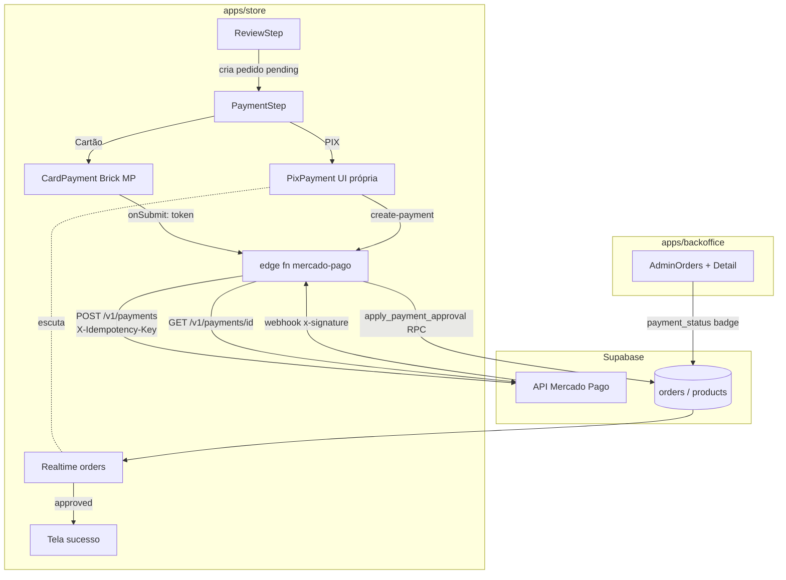

# Checkout Mercado Pago (Bricks) — Design

**Spec**: `.specs/features/02-checkout-mercado-pago/spec.md`
**Context**: `.specs/features/02-checkout-mercado-pago/context.md`
**Status**: Approved (Abordagem A confirmada pelo usuário em 2026-07-18)

---

## Architecture Overview

**Abordagem A (confirmada):** ambos os métodos — cartão e PIX — são processados pelo **gateway do
Mercado Pago via `POST /v1/payments`** (API clássica, fluxo maduro dos Bricks). O que difere é a
camada de UI:

- **Cartão**: `CardPayment` Brick do `@mercadopago/sdk-react` — tokenização no browser (SAQ-A),
  parcelas buscadas automaticamente pelo MP, tema via `customization.visual.style.customVariables`
  com os tokens `nana-*`.
- **PIX**: pagamento criado server-side no MP (`payment_method_id: "pix"`); nossa UI renderiza o
  QR (`qr_code` copia-e-cola → imagem via `qrcode.react`) e escuta a aprovação via
  **Supabase Realtime** na linha do pedido.



**Mudança de fluxo do checkout** (consequência de PAY-16): a ordem dos passos muda de
`… → Pagamento → Revisão` para `… → Revisão → Pagamento`. O pedido é criado (`pending`) quando o
cliente sai da Revisão; o passo Pagamento opera sobre um `order_id` existente, permitindo
retentativas (PAY-02) e regeneração de QR (PAY-11). O carrinho só é limpo na aprovação.

---

## Code Reuse Analysis

### Existing Components to Leverage

| Component | Location | How to Use |
| --------- | -------- | ---------- |
| Padrão de edge function (actions, service role, env) | `supabase/functions/melhor-envio/index.ts` | Mesmo esqueleto para `mercado-pago` |
| `PaymentSettings` + `usePaymentSettings()` | `packages/supabase/src/types/settings.ts`, `packages/core/src/hooks/useStoreSettings.ts` | `pix_enabled`, `card_enabled`, `pix_discount_percent`, `max_installments`, `min_installment_value` — já existem, só aplicar |
| Políticas RLS escopadas de orders | `supabase/migrations/20260414121021_*.sql:204-206,215` | Já existem (`users read/insert own orders`, `admin full orders`) — basta **dropar** as `Allow all` |
| `useCreateOrder` | `apps/store/src/entities/order/api/useOrders.ts` | Reusado; chamado ao sair da Revisão |
| Toggle PIX/Cartão + timer 30 min + copia-e-cola UI | `apps/store/src/features/checkout/ui/PaymentStep.tsx` | Estrutura visual mantida; internals trocados |
| Painel de alertas de estoque crítico | `apps/backoffice/src/widgets/alerts-panel` | Absorve discrepâncias de oversell (floor 0) sem trabalho novo |
| `formatPrice`, design tokens `nana-*` | `@nanapin/core`, `@nanapin/ui` | UI e tema do Brick |

### Integration Points

| System | Integration Method |
| ------ | ------------------ |
| Mercado Pago | REST direto via `fetch` (sem SDK server-side — não existe SDK Deno oficial); `POST /v1/payments`, `GET /v1/payments/{id}` |
| Supabase Realtime | `ALTER PUBLICATION supabase_realtime ADD TABLE orders`; store escuta UPDATE filtrado por `id=eq.<order_id>` (RLS escopada permite) |
| pg_cron | Expirador 24h (PAY-11). **Verificar disponibilidade na implementação**; fallback: checagem lazy no webhook/leitura |

---

## Components

### 1. Migration `orders_payment_fields`

- **Purpose**: Schema de pagamento + endurecimento RLS + efeitos atômicos.
- **Location**: `supabase/migrations/<ts>_orders_payment_fields.sql`
- **Conteúdo**:
  - `orders`: `payment_status text not null default 'pending'` com CHECK
    (`pending|approved|rejected|refunded|expired|cancelled`), `mp_payment_id text`,
    `mp_status_detail text`, `paid_at timestamptz`, `pix_discount numeric not null default 0`.
    Index em `mp_payment_id`.
  - **Backfill legado**: pedidos existentes → `payment_status='approved'` (eram manuais;
    evita o expirador marcá-los `expired`).
  - **RLS**: `DROP POLICY "Allow all orders"` / `"Allow all order_items"`;
    criar `users insert own order items` (INSERT p/ authenticated, `order_id` em pedidos
    próprios) — hoje o insert de itens só funciona por causa do `Allow all`.
  - **RPC `apply_payment_approval(p_order_id uuid, p_mp_payment_id text, p_status_detail text)`**
    (SECURITY DEFINER, chamada só via service role): numa transação, faz
    `UPDATE orders SET payment_status='approved', paid_at=now(), … WHERE id=$1 AND paid_at IS NULL`
    e, **somente se a linha foi atualizada**, decrementa `products.stock` dos itens
    (`GREATEST(stock - qty, 0)`) e incrementa uso do cupom (`coupon_id`). Garantia física de
    idempotência (PAY-07/PAY-08) — reexecutar é no-op.
  - Publication Realtime + (se disponível) job pg_cron horário:
    `pending` com `created_at < now()-'24h'` → `expired`.

### 2. Edge function `mercado-pago`

- **Purpose**: Única porta server-side para o MP (criação de pagamento + webhook).
- **Location**: `supabase/functions/mercado-pago/index.ts` + entrada em `supabase/config.toml`
  com `verify_jwt = false` (webhook precisa ser público; auth do create-payment é manual).
- **Interfaces** (action via query param, molde melhor-envio):
  - `create-payment` `{ order_id, method: 'pix'|'card', idempotency_key, card?: <formData do Brick> }`
    1. Auth manual: `supabase.auth.getUser(jwt)` + ownership (`orders.customer_id` →
       `customers.user_id = user.id`). 401/403 caso contrário.
    2. Guard: `payment_status` ∈ {`pending`,`rejected`,`expired`} (retentativa permitida).
    3. **Recálculo server-side (PAY-03)**: itens × `products.price` atuais + `shipping_cost`
       do pedido − desconto do cupom (validado em `coupons`) − desconto PIX
       (`store_settings.payment.pix_discount_percent`, só se `method='pix'`, base
       `subtotal − cupom`, frete fora). Persiste `pix_discount` e `total` recalculados no pedido.
       Total < R$ 0,01 → 422.
    4. `POST /v1/payments` com `X-Idempotency-Key: <idempotency_key>` (UUID gerado pelo client
       por tentativa — retry de rede não duplica), `external_reference: order_id`,
       `statement_descriptor: "NANAPIN"`, `notification_url` apontando para a action webhook.
       - Cartão: `{ token, transaction_amount, installments, payment_method_id, issuer_id, payer }`
         (repasse do formData do Brick, com `transaction_amount` **substituído** pelo recalculado).
       - PIX: `{ payment_method_id: 'pix', transaction_amount, payer.email, date_of_expiration: now+30min }`
         (formato ISO com millis + offset).
    5. Persiste `mp_payment_id`, `mp_status_detail`; se resposta síncrona = `approved` (cartão),
       chama `apply_payment_approval`.
    6. Retorna: cartão → `{ status, status_detail }`; PIX → `{ qr_code, qr_code_base64, expires_at }`.
  - `webhook` (POST público):
    1. Valida `x-signature`: manifest `id:<data.id lowercase>;request-id:<x-request-id>;ts:<ts>;`
       (partes ausentes removidas), HMAC-SHA256 hex com `MERCADO_PAGO_WEBHOOK_SECRET` via
       `crypto.subtle`, compara com `v1`. Inválida → 401 sem side effects (PAY-05).
    2. `type === 'payment'` → `GET /v1/payments/{data.id}` (nunca confia no payload).
    3. Localiza pedido por `external_reference` (fallback `mp_payment_id`) — cobre o edge case
       de falha pós-criação.
    4. Mapa MP→interno: `approved→approved` (via RPC), `rejected→rejected`,
       `cancelled→cancelled`, `refunded|charged_back→refunded`, `pending|in_process→pending`.
       Transições aplicadas com guard SQL (`approved` nunca regride — PAY-04); update de
       `mp_status_detail` sempre (PAY-12). Segundo `approved` de pagamento diferente → só loga
       e grava `mp_status_detail` para atenção do admin (edge case PIX pago após troca).
    5. Responde 200 rápido (< 22s, senão MP reenvia a cada ~15 min).
- **Env**: `MERCADO_PAGO_ACCESS_TOKEN`, `MERCADO_PAGO_WEBHOOK_SECRET`, `SUPABASE_URL`,
  `SUPABASE_SERVICE_ROLE_KEY` (padrão do projeto; `.env.example` atualizado).
- **Reuses**: esqueleto/headers/erros do melhor-envio.

### 3. Store — feature `checkout` (rewrite do passo de pagamento)

- **Location**: `apps/store/src/features/checkout/`
- **Mudanças**:
  - `CheckoutPage.tsx`: passos `[Identificação, Endereço, Entrega, Revisão, Pagamento]`;
    `handleConfirm` (da Revisão) cria o pedido `pending` e avança para Pagamento com `order_id`.
    Carrinho/cupom **não** são limpos aqui. `incrementCouponUsage` e `markCartRecovered` saem
    da criação: cupom incrementa server-side no `apply_payment_approval`; `markCartRecovered` +
    `clearCart/clearCoupon` acontecem no handler de sucesso (aprovação).
  - `PaymentStep.tsx` (rewrite): toggle PIX/Cartão mantido, filtrado por
    `pix_enabled`/`card_enabled`. Sem nenhum input de PAN/CVV (PAY-01).
  - `ui/CardPaymentBrick.tsx`: wrapper do `<CardPayment>` (`@mercadopago/sdk-react`);
    `initialization={{ amount }}` (com desconto zero — cartão), `customization` com
    `paymentMethods.maxInstallments` das settings e tema nana; `onSubmit` → `useCreatePayment`;
    recusa → mensagem amigável (mapa `status_detail`→pt-BR em `lib/paymentMessages.ts`) e
    permanece no passo (PAY-02). Unmount via `cardPaymentBrickController.unmount()`.
  - `ui/PixPayment.tsx`: chama `create-payment` ao montar; QR via `qrcode.react` a partir de
    `qr_code` (base64 pode vir vazio); timer 30 min reaproveitado do mock; expirou →
    botão "Gerar novo código" (nova tentativa, mesmo pedido); assina Realtime
    (`postgres_changes` UPDATE em `orders` filtro `id=eq.<order_id>`) → `approved` → sucesso
    ao vivo (PAY-13). Exibe desconto PIX quando `pix_discount_percent > 0` (PAY-14).
  - `api/useCreatePayment.ts`: `supabase.functions.invoke('mercado-pago?action=create-payment')`
    com `idempotency_key = crypto.randomUUID()` por tentativa.
  - `OrderSummary`/`ReviewStep`: linha de desconto PIX exibida quando método PIX selecionado
    (preview client-side com `usePaymentSettings`); valor autoritativo é o do servidor.
  - Tela de sucesso: remove promessa de e-mail (assumption confirmada na spec); mostra estado
    real (aprovado / aguardando PIX).
  - `main.tsx`/bootstrap: `initMercadoPago(import.meta.env.VITE_MP_PUBLIC_KEY)`.
  - P3: página de pedidos da conta ganha ação "Pagar com PIX" em pedidos `pending` (reusa
    `PixPayment` com `order_id`).
- **Reuses**: `useCartStore`, `useCouponStore`, `useCreateOrder`, `usePaymentSettings`,
  `formatPrice`, componentes `@nanapin/ui`.

### 4. Backoffice — payment_status

- **Location**: `apps/backoffice/src/entities/order/api/useAdminOrders.ts`,
  `apps/backoffice/src/pages/admin/AdminOrdersPage.tsx`,
  `apps/backoffice/src/features/order-management/ui/OrderDetailDialog.tsx`
- Tipo `Order` ganha os campos novos; badge de `payment_status` (6 estados, cores distintas)
  na listagem; detalhe mostra `mp_payment_id`, `mp_status_detail`, `paid_at` (PAY-17).
  `refunded` chega sozinho via webhook — nenhuma ação de UI.

### 5. Tipos compartilhados

- **Location**: `packages/supabase/src/types/index.ts`
- `PaymentStatus` union + campos em `Order`; reexport para os dois apps.

---

## Data Models

```typescript
// packages/supabase/src/types
export type PaymentStatus =
  | 'pending' | 'approved' | 'rejected' | 'refunded' | 'expired' | 'cancelled'

interface OrderPaymentFields {
  payment_status: PaymentStatus
  mp_payment_id: string | null
  mp_status_detail: string | null
  paid_at: string | null
  pix_discount: number
}

// create-payment request/response (edge fn)
interface CreatePaymentRequest {
  order_id: string
  method: 'pix' | 'card'
  idempotency_key: string           // UUID por tentativa, gerado no client
  card?: CardPaymentFormData        // formData do Brick (token, installments, …)
}
interface PixPaymentResponse { qr_code: string; qr_code_base64: string | null; expires_at: string }
interface CardPaymentResponse { status: string; status_detail: string }
```

**Relationships**: `orders.mp_payment_id` ↔ pagamento MP; `external_reference` no MP = `orders.id`
(reconciliação bidirecional).

---

## Error Handling Strategy

| Error Scenario | Handling | User Impact |
| -------------- | -------- | ----------- |
| MP API fora do ar no create-payment | 502 da edge fn; pedido segue `pending` | Toast "Não foi possível iniciar o pagamento, tente novamente" (PAY-09) |
| Cartão recusado | `status=rejected`; mapa `status_detail`→pt-BR | Mensagem específica (ex.: "Saldo insuficiente"), permanece no passo, pode retentar (PAY-02) |
| Webhook assinatura inválida | 401, zero side effects, log | Nenhum (PAY-05) |
| Webhook duplicado | RPC idempotente é no-op na 2ª vez | Nenhum (PAY-07/08) |
| QR PIX expirado | Timer zera → CTA "Gerar novo código" | Nova tentativa no mesmo pedido (PAY-11) |
| Total recalculado < R$ 0,01 | 422 na edge fn | Erro claro; pedido não cobrado |
| Falha pós-criação no MP (antes de gravar `mp_payment_id`) | Webhook reconcilia via `external_reference` | Pedido aprova sozinho quando o webhook chegar |
| JWT ausente/pedido de outro usuário | 401/403 | "Sessão expirada, entre novamente" |

---

## Risks & Concerns

| Concern | Location | Impact | Mitigation |
| ------- | -------- | ------ | ---------- |
| `Allow all` em orders/order_items anula RLS escopada | `supabase/migrations/20260415090935:88,104` | Qualquer anon lê/edita pedidos | DROP na migration; políticas escopadas + `admin full orders` já existem |
| `order_items` sem política de INSERT p/ cliente | mesma migration | Checkout quebra ao dropar `Allow all` | Criar `users insert own order items` na migration |
| Totais calculados no client (`useOrders.ts:92-114`) | `apps/store/src/entities/order/api/useOrders.ts` | Adulteração de preço | Recálculo server-side no create-payment (PAY-03); valor cobrado nunca vem do client |
| `shipping_cost` confiado do client | idem | Cliente pode zerar o próprio frete | Risco aceito nesta fase (perda limitada ao frete); re-cotação Melhor Envio server-side como follow-up |
| `customer_id: input.customer_id \|\| null` | `useOrders.ts:98` | Insert com null falha sob RLS escopada | Checkout já exige login; bloquear confirmação sem `customer.id` carregado |
| PIX não pagável em sandbox (`/v1/payments`) | — | Fluxo webhook-PIX não testável fim-a-fim em teste | Testes unitários de assinatura/idempotência + simulação manual de webhook assinado com secret de teste; smoke test em produção com valor baixo |
| pg_cron pode não estar habilitado | Supabase local/hosted | Expirador 24h não roda | Verificar na implementação; fallback lazy (marca `expired` na leitura/webhook) |
| Brick incompatível com contas de teste (nota na doc) | — | Testes de cartão | Caminho documentado: credenciais `TEST-` + cartões de teste (APRO/OTHE) |
| `useOrdersByEmail` lia qualquer pedido via `Allow all` | `useOrders.ts:30-43` | Pedidos legados com `customer_id` null somem da conta do cliente | Aceito (dados de teste); RLS filtra corretamente dali em diante |

---

## Tech Decisions (only non-obvious ones)

| Decision | Choice | Rationale |
| -------- | ------ | --------- |
| API do MP | `/v1/payments` clássico (não Orders API) | Fluxo maduro e documentado dos Bricks; ambos os métodos passam pelo gateway MP (confirmado c/ usuário) |
| Brick usado | Só `CardPayment`; PIX com UI própria | Preserva o design NanaPin; PIX é só dados (QR), não precisa de Brick |
| Idempotência da criação | UUID por tentativa gerado no client, repassado como `X-Idempotency-Key` | Retry de rede não duplica cobrança; nova tentativa deliberada = novo UUID |
| Idempotência de efeitos | RPC SQL transacional com guard `paid_at IS NULL` | Garantia física no banco (webhook duplicado/corrida síncrono×webhook) |
| QR PIX | `qrcode.react` sobre `qr_code` texto | `qr_code_base64` pode vir vazio (relato conhecido); texto sempre presente |
| Ordem dos passos | Revisão antes de Pagamento | Pedido precisa existir antes do Brick (amount + order_id); padrão de mercado |
| Cupom/carrinho | Incremento de cupom server-side na aprovação; carrinho limpa no sucesso | Pedido não pago não queima cupom nem esvazia carrinho (deriva de PAY-16) |
| Legado | Backfill `payment_status='approved'` em pedidos existentes | Eram manuais; evita expirador marcá-los `expired` |
| Webhook público | `verify_jwt=false` na function; auth manual no create-payment | MP não manda JWT; assinatura HMAC é a autenticação do webhook |
