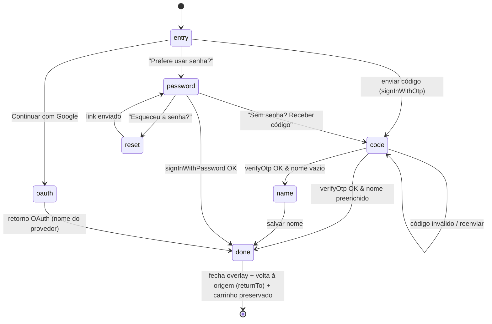

# Store Login UX Design

**Spec**: `.specs/features/04-store-login-ux/spec.md`
**Context**: `.specs/features/04-store-login-ux/context.md`
**Paper**: fluxo OTP redesenhado — Mobile (`Entrada`, `Digite o código`, `Seu nome`, `Login senha`) + Desktop (mesmos 4). Substitui os artboards de link mágico.
**Status**: Draft

---

## Architecture Overview

Um **controlador de auth global** (store Zustand) abre uma **superfície responsiva** (`Dialog` no desktop, `Drawer` no mobile) que hospeda uma **máquina de estados de passos**. Os métodos de auth (OTP/senha/OAuth/reset/nome) são adicionados ao pacote compartilhado `@nanapin/auth`; a UI vive numa feature FSD do app store. `/entrar` vira uma rota fina que só abre o controlador.



**Fluxo de controle:** `openAuth({ returnTo?, intent? })` → overlay abre em `entry` → usuário conclui → `onSuccess` fecha e resolve `returnTo` (ou `/conta`).

---

## Approach Exploration

Superfície e método já decididos (D1/D2). A única escolha arquitetural aberta é **onde vive o estado de abertura/retorno**:

| Abordagem | Como | Trade-off | |
|-----------|------|-----------|--|
| **A. Store Zustand global de UI de auth** (`authUiStore`) | `openAuth()/closeAuth()` chamáveis de qualquer lugar (Header, checkout, favoritar); overlay montado uma vez no `StoreLayout` | Trigger contextual trivial de qualquer componente; casa com o padrão Zustand já usado (cart/wishlist/coupon); `returnTo` simples | ✅ **Recomendada** |
| B. Context/Provider dedicado | `AuthUIProvider` + `useAuthUI()` | Igual à A porém mais boilerplate; sem ganho sobre Zustand já presente | |
| C. Só rota `/entrar` | Navegar sempre para a página | Mais simples, mas perde "acesso no contexto" e o `returnTo` fica preso à history | ❌ contraria D1/D4 |

**Recomendação: A.** Consistente com `cartStore`/`wishlistStore`; `/entrar` monta o mesmo overlay em modo "aberto" para deep-link.

---

## Code Reuse Analysis

### Existing Components to Leverage

| Componente | Local | Como usar |
|-----------|-------|-----------|
| `AuthProvider`/`useAuthContext` | `packages/auth/src/AuthContext.tsx` | **Estender** com `signInWithOtp`, `verifyOtp`, `updateDisplayName`, `resetPassword` (mantém `signIn`, `signUp`, `signInWithGoogle`, `signOut`) |
| `Dialog` | `@nanapin/ui/dialog` | Superfície **desktop** (modal 2 colunas) |
| `Drawer` (vaul) | `@nanapin/ui/drawer` | Superfície **mobile** (bottom sheet com handle) |
| `Sheet` | `@nanapin/ui/sheet` | Alternativa mobile; padrão já usado no `CartDrawer` |
| `InputOTP` | `@nanapin/ui/input-otp` | Input de 6 dígitos (tela "Digite o código") — evita construir do zero |
| `Input`/`Label`/`Button` | `@nanapin/ui/*` | Campos e-mail/senha/nome, CTAs |
| `cartStore` (persist) | `entities/cart/model/cartStore.ts` | **Nada a fazer** — `persist` (localStorage) mantém o carrinho no login e no retorno OAuth |
| `AuthPage` | `apps/store/src/pages/AuthPage.tsx` | **Repurpose** → rota fina que abre o overlay (ou remonta os passos) |
| Trigger `handle_new_customer` | `supabase/migrations/20260415094131_*.sql` | Cria `customers` com `name=''` no signup — habilita OTP sem nome upfront |
| `supabase` client | `@nanapin/supabase/client` | Chamadas GoTrue nativas |

### Integration Points

| Sistema | Integração |
|--------|-----------|
| Supabase Auth (GoTrue) | `signInWithOtp` / `verifyOtp({type:'email'})` / `signInWithOAuth` / `resetPasswordForEmail` — **sem edge function** |
| `customers` table | `update({name})` por RLS do próprio usuário após 1º acesso; `auth.updateUser({data:{full_name}})` para metadados |
| Header | `accountLink` → se deslogado, `openAuth()` em vez de `<Link to="/entrar">` |
| CheckoutPage `if (!user)` (linha ~48) | Trocar o link por `openAuth({ returnTo: '/checkout' })` |
| Favoritar (wishlist) | Ação gated deslogada → `openAuth({ returnTo: rotaAtual })` |

---

## Components

### `@nanapin/auth` — extensões no AuthContext
- **Purpose**: Métodos de auth compartilhados (store + reuso futuro).
- **Location**: `packages/auth/src/AuthContext.tsx`
- **Interfaces**:
  - `signInWithOtp(email: string): Promise<{ error: string | null }>` — `supabase.auth.signInWithOtp({ email, options: { shouldCreateUser: true } })`
  - `verifyOtp(email: string, token: string): Promise<{ error: string | null; isNewUser: boolean }>` — `verifyOtp({ email, token, type: 'email' })`; `isNewUser` = `customer.name` vazio
  - `updateDisplayName(name: string): Promise<{ error: string | null }>` — `update customers.name` + `auth.updateUser({ data: { full_name } })`
  - `resetPassword(email: string): Promise<{ error: string | null }>` — `resetPasswordForEmail(email, { redirectTo })`
- **Dependencies**: `@nanapin/supabase/client`
- **Reuses**: padrão de retorno `{ error }` já existente

### `authUiStore` (controlador global)
- **Purpose**: Estado de abertura + passo + contexto de retorno.
- **Location**: `apps/store/src/features/auth/model/authUiStore.ts`
- **Interfaces**: `{ isOpen, step, email, returnTo, open(opts), close(), goTo(step), setEmail(v) }` (`step: 'entry'|'code'|'name'|'password'|'reset'`)
- **Reuses**: padrão Zustand de `cartStore`

### `<AuthOverlay>` (superfície responsiva)
- **Purpose**: Renderiza `Dialog` (desktop) ou `Drawer` (mobile) e o passo atual; painel de marca no desktop.
- **Location**: `apps/store/src/features/auth/ui/AuthOverlay.tsx`
- **Dependencies**: `authUiStore`, `useIsMobile`, steps, `@nanapin/ui/dialog|drawer`
- **Reuses**: `Dialog`/`Drawer`; montado 1× em `StoreLayout`

### Passos: `AuthEntry`, `AuthCodeStep`, `AuthNameStep`, `AuthPasswordStep`, `AuthResetStep`
- **Location**: `apps/store/src/features/auth/ui/steps/*`
- **Reuses**: `InputOTP` (code), `Input`/`Label`/`Button`, SVG do Google já existente; copy/tokens 1:1 do Paper

### `useAuthFlow` (orquestração)
- **Purpose**: Liga ações dos passos aos métodos do AuthContext + transições + `onSuccess`.
- **Location**: `apps/store/src/features/auth/model/useAuthFlow.ts`

---

## Data Models

Sem novas tabelas. Estado efêmero do fluxo:

```typescript
type AuthStep = 'entry' | 'code' | 'name' | 'password' | 'reset'
interface AuthUiState {
  isOpen: boolean
  step: AuthStep
  email: string
  returnTo: string | null   // rota/ação a retomar após sucesso
}
```

Persistência: `customers.name` (update), `auth.users.user_metadata.full_name` (update). Carrinho: `cartStore` (persist) — inalterado.

---

## Error Handling Strategy

| Cenário | Tratamento | Usuário vê |
|--------|-----------|-----------|
| E-mail inválido no envio | Validação client-side, sem chamada | Erro no campo, botão sem loading |
| Código inválido/expirado | `verifyOtp` erro; manter passo `code` e e-mail | "Código inválido ou expirado" abaixo dos dígitos |
| Rate limit (envio/reenviar) | Detectar erro do GoTrue | "Aguarde alguns segundos para reenviar" + cooldown |
| Cooldown ativo | `resend` desabilitado | Contador "Reenviar em 0:59" |
| Falha de rede | Estado de erro recuperável | Toast + permitir retry |
| `updateDisplayName` falha pós-verify | Sessão mantida; nome adiável | Segue logado; banner na conta |
| Credenciais de senha inválidas | Mensagem genérica | "E-mail ou senha inválidos" |

---

## Risks & Concerns

| Concern | Local | Impacto | Mitigação |
|--------|-------|--------|-----------|
| Template de e-mail padrão do Supabase usa `{{ .ConfirmationURL }}` (link), não `{{ .Token }}` (código) | Painel Supabase Auth | OTP por código não chega como código | Task de config: alterar template Magic Link/OTP para exibir `{{ .Token }}`; documentar no `.env.example` |
| Dependência `input-otp` pode não estar instalada (só o wrapper shadcn existe) | `@nanapin/ui/input-otp` | Build quebra ao importar | Task: verificar/instalar `input-otp` no workspace antes de usar |
| Detecção de "1º acesso" por `customer.name` vazio | `AuthContext.fetchCustomer` | `fetchCustomer` é assíncrono após `onAuthStateChange`; pode haver corrida | `verifyOtp` retorna `isNewUser` consultando `customers` diretamente antes de decidir o passo |
| `emailRedirectTo`/`redirectTo` fixos em `window.location.origin` | `AuthContext.signUp/signInWithGoogle` | OAuth/reset não retomam a origem | Passar `returnTo` no `redirectTo` (query) e resolver no retorno |
| FSD: violação conhecida (`ProductInfo`→`features/share-product`) em modo warn | CLAUDE.md | Não bloqueia | Manter nova feature `auth` limpa (feature→shared apenas) |
| Rota `/entrar` referenciada em vários lugares (`Header`, `CheckoutPage`) | store | Links quebrados se removida | Manter `/entrar` como fallback que abre overlay |

---

## Tech Decisions

| Decisão | Escolha | Racional |
|--------|--------|---------|
| Controlador de UI | `authUiStore` (Zustand) | Consistente com cart/wishlist; trigger contextual global |
| Superfície | `Dialog` (desktop) + `Drawer` (mobile) | Handle nativo no Drawer casa com o Paper; Dialog centraliza modal 2 colunas |
| OTP input | `@nanapin/ui/input-otp` | Reuso; acessibilidade e colagem de código prontas |
| Métodos de auth | Estender `@nanapin/auth` | Mantém credenciais/abstração num só lugar; reuso |
| Backend | Só configuração do Supabase Auth | Confirmado: nenhuma edge function nova |

> **Project-level:** se "usar Zustand para controladores de UI global (overlays)" virar convenção, registrar como `AD-NNN` em `.specs/STATE.md`.

---

## Supabase Auth — Configuração (não-código)

1. **Template de e-mail** (Auth → Email Templates → Magic Link/OTP): usar `{{ .Token }}` para entregar o **código de 6 dígitos** (copy: "Seu código NanaPin é {{ .Token }}").
2. **Expiração do OTP** (Auth settings): definir/validar (ex.: 600s) — UI não deve hardcodar valor divergente.
3. **Rate limit** de envio: manter padrão (~60s) → alinhar cooldown da UI a 60s.
4. **Redirect URLs**: cadastrar origens (dev `http://127.0.0.1:8080` / prod) para Google OAuth e reset.
5. **Google provider**: já ativo (fluxo atual usa `signInWithOAuth`).
