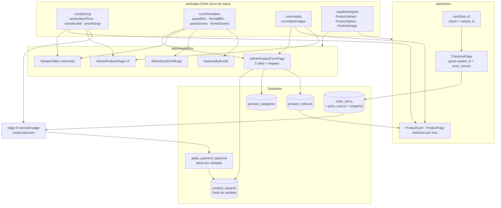

# Product Catalog — Fundação e Caminho do Dinheiro — Design

**Spec:** [`spec.md`](./spec.md) · **Contexto:** [`context.md`](./context.md)
**Status:** Draft
**Desenho:** Paper, arquivo **Nanapin**, página **Backoffice - Produtos**. Esta feature não tem
artboard próprio — é a **fundação** que os 8 artboards de tela pressupõem. O que ela entrega aparece
indiretamente em todos: a faixa `R$ 14,90 – 18,40`, o `sempre disponível`, o selo de categoria e o
`a partir de` só existem porque o modelo aqui existe.

> **Feature 1 de 4** (`AD-009`). Componentes de formulário, mídia e listagem **saíram** deste arquivo
> para os designs de [`11`](../11-product-form-v2/design.md), [`12`](../12-product-media-studio/design.md)
> e [`13`](../13-product-bulk-ops/design.md). O que fica aqui é o que as três consomem.

---

## Conformidade com as decisões de projeto

`.specs/project/STATE.md` § Decisions — todas **conformadas**, nenhuma superada:

| Decisão | Como este design conforma |
| ------- | ------------------------- |
| [2026-07-18] Mercado Pago via `POST /v1/payments`, edge function como única porta server-side | O recálculo por variação acontece **dentro** da function existente; nenhuma porta nova |
| [2026-07-18] Fim das RLS `Allow all`; políticas escopadas + `service_role` para mutação de sistema | `product_categories` e `product_redirects` nascem escopadas; `product_variants` **corrige** a policy `USING (true)` herdada |
| [2026-07-20] Backoffice padroniza em tokens shadcn + shared components de `shared/ui` | Todo componente novo usa `bg-card` / `border-border` / `text-muted-foreground` e reusa `FormCard`, `AdminTable`, `PageHeader`, `Pagination`, `EmptyState`, `FieldGroup`. **Nenhum `nanita-*`** entra no backoffice (loja e admin têm temas separados — `CLAUDE.md` § Convenções) |
| [2026-07-27] Specs numeradas em ordem de criação | Feature é `07-`; itens de implementação em `tasks.md` seguem `01-nome-implementacao` |
| [2026-07-20] `mockup-generator`: engine determinística em `@nanapin/core/mockup`, mockup é só exibição | O estúdio ampliado é **só UI** sobre a engine existente; nenhuma mudança em `composeMockup` |

**Lição L-001** (candidate, `backoffice`): ao migrar telas admin para tokens shadcn, aposentar só as
classes neutras de superfície/texto/borda; accents de marca `nana-violet`/`pink` não têm equivalente e
permanecem. Aplicada aos componentes novos: neutros em token, accent de marca só onde o Paper pede
(faixa violeta de precedência da grade, linha violeta de "Criar categoria").

---

## Architecture Overview

O eixo do design é **uma função de resolução de preço**, escrita três vezes na mesma forma — TypeScript
puro para a loja e o admin, e SQL para a RPC de baixa de estoque — e **congelada no pedido** por
`order_items.price_source`. Nada mais no sistema decide quanto custa um item.



**Regra de precificação (contrato único).** Ela é a razão de existir da fase 2:

```
resolveItemPrice(item, product, variant):
  se item.price_source == 'variant':
      se !variant                       → erro NOT_RESOLVABLE
      se variant.product_id != item.product_id → erro NOT_RESOLVABLE
      se variant.price is null          → erro NOT_RESOLVABLE
      → variant.price
  se item.price_source == 'base':
      se !product                       → erro NOT_RESOLVABLE
      → product.base_price
```

`create-payment` converte `NOT_RESOLVABLE` em HTTP 422 nomeando o item (PST-01 AC 9); a loja usa a mesma
função para nunca **criar** um pedido que cairia nesse erro (PST-03 AC 5).

---

## Code Reuse Analysis

### Componentes existentes a aproveitar

| Componente | Local | Como usar |
| ---------- | ----- | --------- |
| `FormCard`, `PageHeader`, `FieldGroup` | `apps/backoffice/src/shared/ui/` | Cascas de todas as abas e do inspetor — já em tokens shadcn |
| `AdminTable`, `Pagination`, `EmptyState`, `Skeletons` | `apps/backoffice/src/shared/ui/` | Base da listagem v2; `Pagination` já tem `paginationItems.ts` testado |
| `CategoryFormDialog` | `features/category-form/ui/` | Reusado **como está** pelo "Criar categoria" inline (PFM-05 AC 3) |
| `RelatedProductsSelect` | `features/product-form/ui/` | Aba Relacionados fica intacta — é a única das 5 que não muda |
| `RichTextEditor` | `shared/ui/RichTextEditor.tsx` | Descrição na aba Geral, sem mudança |
| `SeoPreview` | `features/product-form/ui/` | Estendido (não reescrito): ganha URL personalizada, disponibilidade e 301 |
| `uploadImageBlob` / `deleteProductImage` | `features/product-form/lib/uploadProductImage.ts` | Estendidos com validação e `MAX_DIMENSION = 1600`; a assinatura `Blob → url` é preservada porque o `mockup-studio` depende dela |
| `MockupStudioDialog` + `renderPlan` | `features/mockup-studio/` | Só o layout cresce; a engine `@nanapin/core/mockup` não muda |
| `calculateOrderTotals` | `packages/core/src/payment/` | Continua sendo quem soma; só a origem de `unit_price` muda |
| `formatPrice` | `packages/core/src/formatters.ts` | Vizinho das novas máscaras — o arquivo vira diretório |
| `useAdminCategories` | `entities/category/api/` | Alimenta o combobox; ganha a contagem de produtos por categoria |
| `csv-import` | `features/csv-import/` | Preservado como porta secundária no menu `Novo produto ▾` |

### Pontos de integração

| Sistema | Integração |
| ------- | ---------- |
| Edge function `mercado-pago` | `create-payment` passa a resolver preço por `price_source`; nenhum contrato novo com o MP, só o `transaction_amount` fica certo |
| RPC `apply_payment_approval` | Corpo reescrito para baixar por variação; assinatura `(uuid, text, text)` e os `GRANT` preservados |
| Storage `product-images` | Sem mudança de bucket ou de path; só o teto de dimensão e a validação prévia |
| Melhor Envio | **Não tocado** (A6) — `production_lead_days` é exibição |
| Realtime de pagamento (PIX) | Não tocado |

---

## Components

### `@nanapin/core/pricing` — resolução de preço e rótulo

- **Purpose**: única fonte da regra de "quanto custa este item" e "como se chama esta variação".
- **Location**: `packages/core/src/pricing/index.ts` (+ `__tests__/`)
- **Interfaces**:
  - `resolveItemPrice(item: PricedItem, ctx: PricingContext): { price: number } | { error: PriceError }`
  - `variantLabel(options: ProductOption[], values: OptionValues): string` — `{Tamanho:"4,5 cm",Acabamento:"Fosco"}` → `4,5 cm · Fosco`, na ordem de `position`
  - `priceRange(variants: ProductVariant[]): { min: number; max: number; count: number } | null` — só linhas ativas com preço
  - `isVariantAvailable(v: ProductVariant, policy: StockPolicy): boolean`
  - `cartesian(options: ProductOption[]): OptionValues[]` — cruzamento na ordem de `position`
  - `diffGrid(current: ProductVariant[], next: OptionValues[]): { toCreate, toKeep, toRemove }`
- **Dependencies**: nenhuma (funções puras, sem I/O)
- **Reuses**: tipos de `@nanapin/supabase/types`
- **Por que em `core`**: a mesma regra roda no admin, na loja e — reescrita em SQL — na RPC. Sem um lugar
  só, a divergência entre eles é questão de tempo.
- **Precedente confirmado no código**: a edge function **já importa de `packages/core` por caminho
  relativo** — `buildPayer`, `canTransition`, `mapMpStatus`, `calculateOrderTotals`
  ([`mercado-pago/handlers.ts:12-22`](../../../supabase/functions/mercado-pago/handlers.ts#L12-L22)).
  Logo `resolveItemPrice` é *literalmente* a função que o servidor roda, coberta pelos testes vitest de
  `packages/core` — não uma cópia que pode divergir. Só a baixa de estoque precisa da versão SQL,
  porque roda dentro da RPC transacional.
  > **Referência atualizada no fatiamento.** A spec original apontava `index.ts:6-12`; desde `AD-004`
  > (feature 09) o `index.ts` é só wiring e a lógica com deps injetadas vive em `handlers.ts`, testada
  > no workspace `@nanapin/functions`. O recálculo de preço que esta feature reescreve está hoje em
  > [`handlers.ts:317-327`](../../../supabase/functions/mercado-pago/handlers.ts#L317-L327).

### `@nanapin/core/formatters` — máscaras pt-BR (PFM-10)

- **Purpose**: parse/format de moeda, gramas e centímetros como funções puras testáveis.
- **Location**: `packages/core/src/formatters.ts` → vira `packages/core/src/formatters/` (`index.ts`,
  `currency.ts`, `units.ts`, `__tests__/`), mantendo o export `@nanapin/core/formatters` e o
  `formatPrice` atual **sem mudança de assinatura**.
- **Interfaces**:
  - `parseBRL(input: string): number | null` — aceita `R$ 1.234,56`, `1.234,56`, `1234,56`, `1234.56`; devolve `null` no que não tem número
  - `formatBRL(value: number): string` — `1234.56` → `1.234,56` (sem o `R$`, que é slot fixo na UI)
  - `parseGrams(input: string): number | null` → kg; `formatGrams(kg: number): string` → `18 g`
  - `parseCm` / `formatCm` (1 decimal) · `parsePercent` / `formatPercent` (inteiro)
- **Dependencies**: nenhuma
- **Reuses**: `Intl.NumberFormat('pt-BR')`, já usado por `formatPrice`

### `@nanapin/core/media` — normalização de imagens (VAR-11)

- **Purpose**: tolerar `string[]` **e** `{url, alt, source}[]` durante e depois da migração.
- **Location**: `packages/core/src/media/index.ts`
- **Interfaces**:
  - `normalizeImages(raw: unknown): ProductImage[]` — string vira `{url, alt: null, source: 'upload'}`; entrada inválida vira `[]`
  - `primaryImage(raw: unknown): ProductImage | null`
- **Reuses**: nada. É o adaptador que permite deployar banco e bundle fora de sincronia.

### `MoneyInput` · `WeightInput` · `DimensionInput` (PFM-10)

- **Location**: `apps/backoffice/src/shared/ui/inputs/` — **não** `features/product-form/`
- **Interfaces**: `{ value: number | null; onChange(v: number | null): void; ... }` — controlados por
  **número**, não por string; a máscara vive só na camada de apresentação
- **Reuses**: `Input` do `@nanapin/ui` + as funções puras de `core/formatters`
- **Por que em `shared/ui` e por que nesta feature** (`AD-010`): são consumidos pelo formulário (`11`),
  pela edição inline da listagem e pela grade rápida (`13`). Em `features/product-form/`, os slices da
  `13` importariam de outro slice da **mesma camada** — cross-import que o `eslint-plugin-boundaries`
  sinaliza. E, na `11`, a `13` teria de esperar uma task no meio do formulário para começar.

### `cartStore` v2 (PST-04)

- **Location**: `apps/store/src/entities/cart/model/cartStore.ts`
- **Mudanças**: `CartItem` ganha `variantId: string | null`, `variantLabel: string`, `unitPrice: number`
  (congelado no add) e `optionValues: OptionValues`; `itemKey = variantId ?? productId`;
  `subtotal` soma `unitPrice`, não `product.price`; `persist({ name: 'nanapin-cart', version: 2, migrate })`
  descartando o storage v1 com aviso
- **Por que congelar `unitPrice` no item**: o snapshot do `Product` dentro do carrinho já é o padrão
  atual; congelar o preço explicitamente torna visível o que hoje é implícito — e o servidor recalcula
  de qualquer forma.

---

## Data Models

### SQL — o que muda

```sql
-- product_variants: ALTER, não CREATE (a tabela existe desde 20260414121021)
alter table public.product_variants
  add column if not exists option_values jsonb   not null default '{}'::jsonb,
  add column if not exists price         numeric(10,2),
  add column if not exists compare_price numeric(10,2),
  add column if not exists weight_kg     numeric(6,3),
  add column if not exists image_url     text,
  add column if not exists is_active     boolean not null default true,
  add column if not exists position      int     not null default 0;
-- `name`, `sku`, `stock`, `price_override` permanecem; `price_override` é deprecado (não lido)
create index if not exists product_variants_product_idx on public.product_variants (product_id, position);

alter table public.products
  add column if not exists options              jsonb not null default '[]'::jsonb,
  add column if not exists stock_policy         text  not null default 'track'
    check (stock_policy in ('track','backorder','none')),
  add column if not exists production_lead_days int;
-- images: text[] -> jsonb, convertendo cada URL em objeto
alter table public.products
  alter column images type jsonb using coalesce(
    (select jsonb_agg(jsonb_build_object('url', u, 'alt', null, 'source', 'upload'))
       from unnest(images) as u), '[]'::jsonb);

create table if not exists public.product_categories (
  product_id  uuid not null references public.products(id)   on delete cascade,
  category_id uuid not null references public.categories(id) on delete cascade,
  position    int  not null default 0,
  primary key (product_id, category_id)
);

create table if not exists public.product_redirects (
  from_slug  text primary key,
  product_id uuid not null references public.products(id) on delete cascade,
  created_at timestamptz not null default now()
);

alter table public.order_items
  add column if not exists price_source    text not null default 'base'
    check (price_source in ('base','variant')),
  add column if not exists variant_label   text,
  add column if not exists variant_options jsonb;
```

**Migração de dados (VAR-01 AC 2-3).** Duas regras, ambas conservadoras:

- `products.variants` (JSONB) → uma linha por objeto, `option_values = {Tamanho, Acabamento}`,
  `stock`/`sku` copiados, **`price = null` e `is_active = false`**.
- Linhas legadas de `product_variants` → `option_values = {}`, **`price = null`, `is_active = false`**,
  `id` preservado. `price_override` **não** é interpretado (A15).

O efeito é que, logo após a migração, todo produto fica sem variação ativa — ou seja, no comportamento
de hoje (precificado por `base_price`). O admin liga cada grade quando põe preço. É o único mapeamento
que não corre risco de cobrar errado.

**Trigger de `base_price` (VAR-12).**

```sql
create or replace function public.sync_product_base_price() returns trigger ...
-- após insert/update/delete em product_variants:
-- update products set base_price = coalesce(
--   (select min(price) from product_variants
--     where product_id = <pid> and is_active and price is not null),
--   base_price)
-- where id = <pid>;
```

Mantém o "a partir de R$ X" honesto sem que `base_price` (que é `NOT NULL`) fique órfão. Quando não há
variação ativa com preço, o valor atual é preservado — nunca vira `0`.

**RLS.** `product_variants` troca `USING (true)` por escopo em produto ativo; `product_categories` e
`product_redirects` nascem com leitura pública e escrita `has_role(auth.uid(),'admin')`, no padrão de
2026-07-18. Os `GRANT` do schema `public` seguem a pendência conhecida do projeto (ver Risks).

### TypeScript — `packages/supabase/src/types/index.ts`

```typescript
export type StockPolicy = 'track' | 'backorder' | 'none'
export type ImageSource = 'upload' | 'mockup' | 'import'
export type OptionValues = Record<string, string>   // { Tamanho: "4,5 cm", Acabamento: "Fosco" }

export interface ProductOption { name: string; values: string[]; position: number }
export interface ProductImage  { url: string; alt: string | null; source: ImageSource }

export interface ProductVariant {
  id: string
  product_id: string
  option_values: OptionValues
  name: string | null
  sku: string | null
  price: number | null
  compare_price: number | null
  stock: number
  weight_kg: number | null
  image_url: string | null
  is_active: boolean
  position: number
}

export interface DbProduct {
  // … campos atuais, com estas mudanças:
  images: ProductImage[]            // era string[]
  options: ProductOption[]          // novo
  stock_policy: StockPolicy         // novo
  production_lead_days: number | null
  category_ids: string[]            // derivado de product_categories
  variants: ProductVariant[]        // agora vem da tabela, não do JSONB
  /** @deprecated sizes/finishes/variants(JSONB) — removidos na fase 6 */
}
```

**Relacionamentos**: `products 1—N product_variants` (fonte de preço/saldo) ·
`products N—N categories` via `product_categories` · `order_items N—1 product_variants`
(FK `NO ACTION` — exclusão de variação vendida é bloqueada na UI, PFM-08 AC 9a).

---

## Error Handling Strategy

| Cenário | Tratamento | O que o admin/cliente vê |
| ------- | ---------- | ------------------------ |
| Campo obrigatório inválido em aba fechada | `validateProduct` roda no submit sobre o estado inteiro | Save bloqueado, badge com contagem na aba, clique leva ao campo |
| Slug já existe | `useSlugAvailability` com debounce, antes do save | `Já existe` em vermelho + sugestão de sufixo; save bloqueado |
| Variação ativa sem preço | Regra de validação + item do checklist | Borda vermelha na linha + "sem preço a variação não entra na loja" |
| Exclusão de variação já vendida | Checagem de `order_items` antes do delete | Recusa nomeando quantos pedidos; oferece **Pausar** |
| SKU duplicado entre linhas | Validação local + `unique` global do banco como rede | Erro apontando as duas linhas, antes do save |
| Upload > 8 MB ou tipo inválido | Validação **antes** de comprimir | Erro nomeando arquivo e motivo; os demais do lote seguem |
| Preço não resolvível no servidor | `resolveItemPrice` → `NOT_RESOLVABLE` → HTTP 422 | Checkout: "não foi possível confirmar o preço de *X*"; pagamento não é criado |
| Carrinho de versão antiga | `persist.migrate` descarta | "Sua sacola foi atualizada" |
| Colagem inválida na grade rápida | `validateRow` por linha, sem esperar submit | Erro embaixo da linha; rodapé `N prontas · M com erro`; criar só as válidas |
| Lote em massa falha parcialmente | Resultado por item, não all-or-nothing | "X alterados · Y falharam", com a lista dos que falharam |
| `sessionStorage` cheio/indisponível | `try/catch` silencioso | Formulário funciona; só o indicador de rascunho não aparece |
| Migração encontra dado inesperado | Falha a migração (não engole) | `supabase db push` para com a mensagem — melhor que dado torto em produção |

---

## Risks & Concerns

| Concern | Local | Impacto | Mitigação |
| ------- | ----- | ------- | ---------- |
| **Conversão destrutiva de `images`** com 12 leitores em `string[]` | `useProducts.ts:14`, `useProduct.ts:20`, `useRecoverCart.ts:20`, `useAbandonedCartTracker.ts:44`, `CheckoutPage.tsx:121`, `ProductGallery.tsx:8`, `CustomPinPage.tsx:396`, `useAdminProducts.ts:25,49`, `AdminProductsPage.tsx:99`, `AdminCollectionsPage.tsx:23`, `AdminProductFormPage.tsx:91,152` | Loja e admin quebram na fase 1 | `normalizeImages` tolera as duas formas **e** os 12 leitores migram na mesma fase (VAR-11) |
| **Fallback silencioso para o preço do client** | [`mercado-pago/index.ts:122`](../../../supabase/functions/mercado-pago/index.ts#L122) — `priceById.get(...) ?? Number(i.unit_price)` | Preço vindo do browser vira preço cobrado quando o produto não resolve | Substituído por erro explícito (PST-01 AC 9); o `??` sai |
| **`create-payment` persiste só `total`** | [`index.ts:173-176`](../../../supabase/functions/mercado-pago/index.ts#L173-L176) | Item mostra 14,90 num pedido que cobrou 18,40 | Persistir `unit_price` e `subtotal` junto (PST-01 AC 10) |
| **RLS `USING (true)` em `product_variants`** | [`20260414121021:193`](../../../supabase/migrations/20260414121021_305804ba-a826-4a90-9d43-6c78231e94d7.sql#L193) | Com preço, custo indireto, estoque e SKU na tabela, vaza a grade de rascunhos | Policy escopada em produto ativo (VAR-07) |
| **`AdminProductFormPage` de 485 linhas, estado num `useState` só** | `AdminProductFormPage.tsx` | Reescrita grande com risco de regredir o que funcionava | Extração para `useProductForm` + um componente por aba; 1 task por aba, cada uma verde antes da próxima |
| **Listagem carrega o catálogo inteiro** | `AdminProductsPage.tsx` com `select('*')` e filtro em memória | Com `variants` e `images` em `jsonb`, o payload cresce muito | Paginação/filtro/`count` no servidor (PLS-01) |
| **Import em laço com refetch por item** | [`AdminProductsPage.tsx:86-90`](../../../apps/backoffice/src/pages/admin/AdminProductsPage.tsx#L86-L90) + [`useAdminProducts.ts:61-65`](../../../apps/backoffice/src/entities/product/api/useAdminProducts.ts#L61-L65) | 40 produtos = 40 SELECTs do catálogo | `createProductsBatch` com um insert e um refetch (PLS-08) |
| **Contagem de uso de tags / produtos por categoria** | não existe hoje | Fazer no client exige o catálogo inteiro — o oposto de PLS-01 | View ou RPC agregada, consultada uma vez e cacheada por sessão |
| **`order_items.size` / `finish` legados** | [`20260415090935:68-69`](../../../supabase/migrations/20260415090935_create_orders_and_order_items.sql#L68-L69) | Não descrevem eixos Cor/Estampa/Pack | Pedidos novos gravam `variant_label` + `variant_options`; a exibição do histórico lê o snapshot e cai nos legados quando nulo |
| **Grants do schema `public` fora das migrations** | memória de projeto: `supabase db reset` deixa a loja em 401 | Um reset local derruba a loja e parece bug da feature | Registrar no `tasks.md` a conferência pós-reset; não é regressão desta feature |
| **Cobertura de teste do backoffice é recente** | vitest chegou no `03-backoffice-ui-standardization`, 40 testes de `shared/ui` | Componentes novos podem entrar sem rede | Toda lógica não-trivial mora em função **pura** exportada (`validateProduct`, `buildBulkPatch`, `parseClipboardGrid`, `diffGrid`, máscaras) — é o que os testes exercitam, não o DOM |
| **`pnpm lint` já falha na baseline** | 28 err / 7 warn em `entities/*/api/useAdmin*` | Ruído esconde regressão nova | Baseline registrada na spec; o gate é "sem **novos** erros" |
| **Estúdio: canvas não roda em node** | `mockup-studio` | Qualidade visual não é testável em CI | Testar o **plano** (`renderPlan`, "ao aplicar"); qualidade visual vira UAT (A12) |

---

## Tech Decisions

| Decisão | Escolha | Rationale |
| ------- | ------- | --------- |
| Onde vive a regra de preço | `@nanapin/core/pricing`, pura, espelhada em SQL na RPC | Três consumidores (admin, loja, function). Regra duplicada em três lugares diverge; em um, não |
| Congelar o caminho de preço | `order_items.price_source` gravado na criação do pedido | Reavaliar "o produto tem variações?" no pagamento faz o preço mudar quando o admin mexe na grade entre o pedido e o pagamento |
| Migração de variação | Tudo migra **pausado e sem preço** | Único mapeamento que não pode cobrar errado; `price_override` do seed é ambíguo (A15) |
| Imagens durante a transição | Coluna convertida na fase 1 **+** leitores migrados na mesma fase, com helper tolerante | Dual-write entre fases é um segundo bug farm; 12 one-liners é mecânico e verificável |
| Estado do formulário | Hook `useProductForm` + componentes de aba burros | `Tabs` do Radix desmonta a aba inativa: validação por `required` de input é estruturalmente impossível |
| Máscaras | Inputs controlados por **número**, máscara só na apresentação | Estado em string vira `NaN` e arredondamento inconsistente; e a grade rápida precisa do `parse` isolado ao colar |
| Desfazer do lote | Snapshot em memória + segundo `update` | `undo` transacional no Postgres seria caro; 30 s de snapshot resolve o caso real (T16) |
| Visões salvas | `localStorage` por navegador | Não justifica tabela nova; as visões padrão são fixas em código |
| Virtualização da grade | **Não** por antecipação | 60 linhas é o teto realista; dependência nova só com perfil que a justifique |
| Flag da rejeição 422 | Variável de ambiente da edge function | Cobre o intervalo entre o deploy da function e o do bundle da loja, e as abas já abertas |
| `products.stock_total` | Legado para produto sem variação; nunca baixado quando há grade | Duas baixas na mesma venda é oversell garantido |

> **Candidata a decisão de projeto** (a registrar em `.specs/project/STATE.md` § Decisions ao fim do
> Execute): *"Regra de negócio consumida por mais de um app **ou** pelo servidor vive como função pura
> em `@nanapin/core`, com o SQL espelhando a mesma regra; nenhum app reimplementa precificação,
> disponibilidade ou rótulo de variação localmente."* Vale para qualquer feature futura que toque preço.

---

## Rastreabilidade design → spec

| Componente / migração | Requisitos |
| --------------------- | ---------- |
| Migrações SQL (variants, options, stock_policy, images, categories, redirects, order_items, RLS, trigger) | VAR-01…VAR-10, VAR-12 |
| `@nanapin/core/media` + 12 leitores | VAR-11 |
| `@nanapin/core/pricing` | PST-01, PST-02, PST-08, PST-10 |
| `@nanapin/core/formatters` + os 3 inputs mascarados | PFM-10 |
| `mercado-pago/create-payment` (`handlers.ts`) | PST-01, PST-09 |
| `apply_payment_approval` | PST-02 |
| `cartStore` v2 + `CheckoutPage` | PST-03, PST-04 |
| Loja: `ProductCard`, `ProductPage`, `useProducts`, `CategoryPage` | PST-05, PST-06, PST-08 |
| Resolução de redirect em `/produto/:slug` | PST-07 |

**23 de 23 requisitos desta feature têm componente.** Os demais 32 requisitos do programa estão nos
designs de [`11`](../11-product-form-v2/design.md), [`12`](../12-product-media-studio/design.md) e
[`13`](../13-product-bulk-ops/design.md).

**Consumido por outras features** — o que `@nanapin/core/pricing` e os inputs entregam e quem usa:

| Saída desta feature | Consumida por |
| ------------------- | ------------- |
| `cartesian`, `diffGrid`, `skuFromParts` | `11` (`OptionsEditor`, `VariantsTable`) · `13` (`buildInsertBatch`) |
| `priceRange`, `variantLabel`, `isVariantAvailable` | `11` (rodapé da grade) · `13` (coluna Preço) |
| `MoneyInput`, `WeightInput`, `DimensionInput` | `11` (grade, aba Preços) · `13` (edição inline, grade rápida) |
| `normalizeImages`, `primaryImage` | `12` (galeria) · `13` (thumb da listagem) |
