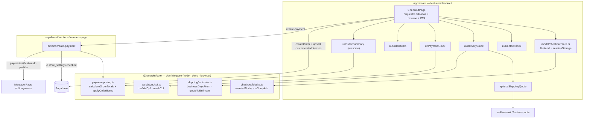

# Checkout One-Page Design

**Spec**: `.specs/features/08-checkout-one-page/spec.md` (rev. 2, 44 requisitos)
**Context**: `.specs/features/08-checkout-one-page/context.md`
**Status**: Draft

---

## Architecture Overview

A feature se apoia num mecanismo que **já existe e funciona** no projeto: `packages/core/src/payment/`
é domínio puro importado pelos **dois lados** — pelo browser via alias `@nanapin/core` e pela edge
function Deno por caminho relativo (`supabase/functions/mercado-pago/index.ts:6-12`). É isso que faz o
valor exibido e o valor cobrado saírem da **mesma função**, em vez de duas implementações que se
parecem.

O design estende esse padrão para as três regras novas que precisam ser idênticas nos dois lados ou
testáveis sem React: preço com bump (`pricing.ts`), data de entrega (`shipping/estimate.ts`) e
completude dos blocos (`checkout/blocks.ts`).



**Fluxo de uma compra (caminho felizes):** blocos preenchidos → `resolveBlocks` diz que os três estão
completos → CTA habilita com o total de `calculateOrderTotals` → CTA cria `customers.cpf` +
`addresses` (upsert) + `orders` + `order_items` → `create-payment` recalcula com **a mesma**
`calculateOrderTotals` (agora ciente do bump) → MP → webhook aprova → Realtime navega para
`/pedido/:id`.

---

## Approach Exploration

| Abordagem | Trade-off | Veredito |
| --------- | --------- | -------- |
| **A — módulo puro em core + Zustand store** | Regras de CHK-03/04/08 testáveis em node; `order_id` sobrevive ao reload via `sessionStorage`; espelha o padrão já validado do `pricing.ts` | **Escolhida** (confirmada 2026-07-27) |
| B — `useState`/`useMemo` na `CheckoutPage` | Mais rápido de escrever; mas a página passa de 400 linhas, completude só testável por render test, e o `order_id` morre no reload → segundo pedido `pending` | Descartada |
| C — `useReducer` + Context no slice | Reducer puro sem dependência nova; mas persistência no reload é fiação manual e o reducer não é reaproveitável pela spec `09` | Descartada |

---

## Code Reuse Analysis

### Existing Components to Leverage

| Component | Location | How to Use |
| --------- | -------- | ---------- |
| `calculateOrderTotals` | `packages/core/src/payment/pricing.ts` | **Estender** com resolução do item de bump. Continua sendo a única fonte de total, nos dois lados |
| Import Deno por caminho relativo | `supabase/functions/mercado-pago/index.ts:6-12` | Mesmo mecanismo para o `pricing.ts` estendido — nada novo a inventar |
| `melhor-envio?action=quote` | `supabase/functions/melhor-envio/index.ts:41-85` | Consumir como está. Retorna `id`, `name`, `company`, `price`, `delivery_time`, `delivery_range` |
| Payload de cotação por item | `features/shipping-calc/ui/ShippingCalc.tsx:36-49` | **Extrair** o mapper produto→payload para `entities/cart/lib/toQuotePayload.ts` e passar a ser usado pelos dois (produto e checkout) |
| `PixPayment` | `features/checkout/ui/PixPayment.tsx` | Manter. Contador, QR, copiar e regenerar já verificados na `02`. Só adicionar o valor (CNF-01) e o ponteiro para `/conta` (CNF-02), e limpar as cores fora da paleta (`:99,141,164`) |
| `CardPaymentBrick` | `features/checkout/ui/CardPaymentBrick.tsx` | Manter. Passa a ser montado dentro do `PaymentBlock` |
| `useCreatePayment` | `features/checkout/api/useCreatePayment.ts` | Manter a interface; o CPF **não** entra no payload (vem do banco, PGD-03/04) |
| `useShippingSettings` / `usePaymentSettings` | `packages/core/src/hooks/useStoreSettings.ts` | Adicionar `useCheckoutSettings`; estender `DEFAULTS` com `checkout` e `handling_days` |
| `NanaMascot` | `packages/ui/src/nana-mascot.tsx:24,76,144` | `expression="wink"` na confirmação (CNF-04) |
| `setGuestEmail` | `features/abandoned-cart/model/useAbandonedCartTracker.ts:118` | Chamar do `ContactBlock` — é hoje o `CustomerStep` o único caller (CHK-11) |
| `useCouponStore` / `useCartStore` | `entities/coupon`, `entities/cart` | Sem mudança; o resumo lê deles |
| `apply_payment_approval` (RPC) | `20260718235214_payment_approval_rpc.sql` | Sem mudança. O item do bump é item comum → herda a baixa de estoque (PAY-08) |

### Integration Points

| System | Integration Method |
| ------ | ------------------ |
| Melhor Envio | `useShippingQuote` (React Query) → `melhor-envio?action=quote`. `keepPreviousData: false` + chave por CEP resolve SHP-10 (resposta obsoleta descartada pelo próprio React Query) |
| ViaCEP | Mantém o `fetch` direto do `AddressStep` (sem chave, público), movido para `api/useCepLookup.ts` |
| Mercado Pago | Sem mudança de porta: só `create-payment` passa a montar `payer.identification` a partir do pedido |
| `store_settings` | Nova chave `checkout`; nova propriedade `handling_days` em `shipping` |
| Supabase (escrita) | `customers` (upsert do CPF), `addresses` (upsert do default), `orders` (+ 3 colunas) — todas exigindo policy nova |

---

## Components

### `checkout/blocks.ts` (domínio puro)

- **Purpose**: Decide quais blocos estão completos, qual está aberto, e se o pedido em curso foi
  invalidado por edição — sem tocar em React.
- **Location**: `packages/core/src/checkout/blocks.ts`
- **Interfaces**:
  - `isContactComplete(c: ContactDraft): boolean` — CHK-03
  - `isDeliveryComplete(d: DeliveryDraft): boolean` — CHK-03
  - `isPaymentComplete(p: PaymentDraft): boolean` — CHK-03 (usa `isValidCpf`)
  - `resolveBlocks(draft: CheckoutDraft): { open: BlockId | null; complete: BlockId[] }` — CHK-04
  - `isOrderStale(draft: CheckoutDraft, snapshot: CheckoutDraft | null): boolean` — CHK-08
- **Dependencies**: `validators/cpf.ts`
- **Reuses**: nenhum — é o novo núcleo. Espelha o formato de `payment/pricing.ts` (função pura +
  interfaces exportadas + suíte de teste irmã).

### `payment/pricing.ts` (estendido)

- **Purpose**: Continuar a **única** fonte de verdade do total, agora ciente do desconto de bump.
- **Location**: `packages/core/src/payment/pricing.ts` (existente)
- **Interfaces** (novos):
  - `applyOrderBump(items: PricingItem[], bump: OrderBumpConfig | null): PricingItem[]` — aplica
    `discount_percent` ao **primeiro** item cujo `product_id === bump.product_id`, apenas quando
    `bump.enabled` e `quantity === 1`; devolve a lista intacta em qualquer outro caso.
  - `CalculateOrderTotalsInput` ganha `bump?: OrderBumpConfig` — quando presente,
    `calculateOrderTotals` roda `applyOrderBump` antes de somar.
- **Dependencies**: nenhuma
- **Reuses**: a própria `calculateOrderTotals` e o `round2` existentes. **Não** quebra a assinatura
  atual: `bump` é opcional, então os 73 testes da `02` seguem válidos.

### `shipping/estimate.ts` (domínio puro)

- **Purpose**: Converter a resposta de cotação do Melhor Envio na janela de datas exibida.
- **Location**: `packages/core/src/shipping/estimate.ts`
- **Interfaces**:
  - `addBusinessDays(from: Date, days: number): Date` — seg–sex, sem feriados (assumption da spec)
  - `quoteToEstimate(quote: ShippingQuote, handlingDays: number, today: Date): { min: Date; max: Date }`
    — SHP-09. `delivery_range` ausente → usa `delivery_time` como min e max.
  - `formatEstimate(min: Date, max: Date): string` — `"entre 4 e 6 de agosto"` | `"em 30 de julho"`
  - `cheapestQuoteId(quotes: ShippingQuote[]): number | null` — SHP-06
- **Dependencies**: nenhuma. `today` é **parâmetro** (nunca `new Date()` interno) para o teste ser
  determinístico.
- **Reuses**: o tipo `ShippingQuote` sai de `ShippingCalc.tsx:9-16` e sobe para
  `packages/supabase/src/types/shipping.ts`.

### `validators/cpf.ts` (domínio puro)

- **Purpose**: Máscara e validação de CPF por dígito verificador.
- **Location**: `packages/core/src/validators/cpf.ts`
- **Interfaces**: `maskCpf(v: string): string`, `isValidCpf(v: string): boolean`,
  `stripCpf(v: string): string`
- **Dependencies**: nenhuma
- **Reuses**: o padrão de `maskCep` (`AddressStep.tsx:11`), que também sobe para cá como `maskCep`.

### `checkoutStore` (estado do app)

- **Purpose**: Guardar o rascunho dos três blocos, o `order_id` em curso e o snapshot para detectar
  edição.
- **Location**: `apps/store/src/features/checkout/model/checkoutStore.ts`
- **Interfaces**:
  - estado: `contact`, `address`, `shipping`, `payment`, `bumpChecked`, `orderId`,
    `orderSnapshot` (o `CheckoutDraft` no momento da criação)
  - ações: `setContact`, `setAddress`, `setShipping`, `setPayment`, `toggleBump`,
    `setOrder(id, snapshot)`, `invalidateOrder()`, `reset()`
  - derivados: `blocks()` → delega a `resolveBlocks`; `isStale()` → delega a `isOrderStale`
- **Dependencies**: `zustand`, `zustand/middleware/persist`, `@nanapin/core/checkout`
- **Reuses**: o padrão exato de `entities/cart/model/cartStore.ts` (Zustand + `persist`). Diferença
  deliberada: `storage: sessionStorage` — o rascunho e o `order_id` são da sessão, não permanentes.

### `ContactBlock` · `DeliveryBlock` · `PaymentBlock`

- **Purpose**: Um bloco do acordeão cada; renderizam aberto (campos) ou colapsado (resumo + "Alterar").
- **Location**: `apps/store/src/features/checkout/ui/`
- **Interfaces** (comum): `{ open: boolean; complete: boolean; onEdit: () => void }`
- **Dependencies**: `checkoutStore`; `DeliveryBlock` usa `useCepLookup` + `useShippingQuote`;
  `PaymentBlock` monta `PixPayment` ou `CardPaymentBrick` e usa `isValidCpf`
- **Reuses**: substituem `CustomerStep`, `AddressStep`, `ShippingStep`, `PaymentStep` e **apagam**
  `ReviewStep` e `StepIndicator`. `ContactBlock` herda de `CustomerStep` a chamada a `setGuestEmail` e
  o checkbox de consentimento (CHK-11). Nenhum deles tem botão `bg-nanita-jam` (CHK-04).

### `OrderSummary` (reescrito)

- **Purpose**: O resumo persistente que substitui o passo Revisão.
- **Location**: `apps/store/src/features/checkout/ui/OrderSummary.tsx` (existente, reescrito)
- **Interfaces**: `{ variant: 'sidebar' | 'bar' }` — `sidebar` para ≥1024px, `bar` colapsável abaixo
- **Dependencies**: `useCartStore`, `useCouponStore`, `calculateOrderTotals`, `checkoutStore`
- **Reuses**: o componente atual como ponto de partida; a barra de frete grátis vem do padrão já
  desenhado no cart drawer

### `OrderBump`

- **Purpose**: A oferta marcável entre Pagamento e CTA.
- **Location**: `apps/store/src/features/checkout/ui/OrderBump.tsx`
- **Interfaces**: `{ }` — lê tudo de `useCheckoutSettings` + `useProduct(bumpProductId)` + store
- **Dependencies**: `useCheckoutSettings`, `entities/product`, `checkoutStore`
- **Reuses**: `useProduct` existente. Condições de exibição em BMP-02 (inclui `stock_total > 0`)

### `useShippingQuote`

- **Purpose**: Cotar o carrinho inteiro no Melhor Envio.
- **Location**: `apps/store/src/features/checkout/api/useShippingQuote.ts`
- **Interfaces**: `useShippingQuote(cep: string | null): UseQueryResult<ShippingQuote[]>`
- **Dependencies**: React Query, `supabase.functions.invoke`, `toQuotePayload`
- **Reuses**: a chamada de `ShippingCalc.tsx:35-58`. `queryKey: ['shipping-quote', cep]` +
  `enabled: cep?.length === 8` dá SHP-03 e SHP-10 de graça

### `OrderConfirmationPage` (reescrito)

- **Purpose**: A confirmação como rota, sobrevivendo ao reload.
- **Location**: `apps/store/src/pages/OrderConfirmationPage.tsx` (existente, hoje **stub** que só fatia
  o `id` e não busca o pedido)
- **Interfaces**: rota `/pedido/:id`, já registrada em `app/App.tsx:42`
- **Dependencies**: novo `useOrder(id)` em `entities/order/api`, `NanaMascot`, `OrderTimeline`
- **Reuses**: `NanaMascot expression="wink"`

### `OrderTimeline`

- **Purpose**: A timeline monocromática de 4 estágios (CNF-04/CNF-06).
- **Location**: `apps/store/src/entities/order/ui/OrderTimeline.tsx`
- **Interfaces**: `{ status: OrderStatus; paidAt: string | null; estimate: { min: string; max: string } | null }`
- **Dependencies**: nenhuma além de tokens
- **Reuses**: — . **Fica em `entities/order` de propósito**: a spec `09` (conta) reusa o mesmo
  componente na lista de pedidos e no rastreio, sem cross-import de feature

### `create-payment` (estendido)

- **Purpose**: Continuar a única porta server-side, agora com pagador identificado e bump precificado.
- **Location**: `supabase/functions/mercado-pago/index.ts`
- **Mudanças**:
  1. Ler `store_settings.checkout` junto do `payment` (mesma query pattern de `:152-157`)
  2. Passar `bump` ao `calculateOrderTotals` → BMP-04
  3. Ler `customers.cpf` + `customers.name` pelo `order.customer_id` e montar
     `payer.identification` / `first_name` / `last_name` para PIX **e** cartão, sobrescrevendo o que
     vier do Brick → PGD-04
- **Reuses**: `calculateOrderTotals` estendido; o `log()` estruturado existente

---

## Data Models

### Migrations (3)

```sql
-- M1 · orders: snapshot de entrega (SHP-07, SHP-08, ADR-05 usa colunas já existentes)
ALTER TABLE public.orders
  ADD COLUMN IF NOT EXISTS shipping_service_id    text,
  ADD COLUMN IF NOT EXISTS delivery_estimate_min  date,
  ADD COLUMN IF NOT EXISTS delivery_estimate_max  date;

-- M2 · RLS: UPDATE do próprio registro (PGD-05, ADR-03)
CREATE POLICY "users update own customer" ON public.customers
  FOR UPDATE TO authenticated
  USING (user_id = auth.uid()) WITH CHECK (user_id = auth.uid());

CREATE POLICY "users update own addresses" ON public.addresses
  FOR UPDATE TO authenticated
  USING (customer_id IN (SELECT id FROM public.customers WHERE user_id = auth.uid()))
  WITH CHECK (customer_id IN (SELECT id FROM public.customers WHERE user_id = auth.uid()));

-- M3 · store_settings: chave checkout + handling_days (BMP-01, SHP-09)
INSERT INTO public.store_settings (key, value) VALUES
  ('checkout', jsonb_build_object(
     'order_bump_enabled', false,
     'order_bump_product_id', null,
     'order_bump_discount_percent', 50
   ))
ON CONFLICT (key) DO NOTHING;

UPDATE public.store_settings
   SET value = value || jsonb_build_object('handling_days', 2)
 WHERE key = 'shipping' AND NOT value ? 'handling_days';
```

> `USING` **e** `WITH CHECK` nas duas policies.
>
> **Correção (2026-07-28, medida no banco local durante T8).** A justificativa original desta linha
> dizia que sem `WITH CHECK` a cliente reatribuiria a linha para outro `user_id`. **Isso é falso no
> Postgres**: numa policy de UPDATE, quando `WITH CHECK` é omitido, o próprio `USING` é reaproveitado
> como check de escrita. O mutante sem `WITH CHECK` também barrou a reatribuição no teste.
> O `WITH CHECK` explícito continua correto — mas o motivo real é **desacoplar a garantia de escrita
> da expressão de leitura**: se um dia o `USING` for afrouxado (para um admin enxergar mais linhas,
> por exemplo), a escrita não afrouxa junto por tabela.

### Tipos

```typescript
// packages/supabase/src/types/settings.ts
export interface CheckoutSettings {
  order_bump_enabled: boolean
  order_bump_product_id: string | null
  order_bump_discount_percent: number
}
export interface ShippingSettings {
  free_shipping_threshold: number
  default_shipping_cost: number
  origin_zip: string
  handling_days: number          // novo
}
export type SettingsKey = 'general' | 'shipping' | 'payment' | 'seo' | 'abandoned_cart' | 'checkout'

// packages/supabase/src/types/shipping.ts (novo — extraído de ShippingCalc.tsx:9-16)
export interface ShippingQuote {
  id: number
  name: string
  company: string
  price: string
  delivery_time: number
  delivery_range?: { min: number; max: number }
}

// packages/core/src/checkout/types.ts
export interface CheckoutDraft {
  contact: { name: string; email: string; whatsapp: string; consent: boolean }
  address: { cep: string; street: string; number: string; complement: string
             neighborhood: string; city: string; state: string; manual: boolean }
  shipping: { serviceId: string; serviceName: string; carrier: string; cost: number
              estimateMin: string; estimateMax: string } | null
  payment: { method: 'pix' | 'card' | null; cpf: string }
  bumpChecked: boolean
}

// packages/core/src/payment/pricing.ts
export interface OrderBumpConfig {
  enabled: boolean
  product_id: string | null
  discount_percent: number
}
```

`PricingItem` ganha `product_id?: string` — opcional, para `applyOrderBump` casar o item sem quebrar
os chamadores atuais.

### Relacionamentos

`orders` 1—N `order_items` (o item do bump é um `order_item` comum, sem coluna nova) · `orders` N—1
`customers` (fonte do CPF no `create-payment`) · `customers` 1—N `addresses` (um `is_default` nesta
feature).

---

## Error Handling Strategy

| Error Scenario | Handling | User Impact |
| -------------- | -------- | ----------- |
| Cotação do ME falha / vazia / timeout | `useShippingQuote` em `isError` → `DeliveryBlock` renderiza opção única "Frete padrão" com `default_shipping_cost` (SHP-05) | Vê o aviso "não conseguimos consultar os prazos agora" e conclui a compra |
| ViaCEP falha ou CEP inexistente | `useCepLookup` erro → `address.manual = true`, campos destravados; cotação segue pelo CEP digitado (SHP-03) | Digita o endereço à mão, sem travar |
| `createOrder` falha | `checkoutStore` **não** grava `orderId`; toast de erro; rascunho e carrinho intactos (CHK-09) | Toca o CTA de novo |
| Upsert de `customers.cpf` falha | Bloqueia a criação do pedido com erro claro — **não** segue para `create-payment`, porque o servidor leria CPF vazio (PGD-03) | "Não conseguimos salvar seus dados. Tente novamente." |
| Upsert de `addresses` falha | **Não** bloqueia: o pedido já tem o endereço nas suas próprias colunas; loga e segue (ADR-03 é conveniência) | Nenhum — o pedido sai; só não fica salvo para a próxima |
| MP indisponível | herdado PAY-09: pedido segue `pending`, erro amigável | Retenta no mesmo pedido |
| `stock_total` do bump zera na janela | `createOrder` monta os itens sem o bump e avisa | "O brinde acabou — seguimos sem ele" |
| Bloco editado com pedido em curso | `invalidateOrder()` limpa `orderId`; próximo CTA cria pedido novo (CHK-08) | Nenhum visível — só não é cobrada por dado velho |
| Total < R$ 0,01 | `calculateOrderTotals` lança; a function devolve 422 (herdado da `02`) | Erro claro, sem cobrança |

---

## Risks & Concerns

| Concern | Location (file:line) | Impact | Mitigation |
| ------- | -------------------- | ------ | ---------- |
| **Segurança (alto).** Recálculo server-side descarta `unit_price` do cliente — correto, mas significa que qualquer desconto por item calculado no front é exibido e não cobrado | `supabase/functions/mercado-pago/index.ts:110-125` | Order bump cobraria o preço cheio; a feature reintroduziria o defeito que veio corrigir | BMP-04: desconto aplicado dentro do `calculateOrderTotals` compartilhado; teste compara total exibido × `orders.total` persistido |
| **Segurança (médio).** `.update()` no Supabase sem policy **não lança** — retorna 0 linhas | `packages/auth/src/AuthContext.tsx:160-164` já sofre disso | `customers.cpf` gravaria "com sucesso" e não gravaria; o PIX sairia sem CPF | M2 cria as policies com `USING` + `WITH CHECK`; e o upsert do CPF **verifica linhas afetadas**, não só `error` (task própria) |
| **Bug em produção.** `orders.address_zip` nunca gravado, e o backoffice faz `.replace()` nele | `AddressStep.tsx:42` (não devolve cep) → `MelhorEnvioTab.tsx:71` | TypeError ao cotar etiqueta de qualquer pedido criado pela loja | ADR-05 grava `address_zip` + `address_complement`; teste de integração cobre o mapper de `createOrder` |
| **Dado ausente.** Mappers de produto omitem `weight_kg`/`width_cm`/`height_cm`/`length_cm` | `entities/product/api/useProducts.ts:5-23`, `useProduct.ts:11-29` | A cotação "real" sairia com os fallbacks 11/2/16/0.1 para todo item — frete errado com cara de certo | SHP-02 exige os campos no select; teste garante que o payload leva o valor do produto quando existe |
| **Acoplamento.** `CheckoutPage` concentra estado, orquestração e render (hoje 211 linhas, cresceria muito) | `apps/store/src/pages/CheckoutPage.tsx` | Página intestável a não ser por render test; regressão silenciosa em CHK-03/08 | Abordagem A: regras em `@nanapin/core/checkout`, estado no `checkoutStore`; a página fica só orquestração |
| **Débito herdado.** `PixPayment` usa `text-red-500/600` e `text-green-600`; `ShippingStep` idem | `PixPayment.tsx:99,141,164`, `ShippingStep.tsx:51,60` | Viola `DESIGN.md` §8 e o grep de CNF-06 falharia | CNF-06 inclui limpar as ocorrências; `ShippingStep` é apagado de todo modo |
| **Teste inexistente.** Não há teste para o mapper de `createOrder` nem para o payload de cotação | `entities/order/api/useOrders.ts`, `ShippingCalc.tsx` | ADR-05 e SHP-02 poderiam "passar" sem gravar/enviar o campo | Tasks de teste explícitas para os dois mappers |
| **Verificação herdada ≠ código herdado.** As pendências manuais da `02` seguem abertas (migrations no hosted, sandbox MP não exercitado) | `.specs/features/02-checkout-mercado-pago/validation.md`, `STATE.md` Handoff | ACs que dependem de runtime de edge function/MP não terão prova automatizada | Test Coverage Matrix marca essas camadas como **manual** e a `validation.md` da 08 as declara como pendência honesta — não como PASS |

---

## Tech Decisions

| Decision | Choice | Rationale |
| -------- | ------ | --------- |
| Onde o desconto do bump é aplicado | Dentro de `calculateOrderTotals`, no domínio compartilhado | É o único ponto por onde os dois lados passam; garante "exibido == cobrado" por construção, não por disciplina |
| Como o servidor identifica o item do bump | Compara `product_id` com `store_settings.checkout.order_bump_product_id`; sem coluna nova | Uma flag `is_order_bump` vinda do cliente seria input não confiável; o `product_id` + a config do lojista bastam. Consequência documentada na spec |
| Persistência do rascunho | `sessionStorage`, não `localStorage` | Rascunho de checkout e `order_id` são da sessão; `localStorage` traria pedido `pending` de dias atrás |
| `today` como parâmetro em `estimate.ts` | Injetado, nunca `new Date()` interno | Teste determinístico de data sem mock de timer |
| Onde vive `OrderTimeline` | `entities/order/ui/`, não `features/checkout/ui/` | A spec `09` reusa na lista de pedidos e no rastreio; em `features/` seria cross-import de feature (a violação de FSD que o `CLAUDE.md` já registra como dívida) |
| Superfície da confirmação | Rota `/pedido/:id` | O stub já existe e a rota já está registrada; estado inline morre no reload após `clearCart` |
| `bump` opcional em `CalculateOrderTotalsInput` | Campo opcional, não parâmetro novo obrigatório | Preserva os 73 testes de pricing da `02` sem reescrita |
| Descarte de cotação obsoleta | `queryKey: ['shipping-quote', cep]` do React Query | SHP-10 sai de graça do cache por chave; nada de `AbortController` manual |
| `StepIndicator` e `ReviewStep` | **Apagados**, não desativados | Código morto que ainda compila é convite a regressão; a spec diz que "Revisão" não existe em nenhum estado |

> **Decisões de nível de projeto** (já registradas em `.specs/project/STATE.md` na fase Specify):
> preço de desconto por item é server-side; RLS de `customers`/`addresses` precisa de UPDATE com
> `WITH CHECK`; `.update()` sem policy não lança — checar linhas afetadas.
