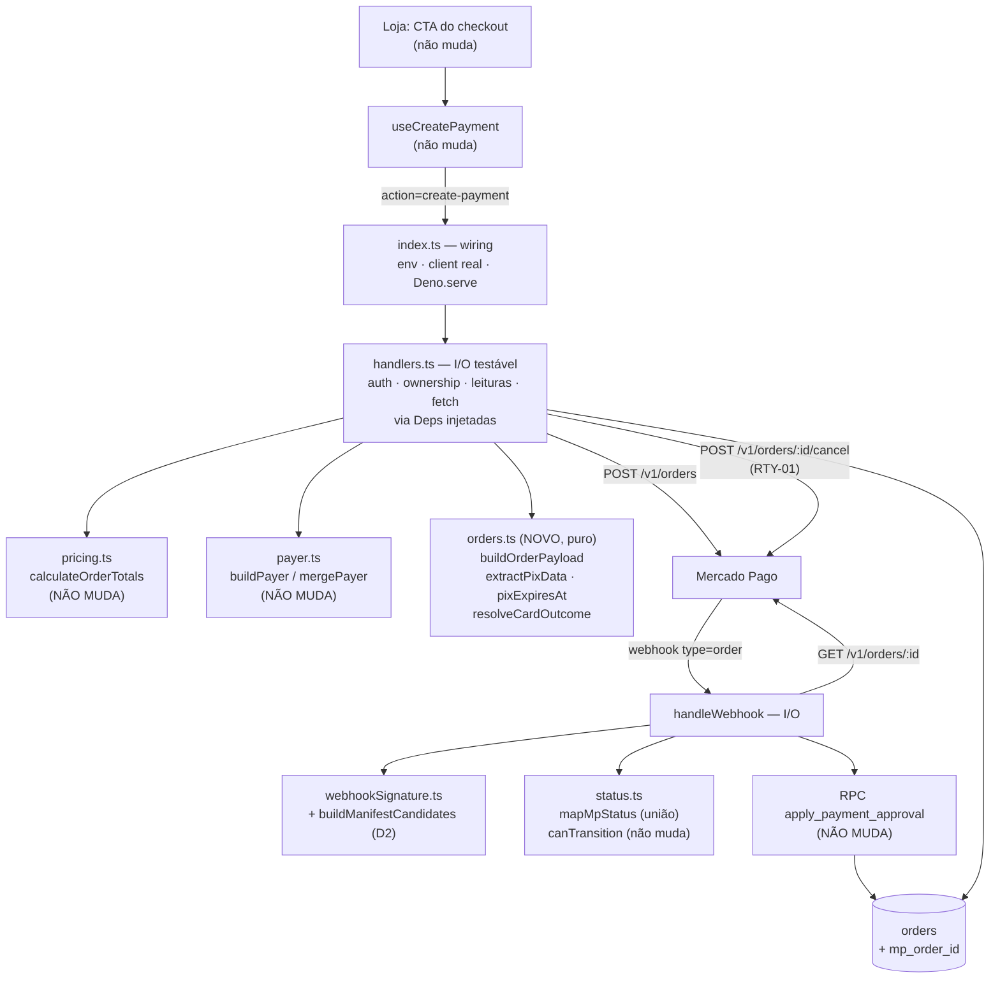

# 09-checkout-orders-api Design

**Spec**: `.specs/features/09-checkout-orders-api/spec.md`
**Context**: `.specs/features/09-checkout-orders-api/context.md`
**Status**: Draft

> `.specs/STATE.md` não existia ao entrar nesta fase — **zero `AD-NNN` ativos**, portanto nenhuma
> restrição de projeto a conformar ou superseder. As decisões project-level desta feature foram
> registradas como `AD-001`…`AD-003` (ver *Tech Decisions*), criando o arquivo.
> Lessons confirmadas: **nenhuma** (`lessons.py list --status confirmed` → vazio). `L-001` é
> `candidate` e trata de tokens do backoffice — não se aplica.

---

## Approach Exploration

Três caminhos entregam o **mesmo escopo**; mudam onde a lógica mora.

### ✅ Recomendado — B: extrair o payload e o parsing para domínio puro

`packages/core/src/payment/orders.ts` (novo) recebe as funções puras — montar o corpo do
`POST /v1/orders`, ler o QR da resposta, decidir o desfecho a partir de `status`/`status_detail`.
`index.ts` fica reduzido a I/O: auth, leituras no banco, `fetch`, persistência.

- **A favor**: a 08 fechou com **zero testes em `supabase/functions/**`** e com o gap BMP-04
  justamente por classificar como "manual" algo que era aritmética pura. Este recorte move para o
  vitest tudo o que é decidível sem rede — inclusive a regra nova mais delicada (STA-03,
  `action_required` de cartão). O sandbox passa a provar só o que **só** ele pode provar.
- **Contra**: importa um arquivo **novo** do core na edge function, o que dispara o carry-forward #12
  (bind mount por arquivo ⇒ exige `supabase stop && supabase start`). Tratado como task explícita.

### A: edição in-place no `index.ts`

Trocar endpoint, payload e status dentro das duas funções que já existem.

- **A favor**: menor diff, estrutura conhecida.
- **Contra**: `handleCreatePayment` já tem ~180 linhas e ganharia o cancel do RTY-01; a lógica nova
  nasceria **não testável** — repetindo exatamente o erro que a 08 pagou.

### C: cliente MP completo em `packages/core/src/payment/mpClient.ts`

Encapsular `fetch` + retry + headers num cliente compartilhado.

- **Rejeitado**: `packages/core/src/payment/*` é hoje estritamente puro e roda **no browser** (a loja
  importa `pricing`, `status`, `payer`). Enfiar I/O ali quebra essa propriedade em troca de nada — a
  edge function é o único chamador.

---

## Architecture Overview



O contorno da caixa é o ponto: tudo marcado **NÃO MUDA** é o que o critério de sucesso audita por
`git diff`. A feature inteira acontece em `index.ts`, no `orders.ts` novo, num trecho de `status.ts` e
numa migration.

---

## Code Reuse Analysis

### Componentes existentes aproveitados

| Componente | Localização | Como usar |
| ---------- | ----------- | --------- |
| `calculateOrderTotals`, `applyOrderBump`, `resolveCouponDiscount` | `packages/core/src/payment/pricing.ts` | **Import inalterado.** Continuam donos do dinheiro; `orders.ts` recebe `totals.total` já calculado e só o formata como string |
| `buildPayer`, `mergePayer` | `packages/core/src/payment/payer.ts` | **Import inalterado.** O `Payer` que ele devolve encaixa 1:1 no `payer` da **raiz** da order — confirmado na referência do MP. É o que preserva PGD-04 por construção |
| `buildManifest`, `parseXSignature`, `validateWebhookSignature` | `packages/core/src/payment/webhookSignature.ts` | ~~**Import inalterado.** O manifest do Orders é idêntico~~ → **premissa REFUTADA no T16** (D2): o `data.id` do tópico `order` é maiúsculo e o lowercase do template derruba o HMAC (8/8 em 401). Acréscimo **aditivo** de `buildManifestCandidates`; `buildManifest`, `parseXSignature` e `validateWebhookSignature` seguem intactos |
| `canTransition` | `packages/core/src/payment/status.ts` | **Inalterado.** O mapa de transições é do domínio interno, não do MP |
| `friendlyMessage` | `packages/core/src/payment/status.ts` | ~~**Inalterado.**~~ → **MODIFICADO no fix de D4**: o fallback genérico serve para STA-03 (desafio 3DS), mas o T16 mediu `rejected_by_issuer` na **recusa**, fora de `cc_rejected_*`, e cair no genérico ali é perder a instrução útil. Ganhou a chave medida + ponte `rejected_*` → `cc_rejected_*`. A loja continua sem mudar: o contrato de resposta é o mesmo |
| `apply_payment_approval` | `supabase/migrations/20260718235214_*.sql` | **Chamada inalterada.** Continua recebendo o id do **payment** em `p_mp_payment_id` (PER-03) |
| Padrão de teste de domínio | `packages/core/src/payment/__tests__/status.test.ts` | Mesmo estilo: vitest, `it.each`, tabela derivada **da spec** com o ID do requisito no `describe` |

### Pontos de integração

| Sistema | Método de integração |
| ------- | -------------------- |
| Mercado Pago | `POST /v1/orders`, `GET /v1/orders/{id}`, `POST /v1/orders/{id}/cancel` — os três com `Authorization: Bearer` e `X-Idempotency-Key` |
| Banco | `orders` ganha `mp_order_id text` + índice; `mp_payment_id` muda de conteúdo (passa a guardar o id do payment do Orders — formato medido: `PAY01K…`), **não** de tipo — sem backfill, pois não há dado legado |
| Loja (`apps/store`) | **Nenhuma mudança.** O contrato de resposta é preservado por ORD-06 e STA-03 |

---

## Components

### `orders.ts` — payload e parsing do Orders (NOVO)

- **Purpose**: transformar dados já resolvidos em corpo de requisição, e resposta do MP em desfecho
  interno — sem tocar rede nem banco.
- **Location**: `packages/core/src/payment/orders.ts`
- **Interfaces**:
  - `formatAmount(value: number): string` — `48` → `"48.00"`, `48.5` → `"48.50"` (ORD-02)
  - `buildOrderPayload(input: BuildOrderPayloadInput): OrderPayload` — ORD-01…04
  - `extractPixData(order: MpOrder): { qr_code: string; qr_code_base64: string | null }` — ORD-06
    (o `expires_at` **saiu daqui** no fix de D5: o MP ecoa `"PT30M"` em vez de resolver)
  - `pixExpiresAt(now: Date): string` — ORD-06/D5, ISO absoluto de `now + ORDER_EXPIRATION`, relógio
    injetado para o módulo seguir puro
  - `extractPaymentId(order: MpOrder): string | null` — PER-02
  - `resolveCardOutcome(order: MpOrder): { status: PaymentStatus | null; statusDetail: string | null }` — STA-02/STA-03
- **Dependencies**: nenhuma (puro; sem imports além de tipos locais e `PaymentStatus`)
- **Reuses**: `PaymentStatus` e `mapMpStatus` de `./status.ts`; convenção de import com extensão
  `.ts` (a edge function importa por caminho relativo — mesmo motivo documentado em `payer.ts:4`)

### `status.ts` — vocabulário do Orders (MODIFICADO)

- **Purpose**: `MP_STATUS_MAP` passa a ser a **união** dos dois vocabulários.
- **Location**: `packages/core/src/payment/status.ts`
- **Interfaces**: assinaturas inalteradas — `mapMpStatus(mpStatus: string): PaymentStatus | null`
- **Dependencies**: nenhuma
- **Reuses**: o próprio mapa; entram 6 chaves (`processed`, `failed`, `canceled`, `expired`,
  `created`, `action_required`), saem zero (STA-01)

> `action_required` entra no mapa como `pending` — o caso PIX (STA-02). O desvio de cartão é decidido
> **antes**, em `resolveCardOutcome`, que é quem conhece o método; `mapMpStatus` segue sem saber de
> método, preservando sua assinatura de função de uma linha.

### `handlers.ts` — I/O testável da edge function (NOVO, extraído)

> Introduzido pela decisão do usuário de **fechar o gap de teste** em vez de aceitá-lo. Sem esta
> extração o layer de I/O ficaria com `Tests: none` — o mesmo ponto cego da 08.

- **Purpose**: orquestrar. Auth, ownership, guard de status, leituras, `fetch`, persistência, log —
  tudo recebendo suas dependências por parâmetro, para rodar em vitest sem Deno e sem rede.
- **Location**: `supabase/functions/mercado-pago/handlers.ts`
- **Interfaces**:
  - `route(deps: Deps, req: Request): Promise<Response>` — OPTIONS, switch de `action`, try/catch.
    **Ficou aqui, e não no `Deno.serve`**, porque dentro do wiring seria intestável: o smoke test do
    400 de `action` inválida não teria como existir. `index.ts` ficou com env + client + serve.
  - `createPayment(deps: Deps, req: Request, body: unknown): Promise<Response>`
  - `webhook(deps: Deps, req: Request, url: URL): Promise<Response>`
  - `cancelPreviousOrder(deps: Deps, mpOrderId: string, idempotencyKey: string): Promise<boolean>` (RTY-01/02)
  - `interface Deps { supabase; fetch; env: { mpAccessToken; mpWebhookSecret; notificationUrl; supabaseUrl } }`
- **Dependencies**: `orders.ts`, `pricing.ts`, `payer.ts`, `status.ts`, `webhookSignature.ts` — **nenhum**
  `Deno.env.get` e **nenhum** import de `esm.sh` (é o que o torna carregável no vitest)
- **Reuses**: o corpo integral das duas funções atuais, **movido** sem reescrita na task de extração
- **Deletado**: `pixExpirationISO` e o uso de `PIX_EXPIRATION_MINUTES` como *timestamp* — vira
  `ORDER_EXPIRATION = "PT30M"`

### `index.ts` — wiring (REDUZIDO)

- **Purpose**: ler env, construir o client service-role real, `Deno.serve`, rotear `action`.
- **Location**: `supabase/functions/mercado-pago/index.ts`
- **Interfaces**: nenhuma exportada
- **Dependencies**: `handlers.ts`, `createClient` de `esm.sh`, `Deno.env`
- **Reuses**: `corsHeaders`, o `switch (action)` e o `try/catch` de erro genérico já existentes
- **Coverage**: `none` na matriz — legítimo porque depois da extração não há regra de negócio aqui;
  o gate é o probe de boot

### Harness de teste — `@nanapin/functions`

- **Purpose**: dar ao layer de handlers um runner e dublês, sem exigir `deno` instalado.
- **Location**: `supabase/package.json`, `supabase/vitest.config.ts`,
  `supabase/functions/mercado-pago/__tests__/{fakes.ts,handlers.test.ts}`
- **Interfaces**: `fakeSupabase()` (cobre `auth.getUser`, `from().select().eq().single()`,
  `.maybeSingle()`, `.update().eq()`, `.rpc()`, com registro de chamadas), `fakeFetch()` (roteiro de
  resposta por URL + captura do corpo enviado)
- **Dependencies**: vitest (env `node`)
- **Reuses**: o padrão de `packages/core/vitest.config.ts`; `pnpm test` segue sendo `turbo run test`

### Migration — `orders.mp_order_id`

- **Purpose**: PER-01.
- **Location**: `supabase/migrations/<timestamp>_orders_mp_order_id.sql`
- **Interfaces**: `alter table public.orders add column if not exists mp_order_id text;` +
  `create index if not exists idx_orders_mp_order_id on public.orders(mp_order_id);`
- **Dependencies**: `20260718234043_orders_payment_schema.sql`
- **Reuses**: o padrão idempotente (`if not exists`) das migrations existentes

---

## Data Models

### `OrderPayload` — corpo do `POST /v1/orders`

```typescript
interface OrderPayload {
  type: 'online'
  processing_mode: 'automatic'
  external_reference: string        // uuid do pedido — WHK-03
  total_amount: string              // "48.00" — string, não número (ORD-02)
  expiration_time: string           // "PT30M" — duração ISO-8601 (ORD-01)
  payer: Payer | Record<string, unknown>   // raiz da order; de buildPayer/mergePayer
  transactions: {
    payments: Array<{
      amount: string                // idêntico a total_amount (ORD-02)
      payment_method:
        | { id: string; type: 'credit_card'; token: string; installments: number }
        | { id: 'pix'; type: 'bank_transfer' }
    }>
  }
}

interface BuildOrderPayloadInput {
  orderId: string
  total: number
  payer: Payer | Record<string, unknown>
  method: 'pix' | 'card'
  card?: { token: string; payment_method_id: string; installments: number }
  expiration?: string               // default "PT30M"
}
```

**Relações**: `total` vem de `calculateOrderTotals`; `payer` vem de `buildPayer` (PIX) ou
`mergePayer(card.payer, orderPayer)` (cartão) — a fusão continua sendo do `payer.ts`.

> `statement_descriptor` e `notification_url` **não** entram no `OrderPayload` do domínio: o primeiro
> é constante da loja e o segundo depende de env. Ficam onde já estão, em `index.ts`, para `orders.ts`
> permanecer puro e testável sem ambiente.

### Delta de `orders`

| Coluna | Antes | Depois |
| ------ | ----- | ------ |
| `mp_order_id` | — | `text`, indexada. ULID da order (`01JC1KVZ…`) |
| `mp_payment_id` | id numérico da Payments API | id do payment do Orders (`pay_01JC1KVZ…`). Tipo `text` já comportava |
| `mp_status_detail` | inalterado | inalterado |

---

## Error Handling Strategy

| Cenário | Tratamento | Impacto para a cliente |
| ------- | ---------- | ---------------------- |
| MP 5xx / inalcançável no create | 502 + log `mp_unavailable`; **`mp_order_id` não é gravado** (ORD-07) | "Não foi possível iniciar o pagamento. Tente novamente." |
| MP 4xx no create | 400 repassando `message` do MP quando houver | Mensagem do MP, sem vazar credencial |
| 2xx sem `id` de order | Tratado como indisponibilidade (502) | Igual ao 5xx — nunca grava id vazio |
| Cartão em `action_required` não-PIX | `payment_status='rejected'` + resposta `{ status: 'rejected', status_detail }`; `friendlyMessage` cai no fallback (STA-03) | "Pagamento recusado. Tente novamente ou use outro método de pagamento." — e o PIX segue disponível |
| Cancel da order anterior falha (inclusive 4xx por não ser cancelável) | Log `previous_order_cancel_failed`; **prossegue** criando a nova (RTY-02) | Nenhum — a retentativa não é bloqueada |
| Webhook com assinatura inválida | 401, sem consultar o MP | — |
| Webhook `type` ≠ `order` | `{ received: true }`, sem efeito | — |
| `GET /v1/orders/{id}` falha no webhook | 502 `mp_lookup_failed`; o MP reentrega | — |
| Status de order desconhecido | `mapMpStatus` → `null`, log `unknown_mp_status`, sem transição | Pedido não regride |
| PIX sem `qr_code` na resposta | `qr_code: ""`, `qr_code_base64: null` (contrato atual) | Cai no estado de erro que a tela já tem |

---

## Risks & Concerns

| Concern | Localização | Impacto | Mitigação |
| ------- | ----------- | ------- | ---------- |
| **Zero testes em `supabase/functions/**`** (registrado na `08/validation.md:414`) | `supabase/functions/mercado-pago/index.ts` | Lógica nova nasceria só provável em sandbox — foi assim que o gap BMP-04 passou | **Resolvido, não mitigado.** Approach B tira o decidível para `orders.ts` (unit), **e** a extração de `handlers.ts` com deps injetadas põe o I/O sob `integration`. Sobra `none` só para o wiring do `Deno.serve` |
| `node_modules` do workspace novo dentro do diretório bind-montado | `supabase/functions/` | Pasta grande dentro do dir que o edge runtime monta arquivo por arquivo pode inflar ou confundir o bundle | Workspace declarado em `supabase/`, um nível acima. **Verificação explícita no T14**: probe de boot depois de o workspace existir — se quebrar, aparece ali e não em produção |
| Dublê de `supabase-js` escrito à mão | `supabase/functions/mercado-pago/__tests__/fakes.ts` | Um fake que divirja do client real deixa o teste verde com código quebrado | Os cenários de sandbox (T16) continuam sendo a prova de que o client real concorda com o dublê — o harness **complementa** o sandbox, não o substitui. Fake cobre só a superfície que os handlers usam, e cada método usado é asseverado por chamada registrada |
| **Carry-forward #12** — bind mount por arquivo no edge runtime local | `index.ts:11` (hoje falha com `Module not found "payer.ts"`) | Importar `orders.ts` (arquivo novo) faz o worker responder 503 até reiniciar | Task dedicada de `supabase stop && supabase start`, posicionada **antes** do primeiro teste de runtime |
| `handleCreatePayment` com ~180 linhas, ganhando o cancel | `index.ts:108-396` | Função longa, difícil de revisar; risco de erro na ordem das escritas | Approach B tira ~40 linhas dela; `cancelPreviousOrder` nasce como função separada, não inline |
| `order_items.product_id` é `text` e `products.id` é `uuid`, com `UUID_RE` filtrando o join | `index.ts:186-196` | Item com `product_id` não-uuid cai em `unit_price` do próprio `order_items` — preço vindo do cliente entraria no cálculo | **Pré-existente, fora de escopo.** Não piora aqui (`pricing.ts` não muda). Registrado para feature futura de saneamento do schema |
| `mp_status_detail` usado como campo de recado humano (`"atencao: segundo pagamento aprovado …"`) | `index.ts:483` | Mistura vocabulário de máquina com texto livre na mesma coluna | Mantido (fora de escopo); o texto novo passa a dizer `duplicate_approved_other_order` para o log ficar greppável |
| `pnpm lint` **já falha** por `no-explicit-any` pré-existente nos hooks admin (CLAUDE.md, Estado conhecido) | `apps/backoffice/src/entities/*/api/useAdmin*` | Um gate "lint limpo" reprovaria por dívida alheia à feature | Gate de build/test **não** inclui `pnpm lint` global; a checagem de lint fica escopada aos arquivos tocados |
| Enum de `status` de order online não confirmado | — | Um status real fora do mapa vira `null` e o pedido não transiciona | Falha segura por construção (`null` = ignora e loga). Task de confirmação na doc + observação do sandbox; a união do mapa reduz a superfície |
| `external_reference` no retorno do `GET /v1/orders/{id}` não confirmado | `handleWebhook` | Lookup primário poderia não achar o pedido | Desenhado redundante: `data.id` do webhook **é** o `mp_order_id`, então o fallback do WHK-03 resolve sozinho mesmo se `external_reference` faltar |

---

## Tech Decisions

| Decisão | Escolha | Rationale |
| ------- | ------- | --------- |
| Onde mora a lógica nova | Funções puras em `packages/core/src/payment/orders.ts`; `index.ts` só I/O | Torna testável no vitest o que a 08 só conseguia provar em sandbox — a causa raiz do gap BMP-04 |
| `mapMpStatus` | União dos vocabulários Orders + Payments legado | `canceled`/`cancelled` diferem por uma letra e ambas as chaves precisam existir; manter as demais custa zero, não invalida `status.test.ts` e degrada com sanidade |
| Quem decide o desvio de STA-03 | `resolveCardOutcome` (conhece o método), não `mapMpStatus` | Preserva `mapMpStatus` como função de uma linha, sem parâmetro de método |
| Formato do valor | `formatAmount` própria, `toFixed(2)` sobre o total já arredondado por `pricing.ts` | `pricing.ts` continua dono do arredondamento; `orders.ts` só serializa. Evita dois lugares arredondando |
| `statement_descriptor` / `notification_url` | Ficam em `index.ts`, fora do `OrderPayload` | Um é constante, o outro depende de env — manter `orders.ts` puro e testável sem ambiente |
| Resposta de STA-03 ao front | `{ status: 'rejected', status_detail }` com HTTP 200 | `CardPaymentBrick` já trata `status !== 'approved'` chamando `friendlyMessage` — é o que permite **zero** mudança em `apps/store` |
| Como tornar o I/O testável | Extrair `handlers.ts` com **dependências injetadas** (`Deps`) e testar em vitest com dublês | A alternativa era `deno test`, que exigiria instalar o Deno na máquina e um segundo runner no repo. Com DI, o layer roda no runner que o monorepo já usa, e o `index.ts` fica com o único pedaço genuinamente não testável (o `Deno.serve`) |
| Onde declarar o workspace de teste | `supabase/package.json` (pacote `@nanapin/functions`), **não** `supabase/functions/package.json` | O `node_modules` não pode nascer dentro de `supabase/functions/`, que é o diretório que o edge runtime bind-monta arquivo por arquivo. Mantém `pnpm test` = `turbo run test`, com cache e `--filter` |

**Project-level → `.specs/STATE.md`:** `AD-001` (Orders é a API de pagamento do projeto), `AD-002`
(lógica de gateway em domínio puro; edge function só I/O), `AD-003` (sem UI de 3DS, `action_required`
não-PIX é recusa).
