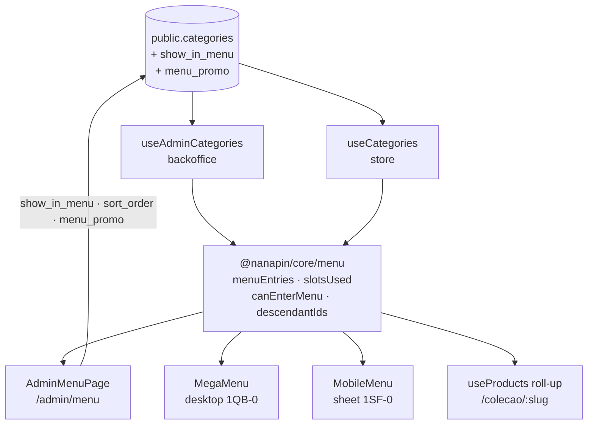

# Menu de navegação da loja — Design

**Spec**: `.specs/features/16-menu-navegacao-loja/spec.md`
**Status**: Approved (arquitetura escolhida e aprovada em modo plano — ver `Tech Decisions`)

---

## Architecture Overview

Uma fonte de dado, três leitores. O menu **não é uma entidade nova** — é um recorte de `categories`,
computado por funções puras em `@nanapin/core/menu` que os dois apps importam. Isso é o que impede a
tela do admin e a loja de discordarem sobre o que é o menu.



**Por que domínio compartilhado e não um hook por app**: a regra "o que é uma entrada de menu" aparece
em quatro telas. Duplicada, o admin mostraria uma coisa e a loja outra — e o bug atual (`.slice(0,4)`
de lista chapada) é exatamente isso em miniatura.

### Tradução dos boards

Os boards `1QB-0` e `1SF-0` são da era **v3 pop-culture**: usam `Lilita One`, `#1A0F2E` e `#FF3B7F`.
O `DESIGN.md` já aposentou os três. **A estrutura e o espaçamento dos boards são a entrega; a paleta e
a tipografia vêm do tema Nanita.**

| Board | Código |
| --- | --- |
| `Lilita One` (título do promo) | `font-display` (Fredoka 500–600) |
| `#1A0F2E` (texto) | `text-nanita-ink` (`#2B1622`) |
| `#FF3B7F` / `text-jam` | `text-nanita-jam` (`#B0176B`) |
| `bg-surface` / `#FFE8F0` / `#EDE9FE` (palcos) | `bg-nanita-sugar` (`#FFEFF6`) |
| `border-b-border` / `#F0EAF5` | `border-nanita-border` (`#FFD7E7`) |
| `bg-jam` (card promo) | `bg-nanita-jam`, texto branco |
| `rounded-[20px]`, `rounded-md` | `rounded-lg` (24px) e `rounded-md` (16px) da escala Nanita |

**Reflow do painel desktop sem a coluna "Por estilo"** (fora do escopo): as medidas do board são
`180px` (filhas) · `160px` (estilo) · `1px` separador · `flex` (em alta) · `260×280` (promo), com
`gap-5` e `px-[80px]`. Removida a coluna de 160px, os 180px liberados vão para a faixa "Em alta", que
continua com **3 cards de 160px** alinhados à esquerda — não 4. Três é o que a AC define e o que
mantém o painel legível.

---

## Code Reuse Analysis

### Existing Components to Leverage

| Component | Location | How to Use |
| --- | --- | --- |
| `bySortOrder` (ordenação + desempate por nome) | `apps/backoffice/src/features/category-list/model/categoryTree.ts:33` | **Mover para `@nanapin/core/menu`** — é a regra do MENU-01 e passa a ter dois donos de app. `categoryTree.ts` importa de lá. |
| `reorderWithinParent` | `apps/backoffice/src/features/category-list/model/categoryTree.ts:368` | Import direto no arraste da tela de Menu. Já devolve só o delta (MENU-08). |
| `eligibleParents` / `moveDestinations` | mesmo arquivo | Referência de padrão para o seletor de destino do promo (excluir descendência). |
| `useAdminCategories` | `apps/backoffice/src/entities/category/api/useAdminCategories.ts` | `updateCategory`, `updateSortOrders`, `product_count`. **Adicionar as 2 colunas em `CATEGORY_SELECT`.** |
| `category_product_counts` (view) | migration `20260801150000` | Contagem do card promo ("12 produtos") sem query nova. |
| `categoryPaths.ts` (`categoryPath`, `parentPath`, `depthOf`) | `apps/backoffice/src/features/product-form/model/` | **Mover para `entities/category/lib/`** — ganha segundo consumidor, e feature→feature é cross-import. |
| `PageHeader`, `FormCard`, `AdminTable` | `apps/backoffice/src/shared/ui/` | Casca da `AdminMenuPage`. |
| `useProducts(slug)` | `apps/store/src/entities/product/api/useProducts.ts` | "Em alta" do painel; ganha o roll-up. Cache por slug do React Query serve os dois usos. |
| `ProductCard` | `apps/store/src/entities/product/ui/ProductCard.tsx` | Cards do "Em alta" — não recriar card de produto. |
| `Sheet` | `packages/ui/src/sheet.tsx` | Folha de tela cheia do menu mobile. |
| `useSearchUiStore` / `useAuthUiStore` | `apps/store/src/features/{search,auth}` | Gatilho de busca e de conta na folha (MENU-18, MENU-19). |
| `useCartUiStore` | `apps/store/src/entities/cart/model/cartUiStore.ts` | Padrão de store Zustand efêmera — o `menuUiStore` da folha segue o mesmo molde e a mesma justificativa. |

### Integration Points

| System | Integration Method |
| --- | --- |
| `public.categories` | Duas colunas novas na tabela existente. Sem tabela nova, sem FK nova. |
| RLS | Nenhuma mudança: `public read categories using (active = true)` e `admin full categories` já cobrem colunas novas. |
| `product_categories` | O roll-up amplia o `.in('category_id', …)` da consulta que já existe — não abre query nova. |

---

## Components

### `@nanapin/core/menu` — o domínio

- **Purpose**: decidir o que é o menu, uma vez, para os dois apps.
- **Location**: `packages/core/src/menu/{index.ts,menu.ts,menu.test.ts}`
- **Interfaces**:
  - `MENU_SLOT_LIMIT: 4`
  - `bySortOrder(a, b): number` — `sort_order` asc, desempate `name.localeCompare` (MENU-01)
  - `menuEntries(categories: MenuCategory[]): MenuEntry[]` — as marcadas e ativas, ordenadas, com
    `children`, `path` e `promo` resolvida
  - `slotsUsed(categories): number`
  - `canEnterMenu(categories, id): { ok: true } | { ok: false; reason: string }` (MENU-06)
  - `descendantIds(categories, id): string[]` — recursivo, com guarda de ciclo (MENU-03)
  - `resolvePromo(categories, raw: unknown): ResolvedPromo | null` — valida a forma do jsonb e o
    destino (MENU-25, MENU-26, edge case de JSON malformado)
- **Dependencies**: nenhuma. Puro, sem React, sem Supabase.
- **Reuses**: `bySortOrder` importado de `categoryTree.ts` (movido para cá).

### `AdminMenuPage` + `features/store-menu`

- **Purpose**: a curadoria — quais categorias ocupam as 4 vagas, em que ordem, e o card promo.
- **Location**: `apps/backoffice/src/pages/admin/AdminMenuPage.tsx`,
  `apps/backoffice/src/features/store-menu/ui/{MenuSlotList,MenuBarPreview,MenuPromoEditor}.tsx`
- **Interfaces**: `MenuSlotList` (arraste + switch + estado inativa), `MenuBarPreview` (prévia
  esquemática da barra), `MenuPromoEditor` (destino + selo + textos)
- **Dependencies**: `useAdminCategories`, `@nanapin/core/menu`, `reorderWithinParent`
- **Reuses**: `PageHeader`, `FormCard`, `Switch`, `Select` de `@nanapin/ui`
- **Nota**: as **subcategorias aparecem em leitura**, com link para `/admin/categorias`. Editar árvore
  em duas telas é o defeito que esta feature evita.

### `MegaMenu` (desktop)

- **Purpose**: painel do board `1QB-0`.
- **Location**: `apps/store/src/widgets/header/ui/MegaMenu.tsx`
- **Interfaces**: `<MegaMenu entries={MenuEntry[]} />`; abre por hover com intenção (`~120ms` de
  entrada, `~200ms` de saída) e por `focus`; fecha em `Esc` devolvendo foco, e no `pointerleave` do
  conjunto topo+painel
- **Dependencies**: `useMenu`, `useProducts`, `ProductCard`
- **Reuses**: `ProductCard`, tokens `nanita-*`

### `widgets/mobile-menu` + `menuUiStore`

- **Purpose**: folha de tela cheia do board `1SF-0`.
- **Location**: `apps/store/src/widgets/mobile-menu/ui/MobileMenu.tsx`,
  `apps/store/src/entities/category/model/menuUiStore.ts`
- **Interfaces**: `useMenuUiStore` → `{ open, openMenu, closeMenu }`
- **Dependencies**: `Sheet`, `useMenu`, `useSearchUiStore`, `useAuthUiStore`
- **Por que o store fica em `entities/category` e não no widget**: mesmo motivo do `cartUiStore` — o
  gatilho está no `Header` (widget), e widget não importa widget. E **efêmero, não persistido**: um
  booleano de UI no storage reabriria o menu na visita seguinte.

### `useMenu` (loja)

- **Purpose**: entregar `MenuEntry[]` prontas para as duas superfícies.
- **Location**: `apps/store/src/entities/category/api/useMenu.ts`
- **Interfaces**: `useMenu(): { entries: MenuEntry[] }`
- **Reuses**: `useCategories` (mesma queryKey `['categories']`, sem segundo fetch) + `menuEntries`
- **Nota**: `useCategories` **não muda de forma** — os 8 consumidores atuais não regridem. Ganha só os
  dois campos novos e `active`.

---

## Data Models

```typescript
/** O card promocional, como gravado em categories.menu_promo (jsonb). */
export interface MenuPromo {
  /** Categoria de destino. Obrigatório — o card sempre leva a uma coleção real. */
  category_id: string
  /** Selo no canto ("NOVIDADE"). Ausente = sem selo. */
  badge?: string
  /** Sobrescreve o nome da categoria de destino. */
  title?: string
  /** Sobrescreve a descrição da categoria de destino. */
  subtitle?: string
}

/** Uma entrada da barra do topo, já resolvida. */
export interface MenuEntry {
  id: string
  name: string
  slug: string
  /** `Bottons › Anime` — só o admin usa; a loja mostra `name`. */
  path: string
  children: MenuCategory[]
  /** null quando não há promo, o jsonb é inválido, ou o destino sumiu/desativou. */
  promo: ResolvedPromo | null
}

export interface ResolvedPromo {
  badge: string | null
  title: string
  subtitle: string | null
  href: string          // `/colecao/${destino.slug}`
  productCount: number | null
}
```

**Colunas novas em `public.categories`**:

| Coluna | Tipo | Default | Porquê |
| --- | --- | --- | --- |
| `show_in_menu` | `boolean not null` | `false` | Separa "existe na loja" de "tem vaga no topo". Vale em qualquer profundidade. |
| `menu_promo` | `jsonb null` | `null` | Blob de exibição, nunca consultado, e ainda vai crescer (cor, imagem). Nulo = sem card. |

**Relationships**: `menu_promo.category_id` aponta para `categories.id` **sem FK** — está dentro de
jsonb. Por isso a resolução em runtime é obrigatória, não conveniência (MENU-26).

---

## Error Handling Strategy

| Error Scenario | Handling | User Impact |
| --- | --- | --- |
| Consulta de categorias falha na loja | `useCategories` já devolve `[]`; `menuEntries([])` devolve `[]` | Barra com só "Crie o Seu" e "Sobre". Nunca barra quebrada. (MENU-04) |
| `menu_promo` com forma inesperada | `resolvePromo` valida e devolve `null` | Painel sem a 4ª coluna. Sem erro em console de cliente. |
| Destino do promo apagado/desativado | `resolvePromo` não encontra o id entre as visíveis → `null` | Card some na loja; admin vê "destino inválido". (MENU-26) |
| Admin tenta a 5ª vaga | `canEnterMenu` devolve `{ ok: false, reason }`; nada é gravado | Toast com o motivo. Switch não muda de estado. (MENU-06) |
| Falha parcial no reorder | `updateSortOrders` devolve o primeiro erro; a tela refaz `fetchCategories` | Ordem volta ao que o banco tem — nunca uma tela que mente. |
| Leitura de categorias falha no admin | **Superfície explícita** de erro com botão de recarregar | Não repetir o `setCollections([])` mudo de `useAdminCollections`, que é o que fez Coleções parecer "vazia" em vez de "quebrada". |

---

## Risks & Concerns

| Concern | Location | Impact | Mitigation |
| --- | --- | --- | --- |
| **Bug vivo**: lista chapada alimenta 4 superfícies | `apps/store/src/entities/category/api/useCategories.ts:9` + 8 consumidores | Barra do topo mostra "Bottons · Academia"; grade da home mistura contêiner e filhas | MENU-01/02 — filtro de raiz nos consumidores + ordenação determinística |
| **AD-012, 3ª ocorrência**: `DbCollection` descreve tabela inexistente | `packages/supabase/src/types/index.ts:22` | Tela permanentemente quebrada ocupando vaga na navegação do admin | MENU-21..23 — remoção completa |
| **Erro engolido em silêncio** | `apps/backoffice/src/entities/collection/api/useAdminCollections.ts:16-21` e `useAdminCategories.ts:50-54` | Falha de leitura vira "lista vazia": indistinguível de "não há dados" | A `AdminMenuPage` **não** repete o padrão — erro de leitura é superfície explícita |
| `menu_promo.category_id` sem integridade referencial | jsonb, sem FK | Apagar a categoria de destino deixa referência pendurada | `resolvePromo` valida em runtime (MENU-26); é AC, não boa vontade |
| Roll-up pode virar N+1 | `useProducts.ts:11-26` | Categoria com muitos descendentes = muitas queries | `descendantIds` sai da lista **já em cache** do React Query; a consulta continua sendo **uma** `.in('category_id', ids)` |
| Admin logado na loja vê categoria inativa | policy `admin full categories` concede `FOR ALL` | Admin navegando a loja veria no menu uma categoria que a cliente não vê | O tipo `Category` da loja ganha `active`, e `menuEntries` filtra **explicitamente** — não depende só de RLS |
| `Header.test.tsx:60` testa a busca do acordeão inline | `apps/store/src/widgets/header/ui/__tests__/Header.test.tsx` | O acordeão é substituído pela folha; o teste passaria a testar código morto | O teste **muda de casa** para `MobileMenu.test.tsx` com a mesma asserção (MENU-18) |
| Violação FSD conhecida em `entities/product/ProductInfo` | pré-existente, `warn` | — | Fora do escopo. `MegaMenu` fica em `widgets/` e só importa para baixo. |

---

## Tech Decisions

| Decision | Choice | Rationale |
| --- | --- | --- |
| Onde mora o menu | Recorte de `categories`, não tabela nova | Segunda árvore = dois lugares para consertar cada regra (o defeito da página de carrinho, no `CLAUDE.md`) |
| Ordem do menu | `sort_order` existente | Coluna `menu_order` seria segundo dono do mesmo dado — o "defeito 01" que o `CategoryFormDialog` documenta |
| Domínio em `@nanapin/core` | Sim, não em cada app | Quatro telas consomem a mesma regra em dois apps |
| `show_in_menu` em qualquer profundidade | Sim | Caso real: Anime é filha de "Bottons". Restringir à raiz tornaria o menu impossível de montar |
| Promo aponta para categoria, não URL | `category_id` | Elimina link com typo; contagem vem de `category_product_counts` |
| `menu_promo` como jsonb | Sim | Blob de exibição, nunca consultado; 4 colunas texto exigiriam migration a cada campo novo |
| Backfill por slug | `anime`, `kpop`, `games`, `filmes` | `default false` puro faz o menu nascer **vazio** numa loja no ar |
| Boards → tokens Nanita | Traduzir, não copiar hex | Boards são v3 (Lilita One, `#1A0F2E`); `DESIGN.md` aposentou os dois |
| Prévia da barra no admin | Esquemática, não o componente da loja | `apps/backoffice` não importa `apps/store` — e a prévia serve para ver estouro, não para ser pixel-perfect |

> **Nota de decisão de projeto**: a remoção de Coleções e a regra "conjunto de produtos = categoria"
> serão registradas em `.specs/STATE.md` como `AD-014` ao fim da execução — é convenção que features
> futuras precisam seguir.
