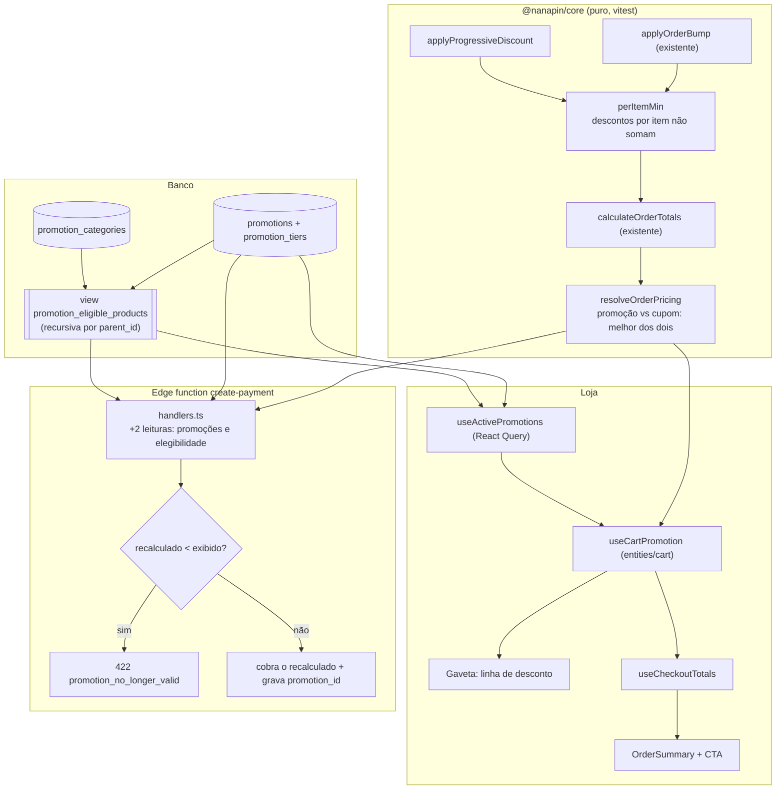

# Promoções: desconto progressivo por quantidade — Design

**Spec**: `.specs/features/17-promocoes-desconto-progressivo/spec.md`
**Contexto**: `.specs/features/17-promocoes-desconto-progressivo/context.md`
**Status**: Draft

---

## Architecture Overview

Uma promoção é **dado no banco**; a regra que a interpreta é **função pura em `@nanapin/core`**; e os dois
consumidores — a loja e a edge function — chamam **a mesma função** com o mesmo conjunto de entradas
resolvido pela **mesma view**. Nada de desconto é calculado inline em nenhum dos lados.

O ponto de entrada único é `resolveOrderPricing`, que envolve `calculateOrderTotals` e decide entre
promoção e cupom. `calculateOrderTotals` mantém a assinatura atual, com `promotions` opcional.



---

## Conformidade com as decisões ativas (`.specs/STATE.md`)

Lidas antes de qualquer escolha. Nenhuma precisa ser superseded.

| Decisão | Como este design conforma |
|---|---|
| **AD-002** — lógica de pagamento é função pura em `packages/core/src/payment/*`; edge function só faz I/O | A regra progressiva, o combinador e o "melhor dos dois" são funções puras em `payment/pricing.ts`. A function ganha **só duas leituras** e uma comparação. Foi o que rejeitou a abordagem C (totais em RPC), que exigiria supersedê-la. |
| **AD-004** — handlers recebem deps por parâmetro, testados em `@nanapin/functions` | As duas leituras novas entram por `Deps.supabase`; os testes de handler cobrem elegibilidade e a guarda 422 com o dublê existente. |
| **AD-012** — tipo escrito à mão é afirmação, não verificação; a prova de que a tela grava é gravar | `DbPromotion` nasce **junto** da migration, na mesma task, e a task tem probe HTTP como critério. A view segue o precedente `category_product_counts` com `security_invoker = true`. |
| **AD-014** — conjunto de produtos é categoria; nada de segunda árvore; jsonb não tem FK | Escopo é `promotion_categories` com FK real (**D5**), e a hierarquia é a `categories.parent_id` que já existe — a view faz roll-up, não cria árvore nova. |
| **AD-009 / AD-010** — fatiar por costura de deploy, não por tela | A 17 é o trecho com risco financeiro, indivisível e primeiro; a 18 não tem risco de dinheiro. |
| **AD-001 / AD-003 / AD-005…008 / AD-011 / AD-013** | Sem interseção: nenhuma chamada externa nova, nenhum e-mail, nenhuma mudança no fluxo de cartão ou no contrato do MP. |

**Lições confirmadas**: `lessons.py list --status confirmed` → nenhuma registrada ainda.

---

## Code Reuse Analysis

### Componentes existentes a aproveitar

| Componente | Local | Como usar |
|---|---|---|
| `applyOrderBump` | `packages/core/src/payment/pricing.ts:83` | **Molde exato** da nova função: recebe itens com preço cheio + config, devolve itens com `unit_price` alterado, sem mutar. A nova nasce ao lado, no mesmo arquivo. |
| `calculateOrderTotals` | `packages/core/src/payment/pricing.ts:103` | Ganha `promotions?` opcional. Assinatura preservada — nenhum chamador atual quebra. |
| `resolveCouponDiscount` | `packages/core/src/payment/pricing.ts:58` | Reusada como está pelo "melhor dos dois". A disciplina de `round2` na base é copiada, não reinventada. |
| `displayedEqualsCharged.test.ts` | `packages/core/src/payment/__tests__/` | **Estendido**, não duplicado: a invariante ganha o caso progressivo e o caso progressivo+cupom. |
| `isOrderStale` / `billingFingerprint` | `packages/core/src/checkout/blocks.ts:154` | Precedente conceitual da guarda: comparar o agora contra um snapshot registrado. |
| `useCoupons` (Admin CRUD) | `packages/core/src/hooks/useCoupons.ts` | Molde de `usePromotions`: mesmo formato de hooks, mesma invalidação de query. |
| `useStoreSettings` | `packages/core/src/hooks/useStoreSettings.ts:51` | Molde do read cacheado com bootstrap; `useActivePromotions` segue o mesmo `staleTime`. |
| `PageHeader` / `StatCard` / `AdminTable` | `apps/backoffice/src/shared/ui` | A listagem é montada com eles, como `AdminCouponsPage`. |
| `Dialog` + `react-hook-form` + `zod` | `AdminCouponsPage.tsx:1-60` | Molde do editor, incluindo `zodResolver` e o `useFieldArray` para as faixas. |
| Migration de cupons | `supabase/migrations/20260418113443_apply_coupons_schema.sql:178-232` | Molde de RLS (`has_role` com fallback), trigger de `updated_at` e colunas espelho em `orders` (`coupon_id`). |
| `descendantIds` | `@nanapin/core/menu` | Conceito do roll-up; no banco a mesma ideia vira CTE recursiva na view. |

### Pontos de integração

| Sistema | Método |
|---|---|
| `create-payment` | Duas leituras novas + guarda de teto, dentro do handler que já recalcula preço. |
| Gaveta do carrinho | `useCartPromotion` alimenta a linha de desconto; nenhum novo widget. |
| Checkout | `useCheckoutTotals` passa `promotions` para `resolveOrderPricing`; `OrderSummary` ganha uma linha. |
| `orders` | Duas colunas espelho (`promotion_id`, `promotion_discount`), no molde de `coupon_id`/`coupon_code`. |
| Sidebar do admin | `navGroups` ganha o grupo `Descontos`; rotas de `App.tsx` na mesma sequência. |

---

## Components

### 1. Migration `promotions-progressive`

- **Purpose**: criar as três tabelas, a view de elegibilidade, as colunas espelho em `orders`, RLS, triggers e a RPC da vitrine.
- **Location**: `supabase/migrations/20260803HHMMSS_promotions-progressive.sql`
- **Interfaces**: DDL + `public.set_kit_showcase(promotion_id uuid)`.
- **Dependencies**: `public.categories`, `public.product_categories`, `public.products`, `public.has_role`.
- **Reuses**: molde de RLS e trigger da migration de cupons.

### 2. Tipos de domínio

- **Purpose**: descrever as linhas novas para os dois apps.
- **Location**: `packages/supabase/src/types/promotion.ts` (exportado no barrel de `types`)
- **Interfaces**: `DbPromotion`, `DbPromotionTier`, `PromotionDiscountKind`, `PromotionScope`.
- **Dependencies**: nenhuma.
- **Reuses**: formato de `types/coupon.ts`.
- **Nota `AD-012`**: escrito na **mesma task** da migration, e a task só fecha com probe HTTP.

### 3. Regra progressiva (o coração)

- **Purpose**: decidir a faixa e aplicar o preço, sem tocar em banco.
- **Location**: `packages/core/src/payment/pricing.ts` — **no mesmo arquivo**, ao lado de `applyOrderBump`.
- **Interfaces**:

```ts
export interface ProgressiveTier { min_qty: number; value: number }

export interface ProgressivePromotion {
  id: string
  discount_kind: 'unit_price' | 'percent'
  /** Ordem NÃO é contrato: a função ordena por `min_qty`. */
  tiers: ProgressiveTier[]
  scope: 'all' | 'categories'
  /** Ignorado quando `scope === 'all'`. Resolvido pela view, nunca por `category_links`. */
  eligibleProductIds: readonly string[]
  stacks_with_coupon: boolean
  /** Desempate de sobreposição (D6). ISO. */
  created_at: string
}

/** Soma de `quantity` dos itens elegíveis — unidades, não produtos distintos (A7). */
export function countEligibleUnits(items: PricingItem[], promo: ProgressivePromotion): number

/** A maior faixa com `min_qty ≤ n`, ou `null`. */
export function resolveProgressiveTier(items: PricingItem[], promo: ProgressivePromotion): ProgressiveTier | null

/** Preço unitário que a faixa produz para um item, ou o cheio (nunca aumenta — A10). */
export function tierUnitPrice(fullPrice: number, kind: PromotionDiscountKind, value: number): number

/** Aplica a MELHOR faixa de CADA promoção elegível; por item vence o menor preço (D6). */
export function applyProgressiveDiscount(
  items: PricingItem[],
  promotions: readonly ProgressivePromotion[],
): { items: PricingItem[]; applied: { promotion_id: string; tier_min_qty: number }[] }

/** Índice a índice, o menor `unit_price` entre duas listas de mesmo comprimento. */
export function perItemMin(a: PricingItem[], b: PricingItem[]): PricingItem[]
```

- **Dependencies**: `round2` local (já existe no arquivo).
- **Reuses**: assinatura, contrato de pureza e o comentário-guia de `applyOrderBump`.

### 4. `resolveOrderPricing` — promoção vs cupom

- **Purpose**: ser o **único** ponto que decide o total do pedido, para loja e servidor.
- **Location**: `packages/core/src/payment/pricing.ts`
- **Interfaces**:

```ts
export interface OrderPricingInput extends Omit<CalculateOrderTotalsInput, 'couponDiscount'> {
  coupon: CouponRule | null
  promotions: readonly ProgressivePromotion[]
}

export interface OrderPricingOutcome {
  totals: OrderTotals
  /** Desconto vindo das faixas, já embutido em `totals.subtotal`. */
  promotionDiscount: number
  applied: { promotion_id: string; tier_min_qty: number }[]
  /** Qual caminho venceu — vira a frase do resumo (PRM-17). */
  winner: 'promotion' | 'coupon' | 'both' | 'none'
  /** Nome do descartado, quando houve escolha. `null` quando não houve. */
  discarded: 'promotion' | 'coupon' | null
}

export function resolveOrderPricing(input: OrderPricingInput): OrderPricingOutcome
```

- **Como decide** (D2): calcula **duas vezes** — (a) com promoção e sem cupom, (b) com cupom e sem
  promoção — e devolve o de **menor `totals.total`**. Empate ⇒ promoção (não exige código digitado).
  Quando `stacks_with_coupon` de todas as aplicáveis é `true`, calcula **uma** vez com os dois e
  `winner = 'both'`.
  Compara pelo **total final**, não pelo desconto, porque cupom `free_shipping` mexe no frete (D2).
- **Dependencies**: `calculateOrderTotals`, `resolveCouponDiscount`, `applyProgressiveDiscount`, `applyOrderBump`, `perItemMin`.

### 5. `useActivePromotions`

- **Purpose**: entregar à loja as promoções vigentes já no formato de `ProgressivePromotion`.
- **Location**: `packages/core/src/hooks/usePromotions.ts`
- **Interfaces**: `useActivePromotions(): { data: ProgressivePromotion[]; isLoading: boolean }`
- **Dependencies**: React Query, `@nanapin/supabase`.
- **Reuses**: `staleTime` e forma de `useStoreSettings`; uma leitura de `promotions` + `promotion_tiers`
  (embed) e uma de `promotion_eligible_products`.

### 6. CRUD de admin

- **Purpose**: as mutações da tela de promoções.
- **Location**: `packages/core/src/hooks/usePromotions.ts` (mesmo arquivo)
- **Interfaces**: `useAdminPromotions`, `useCreatePromotion`, `useUpdatePromotion`, `useDeletePromotion`, `useSetKitShowcase`.
- **Reuses**: `useCoupons.ts` linha a linha, incluindo invalidação.
- **Nota**: gravação de promoção + faixas + categorias é **uma** chamada RPC (`upsert_promotion`), não três
  mutações encadeadas — é o que dá a atomicidade que `PRM-02`/`PRM-08` exigem.

### 7. Telas do admin

- **Purpose**: listagem e editor, conforme os boards `Promoções — listagem` e `Promoção — desconto progressivo (editor)`.
- **Location**: `apps/backoffice/src/pages/admin/AdminPromotionsPage.tsx`, `apps/backoffice/src/features/promotion-form/**`
- **Dependencies**: `usePromotions`, `useCategories`, shadcn `Dialog`/`Switch`/`Input`, `zod`.
- **Reuses**: `PageHeader`, `StatCard`, `AdminTable`, e o molde de dialog de `AdminCouponsPage`.
- **Nota**: o segmento **`Produtos`** do board é renderizado **desabilitado** com rótulo "em breve" (A8) —
  o board não muda, e a tela não promete o que a spec não cobre.

### 8. Loja — gaveta e checkout

- **Purpose**: exibir o mesmo número que o servidor vai cobrar.
- **Location**: `apps/store/src/entities/cart/model/useCartPromotion.ts` (novo), `widgets/cart-drawer/**`, `features/checkout/model/useCheckoutTotals.ts`, `features/checkout/ui/OrderSummary.tsx`
- **Interfaces**: `useCartPromotion(): OrderPricingOutcome & { nextTier: { missing: number; unitPrice: number } | null }`
- **Dependencies**: `useActivePromotions`, `useCartStore`.
- **Reuses**: `resolveOrderPricing`.
- **Por que em `entities/cart`**: a gaveta é `widgets/` e o checkout é `features/` — o hook compartilhado
  tem de morar numa camada abaixo das duas, e ele é sobre o preço do **carrinho**. Mesmo raciocínio que
  pôs `cartUiStore` em `entities/cart`.

### 9. `create-payment`

- **Purpose**: cobrar a faixa e nunca cobrar mais que o exibido.
- **Location**: `supabase/functions/mercado-pago/handlers.ts`
- **Dependencies**: `Deps.supabase`.
- **Fluxo acrescentado** (depois de `resolvedUnitPrice`, antes de `calculateOrderTotals`):
  1. `select` de `promotions` + `promotion_tiers` com `active = true` e vigência cobrindo `now()`;
  2. `select` de `promotion_eligible_products` filtrado por esses `promotion_id` **e** pelos `product_id` do pedido;
  3. `resolveOrderPricing` com os itens de preço cheio;
  4. **guarda de teto**: `if (outcome.promotionDiscount < order.promotion_discount) → 422 promotion_no_longer_valid`, sem criar order no MP;
  5. grava `orders.promotion_id` e `orders.promotion_discount` com os valores **recalculados**;
  6. `log({ promotion_id, tier_min_qty })`.
- **Reuses**: o import relativo já existente de `payment/pricing.ts` — **nenhum arquivo novo entra no grafo
  do Deno**, então nenhum novo bind mount e nenhuma armadilha de extensão `.ts`.

---

## Data Models

```sql
create table public.promotions (
  id                 uuid primary key default gen_random_uuid(),
  name               text not null,
  type               text not null default 'progressive_qty'
                       check (type = 'progressive_qty'),
  scope              text not null default 'categories'
                       check (scope in ('all', 'categories')),
  discount_kind      text not null
                       check (discount_kind in ('unit_price', 'percent')),
  stacks_with_coupon boolean not null default false,
  is_kit_showcase    boolean not null default false,
  active             boolean not null default true,
  valid_from         timestamptz,
  valid_until        timestamptz,
  created_at         timestamptz not null default now(),
  updated_at         timestamptz not null default now()
);

-- No máximo UMA vitrine de kit, garantido pelo banco e não pela tela (PRM-05).
create unique index promotions_single_kit_showcase
  on public.promotions ((true)) where is_kit_showcase;

create table public.promotion_tiers (
  id           uuid primary key default gen_random_uuid(),
  promotion_id uuid not null references public.promotions (id) on delete cascade,
  min_qty      integer not null check (min_qty >= 2),
  value        numeric(10,2) not null check (value > 0),
  unique (promotion_id, min_qty)
);

-- D5/AD-014: FK real, não uuid[] nem jsonb.
create table public.promotion_categories (
  promotion_id uuid not null references public.promotions (id)  on delete cascade,
  category_id  uuid not null references public.categories (id)  on delete cascade,
  primary key (promotion_id, category_id)
);

-- Espelho no pedido, no molde de coupon_id/coupon_code. `promotion_discount` é usado
-- APENAS como teto na guarda; o valor cobrado é sempre o recalculado.
alter table public.orders
  add column if not exists promotion_id       uuid references public.promotions (id) on delete set null,
  add column if not exists promotion_discount numeric(10,2) not null default 0;

-- Elegibilidade: categoria + descendentes (A9), única fonte nos dois lados (D1/B).
create or replace view public.promotion_eligible_products
with (security_invoker = true) as
with recursive tree as (
  select pc.promotion_id, pc.category_id
    from public.promotion_categories pc
  -- `union`, NÃO `union all`: numa CTE recursiva o `union all` não termina se a árvore de categorias
  -- tiver ciclo, e hoje um 2-ciclo é gravável (só existe `categories_parent_not_self`). Medido no
  -- lote 1: com ciclo a view responde em 8ms em vez de pendurar; em árvore acíclica o resultado é
  -- idêntico, porque o `distinct` final já deduplicava. Remove um modo de falha de dentro do
  -- caminho do pagamento.
  union
  select t.promotion_id, c.id
    from public.categories c
    join tree t on c.parent_id = t.category_id
)
select distinct t.promotion_id, pl.product_id
  from tree t
  join public.product_categories pl on pl.category_id = t.category_id;
```

```ts
// packages/supabase/src/types/promotion.ts
export type PromotionDiscountKind = 'unit_price' | 'percent'
export type PromotionScope = 'all' | 'categories'

export interface DbPromotionTier { id: string; promotion_id: string; min_qty: number; value: number }

export interface DbPromotion {
  id: string
  name: string
  type: 'progressive_qty'
  scope: PromotionScope
  discount_kind: PromotionDiscountKind
  stacks_with_coupon: boolean
  is_kit_showcase: boolean
  active: boolean
  valid_from: string | null
  valid_until: string | null
  created_at: string
  updated_at: string
}
```

**Relationships**: `promotions 1—N promotion_tiers`; `promotions N—N categories` via `promotion_categories`;
`orders N—1 promotions` (`on delete set null`, para apagar promoção não apagar histórico de pedido).

---

## Error Handling Strategy

| Cenário | Tratamento | Impacto para quem usa |
|---|---|---|
| Faixa com `min_qty < 2`, duplicada, ou valor fora de faixa | `zod` no editor + `check`/trigger no banco; nada é gravado | Mensagem por campo, promoção intacta |
| Gravação parcial (faixa ok, categoria falha) | RPC `upsert_promotion` numa transação | Erro único; nenhuma promoção meio-salva |
| Segunda promoção marcada como vitrine | RPC desliga a anterior na mesma transação; índice único é a rede | Troca silenciosa e correta |
| Categoria vinculada apagada | `on delete cascade` remove o vínculo; promoção sem vínculo não desconta | Desconto simplesmente para; nunca vira "toda a loja" |
| Promoção pausada/expirada entre pedido e pagamento, desconto **menor** | 422 `promotion_no_longer_valid`, sem order no MP | Checkout recarrega e mostra o total novo; pedido segue pagável |
| Promoção **melhorou** entre pedido e pagamento | Cobra o recalculado (menor) | Cliente paga menos, sem erro |
| `promotion_eligible_products` volta vazio | Nenhuma faixa alcançada ⇒ preço cheio | Sem linha de desconto |
| `useActivePromotions` em erro ou carregando | Trata como "sem promoção": preço cheio | Total nunca pisca para baixo e volta; no pior caso a linha aparece um instante depois |
| Total abaixo de `MIN_ORDER_TOTAL` | `calculateOrderTotals` lança, como já lança | Erro no checkout, sem cobrança |

---

## Risks & Concerns

| Preocupação | Local | Impacto | Mitigação |
|---|---|---|---|
| `Product.category_links` vem do snapshot do carrinho, que é **persistido em `localStorage`** e pode ter dias | `packages/supabase/src/types/index.ts:302`, `entities/cart` | Elegibilidade resolvida daí divergiria da do servidor por dias, gerando 422 no pagamento | **Nunca usar `category_links` para dinheiro** (abordagem B): a view é a única fonte, nos dois lados |
| `useCheckoutTotals` espelha o servidor **passo a passo, à mão** — o topo do arquivo diz "não mudar um lado sem o outro" | `apps/store/src/features/checkout/model/useCheckoutTotals.ts:1-16` | Um terceiro desconto aumentaria a superfície espelhada e a chance de divergir | `resolveOrderPricing` passa a ser o ponto único que os dois chamam: a superfície espelhada **encolhe** em vez de crescer |
| Duas leituras novas no caminho do pagamento | `supabase/functions/mercado-pago/handlers.ts:331` | Latência no `create-payment` | Filtradas pelos `product_id` do pedido; índices em `promotion_categories(category_id)` e `product_categories(category_id)`; medida no roteiro de sandbox |
| Leitura pública de `promotions` expõe campanha futura | RLS nova | Concorrente vê promoção programada e não publicada | Policy pública filtra `active = true` **e** vigência cobrindo `now()`; o resto só com papel admin |
| `check` não consegue validar faixa de `percent` (1–90) porque o `discount_kind` está na tabela-mãe | `promotion_tiers` | Valor absurdo aceito pelo banco se a tela for contornada | Trigger `validate_promotion_tier()`, com o motivo escrito no comentário da migration (trigger é menos visível que `check`) |
| `orders.promotion_discount` é escrito pelo cliente na criação do pedido | `orders` | Poderia virar vetor de fraude se fosse o valor cobrado | É usado **só como teto**: valor alto ⇒ cobra o recalculado (correto); valor baixo ⇒ 422 (auto-infligido). O cobrado é sempre o recálculo do servidor (`PAY-03` intacto) |
| A view recursiva roda a cada leitura | `promotion_eligible_products` | Custo cresce com a profundidade da árvore de categorias | A árvore real tem 2 níveis; `distinct` + índices resolvem. Se crescer, virar matview com refresh é mudança local à view |
| Sobreposição de promoções não tem teste hoje porque não existe hoje | — | Regra D6 poderia nascer sem prova | Caso explícito na matriz: dois produtos, duas promoções, uma delas mais barata |

---

## Tech Decisions

| Decisão | Escolha | Racional |
|---|---|---|
| Onde mora a regra progressiva | **Dentro** de `payment/pricing.ts`, não em arquivo novo | O arquivo já está no grafo de import do Deno; arquivo novo significa mais um bind mount e a armadilha da extensão `.ts` que `pricing/index.ts:228` documenta. E ela é vizinha natural de `applyOrderBump` |
| Como bump e promoção convivem | `perItemMin` — por item vence o **menor** preço, calculado a partir do preço **cheio** nas duas pontas | Descontos por item **não somam**. Torna o resultado independente da ordem de aplicação, o que é propriedade testável, e é coerente com o "melhor dos dois" do cupom |
| Promoção vs cupom | Dois cálculos, vence o **menor total final** | Comparar descontos faria cupom `free_shipping` perder de uma promoção que desconta menos dinheiro (D2) |
| Vitrine do kit | Índice único **parcial** + RPC que desliga a anterior | O índice é a garantia; a RPC é a ergonomia. Sem o índice, duas abas do admin criam duas vitrines |
| Escopo `Produtos` | Tabela **não** suporta; segmento desabilitado na tela | Expor sem AC arrastaria seletor com busca e paginação (A8). O board fica como está, pelo critério da `AD-011` |
| Atomicidade da gravação | RPC `upsert_promotion(payload jsonb)` | Três mutações encadeadas do client deixam promoção meio-salva quando a segunda falha |
| Registro no pedido | `promotion_id` + `promotion_discount`, teto e auditoria | Sem registrar, o servidor não tem como saber que o desconto piorou — e cobraria mais que o exibido em silêncio |

### Ajustes medidos durante a execução (lote 1, 2026-08-03)

O design acima foi escrito antes de o banco existir. Estes quatro pontos foram **medidos** e o código
divergiu do desenho de propósito — registrados aqui para desenho e implementação não mentirem um do outro
(a régua da `AD-011`/`AD-012`).

| Ponto | Desenho dizia | Ficou | Medição que justifica |
|---|---|---|---|
| View recursiva | `union all` | `union` | Com ciclo na árvore de categorias o `union all` **não termina**; hoje um 2-ciclo é gravável (só existe `categories_parent_not_self`). Com `union`: 8ms. Resultado idêntico em árvore acíclica |
| `set_kit_showcase` | "desliga a anterior **na mesma statement**" | duas statements na mesma transação | A forma de uma statement **sucede ou dá 23505 dependendo da ordem física das linhas** (os dois desfechos foram reproduzidos), e índice único parcial **não pode ser `DEFERRABLE`** — só constraint pode, e `unique constraint` não aceita `WHERE`. A propriedade exigida (atômico, exatamente uma vitrine) se mantém |
| Policies de RLS | `has_role(auth.uid(), 'admin')` | `(select public.has_role((select auth.uid()), 'admin'))` | Chamada nua é avaliada **por linha**, e as policies das tabelas-filhas reavaliam a da mãe por linha de faixa. Revisão obrigatória de `supabase-postgres-best-practices`. Policies pré-existentes **não** foram tocadas |
| `upsert_promotion` | "substitui faixas e vínculos" | chave **ausente** preserva; **presente** substitui (vazio = limpa) | Sem isso, a ação de pausar da T20 (`{id, active:false}`) apagaria todas as faixas e categorias em silêncio. Contrato provado por probe, e T14/T20/T21 dependem dele |

> **Candidata a decisão de projeto (`AD-015`)**: *"Desconto por item nunca soma: quando duas regras
> alcançam o mesmo item, vale o menor preço; e entre promoção e cupom vale o menor total do pedido."*
> Isso passa a valer para qualquer oferta futura (upsell, brinde, combo) e por isso pertence ao
> `STATE.md`, não a esta tabela. **Registro só depois do seu aceite deste design.**

---

## Test Coverage Matrix (entra em `tasks.md`)

| Requisito | Prova | Onde |
|---|---|---|
| PRM-08, PRM-09, PRM-14 | vitest puro, incluindo propriedade "chamar duas vezes dá o mesmo" e "nunca aumenta preço" | `packages/core/src/payment/__tests__/progressive.test.ts` |
| PRM-16, PRM-17, PRM-18 | `displayedEqualsCharged.test.ts` **estendido** | idem |
| PRM-10 | probe HTTP: categoria pai com produto em filha aparece na view | task da migration |
| PRM-11, PRM-12, PRM-13 | testes de handler com o dublê de `supabase-js` (`AD-004`) | `supabase/functions/mercado-pago/__tests__/handlers.test.ts` |
| PRM-01…PRM-07 | teste de componente + **probe HTTP de gravação** (`AD-012`) | `apps/backoffice` |
| PRM-15, PRM-23 | teste de componente da gaveta | `apps/store` |
| PRM-19, PRM-20 | teste existente de ordem da sidebar, atualizado | `apps/backoffice` |
| Roteiro manual | 5 bottons: gaveta == CTA == `orders.total` == `total_amount` no MP | sandbox, no molde do roteiro de `handlers.ts:171` |
