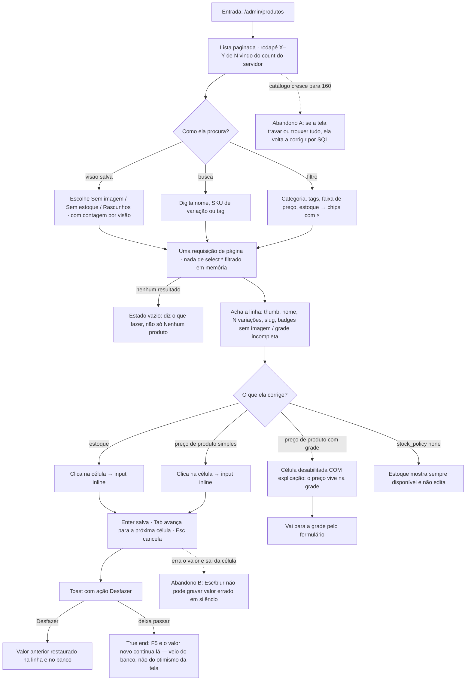

# J-achar-e-corrigir-na-listagem — Achar o produto que importa e corrigir na linha

A journey da feature `13`/P2.1. O valor não é "a tabela carrega" — é **a lojista corrigir um preço no
meio da semana sem abrir formulário**, e a listagem não mentir sobre quanto existe.



```yaml
journey:
  id: J-achar-e-corrigir-na-listagem
  name: "Achar o produto que importa e corrigir preço ou estoque na linha"
  value_statement: "A lojista corrige 12 preços sem abrir 12 formulários, e a listagem diz a verdade sobre quantos produtos existem"
  personas: [Nana, Dora]
  entry_points:
    - url: http://localhost:8081/admin/produtos
      origin: in-app-nav
  actions:
    - step: 1
      verb: "Abre a listagem"
      expected_observable: "Página com 25 linhas no máximo, rodapé X–Y de N com o count real do servidor, uma requisição de página"
    - step: 2
      verb: "Escolhe a visão Sem imagem"
      expected_observable: "Lista filtrada e a contagem da visão coerente com o rodapé"
    - step: 3
      verb: "Busca por SKU de variação e por tag"
      expected_observable: "A busca cobre nome, SKU de variação e tag — não só o nome"
    - step: 4
      verb: "Aplica filtro de categoria e remove pelo × do chip"
      expected_observable: "Cada filtro ativo é um chip com valor e ×; remover reconsulta"
    - step: 5
      verb: "Clica na célula de estoque e digita um valor novo"
      expected_observable: "Input inline na célula; Enter salva, Tab avança, Esc cancela sem gravar"
    - step: 6
      verb: "Usa o Desfazer do toast"
      expected_observable: "O valor anterior volta na tela E no banco"
    - step: 7
      verb: "Olha a linha de um produto com grade e de um com stock_policy none"
      expected_observable: "Faixa R$ X – Y com o rótulo N preços e edição de preço desabilitada COM explicação; sempre disponível não editável"
  goal:
    observable: "O valor corrigido na célula está persistido, e a lista continua coerente com o filtro"
    side_effects: [record-updated, undo-buffer-armed]
  true_end_state: "Depois de um F5, o valor novo continua na linha (leitura do banco, não estado otimista); e o Desfazer usado antes do reload deixou o valor original no banco"
  exit:
    natural: "Ela segue para a próxima linha, sem sair da listagem"
  abandonment:
    - at_step: 1
      how: "A listagem fica lenta ou traz o catálogo inteiro quando cresce"
      resume: "Ela desiste da tela e volta a corrigir por SQL/Studio — o defeito que a 13 existe para matar"
    - at_step: 5
      how: "Digita errado e sai da célula clicando fora"
      resume: "Esc e blur não podem gravar valor errado em silêncio; o Desfazer é a rede"
  crosses: [backoffice, supabase-postgrest]
```

## Notas

- **O que "no servidor" significa aqui**, e é o coração do `PLS-01`: paginação, busca, filtro,
  ordenação e `count` resolvidos no banco. A prova não é visual — é a **rede**: uma requisição por
  página, com `range`, e nenhum `select('*')` do catálogo inteiro. Verificar pela aba Network / pelos
  logs do PostgREST, não pela aparência da tabela.
- **A célula desabilitada é um cenário, não um detalhe.** A própria spec (`13`, Edge Cases) diz que
  desabilitar sem dizer por quê "lê como bug". Para Dora, é o caso onde ela trava.
- **Dívida declarada que não é bug:** a visão `Sem estoque` para produto com grade depende de uma view
  no Postgres que a `13` deixou aberta e a `14` manteve declarada. Se a sessão bater nisso, é dívida
  registrada — não achado novo.
