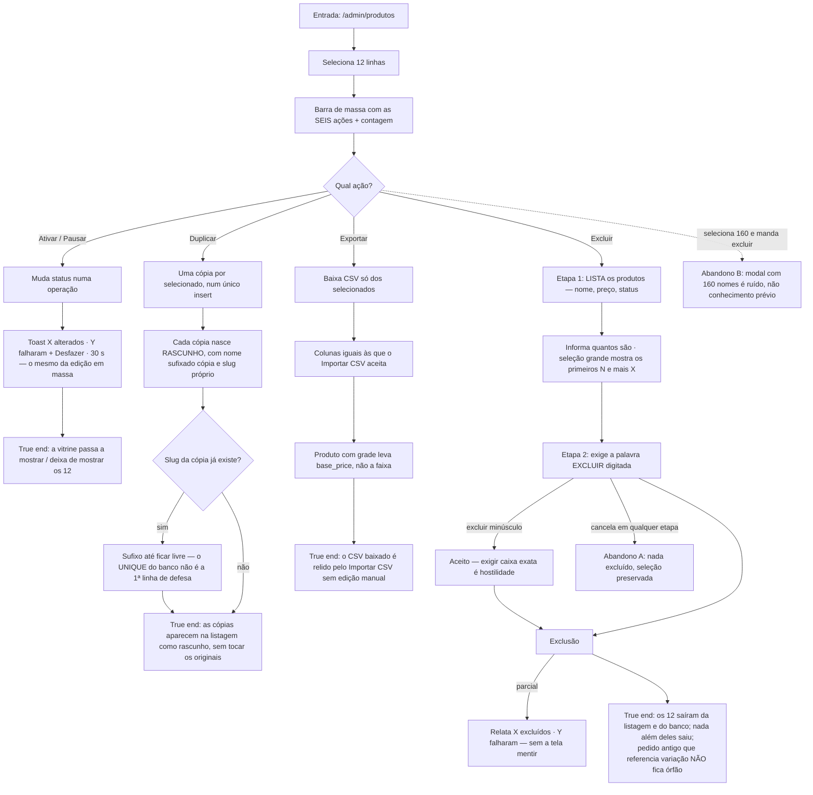

# J-agir-na-selecao-sem-perder-catalogo — Ativar, pausar, duplicar, exportar e excluir a seleção

A journey da feature `14`/P1.1 — as cinco ações diretas que a `13` deixou como lacuna declarada
("o admin seleciona 12 produtos e descobre que a única coisa que dá para fazer com eles é abrir um
painel"). Uma delas é **irreversível e sem desfazer**: excluir. Por isso a confirmação em duas etapas
é o miolo da journey, não um detalhe de UI.



```yaml
journey:
  id: J-agir-na-selecao-sem-perder-catalogo
  name: "Agir em lote sobre a seleção: ativar, pausar, duplicar, exportar, excluir"
  value_statement: "A seleção serve para alguma coisa — e a ação que não tem volta mostra o que vai apagar antes de apagar"
  personas: [Nana, Dora]
  entry_points:
    - url: http://localhost:8081/admin/produtos
      origin: in-app-nav
  actions:
    - step: 1
      verb: "Seleciona 12 produtos"
      expected_observable: "A barra oferece Editar em massa, Ativar, Pausar, Duplicar, Exportar e Excluir, dizendo quantos são"
    - step: 2
      verb: "Aciona Pausar e depois Ativar"
      expected_observable: "Uma operação; toast X alterados · Y falharam com Desfazer · 30 s"
    - step: 3
      verb: "Aciona Duplicar"
      expected_observable: "Uma cópia por item, como rascunho, com (cópia) no nome e slug próprio livre — num único insert"
    - step: 4
      verb: "Aciona Exportar e reabre o arquivo no Importar CSV"
      expected_observable: "CSV com as colunas do importador, só dos selecionados, e relido sem edição manual"
    - step: 5
      verb: "Aciona Excluir"
      expected_observable: "Etapa 1 lista nome, preço e status de cada um e informa quantos são; etapa 2 exige a palavra EXCLUIR (minúsculas aceitas)"
    - step: 6
      verb: "Cancela na etapa 2, reabre e confirma"
      expected_observable: "No cancelamento nada é excluído e a seleção fica; ao confirmar, relato honesto de X excluídos · Y falharam"
  goal:
    observable: "A ação escolhida se aplicou exatamente aos selecionados, com relato fiel do resultado"
    side_effects: [status-updated, records-inserted, csv-downloaded, records-deleted]
  true_end_state: "Depois de F5: os pausados não aparecem na vitrine, as cópias estão na listagem como rascunho sem tocar os originais, o CSV exportado volta pelo importador, e os excluídos saíram do banco sem levar nada além — nem o histórico de pedidos que referencia variações"
  exit:
    natural: "Listagem recarregada, seleção limpa"
  abandonment:
    - at_step: 5
      how: "Ela lê a lista de exclusão, reconhece um produto que não devia estar ali e cancela"
      resume: "Nada excluído; a seleção permanece para ela desmarcar o item e repetir"
    - at_step: 1
      how: "Seleciona os 160 do filtro e manda excluir"
      resume: "A confirmação mostra os primeiros N e um e mais X — listar 160 nomes não é conhecimento prévio"
  crosses: [backoffice, supabase-postgrest, loja-vitrine, importador-csv]
```

## Notas

- **Excluir não tem desfazer, e isso é a razão do desenho.** `A27`: `useUndoBuffer` restaura valores,
  não linhas apagadas. As duas etapas (listar + digitar `EXCLUIR`) são a única proteção que existe.
- **A exclusão tem uma armadilha de banco conhecida:** a FK `order_items.variant_id →
  product_variants(id)` é `NO ACTION` (`PFM-08 AC 9a`). Excluir produto cujas variações já foram
  vendidas tem que falhar de forma legível — nunca erro de FK cru na cara da lojista, nunca sumir com
  o histórico do pedido. É o cenário de maior severidade desta journey.
- **`Exportar` só está andado quando o CSV volta.** Baixar arquivo é meio caminho; o fecho do ciclo
  (`A26`) é o `Importar CSV` reler o que foi exportado sem edição manual.
