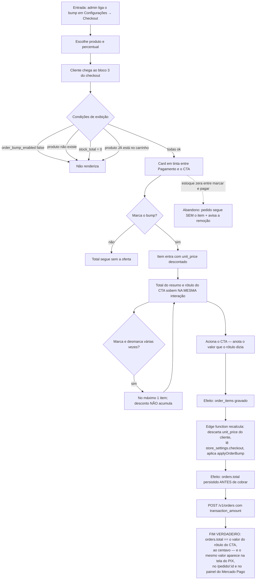

# J-bump-exibido-cobrado — Aceitar a oferta e pagar o valor que apareceu

Esta jornada existe para caçar **um defeito específico que já reapareceu duas vezes** — em contextos
diferentes, pela mesma raiz: um cálculo de preço com dono duplicado.

- Na `08`, a base do cupom era calculada nos dois lados com arredondamento diferente: a loja exibia
  R$ 72,43 e o servidor cobrava R$ 72,44 num carrinho de 3 × R$ 29,90 com cupom de 15%.
- Na `09`, o Verifier deixou BMP-04 como *"Verified na instância do bump · Needs Fix na cláusula
  'idêntico ao exibido'"*.

O servidor **descarta** o `unit_price` que o cliente manda (antifraude, PAY-03). Logo qualquer desconto
por item calculado no front é exibido e não cobrado. É a razão de o desconto do bump viver dentro de
`calculateOrderTotals`, a mesma função dos dois lados.



```yaml
journey:
  id: J-bump-exibido-cobrado
  name: "Aceitar a oferta e pagar o valor que apareceu"
  value_statement: "A pessoa aceita um desconto e é cobrada exatamente o que leu — nunca um centavo acima"
  personas: [Marina, Léo]
  entry_points:
    - url: http://localhost:8081/admin/configuracoes (aba Checkout — pré-condição)
      origin: in-app-nav
    - url: http://localhost:8080/checkout
      origin: in-app-nav
  actions:
    - step: 1
      verb: "Admin liga o bump, escolhe o produto e o percentual"
      expected_observable: "Salvou na chave checkout de store_settings; percentual fora de 1–99 é rejeitado"
    - step: 2
      verb: "Cliente vê a oferta antes do CTA"
      expected_observable: "Card em tinta, badge manteiga sobre tinta, preço com desconto e preço cheio riscado"
    - step: 3
      verb: "Marca a oferta"
      expected_observable: "Total do resumo E rótulo do CTA sobem na mesma interação, com o valor descontado"
    - step: 4
      verb: "Marca e desmarca 3 vezes"
      expected_observable: "Continua um único item, com o desconto aplicado uma única vez"
    - step: 5
      verb: "Paga"
      expected_observable: "O valor cobrado é o do rótulo, ao centavo"
  goal:
    observable: "orders.total == valor exibido no CTA no momento do acionamento"
    side_effects: [order_items-com-o-item-do-bump, orders.total-recalculado-no-servidor]
  true_end_state: >
    O mesmo número em quatro lugares: rótulo do CTA, tela do PIX, orders.total no banco, e
    transaction_amount enviado ao Mercado Pago. Divergência de um centavo é FALHA, não arredondamento
    aceitável — é literalmente o defeito que a feature veio corrigir.
  abandonment:
    - at_step: 3
      how: "O estoque do produto do bump zera entre marcar e acionar o CTA"
      resume: "O pedido é criado sem o item e a remoção é informada — nunca falha silenciosa"
  crosses: [backoffice-settings, loja-checkout, core-pricing, edge-function-mercado-pago, Mercado-Pago]
```

## Combinações obrigatórias

O defeito da `08` só apareceu numa combinação específica. Não basta testar o bump sozinho:

| Combinação | Por que |
| ---------- | ------- |
| bump **+ cupom `percent`** | Foi exatamente aqui que a loja e o servidor divergiram um centavo |
| bump **+ cupom `fixed`** que excede o subtotal | O desconto tem de parar no subtotal, nunca virar crédito |
| bump **+ desconto PIX** | Três descontos compondo; a base de cada um importa |
| bump **+ cupom `free_shipping`** | Frete zera e o desconto PIX ainda incide sobre (subtotal − 0) |
| bump **+ produto do bump já no carrinho** | Não renderiza, mas o servidor **ainda desconta** por `product_id` — comportamento deliberado e documentado; conferir que é isso que acontece |

Valores que expõem resíduo de ponto flutuante: **3 × R$ 29,90** (= 89,69999999999999) com cupom de
**15%**. É o par que produziu a divergência original.
