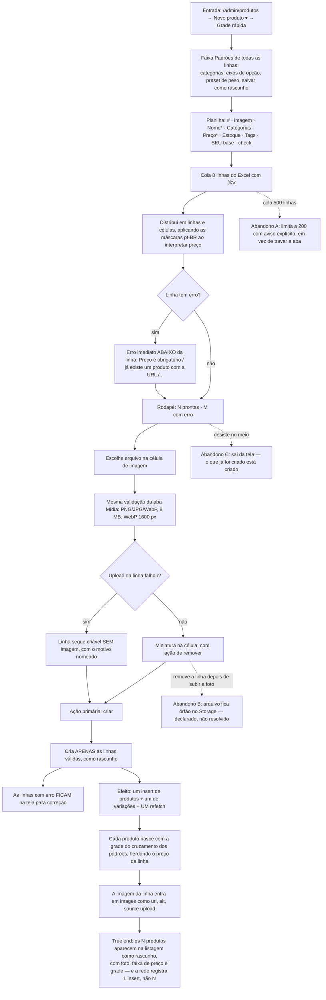

# J-cadastrar-lote-grade-rapida — Cadastrar os 20 itens do drop colando do Excel

A journey da feature `13`/P2.3 mais a coluna de imagem que a `14`/P1.3 acrescentou. O ganho prometido
é inteiro ou não é ganho: cadastrar 20 e depois abrir 20 formulários para pôr foto anula metade.



```yaml
journey:
  id: J-cadastrar-lote-grade-rapida
  name: "Cadastrar os 20 itens do drop colando do Excel, com foto e grade"
  value_statement: "O drop inteiro entra numa tela, com os padrões preenchendo o que se repete — sem 20 idas ao formulário"
  personas: [Nana, Dora]
  entry_points:
    - url: http://localhost:8081/admin/produtos/grade-rapida
      origin: in-app-nav
  actions:
    - step: 1
      verb: "Abre Novo produto ▾ e escolhe Grade rápida"
      expected_observable: "O menu oferece Novo produto, Grade rápida e Importar CSV; a tela abre com a faixa de padrões e a planilha"
    - step: 2
      verb: "Define os padrões do lote: categorias, eixos de opção, peso"
      expected_observable: "O que a linha não informa é herdado do padrão"
    - step: 3
      verb: "Cola 8 linhas do Excel, uma sem preço"
      expected_observable: "Linhas e células distribuídas; erro imediato abaixo da linha inválida; rodapé 7 prontas · 1 com erro"
    - step: 4
      verb: "Navega com Tab e duplica uma linha com ⌥↓"
      expected_observable: "Foco avança célula a célula; a linha é duplicada"
    - step: 5
      verb: "Escolhe uma foto na célula de imagem de duas linhas"
      expected_observable: "Miniatura na célula com ação de remover; arquivo grande/typo errado rejeitado com o motivo nomeado, sem impedir a criação da linha"
    - step: 6
      verb: "Aciona criar"
      expected_observable: "Só as válidas são criadas, como rascunho; as com erro ficam na tela"
  goal:
    observable: "N produtos rascunho criados com grade de variações e imagem, numa escrita em lote"
    side_effects: [records-inserted, variant-rows-inserted, images-uploaded, single-refetch]
  true_end_state: "Os N produtos estão na listagem como rascunho, com thumb, faixa de preço e contagem de variações; a rede registra um insert de produtos, um de variações e um refetch — não N de cada; e a foto está em products.images com source upload"
  exit:
    natural: "Vai para a listagem conferir o lote, ou corrige as linhas que sobraram com erro"
  abandonment:
    - at_step: 3
      how: "Cola 500 linhas de uma planilha grande"
      resume: "O lote é limitado a 200 com aviso explícito (A24) — a aba não trava"
    - at_step: 5
      how: "Sobe a foto e depois remove a linha da planilha"
      resume: "O arquivo fica órfão no Storage — comportamento declarado na spec, não achado de QA"
  crosses: [backoffice, supabase-postgrest, supabase-storage]
```

## Notas

- **O critério de sucesso é de rede, não de tela.** `PLS-08` nasceu porque o importador de CSV chamava
  `createProduct` num laço e cada chamada terminava em `fetchProducts()` — 40 produtos = 40 `SELECT`s
  do catálogo inteiro. Um lote que cria os produtos certos com N requisições **falha** o requisito
  mesmo com a tela verde. Contar as requisições faz parte da sessão.
- **A coluna de imagem tem que reusar a lib da aba Mídia** (`A30`). Um segundo caminho de upload com
  validação própria divergiria — foi o argumento que manteve a coluna fora da `13`. Então o teste é
  comparativo: o mesmo arquivo de 12 MB rejeitado na aba Mídia tem que ser rejeitado aqui, com a mesma
  mensagem.
- **Herança dos padrões é onde o silêncio é caro:** se um padrão não é aplicado, o produto nasce sem
  categoria ou sem grade e ninguém vê — a linha foi criada, afinal. Conferir no banco o que herdou.
