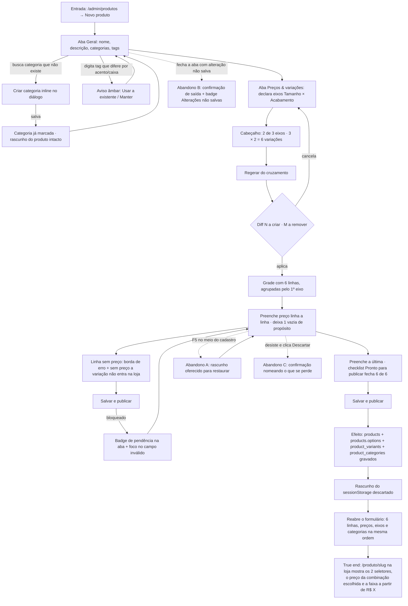

# J-cadastrar-produto-com-grade — Cadastrar um botton novo com eixos e preço por linha

A journey central da feature `11`. O que ela mede não é "o formulário salva", é: **o que a lojista
digitou é o que a cliente vê e o que o servidor cobra**. Por isso o fim não é o toast de sucesso — é
a página do produto na loja, com o seletor de variação e o preço daquela linha.



```yaml
journey:
  id: J-cadastrar-produto-com-grade
  name: "Cadastrar botton novo com eixos e preço por linha"
  value_statement: "A lojista põe no ar um produto com tamanho e acabamento, cada combinação com o próprio preço, e a loja cobra exatamente o que ela digitou"
  personas: [Nana, Dora, Marina]
  entry_points:
    - url: http://localhost:8081/admin/produtos
      origin: in-app-nav
    - url: http://localhost:8081/admin/produtos/novo
      origin: direct
  actions:
    - step: 1
      verb: "Abre Novo produto e preenche nome, descrição e categorias"
      expected_observable: "5 abas — Geral · Mídia · Preços & variações · SEO · Relacionados; contador N / 70 no nome; N selecionadas nas categorias"
    - step: 2
      verb: "Digita tags colando naruto, shonen, anos 90"
      expected_observable: "Três chips de uma vez; tag que difere por acento/caixa gera aviso âmbar com as duas ações"
    - step: 3
      verb: "Declara os eixos Tamanho (3,5 cm; 4,5 cm) e Acabamento (Fosco; Brilhante)"
      expected_observable: "Cabeçalho conta 2 de 3 eixos · 2 × 2 = 4 variações; o 4º eixo fica desabilitado"
    - step: 4
      verb: "Aciona Regerar do cruzamento"
      expected_observable: "Diff N a criar · M a remover ANTES de aplicar; ao aplicar, a grade nasce agrupada pelo 1º eixo"
    - step: 5
      verb: "Preenche o preço de cada linha, deixando uma vazia"
      expected_observable: "Linha ativa sem preço com borda de erro e a frase sem preço a variação não entra na loja; rodapé com N variações · faixa R$ X – Y · Z un."
    - step: 6
      verb: "Tenta Salvar e publicar com a pendência"
      expected_observable: "Save bloqueado, badge de contagem na aba com erro, foco no primeiro campo inválido — nunca um toast genérico"
    - step: 7
      verb: "Fecha a pendência e Salva e publica"
      expected_observable: "Sucesso; checklist 6 de 6 com barra de progresso; rascunho descartado"
  goal:
    observable: "Produto publicado com options, grade de variações e categorias persistidas"
    side_effects: [record-created, variant-rows-created, category-links-created, draft-discarded]
  true_end_state: "Reabrir o formulário traz eixos, grade e categorias na mesma ordem; e /produto/<slug> na loja mostra os dois seletores, a faixa a partir de R$ X e o preço da combinação escolhida — o mesmo que o servidor cobra (o recálculo server-side lê product_variants.price)"
  exit:
    natural: "Volta para /admin/produtos com o produto na listagem, faixa de preço e badges corretos"
  abandonment:
    - at_step: 5
      how: "F5 no meio do cadastro (ou a aba morre)"
      resume: "Ao reabrir o formulário do mesmo produto, o rascunho do sessionStorage é oferecido para restaurar"
    - at_step: 1
      how: "Fecha a aba / navega para outra tela com alteração não salva"
      resume: "Confirmação de saída; badge Alterações não salvas no cabeçalho fixo"
    - at_step: 5
      how: "Desiste e clica Descartar"
      resume: "Confirmação nomeando o que se perde antes de apagar (RFN-08) — não apaga no clique"
  crosses: [backoffice, supabase-postgres, loja-vitrine, edge-function-mercado-pago]
```

## Notas

- **Por que a loja entra na journey.** O desconto e o preço por item são recalculados no servidor a
  partir de `product_variants.price` (`CLAUDE.md` → "Desconto por item é server-side, sempre"). Um
  cadastro que grava a grade mas não aparece na vitrine é um produto que existe e não vende; um que
  aparece com preço diferente do gravado é undercharge. As duas metades só se provam andando até a
  página do produto.
- **A linha sem preço é de propósito.** `PFM-08 AC 11` + `07/T2` decidiram que variação sem preço
  nasce pausada e não vendável. É a pendência mais provável no uso real (a lojista gera 6 linhas e
  preenche 5), e é o caminho onde o formulário antigo mentia com um toast genérico.
- **Cadastro é a superfície onde o `AD-012` bate.** Tipo escrito à mão dizia que a gravação estava
  certa enquanto toda escrita falhava com `PGRST204`/`23502`. A journey só está andada quando a linha
  aparece no banco — nunca por inspeção de tela.
