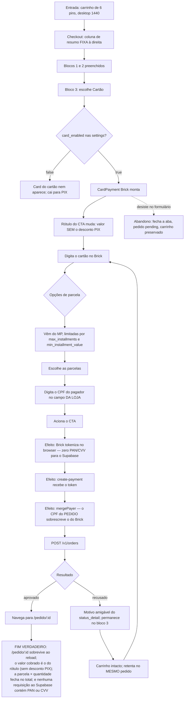

# J-compra-cartao-parcelado — Pagar no cartão, parcelado, sem sair da loja

O caminho do Léo: ticket maior, parcelamento, desktop. Menos volume que o PIX mas maior valor médio.
Passa pelo CardPayment Brick do Mercado Pago — **nenhum campo de PAN/CVV é da loja** (PCI SAQ-A), e o
CPF do pedido **vence** o que o Brick manda.



```yaml
journey:
  id: J-compra-cartao-parcelado
  name: "Pagar no cartão, parcelado, sem sair da loja"
  value_statement: "Ticket maior fecha parcelado, com os dados do cartão nunca tocando o backend da loja"
  personas: [Léo, Marina]
  entry_points:
    - url: http://localhost:8080/checkout
      origin: in-app-nav
  actions:
    - step: 1
      verb: "Escolhe Cartão no bloco 3"
      expected_observable: "Brick do MP monta; o rótulo do CTA passa a mostrar o valor SEM desconto PIX"
    - step: 2
      verb: "Escolhe o parcelamento"
      expected_observable: "Opções vindas do MP, respeitando max_installments e min_installment_value"
    - step: 3
      verb: "Digita o CPF e paga"
      expected_observable: "Aprovação leva a /pedido/:id; recusa mostra motivo em português e mantém o carrinho"
  goal:
    observable: "Pedido aprovado com o valor do cartão (sem desconto PIX) e parcelamento coerente"
    side_effects: [token-do-brick, payer.identification-do-pedido-vence-o-brick, order-no-mp]
  true_end_state: >
    Nenhuma requisição para *.supabase.* contém PAN ou CVV (inspeção de rede). O corpo enviado ao MP
    carrega payer.identification com o CPF do PEDIDO, mesmo que o Brick tenha mandado outro.
    parcelas × valor da parcela fecha com o total. /pedido/:id sobrevive ao reload.
  exit:
    natural: "/pedido/:id"
  abandonment:
    - at_step: 1
      how: "Abre o Brick, olha o valor total e desiste"
      resume: "Pedido pending, carrinho preservado, retomável"
    - at_step: 3
      how: "Duas recusas e troca para PIX"
      resume: "Mesmo order_id; o PIX antigo não cria pedido novo"
  crosses: [loja-checkout, MP-Bricks-SDK, edge-function-mercado-pago, Mercado-Pago-Orders-API]
```

## Restrições de sandbox que atrapalham este caminho

Descobertas na validação da `09` — ambiente, não defeito:

| Restrição | Contorno |
| --------- | -------- |
| Mastercard `5031 4332 1540 6351` devolve `invalid_transaction_amount` em **qualquer** valor nesta conta | Usar o Visa `4235 6477 2802 5682` |
| Pagador precisa de e-mail `@testuser.com` | Usar `test_user_...@testuser.com` no bloco Contato |
| Recusa deliberada | Titular `OTHE` |

**Desktop é a segunda passada, não a primeira.** Mesmo sendo a jornada mais "de mesa" das seis, ela é
andada primeiro em 390px — Marina também paga no cartão, e é nela que o Brick aperta.
