# J-compra-pix-celular — Comprar pins pagando PIX no celular

A jornada do dinheiro. ~90% do tráfego é mobile e o PIX é o meio dominante, então **esta é a jornada
de maior valor da loja**. Se ela quebra, a loja não vende.

```mermaid
flowchart TD
    A[Entrada: link do Instagram no navegador do celular] --> B[Página do produto]
    B --> C[Adiciona ao carrinho]
    C --> D[Abre o carrinho / vai para o checkout]
    D --> E{Está logada?}
    E -->|não| E1[Overlay de auth com returnTo=/checkout]
    E1 --> E2[Código de 6 dígitos ou Google]
    E2 --> F
    E -->|sim| F[Checkout one-page: 3 blocos]
    E1 -.->|fecha o overlay| X1[Abandono: volta pro carrinho? carrinho preservado?]

    F --> G[Bloco 1 Contato: nome, e-mail, WhatsApp]
    G --> H[Bloco 2 Entrega: digita CEP]
    H --> I{ViaCEP resolve?}
    I -->|sim| J[Rua/bairro/cidade travados; número editável]
    I -->|não| J2[Campos destravam para digitação manual]
    J --> K[Cotação Melhor Envio dispara]
    J2 --> K
    K --> L{Cotação respondeu?}
    L -->|sim| M[Opções com transportadora, preço e DATA]
    L -->|falha/vazio| M2[Opção única 'Frete padrão' + aviso]
    M --> N[Escolhe uma opção de envio]
    M2 --> N
    N --> O[Bloco 3 Pagamento: escolhe PIX, digita CPF]
    O --> P{CPF válido?}
    P -->|não| P2[Erro no campo; CTA segue desabilitado]
    P2 --> O
    P -->|sim| Q[Order bump aparece antes do CTA]
    Q --> R{Marca o bump?}
    R -->|sim| S[Total e rótulo do CTA sobem na hora]
    R -->|não| T
    S --> T[CTA fixo no rodapé: 'Pagar R$ X com PIX']
    T --> U[Efeito: cria customers.cpf, addresses, orders + order_items]
    U --> V[Efeito: POST /v1/orders no Mercado Pago]
    V --> W{Order criada?}
    W -->|erro| W2[Alerta amigável; pedido segue pending; CTA reacionável]
    W2 --> T
    W -->|sim| Y[Tela do PIX: valor, contador mm:ss, QR, copia-e-cola]
    Y -.->|fecha a aba| X2[Abandono: pedido fica pending; retoma pela conta?]
    Y -.->|expira sem pagar| X3[Abandono: gera novo código no MESMO pedido]

    Y --> Z[Paga no app do banco]
    Z --> AA[Efeito: webhook do MP chega assinado]
    AA --> AB[Efeito: apply_payment_approval grava approved + paid_at + baixa estoque 1x]
    AB --> AC[Realtime avança a tela sozinha]
    AC --> AD[Navega para /pedido/:id]
    AD --> AE[Efeito: carrinho e cupom limpos AQUI, nunca antes]
    AE --> AF["FIM VERDADEIRO: recarregar /pedido/:id ainda mostra
    a confirmação, com nº do pedido, valor pago, mascote e a
    timeline no estágio certo — e o pedido aparece em /conta"]
```



```yaml
journey:
  id: J-compra-pix-celular
  name: "Comprar pins pagando PIX no celular"
  value_statement: "A pessoa sai com o pedido pago e confirmado, sem ter saído da loja nem redigitado nada"
  personas: [Marina, Bia, Sofia]
  entry_points:
    - url: http://localhost:8080/ (produto → carrinho → /checkout)
      origin: external-share
    - url: http://localhost:8080/checkout
      origin: direct
  actions:
    - step: 1
      verb: "Abre o checkout com itens no carrinho"
      expected_observable: "Uma página com 3 blocos numerados; nenhum passo 'Revisão'; barra de resumo colapsável no topo"
    - step: 2
      verb: "Confere/preenche contato"
      expected_observable: "Nome e e-mail já vêm de customers; bloco colapsa com 'Alterar' quando completo"
    - step: 3
      verb: "Digita o CEP"
      expected_observable: "Endereço preenchido em campos travados e opções de frete reais com data de entrega"
    - step: 4
      verb: "Escolhe o envio"
      expected_observable: "Frete escolhido aparece no resumo e no total; a mais barata mostra 'Grátis' se passou do threshold"
    - step: 5
      verb: "Escolhe PIX e digita o CPF"
      expected_observable: "Badge de −5% no card do PIX; CPF mascarado; CTA habilita e mostra o valor com desconto"
    - step: 6
      verb: "Aciona o CTA fixo no rodapé"
      expected_observable: "Tela do PIX com o VALOR em destaque, contador em contagem regressiva, QR e botão Copiar"
    - step: 7
      verb: "Paga no app do banco"
      expected_observable: "A tela avança sozinha, sem botão 'já paguei', e cai em /pedido/:id"
  goal:
    observable: "/pedido/:id mostra mascote wink, nº do pedido, valor pago e a timeline com 'Pago' concluído"
    side_effects: [customers.cpf-gravado, addresses-default-gravado, order-criada-no-mp, webhook-recebido, estoque-baixado-1x, carrinho-limpo]
  true_end_state: >
    Recarregar /pedido/:id continua mostrando a confirmação (não depende de estado do checkout);
    orders.payment_status = approved com paid_at; orders.address_zip preenchido com 8 dígitos;
    o total cobrado é IDÊNTICO ao que o rótulo do CTA exibia; e o pedido aparece em /conta.
  exit:
    natural: "/pedido/:id, com 'Acompanhar pedido' levando a /conta"
  abandonment:
    - at_step: 1
      how: "Fecha o overlay de login sem entrar"
      resume: "Volta ao carrinho com os itens preservados (Zustand persist)"
    - at_step: 6
      how: "Fecha a aba com o PIX na tela"
      resume: "Pedido fica pending; deve ser retomável em /conta → Pedidos, gerando novo código"
    - at_step: 6
      how: "Deixa o contador expirar sem pagar"
      resume: "Oferece gerar novo código para o MESMO pedido, e aponta para /conta"
  crosses: [loja, edge-function-mercado-pago, Mercado-Pago-Orders-API, Melhor-Envio, ViaCEP, Supabase-Realtime, Postgres-RLS]
```

## Por que o fim verdadeiro é esse

Três lugares onde o QA mentiria se parasse antes:

1. **Parar no "PIX gerado"** — o pedido existe mas ninguém provou que a aprovação chega, avança a tela
   e baixa o estoque uma única vez.
2. **Parar na confirmação sem recarregar** — a confirmação era estado interno da página até a 08 e
   morria no reload, porque o carrinho é limpo na aprovação e a página caía em "carrinho vazio".
3. **Não comparar exibido × cobrado** — é o defeito que reapareceu duas vezes (na 08 por causa do
   arredondamento do cupom, na 09 na cláusula de BMP-04). O fim verdadeiro exige conferir
   `orders.total` contra o que o CTA dizia.
