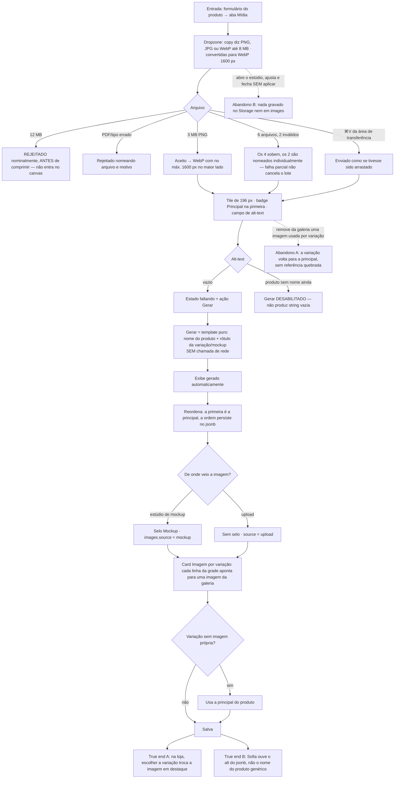

# J-foto-e-alt-do-produto — Pôr a foto certa no produto, com alt que a leitora de tela usa

A journey da feature `12`. O produto é comprado pela foto — e a foto do fosco tem que ser a do fosco.
O `alt` não é enfeite de acessibilidade: é o que Sofia ouve e o que o Google lê.



```yaml
journey:
  id: J-foto-e-alt-do-produto
  name: "Pôr a foto certa no produto e no variante, com alt-text utilizável"
  value_statement: "A cliente vê a foto da combinação que escolheu, e quem usa leitor de tela ouve o que a imagem mostra"
  personas: [Nana, Sofia, Marina]
  entry_points:
    - url: http://localhost:8081/admin/produtos/:id/editar
      origin: in-app-nav
    - url: http://localhost:8080/produto/<slug>
      origin: direct
  actions:
    - step: 1
      verb: "Lê a copy da dropzone e tenta subir um arquivo de 12 MB"
      expected_observable: "A copy diz 8 MB / WebP 1600 px; o arquivo é rejeitado nomeando arquivo e motivo, sem travar a aba"
    - step: 2
      verb: "Sobe 6 arquivos, 2 inválidos"
      expected_observable: "Progresso por arquivo com nome e tamanho; os 4 válidos sobem, os 2 são nomeados"
    - step: 3
      verb: "Cola uma imagem da área de transferência sobre a aba"
      expected_observable: "Enviada como se tivesse sido arrastada"
    - step: 4
      verb: "Usa Gerar no alt-text vazio"
      expected_observable: "Alt determinístico a partir do nome + rótulo, marcado como gerado automaticamente, sem nenhuma requisição de rede"
    - step: 5
      verb: "Abre o estúdio de mockup, ajusta a escala, aplica a todos e fecha sem aplicar"
      expected_observable: "Palco de ~1360 px em três colunas com filmstrip e camadas; ao fechar sem aplicar, nada no Storage nem em images"
    - step: 6
      verb: "Aponta uma imagem da galeria para a variação Fosco e salva"
      expected_observable: "A linha da grade mostra a imagem escolhida"
    - step: 7
      verb: "Como Marina, abre a página do produto e escolhe Fosco"
      expected_observable: "A imagem em destaque troca para a da variação; o alt vem do jsonb"
  goal:
    observable: "images gravado como jsonb com url, alt e source; variação apontando para a imagem certa"
    side_effects: [files-uploaded-to-storage, images-jsonb-updated, variant-image-linked]
  true_end_state: "Na loja: escolher a variação troca a imagem em destaque, o atributo alt do HTML é o texto do jsonb (não o nome do produto), e o WebP servido tem no máximo 1600 px no maior lado"
  exit:
    natural: "Ela publica; a foto é o que a cliente vê primeiro na vitrine"
  abandonment:
    - at_step: 6
      how: "Remove da galeria uma imagem que uma variação estava usando"
      resume: "A variação volta a usar a principal do produto, sem referência quebrada"
    - at_step: 5
      how: "Fecha o estúdio sem aplicar depois de compor 4 renders"
      resume: "Nada foi gravado — nem no Storage nem no produto"
  crosses: [backoffice, supabase-storage, supabase-postgres, loja-vitrine, leitor-de-tela]
```

## Notas

- **A prova do teto de 8 MB é dupla:** rejeitar **e** não ter entrado no canvas. Rejeitar depois de
  comprimir é o defeito original com mensagem — a aba continua travando. Observar o tempo de resposta e
  a ausência de trabalho de canvas, não só o toast.
- **O `Gerar` do alt-text não é IA** (`A20`, `AD-011`) — é template determinístico. Uma requisição de
  rede durante o `Gerar` é achado, não detalhe: significaria provedor não declarado no projeto.
- **1600 px é verificável no Storage**, não na tela: o arquivo servido por
  `/storage/v1/object/public/product-images/...` tem que ter no máximo 1600 px no maior lado. A `12`
  existe porque eram 1200.
- **Sofia entra aqui pela loja.** O backoffice não tem persona de leitor de tela (ver `personas.md`),
  mas o `alt` que ele grava é consumido por ela — `PMD-01 AC 10`.
