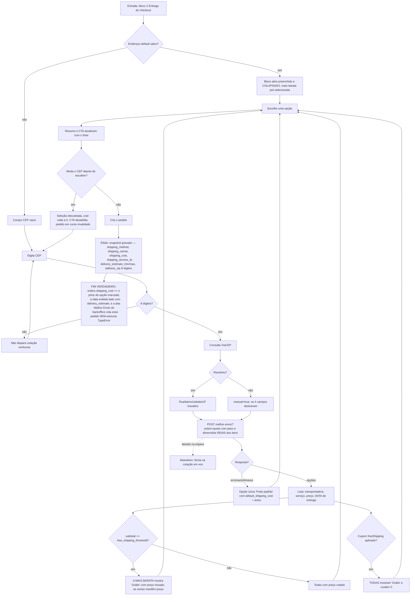

# J-frete-real-melhor-envio — Ver e pagar o frete que foi cotado

A 08 existe em parte por causa desta jornada: antes, o checkout mostrava três opções com preço literal
no código e prazo em string fixa, enquanto a página de produto já cotava o Melhor Envio de verdade.
A pessoa via cotação real no produto e pagava valor inventado no checkout.



```yaml
journey:
  id: J-frete-real-melhor-envio
  name: "Ver e pagar o frete que foi cotado"
  value_statement: "A pessoa vê transportadora, valor e data reais, e paga exatamente aquilo"
  personas: [Marina, Léo, Bia]
  entry_points:
    - url: http://localhost:8080/checkout
      origin: in-app-nav
  actions:
    - step: 1
      verb: "Digita o CEP"
      expected_observable: "Endereço preenchido em campos travados; cotação dispara só com 8 dígitos"
    - step: 2
      verb: "Lê as opções de envio"
      expected_observable: "Cada opção traz transportadora, nome do serviço, preço e uma DATA (não '6-10 dias úteis')"
    - step: 3
      verb: "Escolhe uma opção"
      expected_observable: "Resumo e rótulo do CTA passam a incluir aquele frete"
  goal:
    observable: "O frete no resumo é o price da opção marcada, com data calculada em dias úteis"
    side_effects: [snapshot-de-envio-no-pedido, address_zip-gravado]
  true_end_state: >
    orders.shipping_cost == price da opção escolhida; delivery_estimate_min/max gravados como date;
    shipping_service_id preservado; address_zip com 8 dígitos sem máscara; e a aba Melhor Envio do
    backoffice consegue cotar a etiqueta desse pedido (antes da 08 estourava TypeError).
  exit:
    natural: "Segue para o bloco 3 Pagamento"
  abandonment:
    - at_step: 1
      how: "Fecha a aba enquanto a cotação está em voo"
      resume: "Rascunho volta do sessionStorage; a cotação refaz pela chave do React Query"
    - at_step: 3
      how: "Troca o CEP depois de já ter escolhido o frete"
      resume: "Seleção descartada e pedido em curso invalidado — não pode cobrar frete de CEP antigo"
  crosses: [loja, edge-function-melhor-envio, API-Melhor-Envio, ViaCEP, backoffice-order-management]
```

## Os dois pontos onde isso costuma passar batido

**Peso e dimensão reais.** Os mappers de produto não carregavam `weight_kg`/`width_cm`/`height_cm`/
`length_cm`, então a cotação "real" saía sempre com os fallbacks 11/2/16/0,1 — frete errado com cara de
certo. Conferir que um produto com dimensão cadastrada produz cotação **diferente** de um sem.

**A fronteira do frete grátis.** `subtotal >= threshold`, não `>`. Um carrinho de exatamente R$ 150,00
contra threshold 150 tem de liberar. Essa igualdade exata já sobreviveu a um mutante uma vez.
