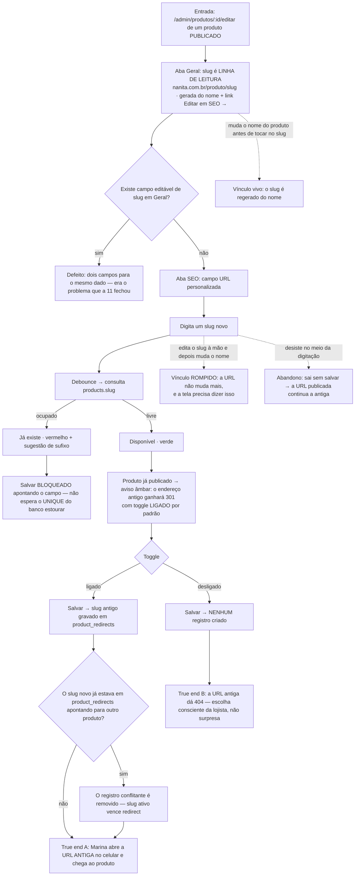

# J-mudar-url-sem-quebrar-link — Mudar a URL do produto sem matar o link do Instagram

A journey da feature `11`/P1.5. Atravessa backoffice → banco → loja, e é a que tem consequência
**fora** do produto: cada drop é divulgado por link no Stories, e um slug trocado sem 301 mata todo
link já postado. Ninguém reclama no backoffice — a venda simplesmente não acontece.



```yaml
journey:
  id: J-mudar-url-sem-quebrar-link
  name: "Mudar a URL de um produto publicado preservando os links já divulgados"
  value_statement: "A lojista corrige o endereço do produto e quem clicou no link antigo do Stories continua chegando ao produto"
  personas: [Nana, Marina]
  entry_points:
    - url: http://localhost:8081/admin/produtos/:id/editar
      origin: in-app-nav
    - url: http://localhost:8080/produto/<slug-antigo>
      origin: external-share
  actions:
    - step: 1
      verb: "Abre um produto publicado e olha o slug na aba Geral"
      expected_observable: "Linha de leitura com a URL e o link Editar em SEO → — nenhum campo editável de slug em Geral"
    - step: 2
      verb: "Muda o nome do produto sem nunca ter editado o slug"
      expected_observable: "O slug é regerado a partir do nome"
    - step: 3
      verb: "Vai para SEO e digita um slug que já existe em outro produto"
      expected_observable: "Já existe em vermelho, com sugestão de sufixo, e Salvar bloqueado apontando o campo"
    - step: 4
      verb: "Corrige para um slug livre"
      expected_observable: "Disponível em verde, com debounce — a consulta não roda a cada tecla"
    - step: 5
      verb: "Confere o aviso de 301"
      expected_observable: "Aviso âmbar informando que o endereço antigo ganhará 301, com o toggle ligado por padrão"
    - step: 6
      verb: "Salva e depois muda o nome de novo"
      expected_observable: "A URL NÃO muda mais (vínculo rompido) e a tela informa isso"
    - step: 7
      verb: "Como Marina, abre a URL antiga no celular"
      expected_observable: "Chega ao produto — o 301 de product_redirects resolve em /produto/:slug"
  goal:
    observable: "Slug novo salvo, com o antigo registrado em product_redirects"
    side_effects: [record-updated, redirect-row-created, conflicting-redirect-removed]
  true_end_state: "A URL antiga aberta na loja (aba nova, sem cache de sessão) chega à página do produto; a URL nova também; e com o toggle desligado nenhuma linha é criada em product_redirects"
  exit:
    natural: "Volta à listagem; o slug novo aparece na coluna Produto"
  abandonment:
    - at_step: 4
      how: "Digita metade do slug e sai da tela sem salvar"
      resume: "A URL publicada continua a antiga; o rascunho guarda o que ela digitou"
  crosses: [backoffice, supabase-postgres, loja-vitrine, links-externos-instagram]
```

## Notas

- **Metade desta journey mora na feature `07`** (`PST-07`, a resolução do redirect em
  `/produto/:slug`). Aqui se prova a **gravação**; a resolução é o que faz a gravação valer. Testar só
  o lado admin deixaria passar exatamente o caso que dói: a linha em `product_redirects` existe e a
  loja ignora.
- **Marina abre no celular, e isso não é decoração.** O link divulgado é do Stories; o clique real
  acontece no navegador do Instagram. É o único trecho de backoffice cuja prova final é mobile.
- **A regra do conflito (`AC 9`) é a sutil:** se o slug novo já estava em `product_redirects`
  apontando para outro produto, o registro conflitante sai — slug ativo vence redirect. Sem isso, um
  produto vivo fica inalcançável por causa de um redirect antigo.
