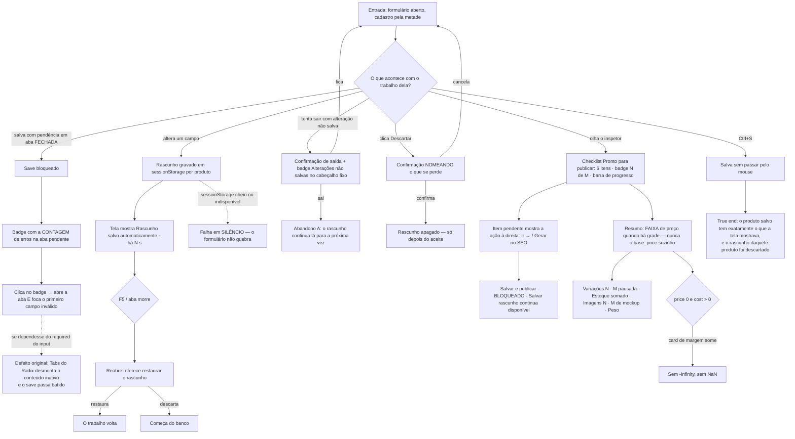

# J-nao-perder-o-trabalho-no-formulario — Não perder 40 minutos de cadastro, e saber onde está o erro

A journey da feature `11`/P1.7 (+ `RFN-07`/`RFN-08` da `14`). Separada da de cadastro de propósito: o
valor aqui não é "o produto foi criado", é **o formulário não me trair**. São os defeitos que a
reescrita da `11` existia para não recriar — validação que o Radix desmonta junto com a aba, margem
`-Infinity`, F5 que apaga tudo, `Descartar` que apaga sem perguntar.



```yaml
journey:
  id: J-nao-perder-o-trabalho-no-formulario
  name: "Cadastrar sem perder o trabalho e sabendo onde está o erro"
  value_statement: "A lojista não perde 40 minutos de cadastro por um F5, e quando o save é bloqueado ela sabe em qual aba e em qual campo"
  personas: [Nana, Dora]
  entry_points:
    - url: http://localhost:8081/admin/produtos/novo
      origin: in-app-nav
    - url: http://localhost:8081/admin/produtos/:id/editar
      origin: in-app-nav
  actions:
    - step: 1
      verb: "Preenche só o nome e clica Salvar e publicar sem nunca abrir a aba Preços"
      expected_observable: "Save bloqueado, badge com a contagem de erros na aba Preços — não um toast genérico"
    - step: 2
      verb: "Clica no badge da aba"
      expected_observable: "A aba abre e o foco vai para o primeiro campo inválido"
    - step: 3
      verb: "Altera um campo e observa o indicador de rascunho"
      expected_observable: "Rascunho salvo automaticamente · há N s ao lado das abas; badge Alterações não salvas no cabeçalho"
    - step: 4
      verb: "Dá F5 e reabre o formulário do mesmo produto"
      expected_observable: "O sistema oferece restaurar o rascunho"
    - step: 5
      verb: "Tenta navegar para outra tela com alteração não salva"
      expected_observable: "Confirmação antes de sair"
    - step: 6
      verb: "Clica Descartar"
      expected_observable: "Confirmação nomeando o que se perde; nada é apagado antes do aceite"
    - step: 7
      verb: "Olha o checklist e o Resumo no inspetor com um produto de preço 0 e custo preenchido"
      expected_observable: "Checklist com badge N de M, barra de progresso e ação por item; Resumo mostrando a FAIXA de preço; nenhum card de margem com -Infinity"
    - step: 8
      verb: "Salva com Ctrl+S"
      expected_observable: "O save dispara pelo atalho"
  goal:
    observable: "O produto é salvo com o conteúdo que a tela mostrava, e o rascunho daquele produto é descartado"
    side_effects: [draft-written-to-sessionstorage, draft-discarded-on-save]
  true_end_state: "Depois do save, o produto relido do banco tem o que a tela mostrava; o rascunho daquele produto não existe mais no sessionStorage; e um F5 antes do save teria oferecido restaurar"
  exit:
    natural: "Ela volta à listagem sabendo que o que viu foi o que salvou"
  abandonment:
    - at_step: 5
      how: "Sai da tela mesmo com alteração não salva"
      resume: "O rascunho continua no sessionStorage e é oferecido na próxima abertura do mesmo produto"
    - at_step: 3
      how: "O sessionStorage está cheio ou indisponível (navegação privada, cota)"
      resume: "O rascunho falha em silêncio e o formulário continua funcionando — declarado na spec"
  crosses: [backoffice, navegador-sessionstorage, supabase-postgrest]
```

## Notas

- **Por que "aba fechada" é o cenário-chave:** o `required` do preço vivia dentro do
  `TabsContent value="precos"`, e o `Tabs` do Radix **desmonta o conteúdo inativo** — salvar de outra
  aba passava batido. A validação tinha que sair do input. É a regressão mais provável de toda a `11`,
  porque é invisível: a tela parece certa.
- **`Descartar` era a única ação destrutiva sem confirmação** do formulário (`RFN-08`). Dora é a
  persona que clica nela achando que "descartar" significa "fechar sem salvar".
- **O Resumo mostrando `base_price` em vez da faixa não é detalhe de layout** — é o defeito que o
  programa inteiro (`07`→`14`) existiu para matar: produto com grade não vende pelo `base_price`.
