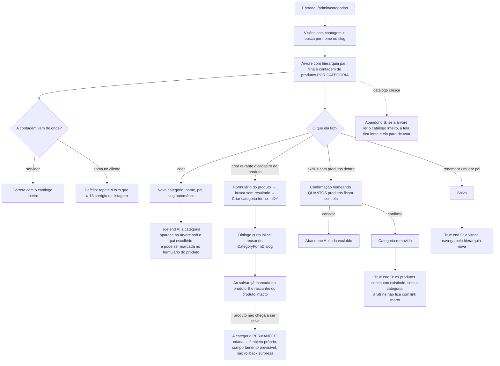

# J-organizar-categorias — Organizar as categorias que a vitrine navega

A journey da feature `14`/P1.6 (`RFN-09`). Categorias é a taxonomia por onde a cliente navega: uma
categoria criada errada, contada errada ou excluída sem aviso desorganiza a vitrine, não o admin. E é
a tela que a `14` trouxe para a mesma linguagem da *listagem v2* — visões com contagem, busca, seleção,
massa, inspetor.



```yaml
journey:
  id: J-organizar-categorias
  name: "Organizar as categorias por onde a vitrine navega"
  value_statement: "A lojista cria, aninha e limpa categorias sabendo quantos produtos cada uma tem — e sem deixar produto órfão por engano"
  personas: [Nana, Dora]
  entry_points:
    - url: http://localhost:8081/admin/categorias
      origin: in-app-nav
    - url: http://localhost:8081/admin/produtos/novo
      origin: in-app-nav
  actions:
    - step: 1
      verb: "Abre a tela de categorias"
      expected_observable: "Visões com contagem, busca por nome ou slug, e a árvore com o caminho hierárquico e a contagem de produtos de cada categoria"
    - step: 2
      verb: "Confere a contagem de uma categoria contra o banco"
      expected_observable: "A contagem bate — e vem do servidor, não de soma no cliente"
    - step: 3
      verb: "Cria uma categoria filha de uma existente"
      expected_observable: "Slug automático; a categoria aparece sob o pai escolhido"
    - step: 4
      verb: "No formulário de produto, busca uma categoria que não existe e usa Criar categoria <termo>"
      expected_observable: "Diálogo inline; ao salvar, a nova categoria já vem marcada e o rascunho do produto não se perde"
    - step: 5
      verb: "Tenta excluir uma categoria que tem produtos"
      expected_observable: "Confirmação nomeando quantos produtos ficam sem ela"
    - step: 6
      verb: "Cancela, depois confirma"
      expected_observable: "No cancelamento nada muda; ao confirmar, os produtos seguem existindo sem a categoria"
  goal:
    observable: "Árvore de categorias refletindo o que a lojista quis, com contagens reais"
    side_effects: [record-created, record-deleted, product-category-links-removed]
  true_end_state: "A hierarquia nova aparece na navegação da loja; a categoria criada inline está vinculada ao produto que a criou (product_categories); e a excluída não deixou link morto na vitrine nem produto inacessível"
  exit:
    natural: "Volta para produtos e usa as categorias novas no cadastro"
  abandonment:
    - at_step: 4
      how: "Cria a categoria inline e desiste de salvar o produto"
      resume: "A categoria fica criada (é objeto próprio) — previsível, declarado na spec da 11"
    - at_step: 5
      how: "Lê quantos produtos perdem a categoria e desiste"
      resume: "Nada excluído; a árvore continua como estava"
  crosses: [backoffice, supabase-postgres, loja-navegacao]
```

## Notas

- **A contagem no servidor é o requisito, não a árvore bonita** (`RFN-09 AC 2`). Somar no cliente
  exigiria ler o catálogo inteiro — exatamente o defeito que a `13` matou na listagem de produtos. A
  prova é de rede: uma consulta agregada, não um `select('*')`.
- **Esta tela acabou de mudar** (commit `1bee074`, *tela de categorias v2 com hierarquia e contagem no
  servidor*), e junto veio a migration `20260801150000_categories-hierarchy-and-counts.sql`. Superfície
  nova = tudo `untested`.
- **Atenção ao `AD-012` desta feature:** `DbCategory` declarava `parent_id`, `banner_url` e
  `color_accent` que o banco não tinha, e **toda gravação de categoria falhava com `PGRST204`**.
  Gravação de categoria se prova gravando — nunca por inspeção de tipo ou de tela.
