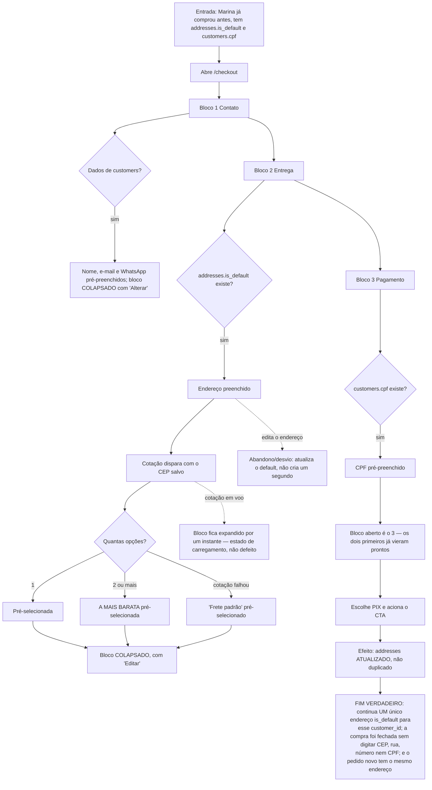

# J-recompra-endereco-salvo — Recomprar sem redigitar nada

A promessa que a `08` faz ao público real da loja: colecionadora que volta a cada drop **não redigita
endereço nem CPF**. A tabela `addresses` existia desde a migration inicial e nunca era usada — o
endereço era redigitado a cada compra.

Esta jornada carrega um AC que já falhou uma vez: **ADR-02** ("o bloco Entrega abre já preenchido **e
colapsado**") não acontecia no caso geral, porque colapsar exige `shipping !== null` e nada
pré-selecionava o frete. Foi corrigido pré-selecionando a opção mais barata quando o endereço vem do
default salvo.



```yaml
journey:
  id: J-recompra-endereco-salvo
  name: "Recomprar sem redigitar nada"
  value_statement: "Quem já comprou fecha a próxima em segundos, sem redigitar endereço nem CPF"
  personas: [Marina, Léo]
  entry_points:
    - url: http://localhost:8080/checkout
      origin: in-app-nav
  actions:
    - step: 1
      verb: "Abre o checkout já logada, tendo comprado antes"
      expected_observable: "Blocos 1 e 2 já vêm COLAPSADOS e preenchidos; o bloco aberto é o 3 Pagamento"
    - step: 2
      verb: "Confere que o CPF já está lá"
      expected_observable: "Campo CPF pré-preenchido de customers.cpf, mascarado"
    - step: 3
      verb: "Escolhe PIX e paga"
      expected_observable: "CTA habilitado desde o início — nenhum campo pendente"
  goal:
    observable: "Compra fechada sem digitar CEP, endereço ou CPF"
    side_effects: [addresses-atualizado-nao-duplicado]
  true_end_state: >
    SELECT count(*) FROM addresses WHERE customer_id = X AND is_default = true → exatamente 1,
    antes e depois da segunda compra. customers.cpf inalterado (ou atualizado, se digitou outro).
    O segundo pedido carrega o mesmo endereço do primeiro.
  exit:
    natural: "/pedido/:id da segunda compra"
  abandonment:
    - at_step: 1
      how: "Edita o endereço porque mudou de casa"
      resume: "O registro default é ATUALIZADO; não aparece um segundo default"
  crosses: [loja-checkout, addresses-RLS-UPDATE, customers-RLS-UPDATE, Melhor-Envio]
```

## O detalhe que a policy de RLS esconde

`customers` e `addresses` nasceram só com SELECT + INSERT. `.update()` no Supabase **não lança quando a
RLS nega** — devolve 0 linhas sem `error`. O `AuthContext` já sofria disso: atualizava `customers.name`
e falhava calado.

A `08` criou as policies de UPDATE e fez os hooks checarem **linhas afetadas**. O teste de verdade
desta jornada é: **fazer a segunda compra e conferir no banco** que gravou. Uma tela que diz "salvo"
não prova nada aqui.
