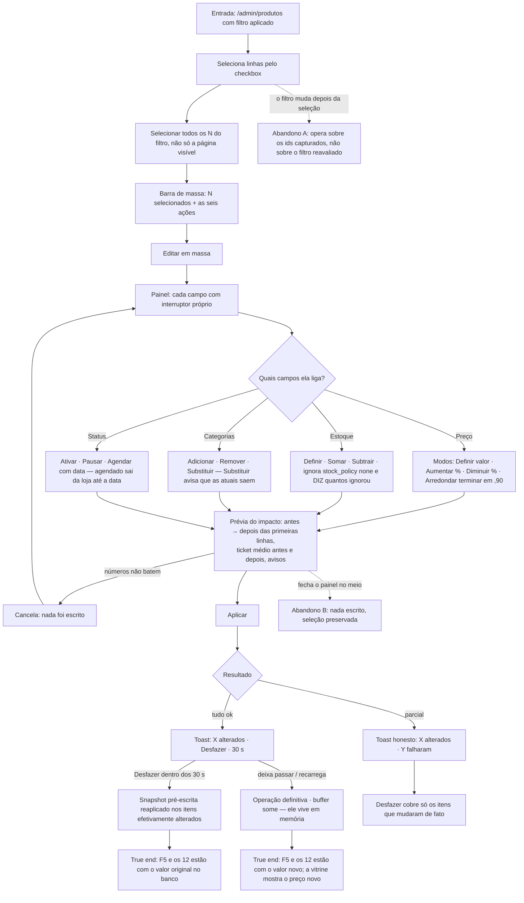

# J-reprecificar-em-massa — Reajustar 12 produtos numa tacada, com prévia e volta atrás

A journey da feature `13`/P2.2 mais as duas lacunas que a `14`/P1.2 fechou (categorias e `Agendar`).
É a operação de maior alcance do backoffice: um clique errado aqui muda o preço de dezenas de
produtos ao mesmo tempo. Por isso a prévia e o desfazer **são** a journey, não enfeite.



```yaml
journey:
  id: J-reprecificar-em-massa
  name: "Reajustar preço, estoque, categorias e status de 12 produtos numa operação"
  value_statement: "A lojista reprecifica o catálogo antes do drop vendo o impacto antes de aplicar, e volta atrás se errou"
  personas: [Nana, Dora]
  entry_points:
    - url: http://localhost:8081/admin/produtos
      origin: in-app-nav
  actions:
    - step: 1
      verb: "Filtra por categoria e seleciona todos os N do filtro"
      expected_observable: "A barra mostra quantos estão selecionados e oferece as seis ações; a seleção cobre o filtro inteiro, não só a página"
    - step: 2
      verb: "Abre Editar em massa e liga só o campo Preço, modo Aumentar 10%"
      expected_observable: "Campos desligados não entram na operação; o painel só promete o que está ligado"
    - step: 3
      verb: "Confere a Prévia do impacto contra a conta feita à mão em 3 linhas"
      expected_observable: "antes → depois por linha, ticket médio antes e depois, e avisos — antes de qualquer escrita"
    - step: 4
      verb: "Liga Estoque com produtos de stock_policy none na seleção"
      expected_observable: "Os none são ignorados E a tela informa quantos foram ignorados"
    - step: 5
      verb: "Liga Categorias no modo Substituir"
      expected_observable: "A prévia avisa que as categorias atuais serão removidas"
    - step: 6
      verb: "Liga Status → Agendar e escolhe uma data futura"
      expected_observable: "Exige data; o produto sai da loja até ela"
    - step: 7
      verb: "Aplica e usa o Desfazer"
      expected_observable: "Toast X alterados (· Y falharam quando parcial) com Desfazer · 30 s; desfazer restaura os valores de antes"
  goal:
    observable: "Os produtos selecionados carregam o valor novo, numa operação, com relato honesto de quantos mudaram"
    side_effects: [records-updated, category-links-diffed, undo-snapshot-captured]
  true_end_state: "Depois de F5, o banco tem o valor novo (ou o original, se ela desfez) nos itens exatos da seleção — e nada mudou fora dela; produto agendado não aparece na vitrine antes da data"
  exit:
    natural: "Volta à listagem com a seleção limpa e as linhas atualizadas"
  abandonment:
    - at_step: 3
      how: "A prévia mostra um número que ela não esperava e ela fecha o painel"
      resume: "Nada foi escrito; a seleção continua para ela tentar outro modo"
    - at_step: 7
      how: "Recarrega a página com o desfazer pendente"
      resume: "O buffer some (vive em memória, A23) e a operação é definitiva — comportamento declarado, não bug"
  crosses: [backoffice, supabase-postgrest, loja-vitrine]
```

## Notas

- **O desfazer é honesto por construção, e isso muda o que se testa.** `A23`: não existe `undo`
  transacional; o desfazer é um segundo `update` com o snapshot capturado **antes** da escrita. Logo o
  teste que importa é o do caso parcial — se 9 de 12 mudaram, o desfazer tem que cobrir 9, não 12.
- **`buildBulkPatch` já era testado quando a UI não existia.** A `14` fechou a lacuna de UI de
  categorias e `Agendar`. Aqui interessa exatamente a costura: a função pura sabe fazer, a tela liga o
  interruptor certo, e o que chega ao banco é o diff — sem reescrever vínculo que não mudou
  (`RFN-04`).
- **Prévia é contrato com a Dora.** Ela é a persona que aplica em 12 produtos por engano; a prévia é
  a única coisa entre a boa intenção e o catálogo reprecificado errado.
