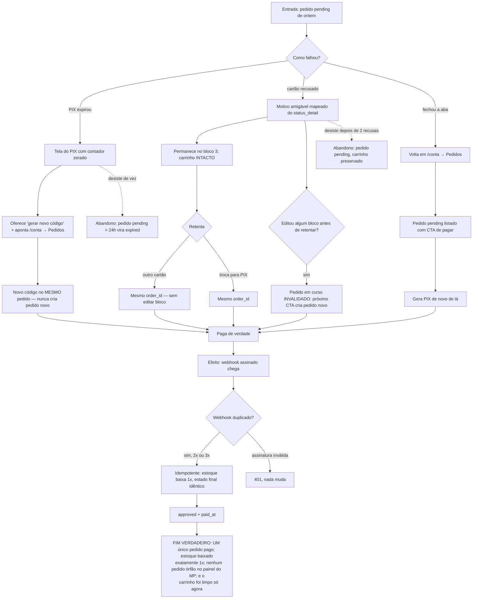

# J-retomar-pagamento-falho — Terminar a compra que deu errado, sem pagar duas vezes

A jornada do Rui. Cobre os três caminhos de recuperação: PIX expirado, cartão recusado, e aba fechada
com o pedido pendente. É onde moram os bugs de maior impacto — pedido órfão, cobrança dupla, carrinho
perdido — e é a jornada que a `09` mais mexeu (Orders API, mapa de status, retentativa).



```yaml
journey:
  id: J-retomar-pagamento-falho
  name: "Terminar a compra que deu errado, sem pagar duas vezes"
  value_statement: "A pessoa recupera a compra sem risco de cobrança dupla nem de pedido fantasma"
  personas: [Rui, Marina]
  entry_points:
    - url: http://localhost:8080/conta
      origin: direct
    - url: http://localhost:8080/checkout
      origin: in-app-nav
  actions:
    - step: 1
      verb: "Abre a conta e encontra o pedido pendente"
      expected_observable: "Pedido pending listado com o CTA de pagar; valor e data corretos"
    - step: 2
      verb: "Gera um novo código PIX"
      expected_observable: "Código novo, MESMO número de pedido — nada de pedido duplicado"
    - step: 3
      verb: "Ou retenta o cartão que foi recusado"
      expected_observable: "Motivo legível em português; carrinho intacto; mesmo order_id"
    - step: 4
      verb: "Paga"
      expected_observable: "Tela avança sozinha; um único pedido aprovado"
  goal:
    observable: "Um pedido aprovado, estoque baixado uma vez, nenhum pedido órfão"
    side_effects: [webhook-idempotente, estoque-1x, paid_at-gravado]
  true_end_state: >
    Contagem no banco: exatamente 1 pedido approved para essa tentativa; products.stock_total decrementado
    exatamente 1x mesmo com webhook reentregue; nenhum pedido pending órfão sobrando no painel do MP; e o
    carrinho/cupom limpos apenas na aprovação.
  abandonment:
    - at_step: 2
      how: "Desiste de novo e não volta"
      resume: "Pedido pending por mais de 24h passa a expired"
    - at_step: 3
      how: "Duas recusas seguidas e fecha"
      resume: "Carrinho preservado; pedido segue pending e retomável pela conta"
  crosses: [loja-checkout, loja-conta, edge-function-mercado-pago, webhook-MP, RPC-apply_payment_approval, Realtime]
```

## O que só esta jornada pega

**Retentativa × edição.** Retentar pagamento reusa o `order_id`; **editar um bloco** invalida o pedido
e o próximo CTA cria outro. A distinção existe porque `orders` não tem policy de UPDATE para
`authenticated` — um bloco editado não persistiria e a function cobraria o frete antigo. Conferir os
dois caminhos separadamente: `createOrder` chamado 1× na retentativa pura, 2× quando houve edição.

**Pedido órfão no painel do MP.** A validação da `09` levantou isso como achado sério: uma order de
recusa que fica pendurada. Conferir no painel do sandbox depois de uma recusa.

**Webhook reentregue.** O MP entregou 2 notificações por order criada durante a validação da `09`. A
idempotência é herdada da `02`, mas a Orders API mudou o formato — reconferir que estoque baixa 1×.
