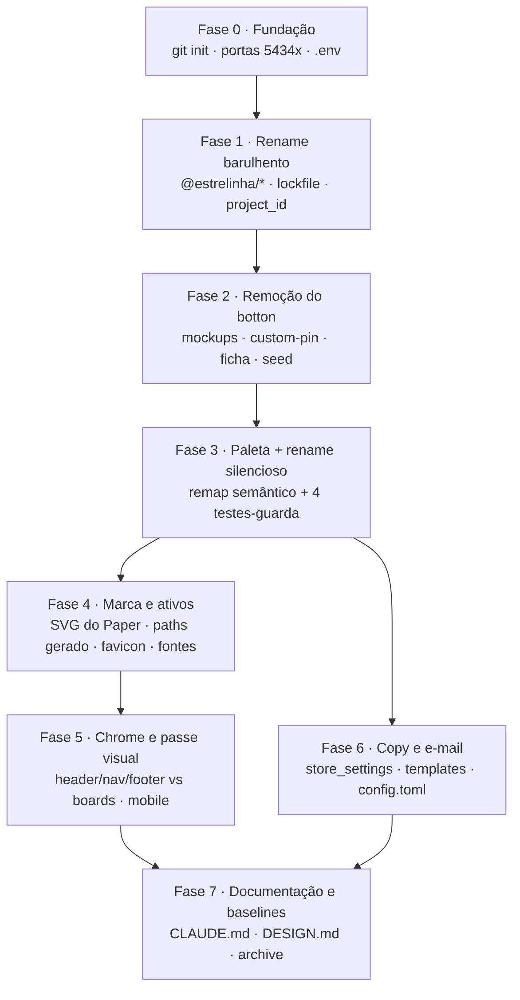

# 20 · Rebrand Uma Estrelinha — Design

**Spec**: [`spec.md`](./spec.md) · **Contexto**: [`context.md`](./context.md)
**Status**: Draft — aguardando aprovação

---

## A ideia central

Esta feature tem **dois renames com perfis de risco opostos**, e tratá-los igual é o erro que
custaria caro:

| | superfície | oráculo | se errar |
| --- | --- | --- | --- |
| **Rename barulhento** | `@nanapin/*` → `@estrelinha/*` — 921 linhas de import, `paths`, aliases do Vite, `package.json` | `tsc` + `pnpm install` | **Quebra alto.** Módulo não resolve. |
| **Rename silencioso** | `nanita-*` / `nana-*` → `estrelinha-*` — ~1.100 ocorrências de classe Tailwind e ~300 de `var(--…)` | **nenhum** | **Não quebra nada.** A classe não existe, o elemento sai sem cor, o build passa, os testes passam. |

Todo o desenho abaixo é organizado por essa distinção. O rename barulhento é um passe mecânico com
o compilador como juiz. O rename silencioso precisa de **um juiz construído de propósito** — a
varredura com âncora de contagem — porque não existe um.

E há um terceiro eixo que não é rename nenhum: a **paleta muda de família**. Rosa Carimbo vira ouro
`accent`; rosa Carmim vira slate `primary`. Um remap mecânico entrega o token certo em ~1.100 lugares,
mas não decide se aquele elemento *devia* ser ouro. Por isso o passe visual é fase própria, não
polimento no fim.

---

## Architecture Overview

**Por que esta ordem.** Três dependências são de fato obrigatórias e o resto é economia:

1. **Fase 1 antes de tudo** — ela toca todo arquivo que importa um pacote. Qualquer trabalho feito
   antes dela seria reescrito por ela.
2. **Fase 2 antes da Fase 3** — re-tematizar 30 arquivos de Mockup Studio e 769 linhas de
   `CustomPinPage` para depois apagá-los é trabalho jogado fora. Apagar primeiro **encolhe a
   superfície da fase mais arriscada**.
3. **Fase 7 por último** — ela registra as baselines de lint, tipo e teste *medidas*, e elas só
   existem quando tudo fechou.

As fases 3→4→5 são uma corrente (paleta → marca → composição). A fase 6 (copy e e-mail) só depende da
paleta, para os templates HTML nascerem com as cores certas — por isso ela é **paralela** a 4/5 e não
precisa esperar o passe visual.

---

## Decisões de arquitetura

### D1 · Tabela de remap: por **papel**, não por nome

O mapeamento não é `nanita-x → estrelinha-x`. Os nomes da Nanita eram apelidos de doceria (`jam`,
`glaze`, `sugar`); os da Uma Estrelinha nomeiam função (`primary`, `accent`, `ground`). Um rename
literal produziria `estrelinha-jam`, que não significa nada.

| classe atual | usos | papel na tela | destino | valor |
| --- | ---: | --- | --- | --- |
| `nanita-jam` | 300 | ação, preço, link, aba ativa | `estrelinha-primary` | `#34495E` |
| `nanita-ink` | 292 | texto primário e superfície escura | `estrelinha-ink` | `#23303A` |
| `nanita-plum` | 205 | texto secundário | `estrelinha-ink-soft` | `#54616B` |
| `nanita-border` | 133 | divisor, contorno de card | `estrelinha-line` | `#E6DFD4` |
| `nanita-sugar` | 93 | faixa de seção, palco de foto | `estrelinha-ground-deep` | `#F1EBE1` |
| `nanita-glaze` | 40 | preenchimento, ilustração | `estrelinha-accent` | `#B8945F` |
| `nanita-butter` | 12 | badge **sobre escuro** | `estrelinha-accent` | `#B8945F` |
| `nanita-raspberry` | 7 | detalhe gráfico ≥24px | `estrelinha-accent-strong` | `#A07E4C` |
| `nanita-rule` | 6 | borda de campo | `estrelinha-field` | `#8C8073` ⭐ novo |
| `nanita-paper` | 3 | o chão | `estrelinha-ground` | `#FAF8F4` |
| `nanita-soft` / `nanita-lift` / `nanita-ink` (sombra) | 13 | elevação | `estrelinha-soft` / `-lift` / `-ink` | recalibradas para o slate |
| `nanita-eyebrow` | 9 | classe utilitária de texto, **não é cor** | `estrelinha-eyebrow` | — |

**Duas colisões que o remap resolve para o mesmo destino, de propósito:**

- **`glaze` e `butter` → `accent`.** Na Nanita eram duas cores com a mesma regra ("nunca sobre claro").
  Aqui uma cor basta: `accent #B8945F` mede **2,66:1 sobre `ground`** (proibido como texto) e
  **4,78:1 sobre `ink`** (AA como texto). É a mesma restrição que a Fita já tinha, com um token a
  menos.
- **`sugar` → `ground-deep`** e não `serenity` (`C-09` refinado na Design): `ground-deep #F1EBE1` é o
  par natural do chão, um degrau mais fundo na mesma família. Em 93 lugares, `serenity #DCE6EC`
  viraria a cor dominante da loja — e azul pálido atrás de foto de prata reduz o contraste do
  produto. `serenity` fica reservado para uso pontual.

### D2 · `--estrelinha-field #8C8073` — o token que o DS herdado não tem

As landing pages quase não têm formulário; a loja tem checkout inteiro. Os dois candidatos existentes
reprovam a WCAG 1.4.11 (contorno de controle pede 3:1):

| candidato | sobre `ground` | veredito |
| --- | --- | --- |
| `line #E6DFD4` | 1,25:1 | reprovado |
| `accent #B8945F` | 2,66:1 | reprovado |
| `accent-strong #A07E4C` | 3,55:1 | passa, **mas é a cor de detalhe da marca** — usá-la em toda borda de input consome o acento |
| **`field #8C8073`** ⭐ | **3,63:1** | escolhido |

`#8C8073` também mede **3,25:1 sobre `ground-deep`** e **3,85:1 sobre branco** — as três superfícies
em que um campo aparece na loja. Descartado `#8F8477` (3,09 sobre `ground-deep`: margem fina demais
para sobreviver a um ajuste futuro do chão). É um taupe morno, derivado de `line` escurecido — mesma
família, então não introduz cor nova na cena.

Exatamente o mesmo raciocínio que produziu o `--nanita-rule` (Papelão, 3,95:1) na feature 19,
guardado por `fieldBorder.test.ts`. O teste é reescrito, não inventado.

### D3 · Quatro testes-guarda, e a âncora de contagem em todos

O rename silencioso não tem oráculo natural, então quatro testes o constroem. Todos leem arquivo do
**disco** — nenhum confia em import, porque o que se está provando é o conteúdo do fonte.

| guarda | o que prova | herda de |
| --- | --- | --- |
| `palette.test.ts` | `App.css` e `tailwind.config.ts` declaram os mesmos valores | reescrito da 19 |
| `contrast.test.ts` | todo token usado como texto ≥ 4,5:1; `accent` e `accent-strong` **nunca** como texto sobre claro | reescrito da 19 |
| `fieldBorder.test.ts` | nenhum controle usa `line` ou `accent` como contorno | reescrito da 19 |
| `brandScan.test.ts` ⭐ | **zero** ocorrência de `nanapin`/`nanita`/`nana` em `apps`, `packages`, `supabase`, raiz | novo |

**Âncora de contagem é obrigatória nos quatro.** Um erro de caminho faz a varredura varrer zero
arquivo e **passar em silêncio** — a pior falha possível num teste desse tipo, e uma lição que a
feature 19 já pagou (`expect(files.length).toBeGreaterThan(50)`).

`brandScan.test.ts` precisa de uma allowlist mínima e **justificada por arquivo**, não uma lista de
conveniência: `.specs/archive/nanita/**` (histórico arquivado) e o próprio `brandScan.test.ts` (que
cita as strings que procura). Qualquer entrada nova exige comentário dizendo por que aquilo não é
resíduo — a allowlist existe para **forçar quem adicionar a escrever o motivo**, o mesmo padrão da
allowlist de cinco arquivos do `buttonShape.test.ts`.

### D4 · A marca vem do Paper por script, não à mão

A escada de redução da Nanita (lockup ≥140px → wordmark ≥110px → monograma ≤48px) tem um análogo
direto no board `78R-0`: **logotipo completo** (símbolo + tipografia + assinatura, 940×256) →
**assinatura** → **selo circular** (420×420).

O `paths.ts` é **gerado** por script a partir dos SVGs exportados, e um teste compara caractere a
caractere contra o arquivo-fonte. Motivo herdado e ainda válido: são ~10KB de coordenada, e
transcrever à mão deforma a letra sem quebrar nada visível.

**Regra estrutural que se mantém:** cada cor é **um** `<path>` com `fill-rule="evenodd"`. Separar os
subpaths pinta o contador das letras por cima do corpo, e elas saem maciças com a geometria intacta.

O favicon sai do **selo circular**, nas duas bases da prancha 19b: recorte próprio na aba (o
navegador não arredonda favicon) e sangrado no `apple-touch-icon` (o iOS aplica a própria máscara).

### D5 · O chrome vem da board `5MC-0`/`6AU-0` — a única página desenhada

O board `516-0` ("Home Loja — Desktop (re-skin)") está **vazio**. A `5MC-0` não é a home, mas carrega
o **chrome completo** já na identidade nova: header com busca, nav de departamentos, breadcrumb,
newsletter e footer. É de lá que header, nav, footer e newsletter são derivados.

A home, a página de produto, o carrinho e o checkout **recebem a paleta e o chrome novos, sem
redesenho** — e as divergências deliberadas ficam registradas, como a 19 fez.

### D6 · O que **não** muda, e é importante que não mude

Toda decisão `AD-001`..`AD-015` segue ativa e esta feature **conforma**, não supersede:

- Pagamento em Orders API (`AD-001`), lógica pura em `packages/core` (`AD-002`), handlers com deps
  injetadas (`AD-004`).
- E-mail com duas portas e um motor (`AD-005`), idempotência no banco (`AD-006`), contrato dirigido
  por estado (`AD-007`), falha de e-mail nunca altera pagamento (`AD-008`).
- Conjunto de produtos é categoria (`AD-014`), desconto por item nunca soma (`AD-015`).
- Carrinho é a gaveta; barra única no rodapé; header recolhe no scroll; mobile é o caso principal.

`AD-016` é a única decisão nova, e ela só revoga a proibição de renomear `nanapin` — com o motivo
registrado.

---

## Code Reuse Analysis

### O que se reaproveita

| Componente | Onde | Como usar |
| --- | --- | --- |
| `palette.test.ts`, `fieldBorder.test.ts`, `buttonShape.test.ts`, `importOrder.test.ts` | `apps/store/src/shared/lib/__tests__/`, `shared/ui/__tests__/` | **Reescrever** para a paleta nova — a estrutura (ler do disco, âncora de contagem) é o ativo |
| `contrast.ts` | `apps/store/src/shared/lib/` | Reusar sem alteração — é matemática WCAG pura |
| `_gen-paths.mjs`, `_gen-favicon.mjs`, `_build-ico.mjs` | `.specs/brand/nanita-v2/` | Reusar os scripts, apontando para os SVGs novos |
| `shared/ui/brand/` (estrutura) | `apps/store/src/shared/ui/brand/` | Mesma escada, componentes renomeados |
| `shared/ui/Button` | `apps/store/src/shared/ui/` | Mantido — existe porque o `<Button>` do shadcn traz `rounded-md` na base e o `tailwind-merge` não colapsa token custom contra t-shirt size |
| Migration de rebrand `20260801170000` | `supabase/migrations/` | **Molde** para a de `store_settings`: `UPDATE` condicionado ao valor antigo, idempotente, não sobrescreve edição da admin |
| Tokens do Paper / landing-pages | `../landing-pages/src/styles/global.css` | Fonte dos valores — já validados como idênticos ao arquivo do Paper |
| Logo raster | `../landing-pages/public/` | Ponto de partida; o vetor autoritativo é o board `78R-0` |

### Pontos de integração

| Sistema | Integração |
| --- | --- |
| Supabase local | Nova instância na faixa 54341–54349; `config.toml` com `project_id` novo |
| Resend (auth SMTP) | `admin_email` e `sender_name` trocados **só depois** do domínio verificado |
| Resend (API HTTP) | `RESEND_FROM` em RFC 5322, **distinto** do remetente do auth |
| Mercado Pago | Nenhuma mudança de código; só credenciais de ambiente |
| Storage | Nenhuma mudança nesta feature; o bucket de mockup é **apagado** |

---

## Componentes

### `shared/ui/brand` (loja)

- **Propósito**: a marca Uma Estrelinha em SVG inline, na escada de redução do board `78R-0`.
- **Local**: `apps/store/src/shared/ui/brand/`
- **Interfaces**: `<EstrelinhaLockup/>`, `<EstrelinhaSignature/>`, `<EstrelinhaSeal/>` — cada um cai
  para o degrau de baixo abaixo do próprio piso de legibilidade.
- **Dependências**: `paths.ts` (gerado); nenhuma requisição de rede.
- **Reusa**: a estrutura e os testes de `shared/ui/brand` da 19; os scripts de `.specs/brand/`.

### `shared/lib/__tests__/brandScan.test.ts` ⭐ novo

- **Propósito**: provar que nenhuma string da marca anterior sobreviveu.
- **Local**: `apps/store/src/shared/lib/__tests__/`
- **Interfaces**: varre `apps/`, `packages/`, `supabase/`, `index.html` e configs da raiz;
  `expect(files.length).toBeGreaterThan(N)` como âncora.
- **Dependências**: `node:fs`; nenhuma.
- **Reusa**: o padrão de varredura de `fieldBorder.test.ts` e `buttonShape.test.ts`.

### `packages/ui` — tokens do admin

- **Propósito**: manter o painel exatamente como está, com os tokens renomeados.
- **Local**: `packages/ui/src/styles.css`, `packages/ui/tailwind.preset.ts`
- **Interfaces**: `--nana-*` → `--estrelinha-admin-*`, **valores inalterados**.
- **Dependências**: `importOrder.test.ts` continua garantindo que o tema da loja não vaza.
- **Reusa**: tudo — é rename puro.

---

## Modelo de dados

Esta feature **não cria tabela nem coluna**. As duas migrations que ela escreve são:

1. **Rebrand de `store_settings`** — `UPDATE` condicionado ao valor antigo (idempotente, não
   sobrescreve edição da admin), no molde de `20260801170000`.
2. **Remoção de mockups** — `DROP TABLE IF EXISTS public.mockup_templates` + remoção dos objetos e do
   bucket, idempotente nos dois sentidos (banco que nunca teve, banco que tinha).

**Armadilha herdada e ainda ativa:** o prefixo de timestamp precisa ser **maior que todos os
existentes**. A CLI chaveia a história pela versão, não pelo nome do arquivo — a `20260801170000`
nasceu com um timestamp já usado e foi considerada aplicada **em silêncio**, aqui e no hospedado.

---

## Estratégia de erro

| Cenário | Tratamento | Impacto |
| --- | --- | --- |
| Classe `nanita-*` sobrevive em algum arquivo | `brandScan.test.ts` falha nomeando arquivo e linha | Vermelho no CI; nunca chega à cliente |
| Valor certo em `App.css`, velho no Tailwind | `palette.test.ts` falha nomeando token e os dois valores | Vermelho no CI |
| Varredura apontada para caminho inexistente | Âncora de contagem falha | O teste não pode passar por ter varrido zero |
| Imports de CSS invertidos em `main.tsx` | `importOrder.test.ts` falha | A loja voltaria ao tema do painel sem quebrar mais nada |
| Migration de remoção rodada duas vezes | `IF EXISTS` em tudo | Segunda execução completa sem erro |
| Migration com timestamp repetido | Convenção + revisão na task | Seria **pulada em silêncio** — já aconteceu |
| Domínio de e-mail não verificado no Resend | Troca fica pendente e documentada; local segue no Mailpit | Trocar antes derrubaria **todo** login por código |
| `pnpm-lock.yaml` não regerado | `pnpm install` falha visivelmente | Nunca resolve para pacote fantasma |

---

## Risks & Concerns

| Concern | Onde | Impacto | Mitigação |
| --- | --- | --- | --- |
| **O rename de tema é silencioso por natureza** | ~1.100 classes em `apps/store/src/**` | Elemento sem cor, build verde, testes verdes | `brandScan.test.ts` com âncora de contagem + passe visual em fase própria (Fase 5) |
| **A paleta muda de família, não só de valor** | 40 usos de `glaze`, 12 de `butter` | Ouro no lugar de rosa muda a leitura de elementos que o remap não decide | Passe visual tela a tela é fase, não polimento; divergências registradas |
| **`packages/` está fora do `pnpm lint`** | `BL-002` | `payment/pricing.ts` — o código de dinheiro — nunca passa por ESLint | Fora de escopo (mexer move a baseline); permanece no `BACKLOG` |
| **`strictNullChecks` está `false`** | `tsconfig.base.json` | União discriminada por literal booleano não estreita (TS2339) | Nenhum código novo desta feature usa esse padrão; se precisar de veredito com motivo, `string \| null` |
| **Tipo escrito à mão não é schema** (`AD-012`) | migrations de remoção | Uma migration que não roda não dá erro de tipo nem de build | Probe HTTP contra o banco local após `db reset`, não inspeção de tipo |
| **1 violação de fronteira FSD conhecida** | `entities/product/ProductInfo` importa `features/share-product` | Pré-existente, em `warn` | Não é regressão; não entra no escopo |
| **`lovable-tagger` no `vite.config`** | `apps/*/vite.config.ts` | Plugin de uma plataforma que não é mais usada; roda em `mode === development` | Avaliar remoção na Fase 0 — é dependência viva de um produto abandonado |
| **`.playwright-cli/` e `dist/` versionados na cópia** | raiz | Lixo entrando no commit de baseline | `.gitignore` revisado antes do `git init` (Fase 0) |
| **O board da home está vazio** | Paper `516-0` | A home fica sem referência de desenho | Declarado fora de escopo; recebe paleta e chrome, não redesenho |

---

## Tech Decisions

| Decisão | Escolha | Racional |
| --- | --- | --- |
| Estratégia do rename de tema | Remap semântico + varredura-guarda + passe visual | Camada de compatibilidade reintroduziria as duas fontes de verdade que `palette.test.ts` existe para impedir, por um benefício ("a loja nunca fica quebrada") que não vale nada numa loja que não abriu |
| Destino de `nanita-sugar` (93 usos) | `ground-deep #F1EBE1` | Par natural do chão; `serenity` em 93 lugares viraria a cor dominante e reduziria o contraste de foto de prata |
| Destino de `nanita-butter` (12 usos) | `accent`, restrito a superfície escura | `accent` sobre `ink` = 4,78:1 (AA). Um token a menos, mesma regra |
| Borda de campo | Token novo `--estrelinha-field #8C8073` | `line` (1,25:1) e `accent` (2,66:1) reprovam a WCAG 1.4.11; `accent-strong` passa mas consumiria o acento da marca em toda borda de input |
| Tokens do backoffice | `--estrelinha-admin-*`, valores inalterados | O sufixo diz que aquele namespace **não é** a marca da loja, evitando que código novo os use por engano |
| Ordem: remover botton antes de re-tematizar | Fase 2 antes da Fase 3 | Re-tematizar 30 arquivos que vão ser apagados é trabalho jogado fora, e encolhe a superfície da fase mais arriscada |
| `NanaLogo` / `NanaMascot` | Removidos de `packages/ui` | Na Nanita sobreviviam por serem a persona da criadora; aqui não representam ninguém |
| Avaliações de demonstração | **Removidas** | Depoimento inventado sobre a morte de alguém tem peso ético diferente de depoimento inventado sobre um pin. `useProductReviews` some junto; quando houver tabela, nasce de verdade |
| `pnpm-lock.yaml` | Regerado do zero | Renomear pacote de workspace invalida as entradas `link:`; editar à mão é fonte de divergência silenciosa |

> **Decisão de projeto:** `AD-016` já registrado no [`STATE.md`](../../STATE.md). As decisões desta
> tabela são locais da feature, exceto o token `--estrelinha-field`, cuja regra (contorno de controle
> ≥ 3:1, nunca `line` nem `accent`) passa a valer para todo código novo e vai ao `DESIGN.md`.
