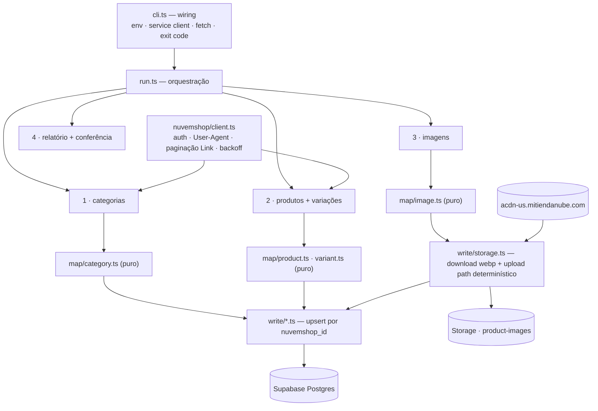

# 21 · Catálogo Nuvemshop — Design

**Spec**: [`spec.md`](./spec.md) · **Contexto compartilhado**: [`20/context.md`](../20-rebrand-uma-estrelinha/context.md)
**Status**: Draft
**Decisões do projeto aplicáveis**: `AD-004` (deps injetadas + teste em vitest), `AD-012` (tipo escrito
à mão não é schema — provar gravando), `AD-014` (conjunto de produtos é categoria), `AD-016` (fatiamento),
`AD-017` (história de migration ainda reescrevível — **não usada aqui**, ver *Tech Decisions*).

---

## O catálogo real, medido

Tudo abaixo foi **medido contra a API em 2026-08-09**, não estimado. É o que o design precisa
responder, e é a régua contra a qual o relatório do import será conferido.

| | valor medido |
| --- | ---: |
| Produtos | **690** |
| Variações | **3.357** |
| Imagens | **3.660** |
| Categorias | **39** (10 raízes, profundidade máxima **1**) |
| Média de categorias por produto | 4,5 |
| Máximo de variações num produto | **144** |
| Máximo de eixos num produto | 3 (o mesmo teto que a UI já impõe) |
| Imagens por produto | média 5,3 · máximo 28 |

E os casos que o import tem de tratar por nome:

| Achado | Nº | Consequência no desenho |
| --- | ---: | --- |
| Produtos despublicados na origem | 9 | entram `is_active = false`, slug preservado |
| Produtos sem **nenhuma** variação com preço | **1** (`pingente-figa-colecao-fragmentos`) | **pulado e reportado** — `products.base_price` é `NOT NULL` |
| Variações sem preço, em produto que entra | 11 | gravadas com `price = null` **e `is_active = false`** |
| Produtos sem imagem | 1 | entra normalmente |
| Produtos sem categoria | 1 | entra sem vínculo em `product_categories` |
| SKUs vazios ou nulos | 952 | `null` |
| **SKUs duplicados** | **1.466** (654 dentro do mesmo produto, 812 entre produtos) | ver *SKU*, abaixo |
| `compare_at_price` **igual** ao preço | **3.346 de 3.357** | ver *Preço*, abaixo |
| `stock_management = false` (estoque ilimitado) | 3.181 de 3.357 | `stock_policy = 'none'` em **594** produtos |
| Handles duplicados | 0 | — |
| Colisão de slug com o seed atual | 1 (`joias-afetivas`) | resolvida pela limpeza do seed |

**Três achados mudaram o desenho e merecem estar no topo:**

1. **O SKU desta loja não é chave.** `BA-002` aparece **316 vezes, em 68 produtos**. E
   `product_variants.sku` é `UNIQUE` **global** desde a migration inicial
   (`20260414121021:53`). Gravar como vem aborta o insert.
2. **`compare_at_price` não é o "de".** Em 3.346 das 3.357 variações ele é **idêntico** ao preço.
   Copiá-lo para `compare_price` faria a loja riscar um preço igual ao cobrado em praticamente todo
   produto do catálogo — defeito visual em massa, que build, `tsc` e teste de componente não pegam.
   Só **93** variações têm um "de" verdadeiro.
3. **O CDN da Nuvemshop serve WebP na mesma URL.** Trocar a extensão por `.webp` devolve
   `image/webp` com **89% menos bytes** (medido em 12 amostras: 1.375 KB → 118 KB). O catálogo cai de
   **~3,5 GB para ~410 MB** sem biblioteca de transcodificação nenhuma. Funcionou em 11 de 12 — logo o
   fallback para a URL original é obrigatório, não zelo.

---

## Architecture Overview

Um **script Node executado à mão**, no repositório, com service role. Confirma a assumption da spec
("Script Node no repositório, executado à mão" — estava `n — validar na Design`): **validada**. Não
pode ser edge function (credencial secreta + execução de dezenas de minutos + 410 MB de tráfego) nem
código de cliente (`CAT-09`).

A separação interna é a mesma que `AD-004` estabeleceu para as edge functions, pelo mesmo motivo: o
que é **decidível** vira função pura testada em vitest, e o que é **I/O** recebe suas dependências por
parâmetro. Aqui isso vale ainda mais: não existe sandbox para "rodar o import de novo e ver" — cada
tentativa custa 3.660 downloads.



**Ordem das fases não é preferência, é pré-requisito:** categoria pai antes da filha (`CAT-05`,
`parent_id` apontaria para nada), produto antes de variação (FK), variação antes de conferir
`base_price` (trigger), e imagem depois do produto (a URL do Storage só pode ser gravada em
`products.images` quando existe produto).

---

## Code Reuse Analysis

### O que já existe e será aproveitado

| Ativo | Onde | Como entra |
| --- | --- | --- |
| Cliente da Nuvemshop | `../landing-pages/src/lib/nuvemshop.ts` | **Referência, não import** — é `import.meta.env` (Astro) e não roda em Node. Auth, `User-Agent`, backoff e a função `loc()` de idioma são **portados** |
| Credenciais preenchidas | `../landing-pages/.env` | copiadas para o `.env` da **raiz** deste repo (`NUVEMSHOP_*`), com `.env.example` atualizado |
| `ImageSource = 'upload' \| 'mockup' \| 'import'` | `packages/supabase/src/types/index.ts:73` | **o valor `'import'` já existe** — é exatamente o que o importador grava |
| Precedente de SKU duplicado | `supabase/migrations/20260801120100_02-backfill-variants.sql:76-90` | a regra já foi decidida no projeto: *perder o SKU (recuperável na tela) em vez de perder a variação (não recuperável)* |
| Padrão de deps injetadas | `supabase/functions/mercado-pago/handlers.ts` (`AD-004`) | mesma forma: `run(deps)` recebe `{ nuvemshop, supabase, fetch, log, now }` |
| Limpeza explícita por slug | `supabase/seed.sql` seção 0 | o arquivo **já** tem uma seção "limpeza do catálogo demo herdado" com lista explícita de slugs — a remoção do seed de dev estende esse mesmo mecanismo, não inventa outro |
| Bucket `product-images` | `20260415095816` | público, sem `file_size_limit`, sem restrição de MIME — **nenhuma policy nova é necessária** |
| Trigger `sync_product_base_price` | `20260801120400` | deriva `products.base_price` de `min(price)` das variações ativas com preço — o importador **não** calcula `base_price` no update, só semeia no insert |
| `product_categories` (N:N ordenado) | `20260801120300` | vínculo produto↔categoria com `position` |

### O que **não** será reusado, e por quê

- **`uploadProductImage.ts`** (`apps/backoffice/src/features/product-form/lib/`) — comprime via
  `canvas`/`Image`, que são API de navegador, e nomeia com `crypto.randomUUID()`. Nome aleatório
  **destruiria a idempotência**: cada re-execução criaria 3.660 arquivos novos. O importador usa
  caminho determinístico.
- **`packages/*`** como casa do importador — ver *Tech Decisions*.

### Integration Points

| Sistema | Como conecta |
| --- | --- |
| API Nuvemshop | `GET /v1/{store}/categories` e `/products`, header `Authentication: bearer`, `User-Agent` obrigatório, paginação pelo header `link` (`rel="next"`) |
| CDN Nuvemshop | `GET` direto na `images[].src`, com troca de extensão para `.webp` |
| Supabase Postgres | `@supabase/supabase-js` com **service role** (RLS irrelevante), upsert por `nuvemshop_id` |
| Supabase Storage | `storage.from('product-images').upload(path, bytes, { upsert:false })` |

---

## Data Models

### Migration nova — a chave de idempotência (`CAT-01`)

`AD-017` **não** se aplica aqui: reescrever história é permitido para desfazer valor de migration
anterior, não para introduzir coluna nova. Esta é uma migration normal.

```sql
-- supabase/migrations/<ts>_nuvemshop-import-keys.sql
alter table public.categories       add column if not exists nuvemshop_id bigint;
alter table public.products         add column if not exists nuvemshop_id bigint;
alter table public.product_variants add column if not exists nuvemshop_id bigint;

create unique index if not exists categories_nuvemshop_id_key       on public.categories       (nuvemshop_id);
create unique index if not exists products_nuvemshop_id_key         on public.products         (nuvemshop_id);
create unique index if not exists product_variants_nuvemshop_id_key on public.product_variants (nuvemshop_id);
```

`bigint` porque os ids medidos passam de 32 bits (`32376553`, `40271295` — ainda cabem, mas o id de
variação não é garantido). Índice único **simples e não parcial**: em Postgres `NULL` não colide com
`NULL`, então linhas locais (cupom de teste, produto cadastrado à mão) convivem sem predicado extra —
e um índice parcial aqui só adicionaria a armadilha que a `L-018` registra.

**Por que a chave é o id e não o slug** (assumption da spec, agora validada): o slug **muda** na
origem quando a Adri renomeia um produto; o id não. Chavear por slug faria um produto renomeado virar
duplicata, e o slug antigo ficaria órfão na loja.

**Por que também em `product_variants`**: sem ela, a re-execução só poderia casar variação por
`option_values`, que muda quando um eixo é renomeado — e aí a variação vira duplicata, com a original
virando lixo ativo e vendável.

### O mapeamento — campo a campo, medido

**Categoria** (`RawCategory → public.categories`)

| destino | origem | observação |
| --- | --- | --- |
| `nuvemshop_id` | `id` | chave |
| `name` | `name.pt` | `loc()` com fallback para o primeiro idioma presente |
| `slug` | `handle.pt` | **preservado** (`CAT-02`) |
| `description` | `description.pt` | vazio em todas as 39 hoje |
| `parent_id` | `parent` | `0` = raiz ⇒ `null`. **Pais gravadas antes das filhas** (`CAT-05`) |
| `sort_order` | *derivado* | ver abaixo |
| `active` | `visibility === 'visible'` **e** não estar na lista de curadoria | ver abaixo |
| `show_in_menu`, `menu_promo` | — | **nunca escritos**. Curadoria é `/admin/menu` (`AD-014`) |

> **A categoria da Nuvemshop não tem campo de ordenação.** Medido: as 39 respostas trazem
> `id, parent, subcategories, google_shopping_category, created_at, updated_at, visibility,
> visibility_updated_at, name, handle, description, seo_title, seo_description` — e nada de
> `order`/`position`/`sort`. A única ordem que a origem expressa é **a posição dentro do array
> `subcategories[]` do pai**. Logo: `sort_order` = índice em `subcategories[]` para as filhas, e
> índice na resposta de `/categories` para as 10 raízes. Está declarado aqui porque é a diferença
> entre "ordenação preservada" (`CAT-05`) e "ordenação inventada" — e sem este parágrafo o próximo
> leitor assumiria que existe um campo.

> **Curadoria decidida pelo usuário em 2026-08-09**: `black-friday`, `rastreio`, `brinquedos` e
> `profissoes` entram **`active = false`**, com slug preservado. Duas estão vazias; as outras duas a
> loja nova não deve exibir hoje — "Black Friday" numa loja sem Black Friday é exatamente a urgência
> fabricada que o `CLAUDE.md` proíbe. A lista é uma **constante declarada e testada**
> (`CURATED_INACTIVE`), não um `if` escondido no meio do mapeamento, e cada uma delas aparece
> **nominalmente no relatório final**.

**Produto** (`RawProduct → public.products`)

| destino | origem | observação |
| --- | --- | --- |
| `nuvemshop_id` | `id` | chave |
| `name` | `name.pt` | vazio ⇒ **pulado** (`CAT-08`; 0 casos hoje) |
| `slug` | `handle.pt` | **preservado** |
| `description` | `description.pt` | HTML da origem, gravado como vem |
| `is_active` | `published` | 9 produtos entram `false` |
| `seo_title`, `seo_description` | `seo_title.pt`, `seo_description.pt` | |
| `video_url` | `video_url` | |
| `options` | `attributes[]` | `[{ name, values[], position }]` — `values` são os distintos das variações naquele eixo, na ordem de primeira aparição. Medido: `values.length === attributes.length` em **todos** os 690 |
| `stock_policy` | `variants[].stock_management` | todas `false` ⇒ `'none'` (594 produtos) · qualquer `true` ⇒ `'track'` (96) |
| `weight_kg`, `width_cm`, `height_cm`, `length_cm` | da **primeira** variação | a Nuvemshop mede por variação; o produto guarda a da primeira, como referência de frete |
| `base_price` | `min(preço efetivo)` **no insert** | `NOT NULL` sem default. No **update** não é escrito: o trigger é dono |
| `images` | ver *Imagens* | `[{ url, alt, source: 'import' }]` |
| `is_featured`, `is_new`, `is_promo`, `sort_order` | — | **nunca escritos** (vitrine é da loja) |

**Variação** (`RawVariant → public.product_variants`)

| destino | origem | observação |
| --- | --- | --- |
| `nuvemshop_id` | `id` | chave |
| `price` | `promotional_price ?? price` | o **preço efetivamente cobrado**. Medido: `{price:380, promo:299, compare:380}` |
| `compare_price` | `compare_at_price` **só se `> price` efetivo** | senão `null`. **Sem esta guarda, 3.346 variações nasceriam com "de" igual ao "por"** |
| `stock` | `stock ?? 0` | `null` em 3.181 (estoque ilimitado) |
| `sku` | ver *SKU* | |
| `option_values` | `zip(attributes[].pt, values[].pt)` | `{"Tipos de elo":"Folheado a ouro (Prata 925)"}` |
| `name` | `values.join(' · ')` | nullable desde `20260801160000`; vazio ⇒ `null` |
| `weight_kg` | `weight` | |
| `position` | `position` | |
| `is_active` | `visible` **e** ter preço | variação sem preço nunca é vendável |
| `image_url` | `image_id` → URL do Storage | resolvido na fase 3 |

**SKU.** A regra já existe no projeto e é seguida sem alteração: grava o SKU quando ele é **único
globalmente** naquele momento; nos demais casos grava `null` e reporta. O comentário da
`02-backfill-variants` é a justificativa e permanece verdadeiro — *perder o SKU é recuperável na
tela; perder a variação não é*. Com 1.466 duplicatas, é a diferença entre importar e não importar.
Previsão: ~939 SKUs preservados, ~2.418 nulos, todos listados no relatório.

### Imagens (`CAT-03`, `CAT-07`)

**Caminho no Storage — determinístico, e é ele que faz a idempotência:**

```
product-images/nuvemshop/<nuvemshop_product_id>/<image_id>.webp
```

Sem UUID aleatório, sem timestamp. A re-execução calcula o mesmo caminho, o `upload` volta
`Duplicate`, e o importador **conta como "já existente" e segue** — que é literalmente o
`CAT-03` ("não apaga imagem já no Storage; só acrescenta o que falta"), obtido pelo nome do arquivo
em vez de por uma tabela de controle.

**Busca — WebP com fallback, medido:**

1. `GET <src sem extensão>.webp` → se `200` **e** `content-type: image/webp`, usa.
2. Qualquer outra coisa → `GET <src>` original.

Medição: 11 de 12 amostras serviram WebP (redução média **89%**, de 92% no melhor caso a 76% no pior);
1 devolveu `403`. Distribuição do catálogo: 3.377 `png`, 252 `jpg`, 31 `webp`. Projeção: **~3,5 GB →
~410 MB**, sem `sharp` e sem canvas.

**Alt.** Das 3.660 imagens, **20 têm `alt` escrito pela vendedora** e 3.640 estão vazias. A origem
vence: quando há texto, ele é usado como veio — são as palavras de quem conhece a peça. Para as
outras 3.640, `AD-011` (alt-text é template determinístico, não IA): `alt = name` na primeira imagem
e `alt = "<name> — foto N"` nas demais.

> **Correção de rota**: a primeira versão deste design afirmava que as 3.660 estavam vazias "sem
> exceção". Estava errado — a contagem tratava `alt` como array (`.length`), e a forma real é um
> objeto localizado `{ pt: '...' }`. **As duas formas ocorrem no mesmo catálogo**, e é por isso que
> `loc()` aceita array e mapa.

**Cache local de download.** As bytes baixadas são guardadas em `tools/catalog-import/.cache/`
(gitignored), chaveadas pela URL. Não é otimização gratuita: `supabase db reset` recria o banco e
leva junto `storage.objects`, então **toda re-execução depois de um reset precisa subir as 3.660
imagens de novo**. Com cache, a segunda execução não toca o CDN — só o Storage.

---

## Components

### `nuvemshop/client.ts`

- **Propósito**: falar com a API — e só isso.
- **Interfaces**:
  - `createClient(deps: { fetch, env, sleep, log }): NuvemshopClient`
  - `listCategories(): Promise<RawCategory[]>`
  - `listProducts(): Promise<RawProduct[]>` — pagina por `per_page=200` seguindo o header `link` `rel="next"` (medido: 690 produtos em 4 páginas)
- **Rate limit — medido, não suposto**: a resposta traz `x-rate-limit-limit: 40`,
  `x-rate-limit-remaining` e `x-rate-limit-reset: 1000`. O comentário do cliente das landing pages diz
  "500 req/hora"; **os headers reais dizem outra coisa**, então o cliente **lê o header** e pausa
  `reset` ms quando `remaining <= 2`, em vez de embutir qualquer número.
- **Backoff (`CAT-06`)**: `429` e `5xx` ⇒ espera `Retry-After` (ou `2^n` s), até 4 tentativas;
  esgotadas, **lança** — e `run.ts` para com relatório, sem produto meio-gravado.
- **Guarda de `User-Agent`**: valida que é string não-vazia **antes da primeira request** e falha com
  mensagem própria. Motivo medido: `NUVEMSHOP_USER_AGENT` no `.env` tem parênteses sem aspas, não
  sobrevive ao carregamento, e a API devolve `400 "Required user-agent is missing"` — erro que não
  parece de credencial e custa tempo para diagnosticar.

### `map/*.ts` — puro, sem I/O

Um módulo por entidade (`category`, `product`, `variant`, `image`, `loc`). Nenhum importa `supabase`
nem `fetch`. É onde moram todas as regras da tabela de mapeamento acima, e é o que os testes de
unidade exercitam com fixtures **extraídas da resposta real** (recortes do catálogo medido, não JSON
inventado — a `L-013` do playbook existe porque fixture com os dois campos candidatos valendo o mesmo
número não detecta leitura do campo errado; aqui `price`, `promotional_price` e `compare_at_price`
divergem de propósito nas fixtures).

### `write/categories.ts` · `write/products.ts`

- **Propósito**: upsert por `nuvemshop_id`, na ordem certa.
- **Regra de re-execução — a que decide o que a origem manda e o que a loja manda:**

  | campo | no insert | no update |
  | --- | --- | --- |
  | catálogo (`name`, `description`, `price`, `stock`, `options`, `images`, `seo_*`, vínculos) | da origem | **da origem** |
  | vitrine (`active`/`is_active`, `sort_order`, `show_in_menu`, `menu_promo`, `is_featured`, `is_new`, `is_promo`) | da origem / curadoria | **preservado — nunca sobrescrito**, e divergência vai ao relatório |

  Sem essa separação, a re-execução desfaria em silêncio toda curadoria feita no admin — inclusive as
  quatro categorias que o usuário acabou de decidir desativar.
- **Vínculo N:N**: `product_categories` reescrito por produto (`delete` + `insert` na mesma
  transação lógica), `position` = índice na lista da origem.

### `write/storage.ts`

- `ensureImage(raw): Promise<{ url, reused: boolean } | { failed: reason }>` — baixa (cache → WebP →
  original), sobe no caminho determinístico, devolve a URL pública.
- **Falha de imagem nunca descarta o produto** (`CAT-07`): devolve `failed`, o produto entra com as
  imagens que deram certo, e a falha é nominal no relatório.
- **Storage indisponível** (erro que não é "duplicate"/404 da própria imagem) ⇒ **para o import**
  (`CAT-06`), para nunca existir produto apontando para URL que não responde.
- Pool de concorrência pequeno (6) — o CDN não está sob o bucket de rate limit da API, mas 3.660
  downloads simultâneos derrubam qualquer coisa.

### `report.ts`

- Acumula `criados / atualizados / pulados / imagens novas / imagens reusadas / imagens falhadas /
  SKUs descartados / categorias forçadas inativas`.
- **Conferência (`CAT-08`)**: `lidos == criados + atualizados + pulados`, por entidade. Divergência é
  **exit code diferente de zero**, não uma linha de aviso — um relatório que não fecha é um import que
  não pode ser declarado bom.
- Saída: tabela no stdout **e** JSON em `--report <path>` para diff entre execuções.

### `cli.ts`

Só wiring, no molde de `index.ts` das edge functions (`AD-004`): lê env, monta client de service role,
monta o client da Nuvemshop, chama `run()`, imprime, define exit code. **Sem lógica e sem teste**, de
propósito — tudo o que decide algo está em `run.ts`/`map/`.

Flags: `--dry-run` (lê tudo, mapeia tudo, grava nada, imprime o relatório previsto),
`--only=categories|products|images`, `--limit=<n>` (para ensaio), `--report=<path>`.

---

## Limpeza do seed de desenvolvimento

Decisão do usuário em 2026-08-09: **limpar**. São 16 produtos, 7 categorias e 24 variações
inventadas, e a categoria `joias-afetivas` colide com a real.

1. **`supabase/seed.sql`**: as seções **1 (categorias), 2 (produtos) e 3 (variações)** saem. Seções
   0 (limpeza), 4 (cupons) e 5 (usuário admin) **ficam** — cupom e admin não têm nada com catálogo, e
   sem eles o dev perde o acesso ao backoffice e o teste de desconto.
2. **Seção 0** ganha os 16 + 7 slugs do catálogo de dev, seguindo o mecanismo que a própria seção já
   usa (lista explícita, nunca "apaga o que não está no seed").
3. **A cláusula que impede o acidente**: cada `DELETE` da seção 0 leva `AND nuvemshop_id IS NULL`. O
   cabeçalho do `seed.sql` documenta a execução avulsa (`docker exec … < supabase/seed.sql`) — sem
   esse predicado, rodá-lo **depois** do import apagaria a categoria `joias-afetivas` **real** e, por
   `on delete cascade`, os 508 vínculos de produto dela.

**Consequência aceita e declarada**: depois disto, `supabase db reset` deixa a loja **sem catálogo**
até o import rodar. É o preço de ter uma fonte só. O cache local de imagens é o que torna essa
re-execução barata.

---

## Error Handling Strategy

| Cenário | Tratamento | Efeito |
| --- | --- | --- |
| `429` / `5xx` da API | backoff (`Retry-After` ou `2^n`), 4 tentativas | esgotadas ⇒ **para com relatório**, nada meio-gravado (`CAT-06`) |
| `User-Agent` ausente/vazio | falha **antes** da primeira request, mensagem própria | evita diagnosticar um `400` genérico |
| Credencial ausente | falha na partida, nomeando a variável | `CAT-09` |
| Produto sem nome ou sem nenhum preço | **pulado**, contado, nomeado no relatório | 1 caso previsto |
| Variação sem preço | gravada `price = null`, `is_active = false` | 11 casos; preserva o `nuvemshop_id` sem tornar vendável |
| SKU duplicado | grava `null`, reporta | precedente da `02-backfill-variants` |
| Slug de produto colidindo com outro `nuvemshop_id` | **pulado e reportado** | 0 casos previstos após a limpeza do seed |
| Imagem individual falha (rede, 403, 404) | produto entra **sem ela** | `CAT-07` |
| Imagem já existe no caminho determinístico | conta como reusada | `CAT-03` |
| Storage indisponível (falha que não é da imagem) | **para com relatório** | nunca produto apontando para URL inexistente |
| Relatório não fecha (`lidos ≠ criados+atualizados+pulados`) | **exit ≠ 0** | `CAT-08` |

---

## Risks & Concerns

| Concern | Onde | Impacto | Mitigação |
| --- | --- | --- | --- |
| `sku` é `UNIQUE` global e a origem tem 1.466 duplicatas | `supabase/migrations/20260414121021_*.sql:53` | insert abortaria; sem tratamento, o import não roda | regra do precedente `20260801120100_02-backfill-variants.sql:76-90` — `null` + relatório. **Teste com fixture de SKU repetido entre produtos diferentes**, que é o caso que só a varredura global pega |
| `compare_at_price` espelha o preço em 99,7% | dado da origem | "de" riscado igual ao "por" em quase todo o catálogo; nenhum gate atual detecta | guarda `compare_at_price > price efetivo`, com teste que **falha se a guarda for removida** |
| **A URL indexada não passa a resolver só com o slug** | `spec.md` AC 2 | a Nuvemshop publica `/produtos/<handle>/` e a loja serve `/produto/:slug` — prefixo diferente. Preservar o slug é **necessário e insuficiente** | **Lacuna de precisão da spec, declarada, não silenciada.** O redirect é `22` (`SEO-01..03`), como a própria tabela *Out of Scope* já diz. O que a `21` entrega é o slug preservado — sem ele, o redirect da `22` não teria para onde apontar |
| `supabase db reset` leva `storage.objects` junto | operação | as 3.660 imagens precisam subir de novo, e as antigas ficam órfãs no volume | caminho determinístico (re-subida cai no mesmo lugar) + cache local de download |
| `seed.sql` avulso depois do import | `supabase/seed.sql` seção 0 | apagaria a `joias-afetivas` real e 508 vínculos por cascade | `AND nuvemshop_id IS NULL` em todo `DELETE` da seção 0 |
| `.env` com parênteses não sobrevive ao carregamento | `../landing-pages/.env` | `400 Required user-agent is missing` — medido nesta sessão | valor entre aspas no `.env.example` + guarda explícita no client |
| Rate limit documentado ≠ medido | `../landing-pages/src/lib/nuvemshop.ts:10` diz 500/h; headers dizem `limit: 40`, `reset: 1000` | número embutido fica errado em qualquer direção | ler `x-rate-limit-remaining`/`reset` do header |
| Workspace novo pode nascer fora do lint | `BL-002` já registra `packages/` fora do `pnpm lint` | o importador é código que grava no banco e não passaria por ESLint | o workspace declara `lint` **e** `test` no `package.json`, então entra nos dois `turbo run` desde o primeiro commit |
| `products.base_price` é `NOT NULL` e o trigger só age via variação | `20260801120400` | insert de produto antes da variação falharia | semear `base_price` com o mínimo calculado no insert; no update, deixar o trigger mandar |
| Um produto tem **144** variações | dado da origem | a grade do admin e o `VariantPicker` da loja nunca foram exercitados nessa ordem de grandeza | fora do escopo da `21` (o import grava o que existe), mas **registrar no `BACKLOG.md`** para a UI ser medida com catálogo real |
| ~3.100 linhas em `product_categories` e 4,5 categorias por produto | dado da origem | consultas de vitrine passam a ler volume real pela primeira vez | índice `product_categories_category_idx` já existe; medir tempo da `CategoryPage` no fecho |

---

## Tech Decisions

| Decisão | Escolha | Racional |
| --- | --- | --- |
| Onde o importador vive | **`tools/catalog-import/`**, workspace `@estrelinha/catalog-import` (`tools/*` novo no `pnpm-workspace.yaml`) | Não é `packages/*`: aquilo é biblioteca **consumida pelos apps**, com alias no Vite e no tsconfig — pôr um CLI lá o faria parecer importável. Não é `supabase/`: aquele workspace existe para testar handler de edge function, e o `node_modules` dele é deliberadamente posicionado para o bind mount do edge runtime. `tools/` diz o que é: ferramenta de build/operação |
| Runner de TypeScript | **`tsx`**, devDependency do workspace | Node 24 stripa tipos nativamente, mas o comportamento varia por versão de Node e o importador precisa rodar igual na máquina de quem for operá-lo. Uma devDependency isolada num workspace de ferramenta é mais barata que um modo experimental |
| Chave de idempotência | `nuvemshop_id` em `categories`, `products` **e** `product_variants` | slug muda na origem; id não. A terceira tabela não é zelo: sem ela, renomear um eixo transforma variação em duplicata vendável |
| Formato das imagens | **WebP do próprio CDN**, com fallback para o original | 89% menos bytes, medido; zero dependência nova. O original permanece na Nuvemshop enquanto a conta existir, e a Adri tem as fotos-fonte |
| Curadoria na re-execução | Import **nunca** sobrescreve flag de vitrine em update; divergência vira linha de relatório | a alternativa desfaz em silêncio o trabalho feito no admin. E "reportar em vez de decidir" é o mesmo princípio de `menuEntries` não truncar em `MENU_SLOT_LIMIT` |
| Categorias inativas por curadoria | constante `CURATED_INACTIVE` (4 handles), testada e nomeada no relatório | `if` no meio do mapeamento é decisão de produto escondida em código |
| `AD-017` (reescrever migration) | **não usado** | a permissão é para desfazer valor de migration anterior. Coluna nova é migration nova, e usar a permissão fora do caso dela é como ela vira dano silencioso |

> **Nada aqui vira `AD-018`.** As escolhas são locais da feature: nenhuma cria convenção que features
> futuras precisem seguir. A regra "origem manda no catálogo, loja manda na vitrine" é candidata a
> decisão de projeto **se e quando** houver uma segunda fonte externa — hoje seria generalizar a
> partir de um caso.

---

## Resultado esperado (é isto que o relatório tem de dizer)

Previsão calculada sobre o catálogo medido. Divergência entre isto e o relatório real é **defeito a
investigar**, não ruído.

| | esperado |
| --- | ---: |
| Categorias criadas | **39** (4 delas `active = false` por curadoria) |
| Produtos criados | **689** |
| Produtos pulados | **1** — `pingente-figa-colecao-fragmentos`, sem preço em nenhuma variação |
| Variações criadas | **3.357** (11 inativas por falta de preço) |
| Variações com `compare_price` | **93** — nunca 3.346 |
| Produtos `stock_policy = 'none'` | **594** · `'track'` **96** |
| Imagens no Storage | **3.660** |
| Bytes no Storage | **~410 MB** (contra ~3,5 GB sem WebP) |
| Segunda execução | **0 criados · 689 atualizados · 0 duplicatas · 3.660 imagens reusadas** |

---

## Success Criteria (da spec, com a prova de cada um)

- [ ] Catálogo real no banco com imagens servidas pelo Storage — **prova**: abrir `/` e uma página de
      produto e conferir que a URL da foto é `…/storage/v1/object/public/product-images/nuvemshop/…`.
- [ ] Duas execuções ⇒ mesmo estado — **prova**: rodar duas vezes e comparar `count(*)` das três
      tabelas antes e depois, mais o relatório com `criados = 0`.
- [ ] Totais do relatório conferem — **prova**: exit code 0, que já embute a conferência.
- [ ] URL de produto indexada resolve — **prova parcial nesta feature**: o slug no banco é idêntico
      ao `handle` da origem nos 689. O redirect de `/produtos/*` é da `22`, e isso está declarado em
      *Risks & Concerns* em vez de dado como cumprido.
- [ ] **`AD-012`** — a tela grava de verdade: probe HTTP contra o banco local depois do import,
      conferindo colunas novas e vínculo N:N. Tipo declarado não conta como prova.
