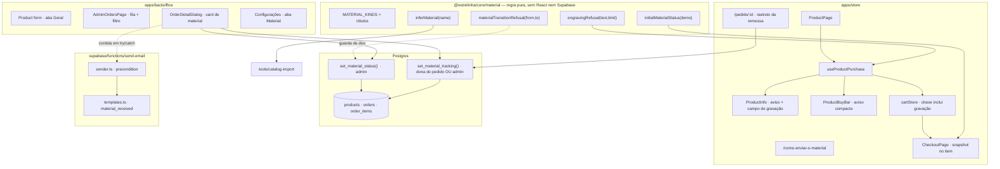

# 22 · Material Afetivo — Design

**Spec**: [`spec.md`](./spec.md)
**Status**: Approved
**Data**: 2026-08-09

> Escrito depois de ler o **banco vivo**, não os tipos: `information_schema` de `orders`,
> `order_items` e `products`, as policies de RLS das duas primeiras, e os eixos reais das 3.356
> variações importadas. É a regra do `AD-012` — tipo escrito à mão é afirmação, não verificação.

---

## Decisões que este design toma antes de qualquer código

Três coisas não estavam decididas na spec e mudam materialmente o que se constrói. Ficam aqui, com
o porquê, em vez de aparecerem como surpresa no meio da implementação.

### D1 · O catálogo real precisa de uma semente, senão a feature nasce inerte

A spec diz que **o produto** determina o material, "no cadastro". Mas o cadastro tem **689
produtos**, e nenhum deles carrega a informação hoje. Sem semente, a fila `aguardando_material`
fica vazia para sempre até a Adri editar centenas de produtos à mão — e a feature inteira vira
código que nunca roda. Esse desfecho já aconteceu duas vezes neste repositório e está registrado:
`PRM-12` "nasceu inerte" (feature 17) e `collections`, que mostrou grade vazia em todos os
ambientes por meses.

A própria spec traz a medição que resolve isso: o material está **no nome do produto**, em massa —
169 dizem "leite", 127 "cinzas", 85 "cabelo", 51 "coto", 50 "pet", 25 "dente", 25 "flores", 2
"penas".

**Decisão**: a inferência por nome é uma **função pura** em `@estrelinha/core/material`
(`inferMaterial`), aplicada pelo **importador** — nunca por SQL. Um `update` com `ilike` na
migration seria a mesma regra escrita duas vezes, em duas linguagens, e a segunda divergiria da
primeira em silêncio.

E a semente **nunca sobrescreve decisão da dona**, o que exige um marcador de "ninguém decidiu
ainda":

| `products.requires_material` | significado | quem escreve |
| --- | --- | --- |
| `null` | **nunca decidido** | é o default da coluna |
| `true` / `false` | decidido | o admin (sempre) ou o importador (**só quando estava `null`**) |

A loja lê `null` como "não exige" — o comportamento de hoje, que é o seguro. Um booleano de três
estados é um cheiro, e é aceito aqui por um motivo específico: sem o terceiro estado não existe
resposta para "esta linha já foi curada?", e a alternativa é o importador apagar a curadoria da Adri
a cada execução.

### D2 · O endereço do ateliê é configuração, não literal no código

`MAT-01` pede o endereço de envio na página "Como enviar". `store_settings` já é a tabela de
configuração da loja, com aba própria no `/admin/configuracoes`, leitura pública por RLS e cache em
`@estrelinha/core/hooks/useStoreSettings`. Um endereço literal em `.tsx` transforma uma mudança de
endereço — que é operação — em deploy. Nasce a chave `material`.

E o endereço é **material insubstituível a caminho**: se a página mostrar um endereço vazio porque
a linha ainda não chegou do banco, a cliente posta cinzas para lugar nenhum. Por isso o bloco de
endereço **não renderiza** enquanto não houver logradouro — ele nunca aparece pela metade.

### D3 · A máquina de estado tem UM dono e DUAS pontas, e um guarda entre elas

A regra de transição precisa existir em dois lugares por razões diferentes e legítimas:

- em **TypeScript** (`materialTransitionRefusal`), porque `MAT-08 AC 3` exige **motivo visível** —
  e motivo é texto de interface, que não sai de um `where` de SQL;
- em **SQL** (o `where` da RPC), porque é a única ponta que uma requisição forjada não contorna.

Duas cópias da mesma regra é o "defeito 01" do projeto. A contrapartida obrigatória é um guarda no
molde de `vercelRedirects.test.ts` e `palette.test.ts`: **`materialTransitions.test.ts` lê a
migration do disco** e compara o conjunto de estados de origem aceitos pelo SQL com
`MATERIAL_TRANSITIONS` do core. Divergir derruba a suíte. Sem esse guarda, a decisão D3 seria dívida;
com ele, é defesa em profundidade.

---

## Architecture Overview



---

## Code Reuse Analysis

### O que já existe e é reaproveitado

| Componente | Local | Como é usado |
| --- | --- | --- |
| `claim_order_email` + `finish_order_email` | `20260730120000_order_emails.sql` | Idempotência do `material_received` sai de graça (`AD-006`) — só o `check` de `type` cresce |
| `preconditionFailure` | `supabase/functions/send-email/sender.ts:…` | Ganha um `case`; o contrato dirigido por estado do `AD-007` não muda |
| `sendOrderEmail(id, type)` | `apps/backoffice/src/entities/order/api/sendOrderEmail.ts` | Ganha o tipo novo. **Já** devolve booleano e nunca lança — é o que `MAT-09 AC 7` exige |
| `apply_payment_approval` | `20260718235214_payment_approval_rpc.sql` | **Molde** das duas RPCs novas: `security definer` + `set search_path` + `revoke all` + `grant` mínimo |
| `has_role(uuid, app_role)` | banco | Papel admin dentro das RPCs, o mesmo que as policies usam |
| `reservedSlugRefusal` / `ROUTE_SLUGS` | `@estrelinha/core/routes` | A rota nova entra na lista; o guarda bidirecional passa a proteger `/como-enviar-o-material` |
| `useProductPurchase` | `entities/product/model` | **Já** é o estado único das duas superfícies de compra — a gravação entra nele, não ao lado |
| `useStoreSettings` | `@estrelinha/core/hooks` | Chave `material` no molde de `general`/`shipping` |
| `CAMPOS_DE_VITRINE` | `tools/catalog-import/src/write/products.ts` | Precedente de "campo que a loja manda, a origem não" — a semente é o caso simétrico |
| `TAP_44` / `TAP_ROW` | `shared/lib/touchTarget` | Alvo de toque do botão de ficha e do CTA de rastreio |
| `FormCard` / `AdminTable` | `backoffice/shared/ui` | Card de material no formulário e na listagem |

### Pontos de integração

| Sistema | Como conecta |
| --- | --- |
| `create-payment` (`mercado-pago`) | **Nenhuma mudança.** Ele lê `id, product_id, quantity, unit_price, variant_id, price_source` — as colunas novas de `order_items` não entram no `select`, então o recálculo não as vê. É o que garante `MAT-06` |
| `resolveOrderPricing` | **Intocado.** `packages/core/src/payment/**` fecha esta feature sem uma linha alterada, conferido por `git status` no gate |
| Realtime de `orders` | A publicação já existe: mudar `material_status` já chega ao `useAdminOrders`, sem nada a acrescentar |
| `order_emails` | Só o `check` de `type` muda |

---

## Data Models

### `products` — o material é propriedade do produto

```sql
alter table public.products
  add column if not exists requires_material  boolean,              -- null = nunca decidido (D1)
  add column if not exists material_kinds     text[] not null default '{}',
  add column if not exists engraving_max_chars integer;
```

- `material_kinds` tem `check (material_kinds <@ MATERIAL_KINDS)` — a lista fechada vive **também**
  no banco, porque um valor torto gravado por qualquer caminho vira rótulo em branco na loja.
- `engraving_max_chars` é **nullable** com `check (between 1 and 200)`. `null` cai em
  `DEFAULT_ENGRAVING_MAX_CHARS = 20`. Não é "sem limite": sem teto, um texto colado de mil
  caracteres entra no pedido e a Adri descobre na bancada.
- **`requires_material` e `material_kinds` são dois dados** — a regra que o handoff destacou. Lista
  vazia com `requires_material = true` é a peça de material livre, e a loja diz "combinado pelo
  WhatsApp".

### `orders` — o estado do material, independente do pagamento

```sql
alter table public.orders
  add column if not exists material_status       text not null default 'nao_aplicavel',
  add column if not exists material_tracking_code text,
  add column if not exists material_received_at   timestamptz;
```

> ⚠️ **`material_tracking_code` NÃO é `tracking_code`.** A coluna que já existe é a remessa
> **de saída** (ateliê → cliente), lida pelo e-mail `order_shipped` e pelo Melhor Envio. Esta é a
> remessa **de entrada** (cliente → ateliê). Reusar a coluna faria "seu pedido foi postado" sair com
> o código do envelope que a cliente mandou.

`material_received_at` existe pelo mesmo motivo de `paid_at`: a fila precisa dizer **há quanto
tempo**, e um estado sem carimbo não responde isso.

### `order_items` — snapshot, e por isso redundante de propósito

```sql
alter table public.order_items
  add column if not exists requires_material boolean not null default false,
  add column if not exists material_kinds    text[] not null default '{}',
  add column if not exists engraving_text    text;
```

Repetir o que `products` já diz é a decisão, não um descuido: `MAT-05` e dois edge cases exigem que
mudar o cadastro **não** altere pedido já criado. Ler do produto no momento da consulta faria o
pedido de ontem mudar de conteúdo hoje.

### Estados e transições

```
nao_aplicavel ──✗ (terminal: não há material neste pedido)

aguardando_material ──▶ material_enviado ──▶ material_recebido ──▶ em_producao
        └──────────────────────────────────▶ material_recebido
                    (salto obrigatório: informar rastreio é OPCIONAL)
```

| de \ para | `material_enviado` | `material_recebido` | `em_producao` |
| --- | :---: | :---: | :---: |
| `nao_aplicavel` | ✗ | ✗ | ✗ |
| `aguardando_material` | ✓ | **✓** | ✗ |
| `material_enviado` | — (idempotente) | ✓ | ✗ |
| `material_recebido` | ✗ (nunca volta) | — (idempotente) | ✓ |
| `em_producao` | ✗ | ✗ | — (idempotente) |

**Transição para o próprio estado é sucesso, não recusa** — é o que faz `MAT-08 AC 4` (duas
requisições concorrentes) convergir sem estado intermediário inválido.

---

## Components

### 1 · `@estrelinha/core/material` — a regra, pura

- **Purpose**: tudo o que é decidível sobre material e gravação, sem React, sem Supabase, sem I/O.
- **Location**: `packages/core/src/material/{material.ts,index.ts}`
- **Interfaces**:
  - `MATERIAL_KINDS: readonly MaterialKind[]` — os 10 do enum da spec
  - `MATERIAL_KIND_LABELS: Record<MaterialKind, string>` · `materialKindLabel(k): string`
  - `MATERIAL_STATUSES` · `MATERIAL_STATUS_LABELS` · `MaterialStatus`
  - `MATERIAL_TRANSITIONS: Record<MaterialStatus, readonly MaterialStatus[]>`
  - `materialTransitionRefusal(from, to): string | null` — **`string | null`, nunca união
    discriminada por literal booleano**: `strictNullChecks` está `false` e ela não estreita (TS2339).
    Mesmo formato de `reservedSlugRefusal` e `menuSlotRefusal`
  - `initialMaterialStatus(items): MaterialStatus` — `MAT-07`
  - `materialSummary(requires, kinds): string` — `''` · lista legível · **`'a combinar'`**
  - `ENGRAVING_AXIS = 'Com gravação'` · `hasEngraving(optionValues): boolean` — casa por nome
    **normalizado** (minúsculo, sem acento), porque o catálogo real tem `Tipo de elo`,
    `Tipos de elo` e `Tipos de Elo` como três grafias do mesmo eixo
  - `DEFAULT_ENGRAVING_MAX_CHARS = 20` · `engravingLimit(max): number`
  - `normalizeEngraving(text): string | null` — **texto só de espaços é vazio** (`MAT-03`)
  - `engravingRefusal(text, limit): string | null`
  - `inferMaterial(name): { requires: boolean; kinds: MaterialKind[] }` — D1
- **Dependencies**: nenhuma.
- **Reuses**: o formato `refusal → string | null` já estabelecido no projeto.

### 2 · Migration `20260811120000_22-material-afetivo.sql`

- **Purpose**: colunas, constraints, índice da fila e as duas RPCs.
- **Interfaces**:
  - `set_material_status(p_order_id uuid, p_status text) returns jsonb`
    → `{ ok, status, reason }`. **Admin apenas** (`has_role`). `grant execute` só a `authenticated`
    (o guarda de papel é interno; `anon` não alcança).
  - `set_material_tracking(p_order_id uuid, p_code text) returns jsonb`
    → `{ ok, status, reason }`. **Dona do pedido ou admin.** Escreve `material_tracking_code` e,
    **somente** a partir de `aguardando_material`, avança para `material_enviado`. De
    `material_recebido` em diante grava o código e **não move o estado para trás** (`MAT-11 AC 12`).
    De `nao_aplicavel`, recusa.
- **Por que RPC e não `PATCH`**: `orders` **não tem policy de `UPDATE` para cliente**, de propósito
  (PAY-10) — abrir uma exporia `payment_status` e os valores. A RPC `security definer` escreve
  **um** campo e devolve o estado; é a mesma medicina de `apply_payment_approval`.
- **Idempotência**: as duas usam `where` sobre os estados de origem permitidos, não leitura antes de
  escrita. Duas admins na mesma transição produzem o resultado de uma só.

### 3 · Página "Como enviar o material"

- **Purpose**: `MAT-01`. Passos, **fichas por material**, preparo, postagem, endereço e checklist.
- **Location**: `apps/store/src/pages/HowToSendMaterialPage.tsx` + `widgets/material-guide/`
- **Interfaces**: âncora por material (`#leite-materno`, `#cinzas`, …) — é o destino do link da
  página do produto, e é o que faz `MAT-02` levar à ficha **correspondente**, não ao topo.
- **Dependencies**: `useMaterialSettings()` (chave `material` de `store_settings`).
- **Endereçamento**: `'como-enviar-o-material'` entra em `ROUTE_SLUGS`. Sem isso
  `reservedSlugs.test.ts` derruba a suíte — e é ele que impede a rota de encobrir uma categoria
  homônima (`AD-018`).

### 4 · `useProductPurchase` — a gravação entra no estado que já é único

- **Purpose**: `MAT-03`, `MAT-04`. Um estado de compra, duas superfícies.
- **Location**: `apps/store/src/entities/product/model/useProductPurchase.tsx`
- **Acrescenta**: `engraving`, `setEngraving`, `engravingEnabled` (derivado da **variação
  escolhida**, não do produto), `engravingLimit`, `engravingRefusal`, e `canAdd` passa a exigir a
  gravação válida.
- **Regra dura**: trocar de `Com gravação: Sim` para `Não` **limpa** o texto. Um texto pendurado
  numa variação que não grava iria para o pedido e a Adri gravaria o que a cliente desistiu de pedir.
- **Reuses**: `findVariant`, `canAddSelection` — nada disso muda.

### 5 · `cartStore` — a chave da linha distingue a gravação

- **Purpose**: `MAT-04`.
- **Mudança**: `itemKey` passa a incluir o texto normalizado:
  `v:<variantId>|e:<texto>` e `p:<id>-<size>-<finish>|e:<texto>`.
- **Persistência**: `version` 2 → **3**, com `migrate` que **preserva** os itens acrescentando
  `engravingText: null`. Diferente do salto 1 → 2, que descartava: ali faltava a variação e o pedido
  nascia impagável; aqui falta um campo opcional cujo default correto é conhecido.
- **Armadilha registrada**: é a mesma que o `variantId` já custou à loja anterior em duas telas —
  duas unidades com gravações diferentes colapsando em quantidade 2.

### 6 · `/pedido/:id` — a cliente diz que postou

- **Purpose**: `MAT-11`.
- **Location**: `apps/store/src/widgets/order-material/` + `entities/order/api/useSetMaterialTracking.ts`
- **Comportamento**: bloco só aparece quando `material_status !== 'nao_aplicavel'`. Campo de código
  quando o estado aceita; **motivo visível** quando não (`MAT-11` edge case da sessão ausente — a
  RPC exige identidade, e o caminho alternativo, avisar a Adri, continua valendo e é dito na tela).
- **Sem sessão**: a policy de `SELECT` de `orders` já exige `customer_id → customers.user_id =
  auth.uid()`, então a página inteira cai em "Pedido não encontrado" — o bloco não chega a montar.
  Isso é comportamento **existente**, e o texto de indisponibilidade cobre o caso da sessão que
  expira com a página aberta.

### 7 · Backoffice — a fila

- **`useAdminOrders`**: `materialFilter`, `materialCounts`, `setMaterialStatus`,
  `setMaterialTracking`. As contagens saem do mesmo `select` de `fetchStatusCounts`, que já lê a
  tabela inteira.
- **`AdminOrdersPage`**: faixa de filtro por estado de material, com `aguardando_material`
  **alcançável em um clique** (`MAT-10`). Não mexe na sidebar — `navItems.test.ts` lê o `App.tsx` do
  disco e compara ordem de rota com `navGroups`; um item novo ali exigiria reordenar rotas sem
  necessidade.
- **`OrderDetailDialog`**: card de material — o que cada item exige (`materialSummary`), o texto de
  gravação, o estado atual, o código de rastreio (editável) e o botão de transição. Recusa mostra
  **o motivo** de `materialTransitionRefusal`, nunca falha calada.
- **Produto (aba Geral)**: `MaterialCard` — switch "exige material", multi-seleção dos tipos
  (desabilitada quando não exige), campo de limite de gravação **visível só quando o produto tem o
  eixo `Com gravação`**.
- **Configurações**: aba `Material` — endereço do ateliê e observação de postagem.

### 8 · E-mail `material_received`

- **`templates.ts`**: `EmailType` e `EMAIL_TYPES` crescem; `renderMaterialReceived` reusa
  `emailShell`, `itemsTable`, `ctaButton`. Georgia no display, Helvetica/Arial no corpo, inline, em
  `<table>`, sem webfont — a pilha de fallback **é** a decisão de design.
- **`sender.ts`**: `ORDER_COLUMNS` ganha `material_status`; `preconditionFailure` ganha
  `case 'material_received': if (order.material_status !== 'material_recebido') return
  'material_not_received'`.
- **Disparo**: `OrderDetailDialog`, depois da transição bem-sucedida, por `sendOrderEmail`, que
  **já** devolve booleano e nunca lança. Falha de e-mail **não** reverte estado (`AD-008`,
  `MAT-09 AC 7`).

### 9 · Importador — a semente

- **Location**: `tools/catalog-import/src/write/products.ts` + `map/product.ts`
- **Insert**: `...inferMaterial(row.name)` entra no payload de criação.
- **Update**: **não** entra em `catalogoDoProduto`. Um passo separado escreve **apenas nas linhas
  com `requires_material is null`** — é o que semeia os 689 já importados sem apagar curadoria.
- **Relatório**: seção própria (`material semeado: N`), no molde de `CURATED_INACTIVE` /
  `CURATED_EXCLUDED` — números que ninguém vê são números que ninguém confere.

---

## Error Handling Strategy

| Cenário | Tratamento | O que a pessoa vê |
| --- | --- | --- |
| Transição a partir de estado inválido | RPC devolve `{ ok:false, reason }`; UI usa `materialTransitionRefusal` | Motivo explícito no dialog ("Este pedido não exige material") |
| Duas admins na mesma transição | `where` sobre estados de origem; mesmo estado ⇒ `ok:true` | Ambas veem sucesso, uma escrita só |
| Cliente informa rastreio sem ser dona | RPC recusa por `has_role`/ownership | "Não foi possível registrar. Fale com a Adri pelo WhatsApp." |
| Cliente informa rastreio em `material_recebido` | Grava o código, **não** move o estado | "Código registrado." — a linha do tempo não anda para trás |
| E-mail `material_received` falha | `sendOrderEmail` devolve `false`; estado permanece | Toast "Material marcado como recebido" (sem alegar e-mail enviado) |
| E-mail disparado duas vezes | `claim_order_email` (`AD-006`) | Um e-mail só |
| Gravação acima do limite | `engravingRefusal`, `canAdd = false` nas duas superfícies | Contador em vermelho + toast ao tentar adicionar |
| Gravação só de espaços | `normalizeEngraving` → `null` | Tratado como vazio; não cria linha separada no carrinho |
| Endereço do ateliê não configurado | Bloco não renderiza | Nenhum endereço pela metade — material insubstituível não se posta para endereço incompleto |
| `material_kinds` com valor fora da lista | `check` no banco recusa a escrita | Erro de save no admin, não rótulo em branco na loja |

---

## Risks & Concerns

| Concern | Local | Impacto | Mitigação |
| --- | --- | --- | --- |
| **Regra de transição em dois idiomas** (TS + SQL) | `core/material` + migration | As duas divergem em silêncio; a UI promete o que o banco recusa | `materialTransitions.test.ts` lê a **migration do disco** e compara com `MATERIAL_TRANSITIONS`, com âncora de contagem — molde de `vercelRedirects.test.ts` |
| **`tracking_code` × `material_tracking_code`** | `orders` | Reuso da coluna faria o e-mail de "postamos sua joia" sair com o código do envelope da cliente | Coluna separada + o `select` de `sender.ts` continua lendo só `tracking_code` para `order_shipped`; teste cobre os dois |
| **`persistProductRelations` não é transacional** | `backoffice/features/product-form/model/persistProduct.ts:1` | Falha no meio deixa produto salvo e relações não | Pré-existente e **declarado** no topo do arquivo. Os campos de material vão no `payload` de `products`, ou seja na **primeira** escrita — não aumentam a janela |
| **`useAdminOrders` lê `orders` inteira para contar** | `entities/order/api/useAdminOrders.ts:33` | `select('status')` sem paginação; **o PostgREST trunca em 1.000 linhas** — mesmo defeito que quebrou o importador na feature 21 | Não introduzido aqui, e **não corrigido aqui** para não misturar escopo. Registrado no `BACKLOG.md`: as contagens de material herdam o mesmo teto e ficam certas até 1.000 pedidos |
| **Booleano de três estados** (`requires_material` nullable) | `products` | Quem ler `= false` perde as linhas `null` | A loja e o admin passam **sempre** por `requiresMaterial(row)`, que trata `null` como `false`; nunca comparação crua |
| **Carrinho persistido de v2** | `cartStore` | Item sem `engravingText` | `migrate` v3 preenche `null`, **preservando** a sacola |
| **Fronteira FSD** | `entities/product/ProductInfo` | Já importa de `features/share-product` (violação conhecida, `warn`) | Não agravada: o aviso de material é `entities/product`, e o link é `<Link>` do router |
| **O estado inicial vem do cliente** | `useCreateOrder` | Uma requisição forjada podia nascer em `material_recebido` e pular a fila | Aceito e declarado. É o mesmo canal por onde `subtotal` já vem — e o servidor recalcula **dinheiro**, que é o que importa (`MAT-08 AC 5`: nenhuma decisão de dinheiro depende do material). Pular a fila não desbloqueia envio: quem posta é a Adri, olhando o envelope. **Avançar** o estado depois da criação só acontece por RPC guardada |
| **`engraving_max_chars` sem valor** | `products` | Texto sem teto entra no pedido | `null` cai em `DEFAULT_ENGRAVING_MAX_CHARS = 20`, nunca em "sem limite" |

---

## Tech Decisions

| Decisão | Escolha | Racional |
| --- | --- | --- |
| Escrita do cliente em `orders` | **RPC `security definer`** | `orders` não tem policy de `UPDATE` para cliente, de propósito (PAY-10). RPC escreve um campo só |
| Retorno das RPCs | **`jsonb` `{ ok, status, reason }`** | `MAT-08 AC 3` exige motivo visível; `boolean` (molde de `apply_payment_approval`) não carrega motivo |
| Uma RPC de rastreio para os dois lados | **Sim** | Cliente e admin fazem a mesma coisa. Duas RPCs seriam duas máquinas de estado |
| Material no pedido | **Snapshot em `order_items`** | `MAT-05` + dois edge cases: mudar cadastro não altera pedido criado |
| `requires_material` nullable | **Sim** (D1) | Sem terceiro estado, o importador apaga curadoria a cada execução |
| Inferência por nome | **TS puro no importador**, nunca SQL | Regra em duas linguagens diverge calada |
| Endereço do ateliê | **`store_settings.material`** (D2) | Mudança de endereço é operação, não deploy |
| Fila no admin | **Filtro na `/admin/pedidos`**, sem item de sidebar | `navItems.test.ts` prende rotas a `navGroups`; um item novo pediria reordenar rotas sem ganho |
| Gravação | **Deriva da variação**, zero coluna de liga/desliga | O eixo `Com gravação` já existe em 35 produtos e **precifica** (33 cobram a mais) |
| Preço | **Nada muda** em `packages/core/src/payment/**` | `MAT-06`: material não altera preço; gravação altera pelo caminho que já existe (`product_variants`) |

> **Nenhuma decisão deste design supera uma `AD-NNN` ativa, e nenhuma pede `AD-019`.** Todas
> conformam: `AD-006` (idempotência por RPC), `AD-007` (contrato dirigido por estado), `AD-008`
> (falha externa contida), `AD-012` (schema lido do banco), `AD-015` (dinheiro intocado), `AD-018`
> (rota nova em `ROUTE_SLUGS`).

---

## Matriz de cobertura de testes

Cada requisito tem um teste que assere o **desfecho da spec**, não o formato da implementação.

| Req | Prova | Onde |
| --- | --- | --- |
| MAT-01 | rota resolve; fichas com âncora por material; endereço só com dado; **slug em `ROUTE_SLUGS`** | `HowToSendMaterialPage.test.tsx` · `reservedSlugs.test.ts` (existente) |
| MAT-02 | três situações distintas (não exige · exige com lista · exige "a combinar"); aviso nas **duas** superfícies; compra sem passo extra | `materialSummary.test.ts` · `ProductInfo.test.tsx` · `ProductBuyBar.test.tsx` |
| MAT-03 | campo só com `Com gravação: Sim`; limite do cadastro; espaços = vazio; acima do limite bloqueia | `material.test.ts` · `useProductPurchase.test.tsx` |
| MAT-04 | duas gravações ⇒ **duas linhas**; mesma gravação ⇒ quantidade 2; v2 → v3 preserva | `cartStore.test.ts` |
| MAT-05 | snapshot no item; mudar cadastro não altera pedido; sai no admin e no e-mail | `CheckoutPage.test.tsx` · `templates.test.ts` |
| MAT-06 | `create-payment` **não lê** as colunas novas; total idêntico com e sem material | `handlers.test.ts` (asserção de não-regressão) |
| MAT-07 | um item que exige ⇒ `aguardando_material`; nenhum ⇒ `nao_aplicavel`; "sem dizer qual" **também** entra na fila | `material.test.ts` |
| MAT-08 | tabela de transições inteira; salto direto permitido; idempotência; pagamento intocado; **SQL × TS** | `material.test.ts` · `materialTransitions.test.ts` |
| MAT-09 | precondition 422 fora do estado; falha não reverte; um e-mail só | `sender.test.ts` |
| MAT-10 | filtro por estado; fila em um clique; contagens | `AdminOrdersPage.test.tsx` |
| MAT-11 | avança de `aguardando`; não volta de `recebido`; recusa `nao_aplicavel`; **nenhuma policy de UPDATE aberta** | `useSetMaterialTracking.test.tsx` · probe HTTP contra o banco local |

**Prova de gravação (`AD-012`)**: as colunas novas e as duas RPCs são provadas por **probe HTTP
contra o banco local**, com `Prefer: return=representation` — inspeção de tipo não prova que uma
tela grava, e um probe que só olha o status "provaria" uma coluna inexistente.
