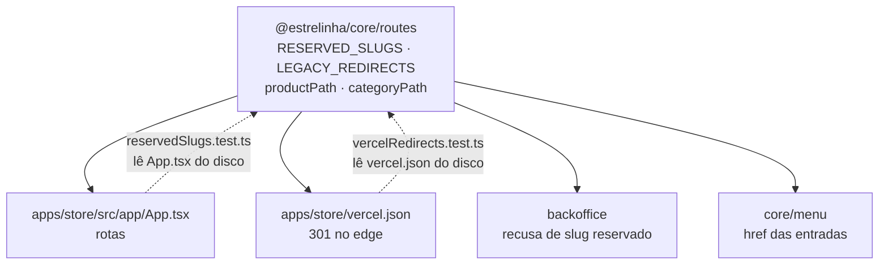
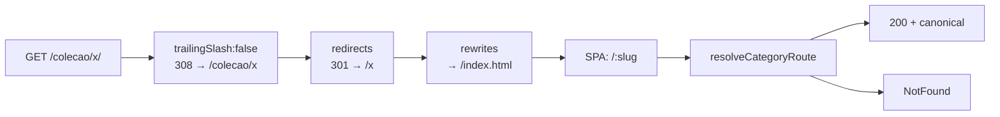

# 23 · URLs e SEO — Design

**Spec**: [`spec.md`](./spec.md)
**Status**: Draft
**Decisões de projeto que restringem este design**: `AD-018` (formato das URLs), `AD-014` (coleção é
categoria), `AD-012` (tipo escrito à mão não é schema), `AD-017` (migration ainda reescrevível — **não
usada aqui**: `category_redirects` nasce em migration nova).

---

## Architecture Overview

O endereçamento passa a ter **uma única fonte de verdade**, `@estrelinha/core/routes`, e **três
consumidores que não podem divergir dela**: o roteador da loja, o `vercel.json` e o cadastro de
categoria do backoffice. Cada um dos três ganha um guarda que lê o arquivo do outro **do disco** —
o padrão que o projeto já usa em `navItems.test.ts` e `palette.test.ts`.



O caminho de uma requisição, do edge até a tela:



`redirects` roda **antes** de `rewrites` no Vercel (documentado), então o 301 acontece sem a SPA nunca
ser carregada. O `trailingSlash: false` roda antes dos dois.

---

## As três formas de resolver, e por que são três

| Camada | Quem responde | O que resolve | Verificável por |
| --- | --- | --- | --- |
| **Edge** (`vercel.json`) | Vercel, antes do JS | `/produto/:slug` · `/colecao/:slug` · `/categoria/:slug` · barra final | `curl -I` |
| **Router** (`App.tsx`) | React Router, no cliente | qual página monta; espelho das regras do edge em dev/teste | vitest |
| **Dado** (`categories`, `category_redirects`) | consulta no Supabase | categoria existe? qual o pai? slug antigo? | vitest + probe HTTP |

**O espelho no router não é redundância.** Em produção o edge resolve `/produto/x` e a SPA nunca vê a
URL antiga. Mas `pnpm dev` e o vitest não têm edge nenhum — sem o espelho, a rota legada quebraria em
todo ambiente que não é a Vercel, e o defeito só apareceria no dia do cutover. As duas pontas leem a
**mesma** lista `LEGACY_REDIRECTS`, e um teste compara o `vercel.json` do disco com ela.

---

## Code Reuse Analysis

### O que já existe e vai ser aproveitado

| Componente | Local | Como |
| --- | --- | --- |
| `product_redirects` + `useProduct` | `supabase/migrations/20260801120300`, `entities/product/api/useProduct.ts` | **`SEO-01` já está implementado** (PST-07): a tabela existe, `useProduct` resolve slug antigo, `ProductPage` navega. Só muda o caminho gerado (`/produto/` → `/produtos/`). |
| `persistRedirect` | `backoffice/features/product-form/model/persistRedirect.ts` | Molde exato de `persistCategoryRedirect` (`SEO-02`), inclusive a regra "slug ativo vence o redirect" (AC 9). |
| `ancestorsOf` / `descendantIds` / `bySortOrder` | `@estrelinha/core/menu` | A subida da cadeia de pais **já é única no projeto**. `categoryHref` usa `ancestorsOf`; não nasce uma quarta caminhada. |
| `navItems.test.ts` | `backoffice/widgets/admin-layout/model/__tests__` | Padrão do guarda que lê `App.tsx` do disco e compara ordem/conteúdo textual. `reservedSlugs.test.ts` é o mesmo molde. |
| `ProductPage` (guarda `isFetching`) | `pages/ProductPage.tsx:50` | O tratamento certo de "consulta correndo ≠ não encontrado". `CategoryPage` **não tem** e passa a ter. |
| `NotFound` | `pages/NotFound.tsx` | Vira o 404 das duas páginas de catálogo (`URL-04`), em vez de dois blocos avulsos. |
| `categories.slug UNIQUE` | migration `20260414121021:15` | É o que torna a forma de **um segmento** (`/joia-de-leite-materno`) não-ambígua sem consulta extra. |
| `selectAll` | `tools/catalog-import/src/write/db.ts` | A leitura do importador já é paginada (defeito das 1.000 linhas do PostgREST) — a exclusão reusa. |

### Integration Points

| Sistema | Como conecta |
| --- | --- |
| Vercel | `redirects` + `trailingSlash` no `vercel.json` já existente. **Nenhum projeto Vercel da Uma Estrelinha existe hoje** (`C-08`) — o arquivo fica pronto, a virada é operação. |
| Supabase | Uma migration nova (`category_redirects`), com RLS espelhando `product_redirects`: leitura pública, escrita de admin. |
| Importador | `CURATED_EXCLUDED` — decisão do usuário em 2026-08-09. |

---

## Components

### `@estrelinha/core/routes` — a fonte de verdade

- **Purpose**: as regras de endereçamento da loja como dado puro, consumível pelos dois apps e
  comparável contra o `vercel.json`.
- **Location**: `packages/core/src/routes/{routes.ts,index.ts}` · export `./routes` no `package.json`
- **Interfaces**:

```ts
/** Primeiro segmento de toda rota declarada em App.tsx. Bidirecional com o arquivo (URL-06). */
export const ROUTE_SLUGS: readonly string[]      // produtos, produto, colecao, categoria, carrinho,
                                                 // pedido, busca, sobre, politicas, conta,
                                                 // favoritos, entrar, checkout

/** Segmentos que não são rota mas são do host/build. Não aparecem em App.tsx de propósito. */
export const INFRA_SLUGS: readonly string[]      // assets, api, _vercel

export const RESERVED_SLUGS: readonly string[]   // ROUTE_SLUGS ∪ INFRA_SLUGS

export const isReservedSlug: (slug: string) => boolean

/**
 * Motivo da recusa, ou `null`. `string | null` e NÃO união discriminada por booleano —
 * com `strictNullChecks: false` o ramo do `else` não estreita (CLAUDE.md).
 */
export const reservedSlugRefusal: (slug: string) => string | null

export const productPath:  (slug: string) => string                       // `/produtos/${slug}`
export const categoryPath:  (slug: string, parentSlug?: string | null) => string

/** As formas legadas, EM DADO. O router e o vercel.json leem daqui. */
export const LEGACY_REDIRECTS: readonly { from: string; to: string }[]
```

- **Dependencies**: nenhuma. Módulo puro, sem import de React nem de Supabase.
- **Reuses**: nada — é código novo, deliberadamente sem dependência para poder ser lido pelos guardas.

`LEGACY_REDIRECTS` em dado:

| `from` | `to` | Por quê |
| --- | --- | --- |
| `/produto/:slug` | `/produtos/:slug` | AC 2 — o singular é o formato da loja nova, nunca foi canônico |
| `/colecao/:slug` | `/:slug` | AC 3c |
| `/categoria/:slug` | `/:slug` | forma que a Nuvemshop aceita e canonicaliza (medido) |

**O destino de categoria é UM segmento, não dois, e isso é deliberado.** O edge não conhece a árvore —
não tem como saber que `joia-de-leite-materno` pende de `joias-afetivas`. A forma de um segmento
**resolve com 200** e declara canonical para a de dois (`AD-018`), então o legado chega ao conteúdo
certo em um salto e o Google recebe a canônica na mesma resposta. Fazer o cliente saltar de novo para
dois segmentos faria dev e produção divergirem em número de saltos, sem ganho.

### `categoryHref` — o href com o pai resolvido

- **Purpose**: a única função que sabe transformar uma categoria da árvore em URL canônica.
- **Location**: `packages/core/src/menu/menu.ts` (junto de `ancestorsOf`, que já vive lá)
- **Interfaces**: `categoryHref(categories: readonly MenuCategory[], id: string): string`
- **Regra**: **a canônica tem no máximo dois segmentos** — o pai **imediato** e a própria. Árvore de
  profundidade 3 (não existe hoje: medido, máximo 2) produziria `/pai/filha`, nunca
  `/avo/pai/filha`.
- **Reuses**: `ancestorsOf` (`menu.ts`) e `categoryPath` (`routes.ts`). Substitui os
  `` `/colecao/${slug}` `` literais de `menuEntries` e `resolvePromo`.

### `resolveCategoryRoute` — a decisão da página de categoria

- **Purpose**: dadas as partes da URL e a árvore, dizer se é conteúdo, redirect ou 404.
- **Location**: `apps/store/src/entities/category/lib/resolveCategoryRoute.ts`
- **Interfaces**:

```ts
export type CategoryRoute =
  | { kind: 'ok';       category: Category; canonical: string }
  | { kind: 'redirect'; to: string }
  | { kind: 'notfound' }

export const resolveCategoryRoute: (input: {
  slug: string
  parentSlug?: string | null
  categories: readonly Category[]
  /** uuid vindo de `category_redirects` para `slug`, ou null. */
  redirectTo?: string | null
}) => CategoryRoute
```

Discriminante é **literal de string**, não booleano — pelo mesmo motivo declarado acima.

- **Regras, em ordem**:

| # | Entrada | Saída |
| --- | --- | --- |
| 1 | `slug` é categoria viva, sem pai | `ok`, canonical `/slug` |
| 2 | `slug` é categoria viva com pai, **sem** `parentSlug` na URL | `ok`, canonical `/pai/slug` — resolve, **não** redireciona (`AD-018`) |
| 3 | `slug` é categoria viva com pai, `parentSlug` **igual** ao pai | `ok`, canonical `/pai/slug` |
| 4 | `slug` é categoria viva, `parentSlug` **diferente** do pai | `redirect` para a canônica |
| 5 | `slug` não é categoria, mas há `redirectTo` para categoria viva | `redirect` para a canônica do destino |
| 6 | resto | `notfound` |

Categoria **inativa** cai em `notfound` sem regra própria: a policy `public read categories using
(active = true)` já a mantém fora de `categories`. É o mesmo mecanismo que faz `/nanita` responder 404
mesmo se a linha voltar ao banco.

- **Dependencies**: `categoryPath`, `ancestorsOf`.

### `CategoryPage` — passa a montar em três rotas

- **Location**: `apps/store/src/pages/CategoryPage.tsx`
- **Muda**:
  - lê `slug` **e** `parentSlug` de `useParams`;
  - troca `useCategoryBySlug` por `useCategories()` + `resolveCategoryRoute` — a árvore já é
    carregada pelo header em toda rota, então **some uma consulta** em vez de nascer outra;
  - `kind: 'redirect'` ⇒ `<Navigate to replace />`; `kind: 'notfound'` ⇒ `<NotFound />` (`URL-04`);
  - **guarda de carregamento** antes do 404 — hoje o `if (!category)` renderiza "Coleção não
    encontrada" enquanto a consulta corre, e com categoria na raiz isso pisca em **toda** abertura;
  - `useCanonical(canonical)`.
- **Prop nova**: `legacy?: boolean` — quando ligada e a resolução é `ok`, navega para a forma servida
  pelo edge em vez de renderizar. É o espelho de `LEGACY_REDIRECTS` para dev/teste.

### `useCanonical` — a tag canônica

- **Purpose**: manter um único `<link rel="canonical">` no `<head>`, apontando para a URL canônica da
  página montada.
- **Location**: `apps/store/src/shared/lib/useCanonical.ts`
- **Interfaces**: `useCanonical(path: string | null): void`
- **Comportamento**: cria/atualiza a tag com `new URL(path, window.location.origin)`; **remove no
  unmount**, para uma navegação SPA nunca deixar a canônica da página anterior no `<head>`.
- **Consumidores**: `ProductPage` (`productPath`), `CategoryPage` (canônica do resolver).

### Recusa de slug reservado — backoffice

- **Location**: `features/category-form/ui/CategoryFormDialog.tsx` (criar) e
  `features/category-list/ui/CategoryInspector.tsx` (editar)
- **Comportamento**: `reservedSlugRefusal(slug)` bloqueia o save e mostra a mensagem **com a lista
  visível** (`URL-05`). As **duas** superfícies, porque a criação deriva o slug do nome
  (`slugify('Sobre') === 'sobre'`) e a edição aceita digitação livre — cobrir só uma deixa metade dos
  caminhos abertos.
- **Junto vai um defeito de rótulo**: o inspetor exibe hoje o prefixo `/categoria/`, que **nunca foi
  uma URL desta loja**. Passa a exibir a canônica real — `umaestrelinha.com.br/` na raiz,
  `umaestrelinha.com.br/<pai>/` na filha.

### `persistCategoryRedirect` — `SEO-02`

- **Location**: `apps/backoffice/src/features/category-list/model/persistCategoryRedirect.ts`
- **Interfaces**: espelho de `persistRedirect`, com `categoryId`/`previousSlug`/`nextSlug`.
- **Regra herdada e obrigatória**: o slug que passa a ser **ativo** é removido de
  `category_redirects` — senão a mesma URL seria categoria e redirect ao mesmo tempo, e a resolução
  dependeria da ordem da consulta.
- **Regra nova**: `nextSlug` reservado nunca chega aqui — a recusa é anterior ao save.

### Importador — `CURATED_EXCLUDED`

- **Location**: `tools/catalog-import/src/map/category.ts` + `write/categories.ts` + `report.ts`
- **Comportamento**: `mapCategories` **não emite** as linhas excluídas; `writeCategories` **apaga** a
  linha existente cujo `nuvemshop_id` esteja na lista. O relatório ganha a seção
  `categorias excluídas por curadoria`, separada de `categorias desativadas por curadoria`.
- **Chave é `nuvemshop_id`, não slug** — pelos dois motivos já registrados em `CURATED_INACTIVE`:
  slug muda na origem, e um destes slugs **é a marca anterior**, que não pode ser plantada em código
  novo (`brandScan.test.ts`).
- **Ponto de atenção**: filha de categoria excluída viraria raiz (é como `parentOf` trata pai
  ausente). As duas excluídas são folhas — o teste assere isso na fixture em vez de assumir.

---

## Data Models

### `category_redirects` (nova)

```sql
create table if not exists public.category_redirects (
  from_slug   text primary key,
  category_id uuid not null references public.categories(id) on delete cascade,
  created_at  timestamptz not null default now()
);
create index if not exists category_redirects_category_idx
  on public.category_redirects (category_id);
```

RLS espelhando `product_redirects` (migration `20260801120400`): `SELECT USING (true)` para a loja
resolver sem sessão; `FOR ALL TO authenticated` com `has_role(auth.uid(), 'admin')` para escrita.

**Relationships**: `category_id → categories.id`, `ON DELETE CASCADE` — categoria apagada não deixa
redirect pendurado, mesma escolha de `product_redirects`.

**`from_slug` divide namespace com `categories.slug` e com `RESERVED_SLUGS`.** A precedência é fixa e
testada: categoria viva > redirect > 404. E a escrita apaga o redirect cujo `from_slug` virou slug
ativo.

### Rotas — a tabela final de `App.tsx`

```
/                        HomePage
/produtos/:slug          ProductPage          ← canônica do produto
/produto/:slug           CategoryPage? não — ProductPage em modo legacy → /produtos/:slug
/colecao/:slug           CategoryPage legacy  → /:slug
/categoria/:slug         CategoryPage legacy  → /:slug
/carrinho /pedido/:id /busca /sobre /politicas /conta /favoritos /entrar
/:slug                   CategoryPage         ← categoria raiz (canônica) ou filha (resolve)
/:parentSlug/:slug       CategoryPage         ← subcategoria, canônica
/checkout                CheckoutPage         (fora do StoreLayout)
*                        NotFound
```

O React Router v6 (6.30.4) **ranqueia por especificidade, não por ordem no arquivo**: segmento
estático pontua acima de dinâmico, e dinâmico acima de splat. Por isso `/conta` vence `/:slug`,
`/produtos/:slug` vence `/:parentSlug/:slug` e `*` só pega o que sobra. **Isso é exatamente a armadilha
que `AD-018` descreve** — a rota vence em silêncio, e quem some é a categoria. É o `URL-05` que
impede a categoria de nascer, e o `URL-06` que impede a lista de envelhecer.

---

## Error Handling Strategy

| Cenário | Tratamento | O que a cliente vê |
| --- | --- | --- |
| `/x` não é categoria nem redirect | `resolveCategoryRoute` ⇒ `notfound` | `NotFound` — a 404 própria (`URL-04`) |
| `/x` com a consulta ainda correndo | guarda de `isFetching` **antes** do 404 | container vazio com `aria-busy`, sem piscar 404 |
| `/pai-errado/filha` | `redirect` para a canônica | URL corrigida na barra, sem salto visível |
| `/colecao/x` em dev | `CategoryPage legacy` ⇒ `Navigate replace` | mesmo destino do edge em produção |
| Slug reservado no cadastro | save bloqueado, lista visível | mensagem no formulário, **antes** de gravar |
| Consulta de categorias falha | erro sobe (`ProductQueryError`, já existente) | "Não conseguimos carregar…" com "Tentar de novo" |
| Redirect apontando para categoria apagada | FK é `CASCADE`; se sobrar órfão, `notfound` | 404 própria |

---

## Risks & Concerns

| Concern | Local | Impacto | Mitigação |
| --- | --- | --- | --- |
| **A tag canônica é injetada por JS e `curl` não a vê.** A loja é SPA pura, sem SSR nem prerender. | `apps/store` (arquitetura) | O Success Criteria da spec diz "medida com `curl` + `canonical`" — metade da medição não é possível desse jeito. O Googlebot renderiza JS e enxerga; `curl` não. | **Partir a verificação**: `curl -I` prova status e `Location` dos 301/308; a canônica se prova em navegador headless (skill `playwright-cli`) contra o `vite preview`. Declarado em `validation.md` como método, não como falha. SSR/prerender fica fora de escopo — é decisão de arquitetura, não de endereçamento. |
| `useProducts(undefined)` devolve **o catálogo inteiro**, e `CategoryPage` chama `useProducts(category?.slug)` | `entities/product/api/useProducts.ts:26` + `pages/CategoryPage.tsx:41` | Com categoria na raiz, **toda URL errada** passaria a baixar 689 produtos antes de mostrar 404 — que é literalmente o que `URL-04` proíbe ("nunca … listagem completa do catálogo") | Duas pontas: opção `enabled` em `useProducts`, ligada só quando a resolução é `ok`; e o ramo "slug dado mas desconhecido" passa a devolver `[]` em vez do catálogo. É mudança deliberada do comentário preservado em `useProducts.ts:38`. |
| `CategoryPage` mostra "Coleção não encontrada" **enquanto carrega** | `pages/CategoryPage.tsx:66` | Hoje pisca só em `/colecao/*`; com `/:slug` na raiz passaria a piscar em toda abertura de categoria | Guarda de `isFetching` antes do 404, igual ao que `ProductPage.tsx:50` já faz |
| `AbandonedCartDetailDialog` monta `<Link to="/produto/…">` **dentro do roteador do backoffice** | `backoffice/features/abandoned-cart-detail/ui/AbandonedCartDetailDialog.tsx:97` | Defeito pré-existente: a rota não existe no admin, o link cai no 404 do painel em vez de abrir a loja | A varredura de `/produto/` passa por esse arquivo de qualquer forma — trocar por `storeUrl()` + `<a target="_blank">` custa a mesma edição |
| Inspetor de categoria exibe prefixo `/categoria/` | `backoffice/features/category-list/ui/CategoryInspector.tsx:107` | Rótulo mente sobre o endereço público desde sempre; com esta feature o certo passa a depender do pai | Prefixo passa a vir de `categoryPath` com o pai resolvido |
| **Não há projeto Vercel da Uma Estrelinha** (`C-08`) | infraestrutura | Os 301 do edge não podem ser medidos contra produção nesta feature | O guarda lê o `vercel.json` **do disco** e compara com `LEGACY_REDIRECTS` — prova a configuração, não a implantação. O que fica por medir é declarado em `validation.md`, não escondido |
| `packages/core` **não passa por ESLint** (`BL-002`) | `pnpm lint` = `turbo run lint`, e core não tem script `lint` | O módulo novo de rotas nasce sem lint | Registrado; não se conserta aqui. `tsc --noEmit` e vitest cobrem o módulo |
| Contagem de testes de `core` vai subir | baseline do `CLAUDE.md` | `core` é o número "que não deve mudar" | O que não pode mudar é o **código de dinheiro**: `packages/core/src/payment/**` fica intacto e é conferido no fecho. O crescimento vem de `routes/` e `menu/`, e é declarado no `validation.md` com o número novo |
| Profundidade > 2 na árvore | `categories.parent_id` | A canônica de dois segmentos perderia o avô | Medido: máximo 2 (10 raízes, 29 filhas). A regra "no máximo dois segmentos, com o pai **imediato**" é explícita e tem teste com árvore de 3 níveis |
| Slug de categoria com o mesmo texto de um `from_slug` | `category_redirects` | URL seria conteúdo e redirect ao mesmo tempo | Precedência fixa (viva > redirect) + a escrita apaga o redirect que virou slug ativo — mesma AC 9 de `persistRedirect` |

---

## Tech Decisions

| Decisão | Escolha | Porquê |
| --- | --- | --- |
| Onde mora o 301 | **Edge (`vercel.json`) com espelho no router** | Só o edge devolve status HTTP de verdade, que é o que preserva o link equity e o que `curl -I` mede. O espelho no router existe porque `pnpm dev` e o vitest não têm edge — sem ele a rota legada só quebraria no cutover. Ambos leem `LEGACY_REDIRECTS`. |
| `statusCode: 301` e não `permanent: true` | **`statusCode: 301`** | `permanent: true` produz **308** (documentado). A AC 2 diz 301. Os dois campos não podem coexistir no mesmo objeto. |
| Barra final | **`trailingSlash: false`** — canônica sem barra | Decisão do usuário em 2026-08-09. Os `<Link>`, o router, a tag canônica e o destino do 301 passam a concordar numa forma só; a URL indexada paga **um** salto 308. `undefined` está fora de questão: as duas formas serviriam o mesmo conteúdo sem canônica, que é conteúdo duplicado. |
| Destino do 301 de categoria | **um segmento** (`/colecao/x` → `/x`) | O edge não conhece a árvore. A forma de um segmento resolve com 200 e declara canonical para a de dois (`AD-018`), então o legado chega ao conteúdo em um salto. Dois saltos só existiriam para igualar dev à produção — custo sem ganho. |
| Onde mora a lista de reservadas | **`@estrelinha/core/routes`** | Os dois apps precisam dela: a loja para o guarda de rotas, o backoffice para recusar o cadastro. É o mesmo motivo pelo qual `menu` já mora em `core` — regra consumida por superfícies dos dois lados. |
| Forma do veredito das funções puras | **`string \| null`** e discriminante de **string** | `strictNullChecks: false` não estreita união por literal booleano (registrado no `CLAUDE.md`); `{ok:false; reason}` daria TS2339 no ramo do `else`. |
| 404 do produto | **passa a ser `NotFound`** | `URL-04` pede "a 404 própria". Dois blocos avulsos com textos diferentes para a mesma situação é a divergência que a feature existe para fechar. |
| `useCategoryBySlug` | **deixa de ser usado pela `CategoryPage`** | A árvore inteira já é carregada pelo header em toda rota e é o que o resolver precisa para achar o pai. Manter a consulta por slug seria uma segunda ida ao banco para responder o que o cache já tem. A função continua exportada. |
| `category_redirects` em migration nova | **sim, não reescreve história** | `AD-017` permite reescrever enquanto o banco não for implantado, mas a permissão é para **desfazer dívida**, não para acomodar tabela nova. Migration nova é o caminho normal. |

> **Decisão de projeto**: nada aqui cria convenção nova além do que `AD-018` já registrou. As regras
> deste design são a **implementação** daquela decisão — em particular, `URL-05` e `URL-06` são a
> contrapartida obrigatória que `AD-018` declarou. Nenhum `AD-019` é necessário.

---

## Cobertura dos requisitos

| ID | Onde fecha | Prova |
| --- | --- | --- |
| `URL-01` | rota `/produtos/:slug` + `productPath` + `useCanonical` | teste de rota + teste da tag canônica |
| `URL-02` | `LEGACY_REDIRECTS` → `vercel.json` + modo legacy do router | `vercelRedirects.test.ts` (lê o disco) + teste de navegação |
| `URL-03` | rotas `/:slug` e `/:parentSlug/:slug` + `resolveCategoryRoute` | tabela de 6 regras, um teste por linha |
| `URL-04` | `NotFound` nas duas páginas + `enabled` em `useProducts` | teste de 404 + teste de que a consulta de catálogo **não** dispara |
| `URL-05` | `reservedSlugRefusal` nas duas superfícies do backoffice | teste de criação e de edição |
| `URL-06` | `reservedSlugs.test.ts` lendo `App.tsx` do disco, **bidirecional** | rota fora da lista quebra; entrada morta na lista quebra |
| `SEO-01` | já existe (PST-07); só muda o caminho | testes existentes de `useProduct`/`ProductPage`, atualizados |
| `SEO-02` | migration + `persistCategoryRedirect` + `redirectTo` no resolver | probe HTTP contra o banco local (`AD-012`: prove que grava) |

---

## Fases previstas (detalhamento vai para `tasks.md`)

| Fase | O que | ~Tasks |
| --- | --- | ---: |
| 1 · A regra | `core/routes`, `categoryHref` em `core/menu` | 2 |
| 2 · Endereçamento na loja | rotas, resolver, `CategoryPage`, `ProductPage`, `useCanonical`, `useProducts`, varredura de links | 7 |
| 3 · Guardas | `reservedSlugs.test.ts`, `vercelRedirects.test.ts`, `vercel.json` | 3 |
| 4 · Backoffice | recusa de reservada, prefixo real, varredura de `/produto/` | 2 |
| 5 · Redirect de categoria | migration, escrita, leitura | 3 |
| 6 · Importador e docs | `CURATED_EXCLUDED`, baselines, `CLAUDE.md`/`STATE.md` | 2 |

**~19 tasks** — acima do orçamento de um lote (~8), então o Execute passa pela oferta de sub-agentes
(~3 lotes sequenciais) antes de começar.
