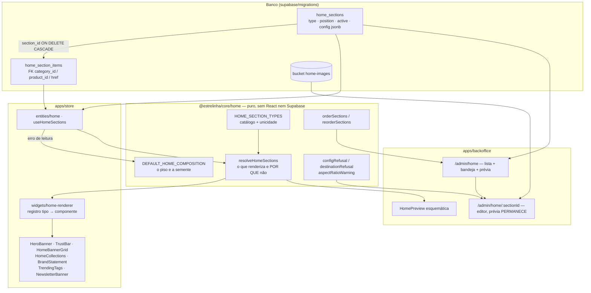

# 24 · Home gerenciável — Design

**Spec**: [`spec.md`](./spec.md) · **Context**: [`context.md`](./context.md)
**Status**: Draft
**Boards**: página `24 · Home gerenciável` do arquivo `Uma Estrelinha` — lista e prévia, editor do
hero, editor da grade de banners, curadoria automático ↔ escolhido, e a tela em 390px.

---

## O que este design decide, em uma frase

A composição da Home sai da ordem do JSX e vira **duas tabelas**: `home_sections` (o quê, onde,
ligado) e `home_section_items` (a curadoria da dona, com **FK de verdade**). A regra de leitura vira
função pura em `@estrelinha/core/home`, consumida pela loja **e** pelo painel — porque "esta seção vai
aparecer?" é a mesma pergunta nos dois lados, e duas respostas divergiriam no primeiro ajuste.

---

## Architecture Overview



**As quatro camadas, e por que a do meio existe.** A loja precisa saber *o que desenhar*; o painel
precisa saber *o que avisar que não vai desenhar*. É a **mesma** regra vista dos dois lados. Foi ter a
regra em cada tela que produziu o defeito original do menu (o `.slice(0, 4)` do `Header`), e o
`CLAUDE.md` já registra a lição: `menuEntries` mora em `core` e é consumida pelas quatro superfícies.
`resolveHomeSections` segue esse molde.

---

## Decisão estrutural nº 1 — o destino é FK, e apagar a categoria **não** apaga o banner

`menu_promo.category_id` mora em `jsonb`, **onde não cabe FK**. A consequência está escrita em
`AD-014` e custou a existência de `resolvePromo`: apagar a categoria de destino não dispara
`on delete set null`, então toda leitura precisa validar o destino em runtime. O `context.md` diz o
que fazer com isso: *"Aqui o desenho pode fazer melhor de origem, e deve."*

Mas **`cascade` seria a resposta errada**, e é o board da grade de banners que prova:

> *"A coleção que este banner apontava foi apagada — enquanto ele estiver sem destino, não aparece na
> loja; a arte fica guardada aqui, e nenhuma cliente cai num link quebrado."*

Com `on delete cascade`, a linha do banner desapareceria junto com a categoria e **a arte que a dona
subiu iria junto**. Ela perderia o upload por ter apagado uma coleção. E `HOME-24` / `HOME-34` pedem
literalmente o contrário: o painel tem de **dizer** que o destino se perdeu, o que exige a linha
continuar existindo.

| FK | Ação | Por quê |
| --- | --- | --- |
| `section_id → home_sections` | **`ON DELETE CASCADE`** | `HOME-30`: apagar a seção apaga os banners dela. A linha não tem sentido sem a seção. |
| `category_id → categories` | **`ON DELETE SET NULL`** | `HOME-24`/`HOME-34`: a arte sobrevive, o destino esvazia, o painel explica, a loja pula. |
| `product_id → products` | **`ON DELETE SET NULL`** | idem. |

**Corolário que muda o CHECK.** "Exatamente um destino" **não** pode ser constraint de banco: o
próprio `SET NULL` produz a linha com zero destinos, e um CHECK de igualdade recusaria o `UPDATE` que
o Postgres emite — a exclusão da categoria falharia. Então:

- **Banco**: `check (num_nonnulls(category_id, product_id, href) <= 1)` — *no máximo* um. Zero é o
  estado órfão, e é legítimo.
- **Aplicação**: "exatamente um para salvar" (`HOME-22`, `HOME-23`) é regra de formulário, em
  `destinationRefusal`. É a única camada onde a distinção entre "ainda não escolhi" e "perdi o que
  tinha" existe.

Órfão nunca é ambíguo na leitura: `resolveHomeSections` marca o item como `broken` e a loja o pula.

---

## Decisão estrutural nº 2 — curadoria é **presença de itens**, não uma flag

Nada de `curation_mode: 'auto' | 'manual'`. A seção **ter** itens é o override; **não ter** é a
derivação de hoje.

| Estado | Loja | Painel |
| --- | --- | --- |
| `items = []` | `pickHomeBanners` / `pickHomeCollections` / `pickTrendingCategories`, como hoje | "Automático" selecionado; categoria nova entra sozinha |
| `items ≠ []` | a lista da dona, na ordem dela, sem completar vaga | "Eu escolho"; itens órfãos marcados |

Uma flag seria **dois donos do mesmo dado** — o "defeito 01" do projeto —, e teria um estado
inalcançável de verdade: `mode = 'manual'` com zero itens é indistinguível de `'auto'` na loja, mas
diferente no banco. `HOME-33` ("voltar ao automático") vira `delete from home_section_items where
section_id = $1`, que é uma operação e não uma sincronização de dois campos.

---

## Decisão estrutural nº 3 — a faixa institucional é **seção**, e ela mesma declara o aninhamento

Hoje a faixa é `interlude` **dentro** de `HomeCollections`, entre a 1ª e a 2ª fileira
(`INTERLUDE_AFTER = 0`). O board a desenha **recuada sob "Fileiras de coleção"**, com o rótulo
*"depois da 1ª fileira"* — e isso não é enfeite: se a lista a mostrasse como irmã, a ordem exibida
mentiria; e movê-la para depois de todas as fileiras violaria `HOME-04`.

**Quem carrega o campo é a própria faixa, não a seção de fileiras.**

```
config.interlude_after: number | null
  null → renderiza no lugar dela mesma, como irmã
  0    → renderiza DENTRO da seção de fileiras imediatamente anterior, depois da fileira de índice 0
```

Por que na faixa e não em `collection_rows`: assim há **um dono**. Se `collection_rows` dissesse
"minha interlude é a seção X", desligar a X deixaria a fileira apontando para um fantasma, e as duas
linhas precisariam concordar. Do jeito escolhido, desligar a faixa é desligar a faixa — e o campo
some junto com ela.

O renderizador aplica a regra ao caminhar a lista ordenada: seção com `interlude_after !== null` cuja
antecessora renderizada é `collection_rows` vira a prop `interlude` daquela; caso contrário renderiza
sozinha, no próprio lugar. Nunca desaparece.

---

## Data Models

### `home_sections`

```sql
create table public.home_sections (
  id         uuid primary key default gen_random_uuid(),
  type       text not null,
  position   integer not null default 0,
  active     boolean not null default false,   -- HOME-10: nasce desligada
  config     jsonb   not null default '{}'::jsonb,
  created_at timestamptz not null default now(),
  updated_at timestamptz not null default now()
);
```

- **`check (type in (...))`** — a lista fechada. É o par da constante em TypeScript, e o guarda
  `homeSections.test.ts` lê **esta migration do disco** e compara os dois conjuntos (`HOME-06`).
  Molde exato de `materialTransitions.test.ts`.
- **`config jsonb` guarda SÓ texto, número e URL de imagem — nunca referência.** Toda referência mora
  em `home_section_items`, onde tem FK. Essa é a linha divisória, e é o que impede o defeito do
  `menu_promo` de reentrar por outra porta.
- **Índice único parcial para os tipos únicos**:
  `create unique index on home_sections (type) where type in ('hero','trust_bar','collection_rows','brand_statement','trending_tags','newsletter')`.
  É o que faz o painel não oferecer uma segunda (edge case da spec) valer também contra escrita
  direta.
- **Trigger do hero** (`HOME-08`): `before update` recusa `active = false` quando `type = 'hero'`;
  `before delete` recusa a exclusão. Esconder o controle na tela é UX; o trigger é o que torna "Home
  com zero seções ativas" **impossível**, que é o que a AC diz.
- **`position` não é único de propósito.** Empate é estado possível (duas admins reordenando ao mesmo
  tempo) e o desempate é de leitura, não de escrita — `HOME-12`, resolvido em `orderSections`.

### `home_section_items`

```sql
create table public.home_section_items (
  id          uuid primary key default gen_random_uuid(),
  section_id  uuid not null references public.home_sections(id) on delete cascade,
  position    integer not null default 0,
  -- destino: no máximo um. Zero = órfão (o SET NULL abaixo produz esse estado).
  category_id uuid references public.categories(id) on delete set null,
  product_id  uuid references public.products(id)   on delete set null,
  href        text,
  -- arte própria (banner livre). Sem imagem, a seção deriva a arte do destino.
  image_url   text,
  alt         text,
  -- rótulo congelado no momento da escolha: é o que deixa o painel dizer O QUE se perdeu
  -- depois de o SET NULL apagar a referência.
  label_snapshot text,
  created_at  timestamptz not null default now(),
  constraint home_section_items_one_destination
    check (num_nonnulls(category_id, product_id, href) <= 1)
);
create index on public.home_section_items (section_id, position);
```

**`label_snapshot` não é desnormalização preguiçosa.** Depois do `SET NULL` não há de onde ler o nome
da coleção apagada, e `HOME-24` pede que o painel **diga** que o destino se perdeu. Sem o snapshot a
mensagem seria "este banner perdeu o destino" e nada mais; com ele é *"a coleção **Prata 925** foi
apagada"*. Ele nunca é lido pela loja — só pelo painel, e só no caso órfão.

### O catálogo de tipos (`@estrelinha/core/home`)

| `type` | Único? | Fonte do conteúdo | `config` |
| --- | :---: | --- | --- |
| `hero` | ✅ **e não desliga** | config | `eyebrow`, `title_line1`, `title_line2`, `paragraph`, `cta_label`, `cta_href`, `image_url`, `image_alt` |
| `trust_bar` | ✅ | **`store_settings`** (`HOME-44`) | — |
| `banner_grid` | ➖ repetível | itens, senão `categories.banner_url` | `layout` |
| `collection_rows` | ✅ | itens, senão raízes por `sort_order` | `limit` (1–8) |
| `brand_statement` | ✅ | config | `eyebrow`, `title`, `paragraph`, `author_name`, `author_role`, `link_label`, `link_href`, `interlude_after` |
| `trending_tags` | ✅ | `pickTrendingCategories` | `title`, `subtitle`, `limit` (1–24) |
| `newsletter` | ✅ | config | `title`, `subtitle`, `cta_label` |
| `collection_feature` | ➖ repetível | 1 item (categoria) | `title`, `text`, `cta_label` — **P2** |
| `product_carousel` | ➖ repetível | itens, senão featured/recentes | `title`, `source`, `limit` — **P3** |
| `category_grid` | ➖ repetível | `browseCategories` | `title`, `limit` — **P3** |

**10 tipos, e a contagem é asserção do guarda.** `HOME-06` proíbe explicitamente contagem regressiva
e prova social: `DropCountdown` e `SocialProof` foram removidos na feature 20 por decisão ética
(depoimento inventado sobre a morte de alguém), e um catálogo genérico de blocos os traz de volta pela
porta do painel. O teste assere a **ausência** dos dois, não só a presença dos dez.

**`trust_bar` não tem texto editável, e isso é `HOME-44`.** A `MarqueeBar` que a `TrustBar` substituiu
prometia "Pix com 5% OFF" e "Parcele em 12×" em texto fixo enquanto `max_installments` já era 6. Dar
campo de texto aqui reintroduziria exatamente esse defeito, com a dona digitando o número em vez do
programador.

### Arranjos da grade de banners (`banner_grid.layout`)

O board oferece quatro. Cada um **declara a proporção de cada vaga**, e é dessa declaração que sai o
aviso de `HOME-27` — nunca de um recorte silencioso, porque **o texto está dentro da arte**.

| `layout` | Vagas | Proporções (desktop) |
| --- | :---: | --- |
| `single` | 1 | `1176 × 1020` (1,15:1) |
| `pair` | 2 | `588 × 510` cada |
| `hero_pair` (**default, é a grade de hoje**) | 3 | 1× `1176 × 1020` + 2× `1176 × 486` |
| `quad` | 4 | 4× `588 × 510` |

`hero_pair` reproduz o `HomeBannerGrid` atual (`RATIOS.grande = 588/510`,
`RATIOS.faixa = 588/243`, em dobro para 2× de densidade) — é o que `HOME-04` exige.

**No celular, todo layout empilha em coluna de largura cheia.** Medido: container com `padding: 1rem`
deixa 358px em 390; `quad` proporcional daria **82px** por célula, e texto embutido numa arte de 82px
é ilegível — em ~90% dos acessos.

### Bucket

`home-images`, **próprio**. Limpar imagem órfã da Home não pode varrer imagem de produto. Policies no
molde de `product-images`: leitura pública, escrita/remoção só admin.

---

## Code Reuse Analysis

### O que se aproveita

| Componente | Onde | Como |
| --- | --- | --- |
| `pickHomeBanners` · `pickHomeCollections` | `store/widgets/home-{banners,collections}/model` | **A derivação continua viva e não é reescrita.** Vira o ramo "sem itens" de `resolveHomeSections`. |
| `pickTrendingCategories` · `browseCategories` | `features/search/lib` · `core/menu` | idem, para `trending_tags` e `category_grid` |
| `bySortOrder` · `categoryHref` · `descendantIds` | `@estrelinha/core/menu` | ordenação e montagem de destino canônico |
| `RESERVED_SLUGS` · `isReservedSlug` | `@estrelinha/core/routes` | `HOME-20` e o edge case do destino reservado — **a mesma fonte da `23`** |
| `compressImage` / `uploadImageBlob` | `backoffice/features/product-form/lib/uploadProductImage.ts` | reuso **com generalização** — ver Riscos |
| `MenuSlotList` · `MenuBarPreview` | `backoffice/features/store-menu/ui` | molde da lista arrastável e da prévia esquemática |
| `reorderWithinParent` | `backoffice/features/category-list/model/categoryTree.ts` | **molde, não import** — ver Riscos |
| `FormPageHeader` (trilha, `Alterações não salvas`, `⌘S`) | `backoffice/shared/ui` | o cabeçalho do editor de seção, mesmo molde dos Descontos |
| `PageHeader` · `TableSkeleton` · superfície de erro explícita | `backoffice/shared/ui` · `AdminMenuPage` | idem — e **falha de leitura é superfície explícita, nunca lista vazia** |
| `materialTransitions.test.ts` | `store/shared/lib/__tests__` | molde do guarda que lê migration do disco com âncora de contagem |

### Pontos de integração

| Sistema | Como conecta |
| --- | --- |
| `categories` | FK real dos itens; e a derivação continua lendo `sort_order` / `banner_url` |
| `store_settings` | `trust_bar` segue lendo daqui, sem intermediário (`HOME-44`) |
| `@estrelinha/core/routes` | valida destino de CTA e de banner; `/admin/home` **não** vira slug reservado (é rota do backoffice, outro app) |
| `navGroups` + `App.tsx` do backoffice | `Home` **acima** de `Menu da loja` no grupo `Loja`, e a ordem das rotas acompanha (`navItems.test.ts` lê o `App.tsx` do disco) |

---

## Components

### `@estrelinha/core/home` — o domínio

- **Purpose**: a regra de composição da Home, pura, para a loja e o painel responderem igual.
- **Location**: `packages/core/src/home/` (+ `"./home"` no `exports` do `package.json`)
- **Sem React e sem Supabase, de propósito** — mesmo motivo de `core/routes`: o guarda que lê a
  migration do disco precisa importar isto dentro de um teste de arquivo.

```ts
// catálogo
export const HOME_SECTION_TYPES: readonly HomeSectionType[]
export const UNIQUE_SECTION_TYPES: readonly HomeSectionType[]
export const MAX_HOME_SECTIONS = 30
export const sectionMeta: (type: HomeSectionType) => SectionMeta   // rótulo, ícone, único?, limites

// o piso e a semente — HOME-04 e HOME-07
export const DEFAULT_HOME_COMPOSITION: readonly HomeSection[]

// ordem — HOME-11, HOME-12
export const orderSections: (s: readonly HomeSection[]) => HomeSection[]   // position, depois id
export const reorderSections: (s, draggedId, targetId) => { id: string; position: number }[] | null

// a leitura, para os DOIS lados — HOME-02, HOME-03, HOME-09, HOME-31..36
export const resolveHomeSections: (s: readonly HomeSection[], ctx: ResolveContext) => ResolvedSection[]

// recusas — sempre `string | null`, nunca união discriminada por booleano
export const uniqueTypeRefusal:  (type, sections) => string | null
export const destinationRefusal: (item: Partial<SectionItem>) => string | null
export const ctaHrefRefusal:     (href: string) => string | null    // usa core/routes
export const configRefusal:      (type, config) => string | null
export const aspectRatioWarning: (w: number, h: number, slot: SlotSpec) => string | null
```

**`string | null` em toda recusa, e não `{ ok: false; reason }`.** `strictNullChecks` está `false` no
`tsconfig.base.json`, e nesse modo união discriminada por literal booleano **não estreita** — ler
`verdict.reason` no ramo do `else` é TS2339. Mesmo formato de `menuSlotRefusal` e `reservedSlugRefusal`.

**`ResolvedSection` carrega o motivo, não só o veredito**, porque `HOME-09` pede que a linha diga
**por quê**:

```ts
interface ResolvedSection {
  section: HomeSection
  renders: boolean
  /** null quando renderiza. Senão, o texto que o painel mostra. */
  hiddenReason: string | null
  /** o que a seção vai desenhar — já derivado ou já curado */
  items: ResolvedItem[]
  /** curados que saíram do ar. Alimenta "2 de 6 escolhidos saíram do ar" (HOME-34). */
  droppedCount: number
  /** para a faixa institucional: dentro de quem ela entra, e depois de qual fileira */
  nestedUnder: { sectionId: string; afterRow: number } | null
}
```

### `entities/home` (loja)

- **Purpose**: ler as seções, com o piso semeado quando a leitura falha.
- **Location**: `apps/store/src/entities/home/`
- **Interfaces**: `useHomeSections(): UseQueryResult<HomeSection[]>` — uma consulta só, com a relação
  embutida: `.select('*, items:home_section_items(*)').order('position')`.
- **`HOME-07`**: erro ou lista vazia ⇒ `DEFAULT_HOME_COMPOSITION`. **Nunca página em branco.** É o
  mesmo instinto do `mapCategory`, que faz `active` cair em `true`: sumir da vitrine é pior que
  aparecer.

### `widgets/home-renderer` (loja)

- **Purpose**: transformar a lista resolvida em JSX, sem a página conhecer tipo nenhum.
- **Location**: `apps/store/src/widgets/home-renderer/`
- **Interfaces**: `HOME_SECTION_RENDERERS: Record<HomeSectionType, ComponentType<SectionProps>>`
- **`HomePage` encolhe para três linhas** — hook, resolve, render. Nenhum nome de seção sobra no
  `.tsx`, que é a definição de "a composição virou dado".

### Os widgets existentes — **props em vez de literais**

`HeroBanner`, `BrandStatement`, `TrendingTags`, `NewsletterBanner` passam a receber o conteúdo por
prop. **A marcação, as classes e os comentários de contraste não mudam** — é troca de fonte do texto,
não redesenho. `HomeBannerGrid` e `HomeCollections` passam a receber a lista já resolvida em vez de
chamarem `useCategories` por conta própria.

> **Risco declarado, e é o maior da feature**: `HOME-04` diz que a Home não pode mudar de aparência.
> A prova é teste de renderização comparando a saída semeada com os literais de hoje — não inspeção
> visual. Detalhado em Riscos.

### `/admin/home` — lista, bandeja e prévia

- **Location**: `apps/backoffice/src/pages/admin/AdminHomePage.tsx` +
  `features/home-composition/ui/{HomeSectionList,HomeSectionRow,HomeBlockTray,HomePreview}.tsx`
- **Duas rotas, um componente**: `/admin/home` e `/admin/home/:sectionId` montam o **mesmo**
  `AdminHomePage`. A coluna da esquerda troca (lista ↔ editor); **a prévia à direita permanece
  montada**, com o bloco em edição contornado. É o precedente dos Descontos (*"editor é TELA, não
  modal"* — sobrevive ao F5, é compartilhável) **sem** o preço dele: o formulário do hero tem seis
  campos e um upload, e perder a prévia para vê-los seria trocar contexto por espaço.
- **A bandeja "Blocos que você pode acrescentar" vive DENTRO do cartão da lista**, no rodapé — não num
  modal do botão "Adicionar seção". É também onde se lê quais tipos são únicos e já estão na lista,
  o que responde à pergunta **antes** de a dona clicar e ser recusada.
- **`HomePreview` é esquemática e usa os tokens do painel.** Render real dos widgets da loja traria
  os `--estrelinha-*` para dentro do backoffice, que tem paleta própria e `importOrder.test.ts`
  guardando a separação. Molde do `MenuBarPreview`.

### Editores de seção

Um componente por tipo, atrás de um registro — mesmo padrão do renderizador da loja:
`HeroEditor`, `BannerGridEditor`, `CollectionRowsEditor`, `TextSectionEditor` (serve
`brand_statement`, `trending_tags`, `newsletter`), `CollectionFeatureEditor` (P2).

### `uploadHomeImage`

- **Location**: `apps/backoffice/src/features/home-composition/lib/uploadHomeImage.ts`
- Reusa `compressImage` / `uploadImageBlob` (1600px, WebP 0,82) **contra o bucket `home-images`**.
- Lê as dimensões naturais **antes** de comprimir e chama `aspectRatioWarning` (`HOME-27`).
- **`HOME-28`**: a seção só é gravada **depois** de o upload retornar URL. Falha de upload não deixa
  banner pela metade — a ordem é upload → grava, nunca as duas em paralelo.

---

## Superfície de escrita

Sem RPC. `home_sections` e `home_section_items` são tabelas de conteúdo, não de dinheiro nem de
estado de pedido — o argumento que obrigou `set_material_status` a existir (`orders` não pode ter
policy de `UPDATE` para não expor `payment_status`) **não se aplica aqui**. Policy de `insert`,
`update` e `delete` com `has_role(auth.uid(), 'admin')` é a superfície certa, e é a que
`/admin/categorias` já usa.

| Operação | Chamada |
| --- | --- |
| Ler (loja) | `select` — RLS devolve só `active = true` |
| Ler (painel) | `select` — policy de admin devolve tudo |
| Reordenar | `upsert` **só das linhas que mudaram**, com `position` **absoluta** (`HOME-11`: repetir a chamada dá o mesmo resultado) |
| Ligar/desligar | `update { active }` **e nada mais** — molde do "pausar cupom": acrescentar campos reescreveria a seção com o que a listagem tem em cache, que pode estar velho |
| Salvar seção | `update { config }` da própria linha (`HOME-14`: última gravação vence **naquela seção**) |
| Curar | `delete` dos itens + `insert` dos novos, na mesma transação lógica; "voltar ao automático" é só o `delete` |

---

## RLS

```sql
alter table public.home_sections       enable row level security;
alter table public.home_section_items  enable row level security;

-- HOME-05: leitura pública SÓ de seção ativa
create policy "public read active home sections" on public.home_sections
  for select using (active = true);

-- o item segue o estado da seção-mãe
create policy "public read items of active sections" on public.home_section_items
  for select using (exists (
    select 1 from public.home_sections s
    where s.id = home_section_items.section_id and s.active = true
  ));

-- escrita e leitura completa: só admin
create policy "admin full home sections" on public.home_sections
  for all using (public.has_role(auth.uid(), 'admin'))
  with check (public.has_role(auth.uid(), 'admin'));
-- idem para home_section_items
```

O guarda `homeSections.test.ts` assere, lendo a migration do disco, que **não existe** policy de
escrita sem `has_role` e que nenhuma concede a `anon` — mesma âncora que
`materialTransitions.test.ts` aplica à `22`.

---

## Error Handling Strategy

| Cenário | Tratamento | O que a pessoa vê |
| --- | --- | --- |
| Leitura das seções falha (`HOME-07`) | `useHomeSections` devolve `DEFAULT_HOME_COMPOSITION` | A Home de hoje. **Nunca** página em branco |
| Leitura falha no painel | Superfície de erro explícita + "Tentar de novo" | Molde do `AdminMenuPage`; **nunca lista vazia** (foi engolir esse erro que fez Coleções parecer "sem conteúdo" por meses) |
| Gravação falha (`HOME-14`) | Toast com a mensagem do banco; o formulário **não** é limpo nem remontado | "Não foi possível salvar" + o que ela digitou continua lá |
| Upload falha (`HOME-28`) | Aborta **antes** do `update`; a seção fica como estava | "Não foi possível enviar a imagem" — nenhum banner pela metade |
| Proporção divergente (`HOME-27`) | **Aviso, não bloqueio**: mostra a medida recomendada em px | "Esta arte é 1:1, e a vaga é 2,42:1 — envie em 1176 × 486 px, ou mude o arranjo" |
| Destino apagado (`HOME-24`, `HOME-34`) | `SET NULL` + `label_snapshot`; a loja pula, o painel nomeia | "A coleção **Prata 925** foi apagada" |
| Imagem não carrega no navegador (`HOME-25`, `HOME-29`) | O contêiner mantém a proporção reservada (`aspect-[...]` no wrapper, já é como o `BannerLink` funciona) | Retângulo `ground-deep` no lugar; **nada abaixo se desloca** |
| Tipo único duplicado | `uniqueTypeRefusal` na bandeja + índice único parcial no banco | O bloco aparece esmaecido, com "já está na lista" |
| Teto de 30 seções | `MAX_HOME_SECTIONS` recusa na tela | "A Home já tem 30 seções" |
| CTA para caminho que a loja não serve (`HOME-20`) | `ctaHrefRefusal` via `@estrelinha/core/routes` | "Este endereço não existe na loja" — nunca grava CTA que leva a 404 |
| Fonte vazia (`HOME-09`) | `hiddenReason` preenchido; ativar **é permitido** | "Não vai aparecer: nenhuma coleção tem banner" |

---

## Risks & Concerns

| Concern | Onde | Impacto | Mitigação |
| --- | --- | --- | --- |
| **`HOME-04` é o risco nº 1 da feature**: mover 7 seções de JSX para dado é a chance de a Home mudar de cara em silêncio | `apps/store/src/pages/HomePage.tsx` e os 7 widgets | A cliente vê uma Home diferente no dia da virada; nada quebra, nada acusa | Teste de renderização que monta a Home com `DEFAULT_HOME_COMPOSITION` e assere **os literais de hoje, string a string** (eyebrow, as duas linhas do título, parágrafo, rótulo e destino do CTA, os dois textos da faixa institucional, título/subtítulo dos chips e da newsletter, `limit` 3 e 4). Task própria, antes de qualquer edição de widget: **congela o comportamento atual e só depois refatora** |
| `uploadImageBlob` tem o bucket **cravado** (`const BUCKET = 'product-images'`) e monta a URL com ele | `backoffice/.../uploadProductImage.ts:3,111-138` | Reusar como está gravaria arte da Home no bucket de produto, e a dívida de imagem órfã varreria as duas | Generalizar para `uploadImageBlob(blob, { bucket, folder, ... })`, com **`'product-images'`/`'products'` como default** — nenhum chamador existente muda. É refatoração de 3 linhas, e é pré-requisito do editor de banner |
| `SUPABASE_URL` tem **fallback para um projeto hard-coded** da loja anterior | `uploadProductImage.ts:4` | Se a env faltar, a URL pública aponta para um projeto que não é este — imagem quebrada sem erro | Fora do escopo desta feature (o `@estrelinha/supabase` já lança sem env). Registrar em `BACKLOG.md`; não silenciar |
| `reorderWithinParent` faz a mesma aritmética que `reorderSections` vai fazer | `backoffice/.../categoryTree.ts:370-396` | Duas cópias da regra de reordenação; a segunda diverge no primeiro ajuste | **Duplicação consciente e registrada.** Extrair um `reorderByIndex` genérico obrigaria a mexer em `categoryTree.ts`, que é código das features 14/16 com testes próprios — refatoração fora do escopo. Além disso o domínio difere de verdade: aquela filtra por pai e devolve `null` entre ramos, esta não tem árvore. Vai para `BACKLOG.md` como consolidação candidata |
| `useCategories` faz `select('*')` **sem paginação** | `store/entities/category/api/useCategories.ts:61` | Teto de 1.000 do PostgREST. Com 37 categorias hoje é folgado; a derivação da Home herda o mesmo teto | Mesma classe do `BL-008` já registrado. Não regride nada: a Home já lê daqui. Anotado, não corrigido nesta feature |
| Ordem de renderização com `interlude_after` tem um caso não óbvio: a faixa marcada como interlude **sem** `collection_rows` antes dela | `core/home/resolveHomeSections` | Se caísse fora, a faixa institucional sumiria de uma Home reordenada — perda de conteúdo em silêncio | Regra explícita: sem antecessora `collection_rows`, renderiza **sozinha no próprio lugar**. AC de teste, não boa vontade |
| **1 violação FSD conhecida** e fronteiras em `warn` | `store/entities/product/ui/ProductInfo` → `features/share-product` | O renderizador novo é `widgets/` lendo `entities/home` — direção correta, mas o modo `warn` não impediria o inverso | O renderizador **não** importa de `features/`; os widgets recebem conteúdo por prop, o que remove a tentação. Sem mudança no modo do lint |
| `--input` escurecido alcança **todo** formulário do backoffice | `packages/ui/src/styles.css:67` | Telas fora do escopo da 24 mudam de aparência | Decisão do usuário nesta sessão. É **um token** (`--input`), separado de `--border` — divisória de card, sidebar e tabela ficam intactas. Espelha a divisão `field`/`line` que a loja já força. Task própria + varredura visual das telas de formulário existentes |
| O `seed.sql` não tem catálogo depois de `db reset` | `supabase/seed.sql` | As seções que dependem de `categories` não renderizam até o importador rodar | **É o comportamento certo** e já é AC (`HOME-09` + edge case). O painel diz "a fonte está vazia"; a loja não mostra moldura vazia |

---

## Tech Decisions

| Decisão | Escolha | Racional |
| --- | --- | --- |
| Modelagem | Duas tabelas; `jsonb` só para texto/número | Referência com FK de verdade. Não repete o `menu_promo` (`AD-014`) |
| Ação da FK de destino | **`SET NULL`**, não `CASCADE` | `CASCADE` apagaria a arte que a dona subiu junto com a coleção. O board mostra a arte sobrevivendo |
| "Exatamente um destino" | CHECK `<= 1` no banco; "exatamente 1" na aplicação | O próprio `SET NULL` produz zero destinos — um CHECK de igualdade faria a exclusão da categoria **falhar** |
| Curadoria | Presença de itens | Uma flag seria dois donos do mesmo dado, com um estado indistinguível na loja |
| Faixa institucional | `interlude_after` **na própria faixa** | Um dono. Em `collection_rows`, desligar a faixa deixaria a fileira apontando para um fantasma |
| Escrita | Policy RLS, sem RPC | Não é dinheiro nem estado de pedido; o argumento de `PAY-10` não se aplica |
| Piso de leitura | `DEFAULT_HOME_COMPOSITION` em `core` | `HOME-07`, e é a mesma constante de que a semente da migration é derivada — o guarda compara as duas |
| Editor | Rota que troca só a coluna esquerda | Precedente dos Descontos, sem perder a prévia |
| Prévia | Esquemática, tokens do painel | Render real traria `--estrelinha-*` para o backoffice; `importOrder.test.ts` guarda a separação |
| Recusas | `string | null` | `strictNullChecks: false` não estreita união por literal booleano (TS2339) |
| Borda de campo | `--input` escurecido no painel inteiro | Decisão do usuário. Um token; `--border` intacto |

> **Nada aqui vira `AD-NNN`.** As três decisões estruturais são internas à Home e não impõem convenção
> a features futuras. A única com cheiro de projeto — "referência de conteúdo é FK, não id em jsonb" —
> **já está registrada** como o trade-off explícito de `AD-014`; este design a cumpre em vez de criar
> regra nova.

---

## Guardas novos

| Guarda | Onde | O que derruba a suíte |
| --- | --- | --- |
| `homeSections.test.ts` | `store/shared/lib/__tests__` | o catálogo de tipos em TS divergir do `check (type in …)` da migration (âncora de contagem, `HOME-06`); um tipo de contagem regressiva ou prova social entrar no catálogo; a semente da migration divergir de `DEFAULT_HOME_COMPOSITION`; a migration abrir policy de escrita sem `has_role` ou conceder qualquer coisa a `anon`; o trigger do hero sumir |
| `homeComposition.test.tsx` | `store/pages/__tests__` | a Home semeada deixar de produzir a sequência e **os textos** de hoje (`HOME-04`) |
| `navItems.test.ts` (**atualizado**) | backoffice | `Loja` deixar de ser `['/admin/home', '/admin/menu']`, nessa ordem — o teste hoje assere `['/admin/menu']` e **vai falhar de propósito** na task da sidebar |

---

## Cobertura de requisitos

| Requisito | Onde resolve |
| --- | --- |
| `HOME-01`, `HOME-05` | migration: tabelas, CHECK, índices, RLS |
| `HOME-02`, `HOME-03` | `resolveHomeSections` + `HomeRenderer` |
| `HOME-04` | semente da migration = `DEFAULT_HOME_COMPOSITION` + `homeComposition.test.tsx` |
| `HOME-06` | `HOME_SECTION_TYPES` + `homeSections.test.ts` |
| `HOME-07` | `useHomeSections` cai no piso |
| `HOME-08` | trigger do hero + a linha sem controle de desligar |
| `HOME-09` | `ResolvedSection.hiddenReason`; ativar continua permitido |
| `HOME-10` | `active` default `false` |
| `HOME-11`, `HOME-12` | `reorderSections` (absolutas, só as mudadas) + `orderSections` (position, depois id) |
| `HOME-13` | `HomePreview` |
| `HOME-14` | tratamento de erro sem remontar o formulário |
| `HOME-15` | board de 390px: abas `Seções | Prévia`, `TAP_44` por controle |
| `HOME-16`..`HOME-21` | `hero` config + `HeroEditor` + `ctaHrefRefusal` |
| `HOME-22`..`HOME-30` | `home_section_items` + `BannerGridEditor` + `uploadHomeImage` |
| `HOME-31`..`HOME-36` | presença de itens + `droppedCount` |
| `HOME-37`..`HOME-40` | `collection_feature` (P2) |
| `HOME-41`..`HOME-44` | `config` por tipo; `trust_bar` sem texto |
| `HOME-45`..`HOME-47` | `product_carousel` e `category_grid` (P3) |

**47 de 47 requisitos endereçados.**

---

## Pergunta aberta que este design fecha

**A forma do "Destaque em coleção" (`HOME-37`..`HOME-40`).** Nenhum dos cinco boards o desenha — ele
só aparece como bloco na bandeja. Fica como a spec descreveu e ninguém contestou: **faixa larga com
UMA coleção** — imagem à esquerda, título + texto curto + CTA à direita, empilhando em 390px. É
`collection_feature`, com exatamente **um** item (a categoria, com FK), e título/texto vazios caindo
no nome e na descrição da própria coleção (`HOME-38`). Sendo P2, se o desenho aparecer antes da task,
ele manda.
