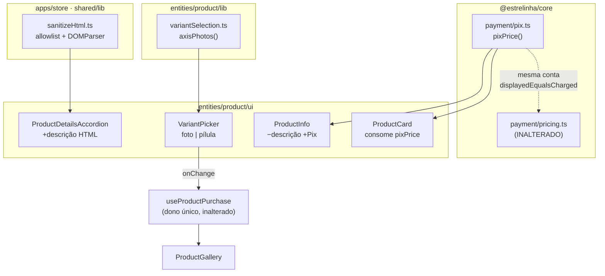

# Detalhe do Produto — Design

**Spec**: `.specs/features/27-detalhe-do-produto/spec.md`
**Status**: Approved

---

## Architecture Overview

Três entregas independentes que tocam a mesma página. Nenhuma cria tabela, coluna, rota ou chamada de
rede: as três leem dado que já existe e mudam **só o render**.



---

## ⚠️ Achado que muda uma AC da spec: o Pix do card diverge do caixa

Medido durante o design, não estava na spec.

| | fórmula | R$ 7,90 a 5% |
| --- | --- | ---: |
| `ProductCard` hoje | `round2(a × (1 − p/100))` | **R$ 7,51** |
| `pricing.ts` (o que é cobrado) | `total = a − round2(a × p/100)` | **R$ 7,50** |

As duas contas **não são a mesma**: uma arredonda o preço final, a outra arredonda o desconto e
subtrai. Com o `pix_discount_percent = 5` de hoje, **81 dos 259 preços distintos do catálogo (31%)**
divergem em 1 centavo. Com 7% ou 10%, nenhum diverge — o defeito está latente exatamente no valor
configurado agora.

A direção é a favor da cliente (a loja promete R$ 7,51 e o caixa cobra R$ 7,50), então ninguém
reclamou. Mas é a definição de "dois donos do mesmo número", e este repositório já pagou por ela: o
cabeçalho de `displayedEqualsCharged.test.ts` documenta um caso idêntico de 1 centavo na base do
cupom, ali **contra** a cliente.

**Decisão**: `pixPrice` adota a forma do caixa — `round2(amount − round2(amount × pct/100))`.

**Consequência declarada**: isto **muda o valor exibido no `ProductCard`** em 31% dos preços, em 1
centavo para baixo. A `PDP-15` da spec dizia "o valor exibido SHALL permanecer idêntico ao de hoje";
passa a dizer **"SHALL ser igual ao que `resolveOrderPricing` cobra"**, que é a invariante que
importa. A `PDP-23` também é emendada: a vaga de foto tem 56px, então o alvo de 44 é satisfeito pela
própria caixa pintada e `TAP_44` não se aplica (a varredura de `touchTarget.test.ts` só cobra o
auxiliar de caixas `h-8/h-9/h-10/38px`).

---

## Code Reuse Analysis

### O que já existe e vai ser usado

| Componente | Local | Como |
| --- | --- | --- |
| `round2` (padrão de arredondamento) | `packages/core/src/payment/pricing.ts:54` | Replicado em `pix.ts` (função de uma linha; importar cruzaria o módulo de dinheiro que precisa ficar intacto) |
| `resolveOrderPricing` | `packages/core/src/payment/pricing.ts` | **Só como oráculo de teste** — prova que `pixPrice` casa com o cobrado |
| `resolveInstallments` | `packages/core/src/payment/installments.ts` | Precedente exato de "regra de exibição promovida a `core/payment`" |
| `colorImage` (privado) | `entities/product/lib/variantSelection.ts:219` | **Renomeado** para `valueImage` e reusado por `colorPreview` e `axisPhotos` — a função nunca foi sobre cor, e sim sobre "a foto deste valor" |
| `availableValuesFor` | idem | Já calculado pelo `VariantPicker`; decide o estado desabilitado das vagas (`PST-08`) |
| `orderedOptions` / `visibleOptions` | idem | Continuam decidindo quais eixos aparecem |
| Desenho da vaga | `entities/product/ui/ColorPreview.tsx:35-102` | Mesma gramática: `rounded-sm`, contorno `field`, escolhida `border-2 border-estrelinha-ink`, vazio `bg-estrelinha-ground-deep` sem ``, foto `scale-[1.6] object-cover` |
| `PixIcon` | `apps/store/src/shared/ui/icons/PixIcon.tsx` | Tamanho por `className`, cor por `currentColor` |
| `usePaymentSettings` | `packages/core/src/hooks/useStoreSettings.ts` | Fonte de `pix_enabled` / `pix_discount_percent` |
| `productSpecs` | `entities/product/lib/productFacts.ts:90` | Continua alimentando os bullets, agora **abaixo** da descrição |
| `Accordion` do shadcn | `packages/ui/src/accordion.tsx` | `AccordionPrimitive.Header` renderiza `<h3>` → conteúdo entra em `h4` |

### Pontos de integração

| Sistema | Como conecta |
| --- | --- |
| `products.description` | Já lido pelo `mapProduct` (`?? ''`); nenhuma mudança de leitura |
| `product_variants.image_url` | Já lido pelo tipo `ProductVariant`; 3.052 de 3.245 preenchidas |
| `store_settings` (payment) | Já lido pelo hook; nenhuma setting nova |
| `useProductPurchase` | **Não muda** — a vaga de foto chama o mesmo `onChange` da pílula |

---

## Components

### 1. `sanitizeHtml`

- **Purpose**: Transformar o HTML da descrição num HTML seguro e restrito antes de ele chegar ao
  `dangerouslySetInnerHTML`.
- **Location**: `apps/store/src/shared/lib/sanitizeHtml.ts`
- **Interfaces**:
  - `sanitizeHtml(dirty: string): string`
- **Dependencies**: `DOMParser` (nativo do navegador e do jsdom)
- **Reuses**: nada — é código novo

**Por que na loja e não em `@estrelinha/core`.** Duas razões, e a segunda é decisiva:

1. Só a loja renderiza descrição de produto. O backoffice **produz** o HTML (TipTap) e não o desenha.
   `shared/` é, pelo `CLAUDE.md`, "utilitários locais do app".
2. `packages/core` roda vitest em `environment: 'node'` (`packages/core/vitest.config.ts:8`), onde
   **`DOMParser` não existe**. Pôr o sanitizador lá exigiria jsdom no pacote só por causa deste
   arquivo. A loja já é jsdom.

Se um dia o painel precisar pré-visualizar a descrição, ele sobe para `core` — o caminho que
`resolveInstallments` percorreu.

**Algoritmo** (sem regex sobre HTML — `DOMParser` monta a árvore, e em `text/html` ele **não executa
script nem baixa recurso**):

```
parse → percorre a árvore em profundidade →
  nó de texto            → mantém
  tag em DROP_COM_FILHOS → remove o nó inteiro
  tag na allowlist       → limpa atributos, mapeia heading, desce nos filhos
  qualquer outra tag     → DESEMBRULHA (filhos sobem para o lugar dela)
→ serializa body.innerHTML
```

```ts
const PERMITIDAS = new Set(['p','br','strong','em','b','i','ul','ol','li','h4','h5','a'])
const DROP_COM_FILHOS = new Set(['script','style','iframe','object','embed','noscript','template'])
const REBAIXA = { h1: 'h4', h2: 'h4', h3: 'h4' }         // PDP-09
const PROTOCOLOS = ['http:', 'https:', 'mailto:']         // PDP-07
```

- Atributo: **todos removidos**, exceto `href` em `<a>` (`PDP-06`).
- `href` sobrevive se for relativo (`/…`) ou se o protocolo estiver em `PROTOCOLOS`; `javascript:` e
  `data:` caem (`PDP-07`). A verificação é por `new URL(href, base)` dentro de `try/catch` — nunca por
  `startsWith`, que `java\tscript:` engana.
- `<a>` que sobrevive com `href` ganha `rel="noopener noreferrer"` (`PDP-08`).
- Entrada vazia/só espaço ⇒ `''`. HTML malformado ⇒ o que o parser montou, sem lançar (`Edge Case`).

### 2. `ProductDescription`

- **Purpose**: Desenhar a descrição sanitizada com a tipografia da loja.
- **Location**: `apps/store/src/entities/product/ui/ProductDescription.tsx`
- **Interfaces**: `<ProductDescription html={string} />` — devolve `null` se o sanitizado for vazio
- **Dependencies**: `sanitizeHtml`
- **Reuses**: tokens `estrelinha-ink` / `ink-soft`

**Por que não `prose` do `@tailwindcss/typography`** (que está no preset, `tailwind.preset.ts:167`, e
hoje não é usado em lugar nenhum da loja): o plugin traz a própria paleta (`--tw-prose-body` = cinzas
do Tailwind), o que plantaria cor de fora do sistema na loja pela primeira vez — e `contrast.test.ts`
mede tokens, não `--tw-prose-*`. Para 7 tags, seletores de filho explícitos são menos código do que
sobrescrever a paleta do plugin, e cada cor continua sendo um token auditável.

### 3. `pixPrice`

- **Purpose**: O preço com desconto Pix, com **um** dono.
- **Location**: `packages/core/src/payment/pix.ts` (arquivo novo — `pricing.ts` e `installments.ts`
  ficam intactos, conferido por `git diff --name-only` no gate)
- **Interfaces**: `pixPrice(amount: number, percent: number): number | null`
- **Dependencies**: nenhuma
- **Reuses**: a forma de `round2` de `pricing.ts:54`

Exportado por `@estrelinha/core/payment/pix` — o `exports` do pacote já tem o curinga
`"./payment/*"`, então **nenhuma mudança em `package.json`**.

```ts
export function pixPrice(amount: number, percent: number): number | null {
  if (!(amount > 0)) return null
  if (!(percent > 0) || percent >= 100) return null
  return round2(amount - round2((amount * percent) / 100))
}
```

### 4. `axisPhotos`

- **Purpose**: Decidir, por regra pura e medida, se um eixo se escolhe por foto — e devolver as vagas.
- **Location**: `apps/store/src/entities/product/lib/variantSelection.ts` (junto de `colorPreview`)
- **Interfaces**:
  - `axisPhotos(product: GridProduct, axis: ProductOption, selected: OptionValues): AxisPhoto[] | null`
  - `interface AxisPhoto { value: string; imageUrl: string | null; active: boolean }`
- **Dependencies**: nenhuma (módulo puro)
- **Reuses**: `valueImage` (ex-`colorImage`)

**A regra** (`PDP-16`), com os números que a sustentam:

```
qualifica  ⟺  (valores com foto) ≥ 2  ∧  (fotos distintas) = (valores com foto)
```

| | eixos | aceita? |
| --- | ---: | --- |
| `Cor` | 352 | sim |
| `Tipos de elo` (+ 4 grafias) | 150 | sim |
| `Modelo` | 27 | sim |
| `Com gravação` · `Com Base` · `Letra` | 67 | **não** — todas as fotos iguais |
| `Tamanho` | 29 de 32 | **não** — mesmo motivo |
| **total aceito** | **540 de 686 (79%)** | |

A segunda condição é o que faz a regra dizer a verdade: um eixo onde `Sim` e `Não` mostram a mesma
foto diria à cliente que a escolha não muda a peça — a razão já escrita no `COR-02`.

**Nota de escopo**: `colorAxis`/`colorPreview` **continuam existindo e intocados** — são a placa do
card (feature 26), que é outra superfície, com outra regra (só `Cor`, com contador de overflow).
`axisPhotos` não os substitui.

### 5. `VariantPicker` (modificado)

- **Purpose**: Um eixo → fotos ou pílulas, conforme `axisPhotos`.
- **Location**: `apps/store/src/entities/product/ui/VariantPicker.tsx`
- **Interfaces**: **assinatura inalterada** (`product`, `max`, `selected`, `onChange`, `surface`)
- **Reuses**: `axisPhotos`, gramática visual do `ColorPreview`

- Fotos **só em `surface="page"`** (`card` e `sheet` seguem em pílula — Out of Scope da spec).
- Cabeçalho do eixo-foto: `<nome>: <valor escolhido>`, com o valor em `ink` e o nome em `ink-soft`
  (`PDP-18`). Sem escolha, só o nome.
- Vaga: **56×56** (`h-14 w-14`), `rounded-sm`, `flex-wrap` — maior que os 40/45 do card porque aqui é
  onde a escolha acontece, e porque ≥44px dispensa `TAP_44`.
- `role="radio"` + `aria-label={value}` + `aria-checked` (`PDP-19`), dentro do `radiogroup` que já
  existe.
- Indisponível: `disabled` + opacidade + contorno tracejado, **visível** (`PDP-21`, `PST-08`).
- Sem foto: caixa `bg-estrelinha-ground-deep` **sem ``** (`PDP-20`).

### 6. `ProductInfo` (modificado)

- Remove o `<p>` da descrição (`PDP-01`).
- Acrescenta a linha do Pix entre o preço e as parcelas (`PDP-11`), lendo `purchase.price` (`PDP-13`).

### 7. `ProductCard` · `PoliciesPage` (modificados)

- `ProductCard`: a expressão inline sai; entra `pixPrice` (`PDP-15`).
- `PoliciesPage`: o literal `5` sai; entra `pix_discount_percent`, com a menção sumindo se o Pix
  estiver desligado (`PDP-24`).

---

## Data Models

Nenhum. Nenhuma tabela, coluna, migration ou tipo de banco muda. O único tipo novo é de UI:

```ts
/** Uma vaga de foto de um eixo de variação na página do produto. */
export interface AxisPhoto {
  value: string
  /** `null` quando nenhuma variação daquele valor tem foto. Nunca a foto de outro valor. */
  imageUrl: string | null
  active: boolean
}
```

---

## Error Handling Strategy

| Cenário | Tratamento | O que a cliente vê |
| --- | --- | --- |
| Descrição vazia / só espaço | `ProductDescription` devolve `null` | Seção só com os bullets de medida |
| Descrição que a limpeza esvazia (ex.: só `<script>`) | idem — a verificação é sobre o **sanitizado**, não sobre o cru | idem |
| Descrição vazia **e** sem medida | Seção não é montada; `defaultValue` cai em `cuidados` | Acordeão abrindo em "Cuidados" |
| HTML malformado | `DOMParser` monta o que dá; sem `throw` | O texto que deu para recuperar |
| `href` com `javascript:` / `data:` | Atributo removido, elemento mantido | O texto do link, sem link |
| `pix_discount_percent` = 0 / ≥100 / negativo | `pixPrice` devolve `null` | Nenhuma linha de Pix |
| Foto de variação 404 / Storage fora | `` falha, a caixa e a borda permanecem | Vaga desenhada e clicável, sem foto |
| Valor sem foto num eixo-foto | Vaga sem `` | Caixa vazia — nunca foto de outro valor |
| Eixo que não qualifica | `axisPhotos` devolve `null` | Pílulas com o nome, como hoje |

---

## Risks & Concerns

| Concern | Local | Impacto | Mitigação |
| --- | --- | --- | --- |
| **Segurança**: `dangerouslySetInnerHTML` entra na loja pela primeira vez com dado de origem externa (Nuvemshop) | `ProductDescription.tsx` | XSS armazenado se o importador trouxer HTML hostil no futuro | Allowlist por árvore (não regex), `DROP_COM_FILHOS`, atributo zero exceto `href` validado por `new URL`. Teste com vetores reais (`<script>`, `onerror`, `javascript:`, ``) |
| **Divergência de dinheiro pré-existente**: card × caixa, 1 centavo em 31% dos preços | `ProductCard.tsx:121-124` | A vitrine promete valor que o caixa não cobra | `pixPrice` adota a forma do caixa; asserido em `displayedEqualsCharged.test.ts`, o arquivo que já carrega essa invariante |
| **Texto cravado divergindo de setting** | `PoliciesPage.tsx:12` | "5% de desconto no PIX!" mente se a dona mudar o painel | `PDP-24` fecha |
| **Teste que mede o objeto errado**: `touchTarget.test.ts` só cobra `TAP_44` de `h-8/h-9/h-10/38px` | `shared/lib/__tests__/touchTarget.test.ts:53` | Uma vaga de 56px passa sem alvo — e está certo, mas se alguém encolher para `h-10` depois, a varredura pega | Nenhuma ação: o guarda já cobre a regressão que importa |
| **Cobertura**: não existe teste de DOM da `ProductPage` congelando a ordem da coluna (não há equivalente ao `homeComposition.test.tsx`) | `pages/__tests__/ProductPage.test.tsx` | Mover a descrição pode passar sem ninguém medir | As tasks acrescentam asserções de **ausência** (descrição fora de `ProductInfo`) e de **presença** (dentro do acordeão) — os dois lados, senão "movida" não é verificável |
| **HTML da origem repete o nome do produto em `<h2>`** (1.358 ocorrências) | dado | Título duplicado com o `<h1>` da página | Rebaixado a `h4` (`PDP-09`); reescrever o texto é curadoria da dona (Out of Scope) |

---

## Tech Decisions

| Decisão | Escolha | Racional |
| --- | --- | --- |
| Onde mora o sanitizador | `apps/store/src/shared/lib` | Só a loja renderiza; `core` roda vitest em `node`, sem `DOMParser` |
| Como sanitizar | `DOMParser` + varredura de árvore | Regex sobre HTML é a família de bug que se quer evitar; `text/html` não executa nem busca recurso |
| Tag desconhecida | Desembrulha (preserva o texto) | Um `<div>` da origem não deve apagar o parágrafo que a dona escreveu |
| `script`/`style`/`iframe`/… | Remove com o conteúdo | Desembrulhar imprimiria o código como texto na tela |
| Tipografia da descrição | Seletores de filho explícitos, não `prose` | O plugin traz paleta própria; a loja mantém toda cor em token auditável |
| Nível de título | `h4` | `AccordionPrimitive.Header` já é `<h3>` |
| Forma de `pixPrice` | `round2(a − round2(a×p/100))` | Casa com `resolveOrderPricing`, que é o que o caixa cobra |
| Onde mora `pixPrice` | `core/payment/pix.ts` (arquivo novo) | O curinga `./payment/*` já exporta; `pricing.ts` fica intacto |
| Regra do eixo-foto | "≥2 fotos e todas distintas" | Medida: aceita 540/686 e rejeita os eixos de foto repetida |
| `colorImage` → `valueImage` | Renomear (é privado) | A função nunca foi sobre cor; dois nomes para uma conta é o anti-padrão do projeto |
| Nome do valor | No cabeçalho do eixo | Rótulo chega a 40 caracteres — não cabe sob uma vaga de 56px em 390px |
| Tamanho da vaga | 56px (card usa 40/45) | É onde a escolha acontece; e ≥44px dispensa `TAP_44` |
| Fotos só em `surface="page"` | Sim | `card`/`sheet` estão fora de escopo por decisão da spec |

> **Nenhuma decisão de nível de projeto.** As três entregas são locais à página do produto e não
> instituem convenção que outra feature precise seguir — logo **não** entra `AD-020` no `STATE.md`.
> O sanitizador vira convenção **se** uma segunda tela precisar renderizar HTML; aí ele sobe para
> `core` e a decisão se registra.
