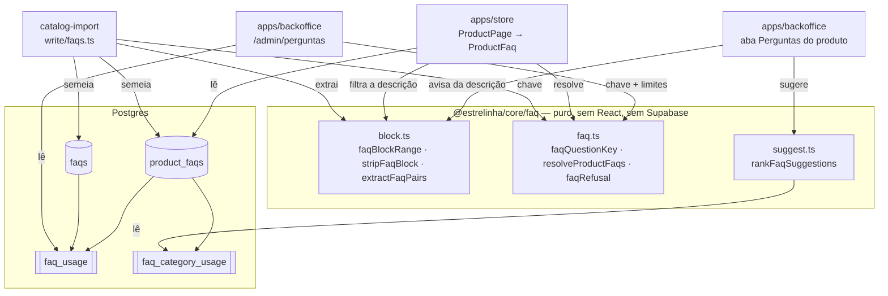

# Perguntas Frequentes — Design

**Spec**: [`spec.md`](./spec.md) · **Status**: Approved (decisões P1–P3 confirmadas pelo usuário em 2026-08-16)

---

## Conformidade com as decisões ativas (`AD-001`..`AD-019`)

Lidas antes de qualquer escolha. Nenhuma é superada por esta feature.

| Decisão | Como esta feature conforma |
| --- | --- |
| `AD-002` / `AD-004` | Regra pura em `packages/core`, I/O fora dela. `@estrelinha/core/faq` não importa React nem Supabase — o importador (Node) e as duas apps (browser) leem o mesmo módulo. |
| `AD-011` | Nada de IA. A sugestão é função pura determinística; a geração vira `BL-014`. |
| `AD-012` | **Tipo escrito à mão é afirmação, não verificação.** As duas tabelas e as duas views são provadas por **probe HTTP contra o banco local**, não por inspeção de tipo. É task explícita (T18). |
| `AD-014` | Conjunto de produtos é categoria. A sugestão e o lote leem `product_categories` + `descendantIds`, nunca uma segunda árvore. |
| `AD-015` | **N/A** — nenhuma decisão de dinheiro toca FAQ. `packages/core/src/payment/**` fica intocado, conferido no gate. |
| `AD-017` | A migration é **nova** (`20260816120000_28-perguntas-frequentes.sql`). Nenhuma migration existente é reescrita — a permissão de reescrever história não é usada aqui porque não há nada a corrigir. |
| `AD-018` | `/admin/perguntas` é rota do **backoffice**; `ROUTE_SLUGS` e `RESERVED_SLUGS` são da **loja**. Nenhum slug novo entra no namespace da loja, e `reservedSlugs.test.ts` não é afetado. |
| `AD-019` | A prévia da Home não é tocada. A seção de FAQ é da página do produto, que não tem prévia. |

---

## Architecture Overview

Um domínio puro no meio, quatro consumidores em volta, e **nenhuma regra duplicada** — que é a
resposta desta feature ao "defeito 01" do projeto.



**A fronteira do bloco de FAQ tem um dono só, e ele é lido por três apps.** `faqBlockRange` é
chamado pelo importador (para extrair), pela loja (para não exibir duas vezes) e pelo painel (para
avisar e para remover). Três definições da mesma fronteira produziriam exatamente o defeito que a
`24` e a `25` existiram para matar.

### Aproximações consideradas

| Abordagem | Por que não |
| --- | --- |
| **Guardar o FAQ num `jsonb` em `products`** | Mata o reuso, que é o pedido central: trocar uma resposta que vale para 443 produtos voltaria a ser 443 edições. E não há como perguntar "em quantos produtos esta pergunta está". |
| **Tabela única `product_faqs` com pergunta e resposta em texto** | É o modelo de hoje disfarçado: 3.476 linhas com 67 perguntas repetidas, sem entidade para a biblioteca apontar. A sugestão por categoria precisaria agrupar por texto a cada leitura. |
| **Biblioteca com 263 entradas (par = entrada)** | Recusado com o usuário: a dona escolheria entre 98 linhas com o mesmo título ao procurar `Quais materiais posso usar nessa joia?`. |
| **Escolhida: `faqs` + `product_faqs` com `answer_override`** | 67 entradas, 70% dos vínculos no padrão. Mesmo molde de `engraving_max_chars` / `requires_material`: default com override nullable e **um leitor** (`resolveProductFaqs`). |

---

## Code Reuse Analysis

### O que já existe e vai ser usado

| Componente | Onde | Como |
| --- | --- | --- |
| `sanitizeHtml` | `apps/store/src/shared/lib/sanitizeHtml.ts` | Inalterado. `ProductDescription` passa a chamá-lo **depois** de `stripFaqBlock`. |
| `planCategoryLinks` / `persistProductRelations` | `apps/backoffice/.../model/persistProduct.ts` | `planFaqLinks` é o espelho exato, e a gravação entra na mesma função de relações. |
| `descendantIds`, `bySortOrder` | `@estrelinha/core/menu` | O lote da `P2-B` aplica à categoria **e à descendência** sem uma segunda travessia de árvore. |
| `selectAll` | `tools/catalog-import/src/write/db.ts` | Obrigatório: `product_faqs` terá 3.476 linhas e `select` simples devolveria 1.000. É a regra que `db.test.ts` guarda. |
| `normalizeText` (NFD + `\p{Diacritic}`) | `packages/core/src/material/material.ts` | O mesmo tratamento de acento, replicado em `faq.ts` com o mesmo comentário sobre `\p{Diacritic}` — **não** importado de `material`, que é outro domínio. |
| `FormCard`, `FormPageHeader`, `AdminTable`, `DateField` | `apps/backoffice/src/shared/ui` | A tela da biblioteca e a aba do produto usam a moldura que Cupons e Promoções já estabeleceram. |
| `Accordion` do shadcn | `@estrelinha/ui/accordion` | A seção de FAQ continua sendo um `AccordionItem`; só o conteúdo muda. |
| `category_product_counts` | migration `20260801150000` | Precedente de view com `security_invoker = true` — as duas views novas seguem o mesmo molde. |

### Pontos de integração

| Sistema | Como conecta |
| --- | --- |
| `ProductPage` | Passa a chamar `useProductFaqs(product.id)` e a repassar `faqs` ao `ProductDetailsAccordion` **como prop**. |
| `AdminProductFormPage` | Ganha a aba `perguntas` (2ª posição) e o estado `form.faqs`, persistido junto das categorias. |
| `App.tsx` + `navGroups` | `/admin/perguntas` entra no grupo `Catálogo`, depois de Categorias, nos dois arquivos e na mesma ordem. |
| `run.ts` do importador | Nova etapa depois de `writeProducts`, antes das imagens; entra no `stopAfter` como `'perguntas'`. |

---

## Components

### 1 · `@estrelinha/core/faq`

- **Propósito**: toda a regra de FAQ, pura, legível por Node e por browser.
- **Local**: `packages/core/src/faq/` — `types.ts`, `faq.ts`, `block.ts`, `suggest.ts`, `index.ts`
- **Export**: `"./faq": "./src/faq/index.ts"` em `packages/core/package.json`

```ts
// types.ts
export interface FaqEntry { id: string; question: string; answer: string; is_active?: boolean }
export interface ProductFaqLink { faq_id: string; position: number; answer_override?: string | null }
export interface ResolvedFaq { id: string; question: string; answer: string; overridden: boolean }
export interface FaqPair { question: string; answer: string }
export interface FaqCategoryUsage { category_id: string; faq_id: string; uses: number; sample: number }
export interface FaqUsage { faq_id: string; products: number }
```

```ts
// faq.ts
export const FAQ_QUESTION_MAX = 160
export const FAQ_ANSWER_MAX = 600
export const decodeHtmlEntities: (text: string) => string
export const faqQuestionKey: (question: string) => string
export const normalizeFaqText: (text: string) => string          // trim + colapsa espaço; '' vira ''
export const faqRefusal: (question: string, answer: string) => string | null
export const faqOverrideOf: (link, entryAnswer) => string | null // igual ao padrão ⇒ null
export const resolveProductFaqs: (
  links: readonly ProductFaqLink[],
  entries: ReadonlyMap<string, FaqEntry> | readonly FaqEntry[],
) => ResolvedFaq[]
```

**`resolveProductFaqs` é o leitor único** (`FAQ-01`, `FAQ-03`, `FAQ-04` numa função só): ordena por
`position`, **pula** o vínculo cuja entrada esteja ausente ou inativa, e resolve
`answer_override ?? entry.answer` com `trim` — override só de espaço não conta.

**`faqQuestionKey`**: decodifica entidades → tira tag → NFD + `\p{Diacritic}` → minúsculas →
colapsa espaço → tira pontuação final (`?`, `!`, `.`). Medido no catálogo real: as três variantes de
normalização (sem folding, com folding, com folding e sem pontuação) devolvem **67**, então a chave é
estável e o corte de pontuação não funde perguntas distintas.

**`faqRefusal`** devolve `string | null`, **nunca união discriminada por literal booleano** —
`strictNullChecks: false` não estreita esse tipo (a armadilha já registrada em
`materialTransitionRefusal`).

**`decodeHtmlEntities`** cobre as **15 entidades medidas** no corpus (`&ccedil;` 8.301 ·
`&atilde;` 6.357 · `&eacute;` 3.751 · `&otilde;` · `&ecirc;` · `&agrave;` · `&oacute;` · `&mdash;` ·
`&uacute;` · `&aacute;` · `&iacute;` · `&Eacute;` · `&nbsp;` · `&acirc;` · `&Aacute;`), mais o
conjunto Latin-1 acentuado completo, os cinco básicos (`&amp;` decodificado **por último**, senão
`&amp;lt;` viraria `<`) e as numéricas (`&#233;`, `&#xE9;`). Entidade desconhecida **fica como está** —
nunca lança.

### 2 · `@estrelinha/core/faq/block.ts` — a fronteira, com um dono

```ts
export interface FaqBlockRange { start: number; end: number; inner: string }
export const faqBlockRange: (html: string) => FaqBlockRange | null
export const extractFaqPairs: (html: string) => FaqPair[]
export const stripFaqBlock:   (html: string) => string
export const hasFaqBlock:     (html: string) => boolean
```

- `faqBlockRange` acha `<h2|h3>` cujo texto normalizado seja `perguntas frequentes` e vai até o
  próximo heading de nível ≤ ao dele, ou o fim. Medido: 685 terminam em outro `<h3>`, 2 são o último bloco.
- `extractFaqPairs` lê os **dois arranjos**: `<p><strong>P</strong><br/>R</p>` (617 produtos) e
  **todos os pares num `<p>` só** separados por `<br/>` (70 produtos — a leitura ingênua perde 312
  pares). O padrão é `<strong>(.*?)</strong>\s*<br\s*/?>\s*(.*?)(?=<strong>|</p>|$)`.
- `stripFaqBlock` remove `[start, end)` **apenas quando `extractFaqPairs` devolveu ao menos um par**
  (`FAQ-06`) — heading com prosa solta embaixo não é tocado.
- Resposta sai como **texto**: entidades decodificadas, tag removida.

> **Por que regex e não `DOMParser` aqui.** Está registrado na spec como assumption: isto **localiza**,
> não sanitiza. A segurança continua vindo de onde sempre veio — o que resta da descrição ainda passa
> por `sanitizeHtml`, e a resposta extraída é renderizada como texto. E o importador roda em **Node**,
> onde não há `DOMParser`: uma implementação por árvore não serviria às três pontas.

### 3 · `@estrelinha/core/faq/suggest.ts`

```ts
export const FAQ_SUGGESTION_LIMIT = 5
export const FAQ_MIN_CATEGORY_SAMPLE = 3

export interface RankInput {
  categoryIds: readonly string[]
  usage: readonly FaqCategoryUsage[]
  global: readonly FaqUsage[]
  linkedFaqIds: readonly string[]
  productHasFaq: boolean
  limit?: number
}
export interface FaqSuggestion { faq_id: string; score: number; source: 'category' | 'global' }
export const rankFaqSuggestions: (input: RankInput) => FaqSuggestion[]
```

`score = max` sobre as categorias do produto de `uses / (sample − self)`, onde `self` é 1 quando o
produto já tem ao menos uma pergunta e pertence àquela categoria. Categoria com `sample <
FAQ_MIN_CATEGORY_SAMPLE` é ignorada. Já vinculadas saem da lista. Desempate: `score desc`, depois
`faq_id` — determinístico.

**A proporção é o desenho, não a contagem**: medido, 84,0% / 83,5% contra 61,1% / 56,1%.

Sem categoria qualificada ⇒ ordena por `global.products` (`source: 'global'`).

### 4 · Migration `supabase/migrations/20260816120000_28-perguntas-frequentes.sql`

Ver **Data Models**. Traz as duas tabelas, os dois índices, as duas views, o trigger de `updated_at`
e a RLS.

### 5 · Loja — `apps/store`

| Arquivo | O que faz |
| --- | --- |
| `entities/product/api/useProductFaqs.ts` (**novo**) | `useQuery(['product-faqs', productId])` — lê `product_faqs` com embed `faq:faqs(...)`, `enabled: !!productId`. **Fora de `PRODUCT_SELECT`** (`FAQ-09`). |
| `entities/product/ui/ProductFaq.tsx` (**novo**) | `<dl>` a partir de `ResolvedFaq[]`. Texto escapado, **sem** `dangerouslySetInnerHTML`. |
| `entities/product/ui/ProductDetailsAccordion.tsx` | Ganha a prop `faqs?: ResolvedFaq[]`; o `<dl>` fixo some. Seção `faq` só é montada com `faqs.length > 0`. |
| `entities/product/ui/ProductDescription.tsx` | `sanitizeHtml(stripFaqBlock(html))`. |
| `pages/ProductPage.tsx` | Chama `useProductFaqs` e passa a prop. |

**A prop, e não o hook dentro do acordeão** — lição da feature 22: um hook de dados dentro de um
componente condicional obriga toda página que o monta a ter `QueryClientProvider`, e
`ProductDetailsAccordion.test.tsx` hoje monta sem provider. Prop mantém o componente apresentacional.

### 6 · Backoffice — biblioteca

| Arquivo | O que faz |
| --- | --- |
| `features/faq-library/api/useAdminFaqs.ts` (**novo**) | Lista `faqs` + `faq_usage`; cria, edita, ativa/desativa, apaga. |
| `features/faq-library/model/faqDelete.ts` (**novo**) | `faqDeleteRefusal(usage): string \| null` — puro, testável. |
| `features/faq-library/ui/FaqLibraryTable.tsx` (**novo**) | Pergunta · início da resposta · **em N produtos** · estado · ações. |
| `features/faq-library/ui/FaqEditorDialog.tsx` (**novo**) | Criar/editar, com `faqRefusal` e a recusa por chave duplicada apontando a existente. |
| `features/faq-library/ui/ApplyToCategoryDialog.tsx` (**novo**) | `P2-B`: escolhe categoria, mostra **prévia com contagem** (`vão receber` / `já têm`), aplica. |
| `pages/admin/AdminFaqsPage.tsx` (**novo**) | A rota `/admin/perguntas`. |

### 7 · Backoffice — aba do produto

| Arquivo | O que faz |
| --- | --- |
| `features/product-form/ui/tabs/FaqTab.tsx` (**novo**) | Lista vinculada (ordem, remover, resposta própria, voltar ao padrão), busca na biblioteca, criar na hora, bloco de sugestões com `Adicionar todas`. |
| `features/product-form/model/planFaqLinks.ts` (**novo**) | Espelho de `planCategoryLinks`, com `answer_override`. |
| `features/product-form/model/persistProduct.ts` | `persistProductRelations` passa a gravar `product_faqs` no mesmo bloco de `product_categories`. |
| `features/product-form/ui/DescriptionFaqNotice.tsx` (**novo**) | `FAQ-27`/`FAQ-28` — o aviso e o botão de remover o bloco. |
| `pages/admin/AdminProductFormPage.tsx` | Aba nova em 2ª posição; carrega os vínculos ao abrir; monta o aviso na aba Geral. |

### 8 · Importador — `tools/catalog-import/src/write/faqs.ts`

```ts
export interface FaqSeedResult {
  entradasCriadas: number
  vinculosCriados: number
  vinculosComRespostaPropria: number
  produtosPulados: number
  produtosSemBloco: number
}
export const planFaqSeed: (items, existentes, produtosComVinculo) => FaqSeedPlan   // puro
export const writeFaqs:   (plan, deps) => Promise<FaqSeedResult>                   // I/O
```

- **Plano puro separado da escrita** (`AD-002`): `planFaqSeed` é testável sem dublê de banco.
- Lê o que já existe com **`selectAll`**, nunca `select` simples.
- Resposta padrão = a **mais frequente** por chave; empate resolvido pela primeira em ordem de
  produto, para a execução ser determinística.
- Produto com ao menos um vínculo é **pulado**; entrada existente é **reusada sem reescrever** a resposta.
- `run.ts`: etapa nova depois de `writeProducts`; `stopAfter` ganha `'perguntas'`; `report.ts` ganha a seção.

---

## Data Models

```sql
create table public.faqs (
  id           uuid primary key default gen_random_uuid(),
  question     text not null,
  answer       text not null,
  -- Chave de deduplicação. Produzida SEMPRE por faqQuestionKey (@estrelinha/core/faq) — o banco
  -- guarda, o TypeScript decide. Uma coluna gerada exigiria unaccent+immutable e daria um SEGUNDO
  -- dono da normalização, divergente do que o painel e o importador usam.
  question_key text not null unique,
  is_active    boolean not null default true,
  created_at   timestamptz not null default now(),
  updated_at   timestamptz not null default now(),
  constraint faqs_question_len check (char_length(btrim(question)) between 1 and 160),
  constraint faqs_answer_len   check (char_length(btrim(answer))   between 1 and 600)
);

create table public.product_faqs (
  product_id      uuid not null references public.products(id) on delete cascade,
  faq_id          uuid not null references public.faqs(id)     on delete restrict,
  position        integer not null default 0,
  answer_override text,
  created_at      timestamptz not null default now(),
  primary key (product_id, faq_id),
  constraint product_faqs_override_len
    check (answer_override is null or char_length(btrim(answer_override)) between 1 and 600)
);

create index product_faqs_faq_id_idx on public.product_faqs (faq_id);
```

**As duas FKs são deliberadamente diferentes.** `product_id` é `cascade` — apagar o produto leva os
vínculos dele, que não significam nada sozinhos. `faq_id` é **`restrict`** — apagar uma entrada usada
removeria a pergunta de até 453 páginas em silêncio; o caminho reversível é `is_active = false`, que
tira de todas de uma vez e volta com um clique.

### Views

```sql
create or replace view public.faq_usage with (security_invoker = true) as
  select f.id as faq_id, count(pf.product_id)::int as products
  from public.faqs f left join public.product_faqs pf on pf.faq_id = f.id
  group by f.id;

create or replace view public.faq_category_usage with (security_invoker = true) as
  with sizes as (
    select pc.category_id, count(distinct pc.product_id)::int as sample
    from public.product_categories pc
    where exists (select 1 from public.product_faqs pf where pf.product_id = pc.product_id)
    group by pc.category_id
  )
  select pc.category_id, pf.faq_id,
         count(distinct pf.product_id)::int as uses,
         s.sample
  from public.product_categories pc
  join public.product_faqs pf on pf.product_id = pc.product_id
  join sizes s on s.category_id = pc.category_id
  group by pc.category_id, pf.faq_id, s.sample;
```

`faq_usage` serve a **três** consumidores: a coluna "em N produtos" da biblioteca, a recusa de apagar
e o desempate global da sugestão. Materializar essa contagem numa coluna de `faqs` seria um segundo
dono do mesmo número.

### RLS

| Tabela | `select` público | escrita |
| --- | --- | --- |
| `faqs` | `using (is_active = true)` | `for all to authenticated using/with check has_role(...,'admin')` |
| `product_faqs` | `using (true)` | idem |

**`product_faqs` é lido sem condição de propósito.** Fosse condicionado à entrada ativa, o vínculo
para uma entrada desativada **não chegaria** ao navegador e o ramo de "pular" nunca rodaria em
produção. Com a leitura aberta, o embed devolve `faq: null` com o `faq_id` intacto — exatamente o
comportamento que a feature 24 mediu (*"saiu do ar é resposta da RLS"*), e `resolveProductFaqs` pula.
Não há vazamento: o conteúdo mora em `faqs`, que continua fechado.

Nenhum `grant` a `anon` é emitido; as duas policies de escrita são `to authenticated`.

---

## Error Handling Strategy

| Cenário | Tratamento | O que a pessoa vê |
| --- | --- | --- |
| Leitura de `product_faqs` falha na loja | `useQuery` devolve `[]` | Seção "Perguntas Frequentes" ausente. Nunca página quebrada. |
| Vínculo com entrada inativa/ausente | `resolveProductFaqs` pula | A vaga some; as demais mantêm a ordem. |
| `question_key` duplicada no `insert` | `23505` capturado no painel | "Esta pergunta já existe na biblioteca" + botão para vinculá-la. |
| `check` de limite violado | `23514` capturado | O motivo de `faqRefusal` já barrou antes; o banco é a segunda linha. |
| Apagar entrada em uso | `23503` (`restrict`) capturado | "Está em N produtos. Desative em vez de apagar." |
| Storage/rede fora no importador | `DbError` sobe e aborta a etapa | Exit ≠ 0 e a seção do relatório diz onde parou. |
| Descrição `null` / vazia | `faqBlockRange` devolve `null` | Nada extraído, nada removido, sem exceção. |
| Duas admins reordenando | Último upsert vence | Nenhuma linha fica sem `position` (é `not null default 0`). |

---

## Risks & Concerns

| Concern | Onde | Impacto | Mitigação |
| --- | --- | --- | --- |
| **Regex sobre HTML** é a família de bug que `sanitizeHtml` existe para não ter | `core/faq/block.ts` | Um bloco mal delimitado poderia comer `Observações importantes` | O resultado **continua passando por `sanitizeHtml`**; a resposta é renderizada como texto. `faqExtraction.test.ts` fixa a fronteira com fixtures reais dos dois arranjos e com o caso de heading seguinte. |
| **A dona pode escrever um bloco novo de FAQ na descrição** e a loja o filtrará | `ProductDescription` | Texto que ela escreve não aparece | É o preço declarado da decisão dela. Pago por `FAQ-27`: o aviso torna o efeito visível na hora, com contagem. |
| `product_faqs` terá **3.476 linhas** — `select` simples é truncado em 1.000 | `catalog-import` | Idempotência quebraria só no volume real (é o defeito histórico do import) | `selectAll` obrigatório; `db.test.ts` já guarda a regra e a task de importador a repete. |
| A view `faq_category_usage` roda `count(distinct)` sobre 3.476 × categorias | Postgres | Lentidão na aba do produto | Índice `product_faqs_faq_id_idx`; a leitura é filtrada por `category_id in (...)` do produto (≤ ~6 categorias). Medir no probe (T18). |
| `AdminProductFormPage` já tem **724 linhas** | `pages/admin/AdminProductFormPage.tsx:1` | Mais uma aba inline piora um arquivo grande | A aba inteira vai para `features/product-form/ui/tabs/FaqTab.tsx`; a página só monta o `<TabsContent>`. Mesmo caminho de `PricingTab`. |
| `products.description` é a mesma coluna que o importador **sobrescreve** a cada execução | `write/products.ts` | Se a dona remover o bloco (`FAQ-28`), o import seguinte o traz de volta | Declarado: o import re-escreve a descrição da origem, e o bloco volta — mas o **vínculo** já existe, então o produto é pulado e nada duplica na tela (a loja filtra). Registrado no comentário de `FAQ-28` e no relatório. |
| `entities/product/ProductInfo` já importa `features/share-product` (violação FSD conhecida) | `apps/store` | Pré-existente | Não piorada: nada novo cruza fronteira. |

---

## Tech Decisions

| Decisão | Escolha | Racional |
| --- | --- | --- |
| Onde mora a regra | `@estrelinha/core/faq`, sem React/Supabase | Três consumidores em dois runtimes (Node e browser) leem o mesmo módulo. |
| Localizar o bloco | Regex, não `DOMParser` | Node não tem `DOMParser`; e isto localiza, não sanitiza. Segurança preservada por `sanitizeHtml` a jusante e por render como texto. |
| Chave de dedupe | Coluna `question_key` escrita pela app | Coluna gerada exigiria `unaccent` + `immutable` e criaria um segundo dono da normalização. |
| `faq_id` FK | `on delete restrict` | Apagar em silêncio de 453 páginas é pior que recusar. `is_active` é o caminho reversível. |
| `product_faqs` leitura pública | Sem condição | Faz o ramo "pular vínculo órfão" existir em produção, como a `24` mediu. |
| Contagem de uso | View, não coluna | Coluna seria segundo dono do número, e desatualizaria em toda escrita fora do painel (o importador). |
| FAQ na loja | Consulta própria | `PRODUCT_SELECT` alimenta a listagem de categoria, que já pesa 3,1 MB (`BL-00X`). |
| FAQ no acordeão | **Prop**, não hook interno | Hook de dados em componente condicional obriga `QueryClientProvider` em toda página que o monte (lição da feature 22). |
| Posição da aba | 2ª, logo após `Geral` | A pergunta é a continuação da descrição; `FAQ-27` liga as duas. |
| Sugestão | Proporção por categoria | 84,0% × 61,1% da contagem bruta. Medido. |

> **Nenhuma decisão desta feature vira `AD-020`.** Todas as escolhas acima ou conformam a uma decisão
> ativa, ou são locais desta feature. O que valeria como decisão de projeto — "regra pura com dono
> único em `core`, consumida por loja, painel e importador" — já é `AD-002`/`AD-004` na prática e foi
> reafirmado pela `24` e pela `25`.

---

## Test Coverage Matrix

| AC | Onde é provado | Tipo |
| --- | --- | --- |
| `FAQ-01`,`FAQ-03`,`FAQ-04` | `core/faq/__tests__/resolve.test.ts` + `ProductFaq.test.tsx` | unidade + componente |
| `FAQ-02` | `ProductDetailsAccordion.test.tsx` (seção ausente; `<dl>` fixo fora do fonte) | componente + varredura |
| `FAQ-05`,`FAQ-06`,`FAQ-07` | `faqNoDuplicate.test.tsx` + `ProductDescription.test.tsx` | componente |
| `FAQ-08` | `ProductFaq.test.tsx` (resposta com `<b>` sai literal) | componente |
| `FAQ-09` | `useProductFaqs.test.ts` + varredura de `PRODUCT_SELECT` | unidade |
| `FAQ-10`..`FAQ-13` | `faqSchema.test.ts` (lê a migration do disco) + **probe HTTP** | guarda + probe |
| `FAQ-14`..`FAQ-19` | `AdminFaqsPage.test.tsx`, `FaqEditorDialog.test.tsx`, `FaqTab.test.tsx`, `navItems.test.ts` | componente |
| `FAQ-20`..`FAQ-26` | `write/__tests__/faqs.test.ts` + execução real do importador | unidade + medição |
| `FAQ-21`,`FAQ-22`,`FAQ-23` | `core/faq/__tests__/block.test.ts` (fixtures dos dois arranjos) | unidade |
| `FAQ-27`,`FAQ-28` | `DescriptionFaqNotice.test.tsx` | componente |
| `FAQ-29`..`FAQ-34` | `core/faq/__tests__/suggest.test.ts` + `faqSuggestion.test.ts` (fixture do catálogo real, ≥80%) | unidade + guarda |
| `FAQ-35`,`FAQ-36` | `ApplyToCategoryDialog.test.tsx` | componente |
| `FAQ-37` | `FaqTab.test.tsx` (reordenar grava linha inteira) | componente |
