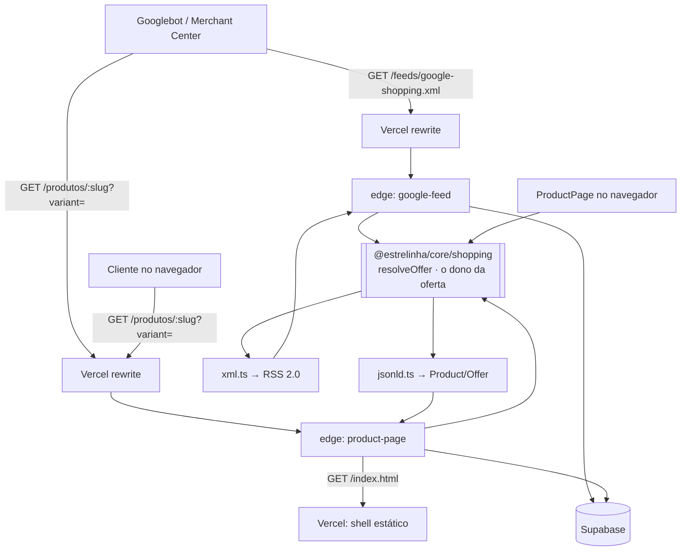

# Google Shopping — Design

**Spec**: `.specs/features/30-google-shopping/spec.md`
**Status**: Draft

---

## Architecture Overview

A feature tem **um dono para "o que é a oferta desta variação"** — `@estrelinha/core/shopping` — e
**duas serializações** dele: XML para o Merchant Center e JSON-LD para a landing page. Essa é a
decisão central, e ela existe por um motivo medido neste projeto várias vezes: quando a mesma regra é
escrita duas vezes em runtimes que não se importam, as duas divergem sem quebrar nada. Aqui a
divergência tem consequência específica e cara — o Google compara o preço do **feed** com o preço da
**página** e reprova o item quando discordam. Duas escritas seriam duas chances de reprovar 3.233
ofertas.

Duas edge functions no Supabase servem as duas pontas, e a Vercel só as expõe sob o domínio da loja
por `rewrites`.



O terceiro consumidor de `core/shopping` é a **própria loja**: `ProductPage` resolve o `?variant=`
pela mesma função de identidade pública que produziu o `offer_id`. Um número, um significado, nos três
lugares.

### Por que edge function do Supabase e não da Vercel

Escolha do usuário (2026-08-16), e coerente com o repositório: as quatro integrações de servidor deste
projeto (`melhor-envio`, `mercado-pago`, `send-email`, `_shared`) já moram em `supabase/functions/`,
com o padrão `index.ts` = wiring e `handlers.ts` = lógica com dependências injetadas (`AD-004`),
testado em `@estrelinha/functions`. Uma quinta função segue o caminho conhecido; uma função da Vercel
inauguraria um segundo lugar de código de servidor, com outro runtime, outro deploy e outro jeito de
testar.

### O shell é buscado, nunca embutido

`product-page` **não** pode carregar uma cópia do `index.html` dentro do bundle da function. O Vite
emite nome de asset com hash a cada build (`index-a1b2c3.js`), e o deploy da Vercel é independente do
`supabase functions deploy`: um shell embutido apontaria para um bundle que não existe mais no
primeiro deploy da loja, e o modo de falhar é **quadro branco** — a página responde 200, o `<script>`
responde 404, e nada no servidor acusa.

Então a function busca `GET {STORE_PUBLIC_URL}/index.html` a cada geração, com cache curto em memória.
Não há laço: o `rewrite` da Vercel intercepta `/produtos/:slug`, e `/index.html` é arquivo real
servido pelo filesystem antes de qualquer rewrite.

---

## Code Reuse Analysis

### Componentes existentes a aproveitar

| Componente | Local | Como usar |
| --- | --- | --- |
| `productPath` | `@estrelinha/core/routes` | Monta o `<g:link>` e o `url` do JSON-LD. **Nunca** concatenar string: seria a quarta cópia da regra de endereçamento (`AD-018`). |
| `findVariant`, `initialSelection` | `apps/store/src/entities/product/lib/variantSelection.ts` | O `?variant=` vira uma `OptionValues` inicial; a seleção padrão continua sendo o recuo. |
| `useProductPurchase` | `apps/store/src/entities/product/model/useProductPurchase.tsx` | Ganha um parâmetro de seleção inicial. Já é o **estado único** das duas superfícies de compra — não duplicar. |
| `sanitizeHtml`, `stripFaqBlock` | `apps/store/src/shared/lib`, `@estrelinha/core/faq/block` | A descrição do feed é a mesma que a loja mostra. `stripFaqBlock` já vive em `core` e roda em dois runtimes — o terceiro (Deno) é de graça. |
| Padrão `index.ts` + `handlers.ts` | `supabase/functions/mercado-pago` | Wiring separado de lógica, dependências injetadas, testado fora do Deno (`AD-004`). |
| `selectAll` (paginação) | `tools/catalog-import/src/db.ts` | O `db.test.ts` do importador já existe **porque** uma leitura de catálogo foi truncada em 1.000 linhas pelo PostgREST. A mesma armadilha, no feed, remove 2.233 ofertas do Google. |
| `store_settings` + `DEFAULT_*` | `packages/supabase/src/types/settings.ts` | O interruptor é mais uma chave, com default no TypeScript **e** na migration, presos por `storeSettingsDefaults.test.ts`. |
| `FormCard`, `AdminTable`, `FormPageHeader` | `apps/backoffice/src/shared/ui` | A tela nova não inventa moldura. |
| `has_role(admin)` nas policies | migrations existentes | A escrita do interruptor é `store_settings`, que já é admin-only. Nada novo de auth. |
| `vercelRedirects.test.ts` | `apps/store/src/shared/lib/__tests__` | Já lê o `vercel.json` do disco. Os `rewrites` novos entram no mesmo guarda. |

### Pontos de integração

| Sistema | Como conecta |
| --- | --- |
| Merchant Center `685367464` | Busca agendada diária sobre `https://umaestrelinha.com.br/feeds/google-shopping.xml`. Criada à mão pela dona, no cutover. |
| Vercel | Dois `rewrites` novos, **antes** do catch-all `/(.*)` → `/index.html`, que é avaliado por ordem. |
| Supabase | Leitura com `anon` (o catálogo é público e a RLS já o expõe); a leitura do interruptor é `store_settings`, também de leitura pública. |
| Importador | Passa a semear `products.brand` a partir de `RawProduct.brand`, só onde a coluna é nula. |

---

## Components

### `@estrelinha/core/shopping` — o dono da oferta

- **Purpose**: responder "o que é a oferta desta variação" uma vez só, para os três consumidores.
- **Location**: `packages/core/src/shopping/`
- **Interfaces**:
  - `publicVariantId(variant): string` — `nuvemshop_id` em decimal, ou o UUID. É o `offer_id` **e** o
    valor do `?variant=`.
  - `publicProductId(product): string` — idem para o `item_group_id`.
  - `feedExclusion(product, variant): FeedExclusion | null` — `null` = entra no feed; senão o motivo
    (`'produto_inativo' | 'variacao_inativa' | 'sem_preco'`). Devolver o **motivo** e não um booleano é
    o que permite a tela contar por motivo (`GSH-22`) sem reimplementar a regra.
  - `offerAvailability(product, variant): 'in_stock' | 'out_of_stock' | 'backorder'`
  - `offerPricing(variant, product): { price: number; salePrice: number | null }` — `salePrice` só
    quando `compare_price > price`.
  - `resolveOffer(product, variant, origin): ShoppingOffer`
  - `renderFeedXml(offers, meta): string` (`xml.ts`) — RSS 2.0, `escapeXml` interno.
  - `productJsonLd(offer): object` (`jsonld.ts`) — `Product` + `Offer`.
- **Dependencies**: `@estrelinha/core/routes` (`productPath`), `@estrelinha/core/faq/block`
  (`stripFaqBlock`). **Nenhuma** — React, Supabase, DOM.
- **Reuses**: o precedente exato é `core/faq/block.ts`: módulo puro porque três pontas em dois
  runtimes o leem. Aqui são três pontas em **três** runtimes (Deno, navegador, Node do teste).

> **Módulo puro, e isso é asserido.** `catalog.test.ts` de `core/home` já varre um módulo inteiro
> recusando import de React ou Supabase, com âncora de contagem. `shopping` ganha o mesmo guarda:
> um `import` de `supabase-js` aqui quebraria o build da edge function só no deploy.

### `supabase/functions/google-feed`

- **Purpose**: servir o RSS que o Merchant Center busca.
- **Location**: `supabase/functions/google-feed/{index.ts,handlers.ts}`
- **Interfaces**:
  - `GET /` → `200 application/xml` | `404` (integração desligada) | `503` (leitura incompleta)
  - `handleFeed(deps): Promise<Response>` — deps: `{ supabase, origin, now }`
- **Dependencies**: `store_settings` (interruptor), `products`, `product_variants`, `categories`
- **Reuses**: `resolveOffer` + `renderFeedXml`; paginação no molde de `selectAll`.
- **Regra que não pode ser afrouxada**: a leitura pede `count=exact` e compara com o número de linhas
  montadas. Divergiu, responde **503 sem corpo**. Um feed com 1.000 de 3.233 ofertas é lido pelo
  Google como "remova 2.233" — silencioso, e só visível no dia seguinte.

### `supabase/functions/product-page`

- **Purpose**: entregar o `index.html` da loja com o JSON-LD já dentro.
- **Location**: `supabase/functions/product-page/{index.ts,handlers.ts}`
- **Interfaces**:
  - `GET /?slug=<slug>&variant=<id>` → `200 text/html`
  - `handleProductPage(deps, url): Promise<Response>` — deps: `{ supabase, fetchShell, origin }`
- **Dependencies**: `STORE_PUBLIC_URL`, `products`, `product_variants`
- **Reuses**: `resolveOffer` + `productJsonLd`; o shell vem da própria loja.
- **Comportamento de recuo**: slug desconhecido, variação desconhecida, ou falha da leitura ⇒
  devolve o **shell intacto**, com 200. A SPA então resolve sozinha — `NotFound` para slug morto,
  seleção padrão para variação inválida. Nunca uma página de erro do servidor no caminho da cliente.

### `apps/store` — o `?variant=` na página

- **Purpose**: abrir a página já na variação anunciada.
- **Location**: `apps/store/src/entities/product/lib/variantSelection.ts`,
  `apps/store/src/entities/product/model/useProductPurchase.tsx`,
  `apps/store/src/pages/ProductPage.tsx`
- **Interfaces**:
  - `findVariantByPublicId(product, id: string | null): ProductVariant | null` — casa por
    `publicVariantId`, o que aceita `nuvemshop_id` **e** UUID sem dois caminhos de código.
  - `useProductPurchase(product, onVariantChange?, initialVariant?)` — o terceiro parâmetro semeia
    `initialSelection`; ausente, tudo segue como hoje.
- **Reuses**: `initialSelection` continua sendo o recuo — o `?variant=` **substitui a semente**, não o
  algoritmo.

### `apps/backoffice` — `/admin/google-shopping`

- **Purpose**: ligar, ensinar o cutover, e dizer o que o feed publica.
- **Location**: `apps/backoffice/src/pages/admin/AdminGoogleShoppingPage.tsx`,
  `apps/backoffice/src/features/google-shopping/`
- **Interfaces**: leitura de `store_settings.google_shopping`; contagem derivada de `feedExclusion`
  sobre o catálogo — **a mesma função do feed**, nunca uma segunda contagem.
- **Onde entra na sidebar**: grupo **`Loja`**, depois de `Menu da loja`. É o que a cliente vê **antes**
  de chegar — mesma família de Home e Menu, que é curadoria de vitrine e não cadastro. Exige atualizar
  `navGroups` **e** a ordem das rotas em `App.tsx`, que `navItems.test.ts` compara lendo o arquivo.
- **Os campos de identificação NÃO ficam aqui**: vão para a aba **SEO** do formulário do produto, num
  card `Google Shopping`. São propriedade do produto, e a aba SEO já é "como este produto é descrito
  para fora". Nenhuma aba nova.

---

## Data Models

### Migration `20260817120000_30-google-shopping.sql`

```sql
alter table public.products
  add column if not exists brand                   text,
  add column if not exists mpn                     text,
  add column if not exists age_group               text,
  add column if not exists gender                  text,
  add column if not exists google_product_category text,
  -- NULL = herda o default de loja. Não é boolean: o terceiro estado é "nunca decidido",
  -- mesmo molde de products.requires_material (22) e engraving_max_chars (22).
  add column if not exists identifier_exists       boolean;

alter table public.products
  add constraint products_age_group_check
  check (age_group is null or age_group in
    ('newborn','infant','toddler','kids','adult'));

alter table public.products
  add constraint products_gender_check
  check (gender is null or gender in ('male','female','unisex'));
```

`check` em statement próprio e **nomeado**: `ADD COLUMN IF NOT EXISTS` com `CHECK` inline é ignorado
em silêncio quando a coluna já existe, e o banco fica sem a constraint sem avisar — a migration
`20260801120000` já registra essa armadilha.

### `store_settings.google_shopping`

```typescript
export interface GoogleShoppingSettings {
  /** Nasce `false`. Ligar é ato explícito da dona, depois do cutover. */
  enabled: boolean
  /** Já esteve ligada alguma vez? É o que faz o desligar pedir confirmação (GSH-16). */
  ever_enabled: boolean
  /** Só exibição na tela — o feed não o usa. Serve para a dona conferir contra o Google. */
  merchant_id: string
  /** Fallback de `google_product_category` quando o produto não define. */
  default_product_category: string
  /** Gravado pela edge function a cada resposta 200. `null` = o Google ainda não buscou. */
  last_fetched_at: string | null
}

export const DEFAULT_GOOGLE_SHOPPING: GoogleShoppingSettings = {
  enabled: false,
  ever_enabled: false,
  merchant_id: '685367464',
  default_product_category: 'Apparel & Accessories > Jewelry',
  last_fetched_at: null,
}
```

**Relacionamentos**: `last_fetched_at` é escrito pela function com service role, e lido pela tela.
É a única escrita de servidor da feature.

### `ShoppingOffer`

```typescript
export interface ShoppingOffer {
  id: string
  itemGroupId: string
  title: string
  description: string
  link: string
  imageLink: string
  additionalImageLinks: string[]
  availability: 'in_stock' | 'out_of_stock' | 'backorder'
  price: number
  salePrice: number | null
  brand: string | null
  mpn: string | null
  ageGroup: string | null
  gender: string | null
  googleProductCategory: string | null
  identifierExists: boolean
  condition: 'new'
}
```

---

## `vercel.json` — a ordem importa

```jsonc
"rewrites": [
  { "source": "/feeds/google-shopping.xml", "destination": "<supabase>/functions/v1/google-feed" },
  { "source": "/produtos/:slug",            "destination": "<supabase>/functions/v1/product-page?slug=:slug" },
  { "source": "/(.*)",                      "destination": "/index.html" }
]
```

O catch-all é o **último**: a Vercel avalia `rewrites` por ordem, e um catch-all na frente engoliria as
duas rotas sem erro nenhum. É exatamente o tipo de defeito que este projeto já decidiu prender por
teste que lê o arquivo do disco — `vercelRedirects.test.ts` ganha a asserção de **ordem**, não só de
presença.

`redirects` roda antes de `rewrites`, então o 301 de `/produto/:slug` → `/produtos/:slug` continua
chegando na rota nova já canonizado.

---

## Error Handling Strategy

| Cenário | Tratamento | Impacto para quem |
| --- | --- | --- |
| Integração desligada | `google-feed` responde **404** | Google: fonte inexistente, inofensivo antes do cutover |
| Leitura do catálogo falha | **503**, sem corpo | Google mantém o último feed bom e tenta de novo. **Nunca** um feed vazio |
| Leitura devolve menos que `count=exact` | **503**, sem corpo | Idem — é o caso do teto de 1.000 do PostgREST |
| Catálogo vazio (0 ofertas elegíveis) | **503** | Feed com zero itens é a instrução "apague tudo" |
| `offer_id` duplicado no documento | falha a geração, **503** com log do id | Id repetido é item descartado em silêncio do lado do Google |
| `STORE_PUBLIC_URL` ausente | **503** | Melhor que emitir `<g:link>` com host errado em 3.233 ofertas |
| `product-page`: shell não carrega | responde **502** e a Vercel serve… nada | ⚠️ ver *Riscos* — é o pior caminho da feature |
| `product-page`: slug desconhecido | shell intacto, **200** | A SPA renderiza `NotFound`, como hoje |
| `product-page`: `?variant=` inválido | shell com JSON-LD do produto, **200** | A página abre na seleção padrão |
| Descrição vazia | usa o nome do produto | `<g:description>` é obrigatório |

---

## Risks & Concerns

| Preocupação | Local | Impacto | Mitigação |
| --- | --- | --- | --- |
| **`product-page` entra no caminho crítico de TODA página de produto**, não só do rastreador | `vercel.json` rewrite | Function fora do ar = página de produto fora do ar, para cliente pagante. Hoje é arquivo estático e não tem como cair | Resposta com `Cache-Control: public, s-maxage=300, stale-while-revalidate=86400`. **Não** condicionar o rewrite ao `User-Agent`: servir HTML diferente para o Googlebot é cloaking. Task própria para medir o comportamento de cache da Vercel em rewrite externo — **não tenho certeza de que a Vercel cacheia proxy para host externo**, e se não cachear, a decisão precisa ser revista antes do cutover |
| Não confirmei que o rastreador do Merchant Center executa JavaScript | — | Se executasse, metade da P1-B seria desnecessária | Irrelevante para a decisão: o JSON-LD servido funciona nos dois mundos, e é o que a Nuvemshop entrega hoje. Custo baixo, incerteza eliminada |
| `pnpm lint` não olha `packages/` (`BL-002`) | `turbo.json` | `core/shopping` nasce **sem ESLint**, como `payment/pricing.ts` | Registrar; não resolver aqui. O typecheck e os testes cobrem |
| Cold start da edge function na primeira visita de produto do dia | `product-page` | ~300ms a mais para uma cliente | Aceito, e o cache de borda o torna raro |
| `product_variants.price_override` continua vivo e depreciado | migration `20260801120000` | Um leitor futuro pode achar que é o preço | `offerPricing` lê `price`, e o teste assere o valor divergindo dos dois campos (a lição do fixture em que os dois candidatos valem o mesmo número) |
| A conta tem **2 itens recusados** cujo motivo não conhecemos | Merchant Center | Podem ser de política do nicho, e nesse caso reaparecem | Fora de escopo declarado. O feed **não muda o texto** enviado, justamente para que uma reprovação nova seja atribuível |
| 191 variações ativas sem `image_url` | banco (medido) | `<g:image_link>` é obrigatório | Recuo para a primeira imagem do produto — medido: **todo** produto tem imagem |
| jsdom não mede layout, e a tela nova é do painel | — | Regressão mobile invisível | O painel não é mobile-first como a loja; ainda assim a tela entra na varredura de `touchTarget` |

---

## Tech Decisions

| Decisão | Escolha | Racional |
| --- | --- | --- |
| Onde mora a regra da oferta | `@estrelinha/core/shopping`, puro | Três consumidores em três runtimes. Duas escritas fariam feed e página divergirem — que é literalmente o que o Merchant Center reprova |
| Runtime das funções | Supabase Edge Functions | Escolha do usuário; é o padrão das outras quatro integrações e reusa `AD-004` |
| Shell do `index.html` | buscado da loja a cada geração, com cache curto | Embutir congela o hash dos assets e produz quadro branco no primeiro deploy seguinte |
| Identidade pública da variação | `nuvemshop_id`, com UUID de recuo | Medido contra o Merchant Center. O mesmo valor serve de `offer_id` e de `?variant=` — um número, um significado |
| `sale_price` | só de `compare_price` | Pix e promoção progressiva são condicionais; anunciá-los quebraria a igualdade feed ↔ página |
| Feed sem `g:shipping` | conta já configurada | Frete no feed seria um segundo dono de uma regra que o Merchant Center já tem |
| `identifier_exists` como `boolean` anulável | `null` = herda | Terceiro estado "nunca decidido", mesmo molde de `requires_material` |
| Onde os campos de produto aparecem | card na aba **SEO** | Já é a aba de "como este produto é descrito para fora". Aba nova custaria um teste de abas e não diria nada a mais |
| Onde a tela entra na sidebar | grupo `Loja`, após `Menu da loja` | É vitrine, não cadastro |

> **Candidata a decisão de projeto (`AD-020`):** *"Superfície que o Google lê é servida, não
> renderizada no cliente — e o preço que ela declara vem da mesma função que o feed."* Fica registrada
> aqui e é promovida a `STATE.md` no fecho da feature, junto do resultado medido.

---

## Test Coverage Matrix

| Requisito | Como se prova | Onde |
| --- | --- | --- |
| GSH-01..03 | a oferta `1259936246` sai com `item_group_id` `281745761` e link com o mesmo id | `core/shopping/__tests__/offer.test.ts` |
| GSH-04 | cada motivo de exclusão tem um caso, e a soma fecha com o total | idem |
| GSH-05 | mock devolve 1.000 de 3.233 ⇒ **503**, e o corpo não é XML | `functions/__tests__/googleFeed.test.ts` |
| GSH-06..08 | `compare_price > price` produz o par; `price_override` divergente é ignorado | `offer.test.ts` |
| GSH-09 | o documento passa por um parser XML e valida o namespace | `xml.test.ts` |
| GSH-10..11 | `?variant=` por `nuvemshop_id`, por UUID, desconhecido, de outro produto, inativo | `ProductPage.test.tsx` |
| GSH-12..13 | **o guarda central**: para a mesma variação, `renderFeedXml` e `productJsonLd` declaram o mesmo preço e a mesma disponibilidade | `shoppingParity.test.ts` |
| GSH-14 | canônica sem query mesmo com `?variant=` | `useCanonical.test.tsx` |
| GSH-15..18 | 404 desligado / 200 ligado; confirmação ao desligar; ordem do cutover na tela | `AdminGoogleShoppingPage.test.tsx` |
| GSH-19..20 | tag omitida quando vazia; vocabulário recusado no banco | `googleShoppingSchema.test.ts` (lê o `.sql`) |
| GSH-21 | segunda execução do importador não sobrescreve `brand` curado | `catalog-import` |
| GSH-22 | contagem por motivo usa `feedExclusion`, não uma segunda regra | `AdminGoogleShoppingPage.test.tsx` |
| ordem do `vercel.json` | catch-all é o último elemento do array | `vercelRedirects.test.ts` |
| pureza de `core/shopping` | varredura com âncora de contagem recusa React/Supabase | `catalog.test.ts` do escopo novo |

**`shoppingParity.test.ts` é o guarda que justifica a arquitetura.** Se ele puder ser satisfeito por
duas implementações separadas, a arquitetura falhou.
