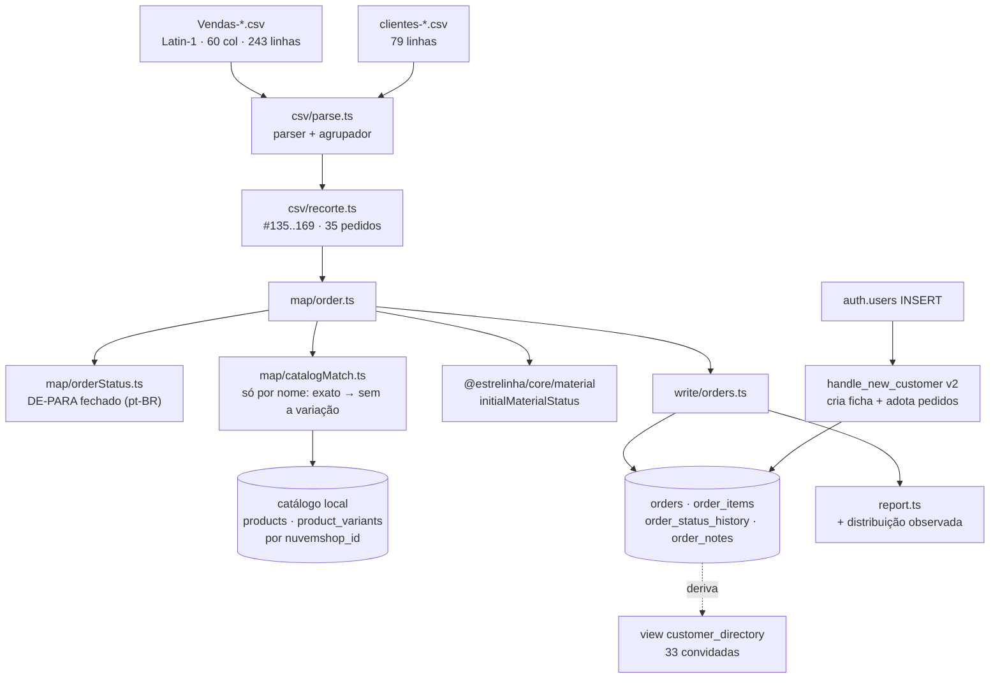

# 35 · Clientes e pedidos da Nuvemshop — Design

**Spec**: [`spec.md`](spec.md) · **Medição**: [`medicao.md`](medicao.md)
**Status**: **Done** — 2026-08-30. Ver [`validation.md`](validation.md).
**Revisado em 2026-08-30**: fonte passou de API para **CSV**.
**Decisões ativas conferidas**: `AD-012` (tipo escrito à mão é afirmação), `AD-017` (migration
aplicada é imutável — tudo aqui é migration nova), `AD-023` (a listagem de clientes é
`customer_directory`), `AD-024` (contador e filtro são o mesmo predicado).

---

## As duas decisões que moldam tudo

### 1 · A pessoa é derivada do pedido, não escrita

Três abordagens; a primeira vence por `AD-023`, que já está `active`.

| Abordagem | Por que ganha / perde |
| --- | --- |
| **A · Derivar da linha do pedido** ⭐ | **Escolhida.** É o mecanismo que `AD-023` construiu: `customer_directory` deriva a convidada por `md5(lower(email))::uuid`. Zero linha escrita para quem não pediu cadastro, `has_account = false` é verdade, e o reencontro vira consequência da view. Medido: os 33 e-mails do recorte **já estão todos** no arquivo de vendas — o CSV de clientes não acrescenta nada obrigatório |
| B · Importar o CSV de clientes para `public.customers` | **Perde.** A view marca **toda** linha de `customers` como `has_account = true` — 33 pessoas que nunca criaram conta apareceriam como cadastradas |
| C · Tabela `imported_customers` | **Perde.** Terceiro dono do conceito "pessoa" — defeito 01 com nome novo |

O CSV de clientes entra como **conferência** (provar que os 33 fecham — hoje fecham, 0 ausentes) e
como fonte da seção `clientes sem pedido` do relatório.

### 2 · Item errado é pior que item sem link

O CSV **não tem `product_id`** — só nome e SKU. O desenho original casava por nome, nome-base e
**SKU único no catálogo local**. Rodar contra o banco real derrubou o terceiro passo:

> **A unicidade do SKU no catálogo local é FABRICADA.** `dedupeSkus` (feature 21) nulifica o SKU de
> todas as variações menos a primeira, porque `product_variants.sku` é `UNIQUE` global. `BA-002`
> aparece **316 vezes em 68 produtos** na origem e sobrevive numa variação **arbitrária**. Perguntar
> ao catálogo "este SKU é único?" devolve `sim` para um código que não identifica nada — e a
> feature 21 já tinha escrito que *"nesta loja o SKU é um código de material, não um identificador
> de linha vendável"*.

Medido nos 35 pedidos: dos 20 vínculos que só o SKU produzia, pelo menos um está claramente errado —
`NS-162` ligava "Corrente **Veneziana** de Prata 925 (45cm)" a "Corrente **Singapura** em Prata 925".

**Regra final: casa por nome exato → nome sem a variação. E nada mais.** A taxa cai de 74,6% para
**40,7%**, e nenhum item aponta para o produto errado. O snapshot (nome, preço, quantidade) está
certo dos dois jeitos e é o que a tela mostra; o vínculo é conveniência. `suggestBySku` devolve o
candidato para o **relatório**, marcado `(NÃO aplicado)` — a informação não se perde, só não vira
dado.

---

## Architecture Overview



**A fase nova é a `4`, depois das imagens** — por dependência: o casamento de item precisa de
`products.nuvemshop_id`, que a fase 2 grava. `--stop-after` ganha o valor `pedidos`.

**Nenhuma chamada de rede no caminho de pedidos.** A fase lê dois arquivos do disco e o catálogo do
banco local. Isso apaga uma classe inteira de falha que o plano anterior tinha.

---

## Code Reuse Analysis

| Componente | Onde | Como |
| --- | --- | --- |
| `selectAll` | `src/write/db.ts` | Toda leitura de estado atual — ler os 692 produtos sem paginar seria truncado em 1.000 pelo PostgREST na primeira loja que crescer |
| `createReport` / `Balance` | `src/report.ts` | `Entity` ganha `pedidos` e `itens`; o `balance` já produz exit ≠ 0 |
| `initialMaterialStatus` | `@estrelinha/core/material` | **A mesma função do checkout.** Dono único de "este pedido entra na fila?" |
| `requiresMaterial` | idem | Lê a curadoria de `products` para decidir o item |
| `PaymentStatus` / `OrderStatus` | `@estrelinha/supabase/types` | Tipam o **destino** do de-para: estado fora do `CHECK` não compila |
| `customer_directory` | migration da `34` | Deriva a convidada. Ganha `phone`/`cpf`; a semântica não muda |
| `chargeMaterialUrl` | `features/order-list/model/chargeMaterial.ts` | Passa a receber telefone real |
| `escapeSearchTerm` / `pageRange` | `@estrelinha/core/paging` | Nada a fazer — a listagem já funciona; ela só vê linhas a mais |
| `createNuvemshopClient` | `src/nuvemshop/client.ts` | **Intocado.** Continua servindo as fases 1–3 (catálogo) |

**Integração com `/admin/pedidos` (feature 34): nenhuma alteração de código.** `ESP-17` exige que o
importado passe pelos mesmos predicados. A tela só vê linhas a mais.

---

## Components

### `csv/parse.ts` — o parser, e o agrupador

- **Purpose**: transformar bytes em pedidos, com as duas armadilhas do arquivo resolvidas num lugar
  só.
- **Interfaces** (nomes como implementados):
  - `parseCsv(texto: string, delimitador?: string): string[][]` — RFC 4180 com aspas escapadas.
  - `decodificar(bytes: Buffer): string` — Latin-1.
  - `lerVendas(bytes: Buffer): PedidoVenda[]` · `lerClientes(bytes: Buffer): ClienteVenda[]`
  - `agruparPedidos(linhas: LinhaVenda[]): PedidoVenda[]` — a linha com `Data` abre o pedido; as
    seguintes com o mesmo `Número do Pedido` são itens dele.
  - `desescaparPlanilha(valor: string): string | null` — `="AD779152389BR"` → `AD779152389BR`,
    `=""` → `null`.
  - `parseBrDate(valor: string): string | null` — `dd/mm/yyyy hh:mm:ss` → ISO com offset `-03:00`.
  - `texto` · `parseDecimal` · `parseInteiro` · `somenteDigitos`

```typescript
// DUAS armadilhas medidas no arquivo real — e nenhuma delas grita:
//
// 1. Latin-1, não UTF-8. Medido nos bytes: o arquivo abre em `22 4e fa` (`"Núm`) e `Não está` é
//    `4e e3 6f 20 65 73 74 e1`. Nenhum desses bytes é UTF-8 válido sozinho, então a leitura ingênua
//    troca cada um por U+FFFD: a coluna vira `N�mero do Pedido`, a busca por `Número do Pedido`
//    falha, TODO pedido lê número vazio, e os 70 viram um grupo só.
// 2. O pedido são N linhas. Ler linha a linha dá 243 "pedidos" em vez de 70.
//
// NÃO há corte de BOM: decodificando Latin-1 cada byte vira U+0000..U+00FF, então U+FEFF é
// inalcançável por construção. Quem protege contra arquivo em outro encoding é a conferência de
// cabeçalho, que falha nomeando a coluna — e o nome quebrado aponta direto para a causa.
export const decodificar = (bytes: Buffer): string => bytes.toString('latin1')
```

### `csv/recorte.ts` — o corte dos dois negócios

- **Purpose**: manter só `#135..169`, e **dizer** o que ficou de fora.
- **Interfaces**: `PRIMEIRO_PEDIDO = 135` · `dentroDoRecorte(pedido): boolean` ·
  `aplicarRecorte(pedidos): { dentro, fora }`
- **Sem teto**: a faixa é `>= 135` e não `135..169`. Um `max` deixaria pedidos novos de fora em
  silêncio numa reexportação, e o import passaria verde espelhando um recorte velho.
- **Por que faixa numérica e não heurística de nome**: o corte foi medido e é exato — `#134` é a
  última linha da loja anterior, `#135` a primeira da Uma Estrelinha, e as duas bases de e-mail não
  se tocam. Uma heurística por nome de produto erra em **4** pedidos (`#108`, `#114`, `#126`, `#133`
  têm "pingente"/"colar" e são de artigo religioso). Constante explícita, com o número medido no
  comentário, é honesta; regex sobre nome de produto seria adivinhação disfarçada de regra.

### `map/orderStatus.ts` — o de-para, fechado e auditável

- **Interfaces**: `mapPaymentStatus(row): PaymentStatus` · `mapOrderStatus(row): OrderStatus` ·
  `describeTriple(row): string`
- **Dependencies**: só `@estrelinha/supabase/types`. Regra pura.

```typescript
// Record TOTAL sobre o vocabulário da origem: valor novo no CSV sem destino aqui NÃO COMPILA.
// O valor é PaymentStatus, fechado pelo CHECK do banco: destino inventado também não compila.
// As duas pontas verificadas pelo tipo, nenhuma por convenção.
const PAGAMENTO: Record<StatusPagamento, PaymentStatus | 'ambiguo'> = {
  Confirmado: 'approved',
  Pendente:   'pending',
  Recusado:   'ambiguo',   // resolvido abaixo — o próprio arquivo desfaz
}

/**
 * `Recusado` cobre DUAS coisas, e juntá-las apagaria a diferença entre "ninguém pagou o PIX" e
 * "o cartão foi negado" — que pedem ação diferente da Adri.
 *
 * Medido: 4 PIX (com `Vencimento`, sem `Data de pagamento`) e 2 cartão (com `Parcelas`, sem
 * `Vencimento`). `rejected` não é produzido pelo recorte de hoje, e fica na tabela mesmo assim:
 * o mapeamento tem de continuar certo se o arquivo for reexportado.
 */
const recusado = (row: RawOrder): PaymentStatus =>
  row.vencimentoPagamento !== null && row.dataPagamento === null ? 'expired' : 'rejected'
```

### `map/catalogMatch.ts` — o casamento, e a recusa de casar errado

- **Interfaces**:
  - `buildIndex(produtos, variacoes): CatalogIndex`
  - `matchItem(nome: string, sku: string | null, index: CatalogIndex): Match | null`
  - `stripVariant(nome: string): string | null` — recorte **balanceado** do grupo final.
- **Reuses**: nada — é regra nova e pura.

```typescript
/**
 * Remove o último grupo de parênteses BALANCEADO. O recorte ingênuo (primeiro `(`) erra em
 * `(Folheado a ouro (Prata 925))`, que é o arranjo mais comum do catálogo — medido: a taxa de
 * casamento cai de 50,8% para 40,7%.
 */
export const stripVariant = (nome: string): string | null => {
  const s = nome.trimEnd()
  if (!s.endsWith(')')) return null
  let profundidade = 0
  for (let i = s.length - 1; i >= 0; i -= 1) {
    if (s[i] === ')') profundidade += 1
    else if (s[i] === '(') {
      profundidade -= 1
      if (profundidade === 0) return s.slice(0, i).trimEnd()
    }
  }
  return null
}
```

### `map/order.ts` — o snapshot, e os dois cortes de material

- **Interfaces**: `mapOrder(raw, index): MappedOrder`
- **Reuses**: `initialMaterialStatus`, `mapOrderStatus`, `matchItem`.

```typescript
// A máquina de material não tem estado FINAL, e o import não observa o estado — infere dos itens.
// Sem os DOIS cortes abaixo a fila da Adri nasceria com 8 pedidos; com eles, nasce com 4 — os 4
// que de fato esperam envelope. Medido.
//
//   corte 1 · terminal   — pedido entregue em 2025 ficaria em `aguardando_material` PARA SEMPRE;
//   corte 2 · pagamento  — PIX expirado nunca virou dinheiro, e cobrar material de quem não pagou
//                          é fila falsa. Este corte NÃO existia no plano da API: apareceu ao
//                          aplicar o de-para no dado real.
const TERMINAIS: readonly OrderStatus[] = ['shipped', 'delivered', 'cancelled']
const material =
  TERMINAIS.includes(status) || payment !== 'approved'
    ? 'nao_aplicavel'
    : initialMaterialStatus(itens)
```

### `write/orders.ts` — a escrita idempotente

- **Interfaces**: `writeOrders(mapped, deps & { ressincronizarEstado, reimportarItens })`

```typescript
/** Escritas SEMPRE. Fato da origem, que a Adri não edita no painel. */
const COLUNAS_SNAPSHOT = [
  'order_number', 'customer_name', 'customer_email', 'customer_phone', 'customer_document',
  'subtotal', 'discount', 'shipping_cost', 'total', 'payment_method', 'shipping_method',
  'address_street', 'address_number', 'address_neighborhood', 'address_complement',
  'address_city', 'address_state', 'address_zip', 'coupon_code', 'notes', 'created_at',
  'nuvemshop_id', 'nuvemshop_status', 'nuvemshop_payment_status', 'nuvemshop_shipping_status',
  'nuvemshop_synced_at',
] as const

/**
 * Escritas SÓ NO INSERT — ou no UPDATE com `--ressincronizar-estado`.
 *
 * Depois do cutover o DONO destas colunas é o painel, não o arquivo. Sem esta separação a segunda
 * execução arrasta de volta um pedido que a Adri já marcou como enviado — e não quebra nada: o
 * banco aceita, a tela mostra, e o trabalho de um dia some sem mensagem nenhuma.
 */
const COLUNAS_OPERACIONAIS = [
  'status', 'payment_status', 'material_status', 'material_tracking_code',
  'tracking_code', 'shipping_carrier', 'cancel_reason', 'paid_at',
] as const
```

**Itens são imutáveis.** O CSV não tem id de item, então não há chave de update honesta: casar por
posição ou por nome erra em silêncio numa reexportação. Pedido que já existe **não tem itens
tocados**; `--reimportar-itens` apaga e regrava o conjunto inteiro daquele pedido.

### Migration `20260830120000_35-clientes-e-pedidos-nuvemshop.sql`

Quatro blocos, migration nova (`AD-017`):

1. **Proveniência e idempotência**: `orders.nuvemshop_id bigint` + índice único **simples** (em
   Postgres `NULL` não colide com `NULL`, então pedido nascido aqui convive sem predicado), mais
   `nuvemshop_status`, `nuvemshop_payment_status`, `nuvemshop_shipping_status` (**texto em
   português, como veio**) e `nuvemshop_synced_at`.
2. **Contato no pedido**: `customer_phone text`, `customer_document text`.
3. **`customer_directory` v2**: a parte B agrega `phone` e `cpf` do pedido mais recente que os tenha.
   ⚠️ `customer_list` e `customer_stats` **dependem** desta view — `create or replace` não aceita
   mudança de colunas, então as três caem e sobem **na ordem**, dentro da transação.
4. **`handle_new_customer` v2**: adota os pedidos órfãos do mesmo e-mail.

```sql
-- Adoção por e-mail. `security definer` já existia — sem ele o UPDATE bate na RLS de `orders`,
-- que não tem policy de UPDATE para cliente (PAY-10), e falha calado.
-- `lower()` nos dois lados: o arquivo traz `VROSA_RJ@HOTMAIL.COM` e `LAINE.MCOELHO@HOTMAIL.COM`
-- em caixa alta — comparar cru deixaria a mesma pessoa como duas.
update public.orders o
   set customer_id = v_customer_id
 where o.customer_id is null
   and lower(o.customer_email) = lower(new.email);
```

### Guarda `provenanceNotRead.test.ts`

Varre `apps/**` e falha se alguma tela ler `nuvemshop_status`, `nuvemshop_payment_status` ou
`nuvemshop_shipping_status`. **Âncora de contagem obrigatória** — sem ela um caminho errado varre
zero arquivo e o teste vira no-op verde. As colunas cruas são proveniência; no dia em que uma tela
ler `nuvemshop_payment_status` para pintar um selo, existem duas respostas para "este pedido foi
pago?" — e elas divergem no primeiro `Recusado`.

---

## Error Handling Strategy

| Cenário | Tratamento | O que quem roda vê |
| --- | --- | --- |
| Cabeçalho diferente do esperado | Falha **antes de mapear**, nomeando a coluna ausente | "coluna `Status do Envio` não existe — o arquivo tem 59 colunas, esperadas 60" |
| Encoding lido errado | O parser fixa Latin-1; um `�` em qualquer campo de status **aborta** nomeando o encoding | Erro que aponta para a causa, não para o vocabulário |
| Valor de status fora do vocabulário | `UnknownVocabularyError` → relatório parcial → exit ≠ 0 | Nomeia valor e `Número do Pedido` |
| `Número do Pedido` sem linha-cabeça | Aborta | Nomeia o número |
| Item sem produto local | Snapshot preservado, `variant_id = null`, entra em `itens órfãos` | Contagem + taxa no relatório |
| Taxa de casamento < 50% | **Falha o gate** | "casamento em 12% — o catálogo local está vazio?" |
| Catálogo local vazio | Aviso em log **antes** da fase | "0 produtos locais — rode as fases 1–3 antes" |
| `order_number` duplicado | Violação do índice único sobe como `DbError` | Nomeia os dois |
| Soma dos itens ≠ `subtotal` | **Não aborta** — entra em `totais que não fecham` | Lista para conferência (hoje: 0) |

---

## Risks & Concerns

| Concern | Onde | Impacto | Mitigação |
| --- | --- | --- | --- |
| **O CSV não tem id de produto nem de item** | fonte | Metade do histórico fica sem vínculo; e casar por SKU ambíguo ligaria 23,7% ao produto errado | `ESP-31`: ordem de casamento fixa, ambíguo é órfão, piso de 50% no gate |
| Encoding Latin-1 sem declaração | fonte | Lido como UTF-8, **nenhuma** entrada do de-para casa e a mensagem culpa o vocabulário | Decodificação fixada no parser + guarda de `�` |
| Recorte por faixa numérica é um literal | `csv/recorte.ts` | Um arquivo reexportado com pedidos novos (`#170+`) ficaria de fora em silêncio | `max` é **exclusivo por cima**: aceita `>= 135` e reporta quantos passaram. O teste assere que `#170` entraria |
| `customer_list`/`customer_stats` dependem de `customer_directory` | migration da `34` | Drop na ordem errada quebra a tela de clientes | Três views caem e sobem na ordem, em transação; probe SQL nas três |
| Trigger de `auth` alterado | `handle_new_customer` | Erro ali derruba **todo cadastro novo** | `UPDATE` aditivo com `where customer_id is null`; o `insert` existente não muda; teste de integração |
| Fila de material inferida | `material_status` | Fila falsa faz a Adri esperar envelope que não vem | Dois cortes (`ESP-19`) + nota declarando a inferência + lista nominal de 4 |
| `useOrdersByEmail` é **código morto** | `apps/store/src/entities/order/api/useOrders.ts:40` | Sem chamador. Se alguém o ligar, o histórico importado vaza por e-mail **sem autenticação** | Não é tocado; registrar em `BACKLOG` como remoção |
| `order_status_history` tem policy `Allow all` para `public` | migration `20260415160758` | Qualquer um lê o histórico de qualquer pedido | Pré-existente, fora do escopo; registrar em `BACKLOG` |
| Catálogo local **vazio hoje** (0 produtos) | banco local | Rodar a fase agora dá 100% de órfãos | Aviso em log + o piso de 50% reprova o gate |
| Os CSV carregam **PII real** (CPF, telefone, endereço de 33 pessoas) | `~/Downloads` | Fixture de teste com dado real entra no git para sempre | A fixture é **sintética**, derivada da forma e não do conteúdo; um teste assere que nenhum CPF do arquivo real aparece em `src/__fixtures__/` |

---

## Tech Decisions

| Decisão | Escolha | Razão |
| --- | --- | --- |
| Fonte | **CSV**, não API | Plano Essencial não dá `read_orders`/`read_customers`. Some o bloqueio externo |
| Recorte | `#135..169`, faixa explícita | Corte medido e exato; heurística por nome erra 4 pedidos |
| Onde mora a cliente | Derivada do pedido | `AD-023` |
| Onde mora o de-para | `tools/catalog-import/src/map/orderStatus.ts` | Um consumidor só, e nenhum segundo previsível |
| Forma do de-para | `Record<VocabulárioPtBr, TipoDestino>` | Valor novo na origem não compila; destino fora do `CHECK` também não |
| `Recusado` | Desambiguado por `Vencimento` × `Parcelas` | O arquivo desfaz a própria ambiguidade; juntar apagaria duas ações diferentes |
| Vocabulário desconhecido | **Aborta** | Padrão silencioso num eixo de dinheiro é como se separa pedido não pago |
| `separating` | Nunca produzido | Nenhuma das quatro formas de `Status do Envio` significa "montando agora" |
| Casamento de item | **só por nome**: exato → sem a variação | A unicidade do SKU no catálogo local é fabricada por `dedupeSkus`; medido, ligava "Veneziana" a "Singapura" |
| Itens | **Imutáveis** | Sem id na origem, toda chave de update erra em silêncio |
| Prefixo de `order_number` | `NS-<Número do Pedido>` | Não colide com `NP-`; proveniência visível; a busca é `ilike %termo%`, então `165` ainda acha `NS-165` |
| Histórico sintetizado | Só transições **datadas** | `Data`→`pending`, `Data de pagamento`→`paid`, `Data de envío`→`shipped`, `Data e hora do cancelamento`→`cancelled`. O CSV **data o envio** — a API não datava |
| Propriedade pós-cutover | Operacionais só no INSERT | Depois do cutover o dono é o painel |

### Decisões que nasceram na implementação, não no desenho

| Decisão | Escolha | O que a obrigou |
| --- | --- | --- |
| Corte de BOM | **Removido** | Medido nos bytes: o arquivo não tem BOM, e decodificando Latin-1 cada byte vira `U+0000..U+00FF` — `U+FEFF` é **inalcançável por construção**. O `if` seria código morto fingindo proteção. Quem protege é a conferência de cabeçalho, que falha nomeando a coluna |
| Ordem do histórico | **Lógica**, com cada linha empurrada para a frente | `Data de pagamento` e `Data de envío` vêm **sem hora**. O `#138` foi criado às 22:16 e pago no mesmo dia: por timestamp, o pagamento (00:00) precede a criação, e o painel — que funde os fios por tempo — mostraria "pago" acima de "recebido". Achado por um teste que falhou com razão |
| Default de `--stop-after` | `imagens` → **`pedidos`** | Mantido em `imagens`, a fase 4 nunca rodaria sem alguém lembrar da flag — e "não rodou" é indistinguível de "não achou nada" |
| `--somente-pedidos` | **Acrescentada** | O `--only` genérico foi rejeitado porque as fases 1–3 passam resultado em memória umas às outras. **A fase 4 é a única que lê seu insumo do BANCO**, então é a única que pode rodar sozinha sem fingir independência. Sem ela, reimportar pedidos custaria 3.660 uploads de imagem — e a razão de re-execução é assimétrica: catálogo muda raramente, pedidos mudam a cada export |
| Ordem de execução das tasks | T06 **antes** da T05 | `mapOrder` chama `matchItem`. A `tasks.md` listou T05 → T06, e a dependência é a inversa |
| Guarda de PII | Prova a **presença** de formato sintético, não a ausência de dado real | Ver `SPEC_DEVIATION` em `csv/__tests__/fixtureSintetica.test.ts`: comparar contra os CPFs reais exigiria tê-los no repositório — cometendo o próprio problema — e o arquivo real mora fora do git, então o teste passaria em verde em qualquer máquina que não o tivesse |

> **Candidata a `AD-025`**: *"Dado importado de fonte externa guarda o valor cru numa coluna de
> proveniência que nenhuma tela lê; a coluna derivada é a única verdade da aplicação."* Vale para
> qualquer import futuro, e é o que impede o de-para de virar um segundo dono.

> **Candidata a `AD-026`**: *"Vínculo de chave estrangeira derivado por heurística só é gravado
> quando a heurística é inequívoca; ambiguidade vira ausência de vínculo, nunca escolha."* Nasceu da
> medição dos 61 SKUs ambíguos, e vale para qualquer casamento por nome ou código.

---

## Baselines a atualizar no fecho

| Medida | Baseline hoje | Onde |
| --- | --- | --- |
| Testes | 5807 em 318 arquivos | `CLAUDE.md` — soma em `catalog-import`, `backoffice` e `store` |
| Lint | 27 erros / 5 warnings | `CLAUDE.md` |
| Tipos | 0 · 0 · 0 | `catalog-import` tem tsconfig próprio |
| Guardas | tabela do `CLAUDE.md` | ganha `provenanceNotRead.test.ts` e os guardas de CSV |
