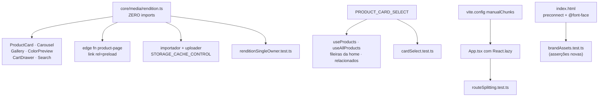

# Performance da loja no celular — Design

**Spec**: `.specs/features/38-performance-mobile/spec.md`
**Context**: `.specs/features/38-performance-mobile/context.md`
**Status**: Draft

---

## Architecture Overview

Três frentes independentes, que podem fechar em qualquer ordem. A única peça compartilhada é o
módulo novo `@estrelinha/core/media/rendition` — o dono único de "como se pede uma imagem".



**A regra que organiza tudo**: cada peça nova ganha um guarda que lê o fonte do disco, com âncora de
contagem — o molde de `freeShippingSingleOwner.test.ts`. Nas três frentes o modo de falha é o mesmo
do "defeito 01": a regressão não quebra build, `tsc` nem teste de componente.

---

## Approach Exploration

### A escolha estrutural: onde mora o helper de imagem

**Recomendado — arquivo próprio em `core/media`, sem import nenhum.**

O `core/media/index.ts` de hoje faz `import type { ProductImage, ImageSource } from
'@estrelinha/supabase/types'`. Isso é inofensivo no Vite e **fatal no Deno**: o `CLAUDE.md` registra,
medido na feature `33`, que o Deno resolve o grafo de **tipos** e um `import type` de pacote com
alias derruba o worker com `Failed resolving types` **antes da primeira linha rodar**. Como a edge
function `product-page` precisa da mesma função para montar o `preload` (`PRF-06`), o módulo novo tem
de ser alcançável por caminho relativo com `.ts` explícito e **sem nenhum import**.

| Alternativa | Por que não |
| --- | --- |
| Acrescentar as funções ao `core/media/index.ts` existente | A edge function passaria pelo barrel e morreria no `import type` de `@estrelinha/supabase/types`. É exatamente a armadilha da `33`, e ela já custou uma feature |
| Duplicar a montagem da URL na edge function | Dois donos da mesma regra, com um deles fora do alcance do guarda. O "defeito 01" na peça central desta feature |
| Um pacote novo `@estrelinha/image` | Cerimônia sem ganho: são ~60 linhas puras, e `core/media` já é o dono do assunto "imagem de produto" |

### A escolha de escopo: quantas superfícies recebem `srcset`

**Recomendado — as oito superfícies de listagem e a galeria; a lupa fica com o original.**

Não é "todo `` da loja". `BrandSvg`, os ícones e as fotos da página Sobre são ativos locais
servidos por `/assets` com `immutable` — passar por `render/image` custaria uma transformação
cobrada por nada.

---

## Code Reuse Analysis

### Existing Components to Leverage

| Componente | Local | Como usar |
| --- | --- | --- |
| `normalizeImages` / `primaryImage` | `packages/core/src/media/index.ts` | Vizinhos do módulo novo. Continuam donos de "o que é uma imagem"; o módulo novo é dono de "como se pede uma imagem" |
| `freeShippingSingleOwner.test.ts` | store `shared/lib/__tests__` | **Molde literal** do guarda `PRF-15`: escopo escrito à mão, allowlist curta, âncora dupla, remoção de comentário com CRLF normalizado primeiro |
| `reservedSlugs.test.ts` · `sitemapRoutes.test.ts` | store `app/__tests__` | Molde do guarda `PRF-16`: lê `App.tsx` do disco, bidirecional |
| `PRODUCT_SELECT` | `entities/product/lib/mapProduct.ts` | O select enxuto nasce ao lado, com a mesma convenção de embed aliased |
| `mapDbToProduct` | idem | **Não muda.** O select enxuto omite colunas; o mapper já coalesce todas elas |
| `createShellCache` · `injectIntoHead` | `supabase/functions/product-page/handlers.ts` | O `preload` entra pelo `injectIntoHead` que já existe, junto do JSON-LD |
| Cache em disco do importador | `tools/catalog-import/src/write/cache.ts` | Os 410 MB já baixados são a fonte do passe de `cacheControl` — sem tocar o CDN da Nuvemshop |
| `useInfiniteWindow` | store `shared/lib` | **Intocado.** A janela continua no cliente, por decisão do `context.md` |

### Integration Points

| Sistema | Integração |
| --- | --- |
| Supabase Storage | Leitura por URL pública; o caminho `/object/public/` vira `/render/image/public/` |
| Edge function `product-page` | Importa `rendition.ts` por caminho relativo com extensão |
| Vercel | O `vercel.json` já serve `/assets` com `immutable`; as fontes entram lá sem mudança de config |
| React Query | Só o `defaultOptions` do `QueryClient` muda |

---

## Components

### `renditionUrl` — o dono único da URL de imagem

- **Purpose**: transformar a URL pública de um objeto do Storage na URL da rendição do tamanho pedido.
- **Location**: `packages/core/src/media/rendition.ts` — **arquivo sem nenhum `import`**, nem de tipo.
- **Reexport**: `packages/core/src/media/index.ts` acrescenta `export * from './rendition.ts'`
  (com extensão, pela regra da `33`); a edge function importa
  `../../../packages/core/src/media/rendition.ts` **direto**, nunca pelo barrel.

```typescript
/** As três larguras. Uma escrita só, lida pelo srcset e pelo guarda. */
export const RENDITION_WIDTHS = [360, 480, 720] as const

/** Medido: 75 entrega 12,7 KB contra 113,9 KB do original, sem perda visível em foto de joia. */
export const RENDITION_QUALITY = 75

/** Limites do Supabase. Fora deles a resposta é erro, não foto. */
export const RENDITION_MIN_WIDTH = 1
export const RENDITION_MAX_WIDTH = 2500

/** Um ano. O literal '3600' está hoje escrito em dois workspaces — este é o fim disso. */
export const STORAGE_CACHE_CONTROL = '31536000'

/** O segmento que identifica um objeto público do Storage. */
const OBJECT_SEGMENT = '/storage/v1/object/public/'
const RENDER_SEGMENT = '/storage/v1/render/image/public/'

/**
 * A URL da rendição. Entrada que não é objeto público do Storage volta INALTERADA — banner de
 * campanha em host externo, ativo local de `/assets`, string vazia de produto sem foto.
 */
export const renditionUrl = (url: string, width: number): string

/** `"…360.webp 360w, …480.webp 480w, …720.webp 720w"`. `''` quando a URL não é transformável. */
export const renditionSrcSet = (url: string, widths?: readonly number[]): string
```

- **Dependencies**: nenhuma.
- **Reuses**: nada — é folha de propósito.

### `imagePriority` — o dono único da prioridade do LCP

- **Purpose**: dizer, pelo índice na lista, se aquela imagem é candidata a LCP.
- **Location**: `packages/core/src/media/rendition.ts` (mesmo módulo: o assunto é "como se pede uma
  imagem", e prioridade é parte do pedido).

```typescript
/** Quantos cards da primeira leva nascem ansiosos. Seis cobre 3 linhas de 2 colunas em 390px. */
export const EAGER_IMAGE_COUNT = 6

export interface ImagePriority {
  loading: 'eager' | 'lazy'
  /** Só o primeiro. Mais de um `high` dilui a dica e o navegador ignora. */
  fetchPriority?: 'high'
  /** `false` para os primeiros: nem Framer nem `opacity-0` podem escondê-los do medidor. */
  animateIn: boolean
}

export const imagePriority = (index: number): ImagePriority
```

- **Por que uma função e não uma comparação literal**: `PRF-03` AC 4. A régua `index < 6` repetida em
  seis superfícies é o "defeito 01" outra vez — a sétima superfície nasce sem ela, e nada acusa.

### `PRODUCT_CARD_SELECT` — a consulta da listagem

- **Purpose**: trazer só as colunas que a listagem desenha.
- **Location**: `apps/store/src/entities/product/lib/mapProduct.ts`, ao lado do `PRODUCT_SELECT`.

O que **sai** (medido no payload de 147 produtos, 1.220.067 bytes crus):

| Coluna | Bytes | Por que sai |
| --- | --- | --- |
| `product_variants(*)` → lista explícita | ~200.000 de 506.566 | `created_at`, `product_id`, `nuvemshop_id`, `weight_kg` e `sku` não são lidos por `normalizeVariants` na listagem |
| `description` | 293.448 | O card não a exibe. É a página do produto que a mostra |
| `seo_title` · `seo_description` | 30.002 | Só a edge function e o feed leem |
| Google Shopping (`brand`, `mpn`, `age_group`, `gender`, `google_product_category`, `identifier_exists`) | ~8.000 | Só `core/shopping`, fora do navegador |
| `cost_price` · `video_url` · `scheduled_at` · `related_product_ids` · `buy_together_ids` · `production_lead_days` · `is_promo` · `sort_order` · `created_at` · `updated_at` | ~15.000 | Nenhum consumidor de listagem |

O que **fica, e não é negociável**: `weight_kg`, `width_cm`, `height_cm`, `length_cm` — sem eles a
cotação de frete cai nos fallbacks `11/2/16/0.1` (`SHP-02`), e o card **adiciona ao carrinho**.
Também ficam `tags`, `is_new`, `price` e `compare_price`, que os filtros da categoria leem, e
`requires_material` / `material_kinds` / `engraving_max_chars`, da feature `22`.

**Estimativa**: 1.220 KB → ~180 KB crus; 307 KB → ~45 KB comprimidos.

### Guardas novos

| Guarda | Local | O que derruba a suíte |
| --- | --- | --- |
| `renditionSingleOwner.test.ts` | store `shared/lib/__tests__` | qualquer arquivo de `apps/**` que escreva `render/image`, `?width=` ou `quality=` sem passar pelo helper; as larguras cravadas em JSX. **Âncora dupla** (arquivos lidos **e** chamadas do helper encontradas) e **sensor embutido** (a régua acusa uma linha sintética que monta a URL à mão) |
| `cardSelect.test.ts` | store `entities/product/lib/__tests__` | uma linha contendo **só** as colunas de `PRODUCT_CARD_SELECT`, passada por `mapDbToProduct`, produzir campo de listagem vazio ou default; `description` voltar ao select enxuto; as dimensões de `SHP-02` saírem dele |
| `routeSplitting.test.ts` | store `app/__tests__` | página do `App.tsx` importada estaticamente; `Suspense` sumir; **bidirecional** — entrada em `lazy` que deixou de ser rota |

### Retirada do `Toaster` do Radix (`PRF-13`)

`App.tsx` monta `<Toaster />` (Radix, via `@estrelinha/ui/toaster`) **e** `<Sonner />`. A varredura
mostrou **zero** consumidores de `useToast` na loja — os sete arquivos que avisam usam `sonner`. Sai
o do Radix; o pacote continua instalado para o backoffice.

---

## Data Models

Nenhum. Esta feature não cria coluna, tabela, view nem migration.

---

## Error Handling Strategy

| Cenário | Tratamento | Impacto na cliente |
| --- | --- | --- |
| URL vazia (produto sem foto) | `renditionUrl('')` devolve `''`; a superfície já não renderiza `` (`VAR-11`) | Palco vazio, como hoje |
| URL de host externo | Devolvida inalterada, sem `srcset` | Imagem carrega como hoje |
| Largura fora de `1..2500` | Grampeada ao limite | Foto, em vez de erro |
| Rendição responde erro | **Sem caminho alternativo** — assunção registrada | Aquela imagem falha |
| Navegador sem `srcset` | Usa o `src`, que aponta para a rendição **média** (480), nunca o original | Foto menor, não o pior caso |
| Chunk sob demanda falha ao baixar | `ErrorBoundary` em volta do `Suspense`, com recarregar | Mensagem legível, nunca tela branca |
| Passe de `cacheControl` reexecutado | `update()` é substituição; a segunda passada grava o mesmo valor | Nenhum |

---

## Risks & Concerns

| Concern | Local | Impacto | Mitigação |
| --- | --- | --- | --- |
| **`core/media/index.ts` importa `@estrelinha/supabase/types`** | `packages/core/src/media/index.ts:1` | A edge function que importar o barrel morre com `Failed resolving types` antes de rodar — a armadilha medida na feature `33` | O módulo novo é **arquivo separado sem import**, e a edge function o importa direto, nunca pelo barrel. Uma task de fumaça roda o `deno check` da function |
| **Não existe atualização de metadados no `storage-js` 2.110.7** | verificado no `dist/index.d.mts` do pacote instalado | Mudar `cacheControl` dos 3.618 objetos existentes exige **reenviar os bytes** (~410 MB); não há `updateMetadata`. Uma busca na web afirmou o contrário e estava errada | O passe usa o **cache em disco do importador**, então nada é rebaixado do CDN da Nuvemshop. E vira **task própria e opcional**: o custo de transformação é por *imagem distinta por mês*, não por batida, então o passe compra **velocidade de revisita**, não dinheiro |
| **O chunk do Supabase carrega `realtime-js` + `phoenix` (17,8 KB gzip)** | `packages/supabase/src/client.ts:12` | O `createClient` puxa realtime no boot, e só o `PixPayment` usa | Fora do escopo: separar exigiria um segundo client. Fica registrado como remanescente conhecido no fecho |
| **`CategoryPage` importa `NotFound` e o renderiza** | `apps/store/src/pages/CategoryPage.tsx:14` | Com `lazy`, `NotFound` entra no chunk da categoria em vez do inicial | Aceito e esperado: é o comportamento correto. O guarda de `PRF-16` não pode confundir isso com regressão |
| **`?preview=1` lê `window.location` acima das `Routes`** | `apps/store/src/app/App.tsx:31` | O `lazy` não pode atrasar a decisão de prévia, ou a feature `25` quebra | A leitura fica onde está — acima do `Suspense`. Uma AC de `PRF-10` cobre isso |
| **`brandAssets.test.ts` já lê o `index.html`** | store `app/__tests__` | Trocar as fontes por `@font-face` local pode passar sem ninguém notar se o arquivo não existir | O guarda ganha asserção: toda fonte referenciada existe no disco, como já faz com os ícones |
| **A rodada de Lighthouse que abriu a feature tinha extensões ativas** | relatório do usuário, `runWarnings` | Os números de partida estão inflados, e comparar contra eles superestimaria o ganho | O fecho **remede o antes e o depois** em aba anônima, no mesmo aparelho |
| **`useAllProducts` continua baixando 680 produtos** | `entities/product/api/useProducts.ts:130` | Com o select enxuto cai de 1,45 MB para ~250 KB, mas o teto de 1.000 linhas do PostgREST segue | Encolhe nesta feature, fecha na `BL-020` |

---

## Tech Decisions

| Decisão | Escolha | Rationale |
| --- | --- | --- |
| Casa do helper | `core/media/rendition.ts`, **zero imports** | Única forma de a edge function consumi-lo sem cair no `Failed resolving types` da `33` |
| `src` do `` com `srcset` | Rendição de **480**, não o original | O `src` é o que navegador antigo usa; apontá-lo ao original faria o caso legado pagar o pior preço |
| Prioridade do LCP | Função pura `imagePriority(index)` | `PRF-03` AC 4 — a régua repetida em seis superfícies é o "defeito 01" |
| Passe de `cacheControl` | Task **própria e opcional**, a partir do cache em disco | Sem `updateMetadata` na biblioteca, o passe custa 410 MB de upload. E ele compra velocidade, não dinheiro |
| `manualChunks` | `react`, `supabase`, `query` nomeados; o resto por rota | Três chunks estáveis que sobrevivem a deploy. Granularidade maior fragmenta sem ganho em HTTP/2 |
| Fallback do `Suspense` | O esqueleto que a página já tem, quando existe | `LST-09` já definiu o esqueleto da listagem; um spinner novo deslocaria layout |
| Fontes | Self-hosted em `public/fonts`, servidas por `/assets`… | …**a conferir na task**: `public/` é copiado para a raiz do `dist`, não para `/assets`. Se o `immutable` não alcançar, o `vercel.json` ganha uma regra para `/fonts/(.*)` |

> **Nenhuma decisão de nível de projeto.** As três escolhas estruturais aqui (casa do helper,
> dono único da URL, dono único da prioridade) são aplicações diretas de regras que já existem — a
> armadilha de extensão da `33` e o "defeito 01" do `CLAUDE.md`. Não há `AD-028` a escrever, e o
> `STATE.md` recebe só o handoff no fecho.
