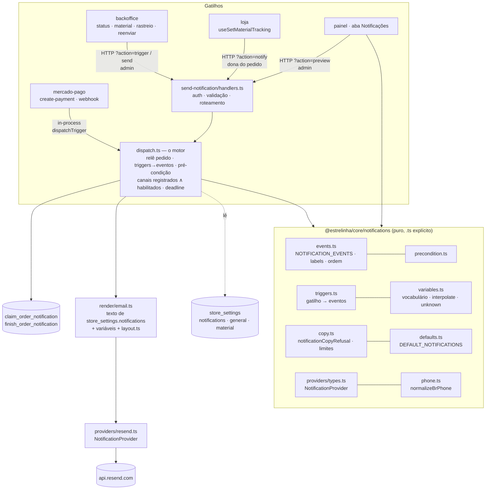

# 42 — Notificações por e-mail · Design

**Spec**: `.specs/features/42-notificacoes-email-e-whatsapp/spec.md`
**Context**: `.specs/features/42-notificacoes-email-e-whatsapp/context.md`
**Status**: **Approved** — usuário, 2026-09-06 (abordagem 1, com a porta `notify`). `AD-032` registrada.

**Decisões ativas que este design obedece** (lidas de `STATE.md` em 2026-09-06): `AD-004` (handlers
com deps injetadas), `AD-005` (duas portas, um motor; `mercado-pago` importa in-process), `AD-006`
(idempotência por RPC no banco), `AD-007` (contrato dirigido por estado), `AD-008` (`await` limitado,
nunca background), `AD-012` (tipo não é schema — probe HTTP), `AD-016` (marca), `AD-019`/`AD-028`
(a prévia é a loja/função, nunca um segundo desenho), `AD-023` (convidada não tem linha em
`customers`), `AD-027` (interruptor próprio, e o custo de nascer desligado), `AD-031` (Evolution na
`43`). Nenhuma é superada. **Uma decisão nova** sai deste design: `AD-032` (gatilho → eventos, em
`core`), registrada no fim.

---

## Approach exploration (Large) — três caminhos, um recomendado

Os três entregam a mesma spec. Diferem em **onde a decisão "quais eventos saem agora?" mora** e em
**como o evento iniciado pela cliente chega ao motor**.

| | **1 · Gatilhos em `core`, motor síncrono, porta da cliente** (recomendado) | 2 · Fila em `order_notifications` + drenador `pg_cron`/`pg_net` | 3 · Chamador nomeia eventos, um a um |
| --- | --- | --- | --- |
| Quem decide os eventos | `core/notifications/triggers.ts`: o chamador diz **o que aconteceu** (`payment_approved`), `core` devolve os eventos (`material_instructions` **ou** `order_paid`, mais `owner_order_paid`) | idem, mas o disparo grava `pending` e volta; um job envia depois | o chamador (`mercado-pago`, backoffice) escreve a bifurcação — em **dois** lugares |
| Cliente informa rastreio | a loja chama `action=notify` autenticada; o handler exige **dona do pedido** (mesmo predicado de `set_material_tracking`) e só aceita gatilhos da lista de cliente | trigger SQL enfileira; `pg_net` chama a function | idem ao 1 |
| Orçamento de 2500 ms | deadline compartilhado; o que não coube fica `failed: budget_exhausted`, visível e reenviável | não existe: tudo é assíncrono | idem ao 1 |
| Extensões novas | **nenhuma** | `pg_net` (não existe hoje em migration nenhuma) + `pg_cron` (existe, com fallback) | nenhuma |
| Latência do aviso | imediata | até 1 min (cron) | imediata |
| Testabilidade local | vitest + dublês, como hoje; probe HTTP | precisa de `pg_net` no local e de um túnel para a function | como o 1 |
| Conformidade | `AD-005/006/007/008` intactas | `AD-008` fala de background **na function**; um job no banco não a viola, mas cria um **segundo caminho** de envio para auditar | `AD-007` ok; **bifurcação duplicada** = defeito 01 |
| Quando faria sentido | agora | se `failed: budget_exhausted` aparecer com frequência **medida** — e a spec já deixa a linha visível para medir | nunca |

**Recomendação: 1.** Zero extensão nova, zero segundo caminho, a decisão de negócio (que evento sai)
em `core` com teste puro, e a `43` acrescenta canal sem tocar em nada disso. O 2 fica registrado como
evolução condicionada a medida, não a opinião.

---

## Architecture Overview



**Um motor** (`dispatch.ts`), **duas portas** (in-process para a `mercado-pago`, HTTP para
backoffice/loja/painel), **uma memória** (`order_notifications`), **uma regra** (`core/notifications`),
lida pelos três lados.

---

## Code Reuse Analysis

### Existing Components to Leverage

| Componente | Onde | Como |
| --- | --- | --- |
| `sender.ts` (motor atual) | `supabase/functions/send-email/sender.ts` | **Evolui** para `dispatch.ts`: mantém releitura com service role, `preconditionFailure`, claim → send → finish, `AbortController`, `classify*`, "nunca lança". Ganha laço de canais e deadline |
| `layout.ts` (casca, blocos, `escapeHtml`, `textBody`) | idem | **Move** para `send-notification/render/layout.ts`, sem mudança de comportamento. Continua o único dono da estrutura |
| `templates.ts` | idem | **Substituído** por `render/email.ts`, que lê texto de settings. Os quatro textos atuais viram **`DEFAULT_NOTIFICATIONS`** em `core` (byte a byte — `PNL-06`); `templates.test.ts` migra para provar que default + interpolação reproduz o HTML antigo |
| `handlers.ts` (`requireAdmin`, `json`, `route`) | idem | Mantido; ganha `trigger`, `notify`, `preview` |
| `claim_order_email` / `finish_order_email` | `20260730120000_order_emails.sql` | **Molde** das novas RPCs (uma statement, `on conflict … where status <> 'sent'`) |
| `fireEmail` | `mercado-pago/handlers.ts:79` | Vira `fireTrigger(deps, orderId, trigger, budgetMs)`; os dois pontos de disparo (`:808`, `:993`) passam a nomear **gatilho** |
| Seed aditivo/idempotente | `20260905120000_37-…sql` | `UPDATE … value || … WHERE key = 'notifications' AND NOT value ? …` — mas aqui a chave é **nova**, então é `INSERT … ON CONFLICT (key) DO NOTHING` |
| `useStoreSettings` / `useUpdateSettings` | `packages/core/src/hooks/useStoreSettings.ts` | Nova chave `notifications` em `DEFAULTS` (**obrigatório**, ver Risks) e `useNotificationSettings()` |
| `storeSettingsDefaults.test.ts` | store `shared/lib/__tests__` | Ganha o bloco `notifications` (TS × SQL) |
| `menuTargetRefusal` / `freeShippingRefusal` | `core/menu`, `core/shipping` | Formato `string \| null` de `notificationCopyRefusal` e `variablesRefusal` |
| `MenuLivePreview` | backoffice `features/store-menu` | Molde do `<iframe sandbox srcdoc>` em 390/600 |
| `whatsappNumber` | backoffice `features/order-list/model/chargeMaterial.ts:59` | **Sobe** para `core/notifications/phone.ts` como `normalizeBrPhone`; `chargeMaterial.ts` importa de lá |
| `history.ts` / `OrderHistory.tsx` / `useAdminOrder.ts` | backoffice | Passam a ler `order_notifications` e `NOTIFICATION_EVENT_LABELS` de `core` |
| `_shared/testing/fakes.ts` | `supabase/functions/_shared` | Dublê do client ganha `order_notifications` e as RPCs novas |

### Integration Points

| Sistema | Integração |
| --- | --- |
| `mercado-pago` | `import { dispatchTrigger } from '../send-notification/dispatch.ts'`; `deps.email` vira `deps.notifications: NotificationEnv` (mesmos campos + nada novo nesta feature) |
| Loja (`useSetMaterialTracking`) | após `ok: true` da RPC, `supabase.functions.invoke('send-notification?action=notify', { body: { order_id, trigger: 'material_tracking_set' } })`, contido em `try/catch`, sem bloquear a UI |
| Backoffice (`useAdminOrders`) | `sendOrderEmail(id, type)` → `notifyOrder(id, trigger)` (`?action=trigger`); reenvio explícito no histórico → `?action=send` com `{ order_id, event, channel }` |
| Painel (`AdminSettingsPage`) | aba **Notificações** = `features/notification-settings` (slice próprio; a página só monta) |
| Banco | migration `20260907120000_42-notificacoes.sql` (abaixo) |

---

## Components

### `@estrelinha/core/notifications` (novo, puro, todo import com `.ts`)

- **Purpose**: a regra — o que existe, quando sai, para quem, com que texto, e o que é recusado.
- **Location**: `packages/core/src/notifications/`
- **Interfaces**:
  - `events.ts` — `NOTIFICATION_EVENTS: readonly NotificationEvent[]` (na **ordem da jornada**, a
    mesma da aba); `NotificationEvent` union de string literal; `NOTIFICATION_EVENT_LABELS:
    Record<NotificationEvent, string>` (fecha o D2); `EVENT_AUDIENCE: Record<NotificationEvent,
    'customer' | 'owner'>`; `MATERIAL_EVENTS` (os que proíbem `!`).
  - `precondition.ts` — `preconditionFailure(event, order: OrderSnapshot): string | null` (movido de
    `sender.ts`, com os eventos novos; para `owner_*` inclui `no_owner_contact`).
  - `triggers.ts` — `NotificationTrigger = 'pix_created' | 'payment_approved' | 'payment_rejected' |
    'payment_expired' | 'payment_refunded' | 'order_status_changed' | 'material_status_changed' |
    'material_tracking_set'`; `eventsForTrigger(trigger, order): NotificationEvent[]`;
    `CUSTOMER_TRIGGERS = ['material_tracking_set']` (os que `action=notify` aceita).
  - `variables.ts` — `NOTIFICATION_VARIABLES` (vocabulário fechado); `interpolate(text, vars):
    string`; `unknownVariables(text): string[]`; `variablesRefusal(text): string | null`.
  - `copy.ts` — `notificationCopyRefusal(text, { event, channel }): string | null`; `COPY_LIMITS =
    { subject: 120, heading: 80, lead: 600, extraLines: 5, extraLine: 160, ctaLabel: 40 }`;
    `limitsRefusal(fields, channel): string | null`.
  - `defaults.ts` — `DEFAULT_NOTIFICATIONS: NotificationSettings` (os 4 textos atuais, `enabled:
    true`; os demais com texto inicial e `enabled: false`; `post_delivery_days: 7`).
  - `settings.ts` — tipos `NotificationSettings`, `EventChannelSettings`, `EmailFields`;
    `resolveEventSettings(settings, event, channel)` (merge com defaults, para banco anterior à
    migration).
  - `providers/types.ts` — `interface NotificationProvider { channel: NotificationChannel;
    send(msg: RenderedMessage, ctx: { fetch, env, signal }): Promise<ProviderOutcome>;
    classifyFailure(status: number, body: unknown): string }`.
  - `providers/resend.ts` — o adaptador (hoje `postToResend` + `classifyResendFailure`).
  - `phone.ts` — `normalizeBrPhone(input): string | null`.
- **Dependencies**: nenhuma (`purity.test.ts` novo assere: sem React, Supabase, Deno).
- **Reuses**: `sender.ts` (lógica de pré-condição e classificação), `chargeMaterial.ts` (telefone).

### `send-notification` (edge function — renomeada de `send-email`)

- **Purpose**: as portas HTTP e o motor.
- **Location**: `supabase/functions/send-notification/`
- **Interfaces**:
  - `index.ts` — wiring (env, client, `Deno.serve`). Só.
  - `handlers.ts` — `route(deps, req)`; actions:
    - `send` (admin) `{ order_id, event, channel? }` → um evento, explícito (reenvio).
    - `trigger` (admin) `{ order_id, trigger }` → `dispatchTrigger`.
    - `notify` (**dona do pedido**) `{ order_id, trigger ∈ CUSTOMER_TRIGGERS }` → `dispatchTrigger`.
      Autorização: JWT → `getUser`; consulta `orders.id = order_id and customer_id in (select id from
      customers where user_id = uid)` com service role; ausente ⇒ 404 (mesma resposta para "não é
      seu" e "não existe", como a RPC).
    - `preview` (admin) `{ event, channel: 'email', draft, order_id? }` → `{ subject, html, text }`;
      **sem** claim, **sem** provedor.
  - `dispatch.ts` — `dispatchTrigger(deps, { orderId, trigger, budgetMs }): Promise<DispatchReport>`
    e `dispatchEvent(deps, { orderId, event, channel?, deadline }): Promise<SendResult[]>`.
    Sequência por evento: relê pedido (`ORDER_COLUMNS` + `whatsapp_opt_in`, já para a `43`) → lê
    settings (`key in ('notifications','general','material')`, uma consulta) → pré-condição → para
    cada `provider` em `REGISTERED_PROVIDERS` (só `resend` aqui): habilitado? destinatário? tempo?
    → `claim_order_notification` → `render` → `provider.send` com `signal` do tempo restante →
    `finish_order_notification`. Nunca lança. Loga `{ action: 'send-notification', order_id, event,
    channel, status }`.
  - `render/email.ts` — `renderEmail(event, order, fields, vars): RenderedMessage`; blocos fixos
    por evento (`highlightBox` do rastreio em `order_shipped`, parágrafo condicional de devolução em
    `order_cancelled`, `{{link_guia_material}}` como CTA secundário em `material_instructions`).
  - `render/layout.ts` — o atual, movido.
  - `render/sample.ts` — pedido de exemplo (**`@exemplo.invalid`**, nome fictício, itens
    genéricos) para a prévia sem `order_id`.
- **Dependencies**: `core/notifications` por caminho relativo com `.ts`; `formatters/price.ts`.
- **Reuses**: tudo de `send-email`. **Os testes movem junto** (`__tests__/handlers.test.ts`,
  `templates.test.ts` → `render.test.ts`); queda de contagem só se o número reaparecer no novo lugar.

### `mercado-pago` (mudança mínima)

- `fireEmail` → `fireTrigger(deps, orderId, trigger, budgetMs)`; `:808` dispara `'pix_created'`
  quando há QR, `'payment_approved'` quando `approvalApplied`; `:993` dispara `'payment_approved'`,
  e nos ramos de `expired | rejected | refunded` com `applied`, o gatilho correspondente.
- `deps.email: EmailEnv` → `deps.notifications: NotificationEnv` (mesmos campos).
- **Nada mais.** `payment/**` e o recálculo não são tocados (`NTF-16`).

### Migration `20260907120000_42-notificacoes.sql`

Na ordem, tudo idempotente:

1. `alter table public.order_emails rename to order_notifications` (guardado por `if exists` do
   nome antigo e `not exists` do novo) — preserva dados, FK, RLS e policy.
2. `rename column type to event`; `add column channel text not null default 'email'`; `add column
   delivery_status text`; `check (channel in ('email','whatsapp'))`; `check (delivery_status is null
   or delivery_status in ('sent_to_server','delivered','read'))`.
3. Trocar o `check` de `event` para a lista completa de `NOTIFICATION_EVENTS` (guarda lê os dois).
4. `drop index order_emails_order_type`; `create unique index order_notifications_order_event_channel
   on (order_id, event, channel)` — **não parcial**.
5. RPCs `claim_order_notification(uuid, text, text)` e `finish_order_notification(uuid, text, text)`
   — molde das atuais; `revoke` de `public/anon/authenticated`, `grant` a `service_role`.
6. `create or replace function claim_order_email(uuid, text)` → `select
   claim_order_notification($1, $2, 'email')`; idem `finish_order_email` → delega. **Janela de
   deploy coberta**: a function antiga ainda publicada continua funcionando.
7. `create view public.order_emails with (security_invoker = true) as select id, order_id, event as
   type, status, attempts, provider_message_id, error, created_at, sent_at from order_notifications
   where channel = 'email'`; `grant select to authenticated` (a RLS da tabela vale pelo invoker).
8. Seed: `insert into store_settings (key, value) values ('notifications', <DEFAULT_NOTIFICATIONS
   como jsonb>) on conflict (key) do nothing`.
9. Comentários de tabela/colunas explicando a view de compatibilidade e a migration futura que a
   remove.

### Backoffice

- **`features/notification-settings/`** (slice novo): `ui/NotificationsTab.tsx` (lista de eventos na
  ordem de `NOTIFICATION_EVENTS`, agrupados por trecho da jornada: Compra · Material · Envio · Dona);
  `ui/EventCard.tsx` (interruptor + campos de e-mail + recusa inline + "ver prévia");
  `ui/EmailPreviewFrame.tsx` (iframe 390/600, `srcdoc`); `model/useNotificationDraft.ts` (rascunho
  local, `variablesRefusal` + `notificationCopyRefusal` + `limitsRefusal` antes de salvar);
  `api/previewNotification.ts` (invoke `?action=preview`).
- **`entities/order/api/notifyOrder.ts`** substitui `sendOrderEmail.ts`: `notifyOrder(orderId,
  trigger): Promise<boolean>` e `resendNotification(orderId, event, channel): Promise<boolean>`.
- **`useAdminOrders.ts`**: `updateStatus` → `notifyOrder(id, 'order_status_changed')`;
  `addTrackingCode` → idem (é o par do `shipped`); `setMaterialStatus` →
  `'material_status_changed'`; `setMaterialTracking` → `'material_tracking_set'`.
- **`useAdminOrder.ts`**: `.from('order_notifications')`; `OrderEmailEvent` → `OrderNotificationRow`.
- **`history.ts`**: rótulos de `NOTIFICATION_EVENT_LABELS`; evento ganha `channel`.
- **`AdminSettingsPage.tsx`**: remove o bloco de lembrete da aba Carrinho (mantém `threshold_hours`);
  monta `<NotificationsTab />`.
- **`chargeMaterial.ts`**: `whatsappNumber` → `normalizeBrPhone` de `core` (mesmo comportamento;
  os testes atuais continuam valendo e ganham o caso de 10 dígitos).

### Loja

- `useSetMaterialTracking.ts`: após sucesso, `invoke('send-notification?action=notify')` contido.
- `NewsletterBanner.tsx`: copy da confirmação → "Anotado. Quando houver novidades, escrevemos."
- `useStoreSettings.ts` (core): `notifications: DEFAULT_NOTIFICATIONS` em `DEFAULTS`;
  `useNotificationSettings()`.
- `packages/supabase/src/types/settings.ts`: `SettingsKey` ganha `'notifications'`;
  `NotificationSettings` e `DEFAULT_NOTIFICATIONS` **reexportados de `core`** (molde de `MenuPromo`:
  quem usa o tipo é a regra; o pacote de tipos só descreve a coluna).

### Guardas de disco (novos ou estendidos)

| Guarda | Onde | Derruba a suíte se |
| --- | --- | --- |
| `orderNotificationsSchema.test.ts` | store `shared/lib/__tests__` | o `check` de `event` divergir de `NOTIFICATION_EVENTS` (dois sentidos); índice virar parcial; view perder `security_invoker`; `grant` alcançar `anon`; RPC antiga deixar de delegar; seed perder o `on conflict do nothing`. Âncora dupla + sensor por mutação |
| `notificationSingleOwner.test.ts` | idem | qualquer arquivo de `apps/**` ou `supabase/functions/**` ler `order_emails` (fora da migration); literal de evento fora de `core` em `apps/**` (o painel e o histórico consomem `NOTIFICATION_EVENTS`) |
| `authSenderDomain.test.ts` | idem | `send.umaestrelinha.com.br` em qualquer arquivo do repositório fora de `.specs/`; o `admin_email` do `config.toml` divergir do `.env.example` |
| `storeSettingsDefaults.test.ts` (+bloco) | idem | `DEFAULT_NOTIFICATIONS` divergir do jsonb da migration; algum dos 4 legados nascer desligado; algum novo nascer ligado |
| `notificationCopyGuard.test.ts` | `core/notifications/__tests__` | um default reprovar em `notificationCopyRefusal`/`limitsRefusal`; sensor: default com "corra" e com `!` em evento de material reprovam |
| `purity.test.ts` | idem | `core/notifications/**` importar React/Supabase/Deno ou um especificador relativo sem `.ts` |
| `AdminSettingsPage.test.tsx` (+casos) | backoffice | o controle de lembrete voltar à aba Carrinho (sensor: reinjetar reprova) |
| `providers.test.ts` | `core/notifications/__tests__` | `resend` e o dublê não satisfazerem a mesma bateria da interface |

---

## Data Models

```typescript
// core/notifications/settings.ts
export type NotificationChannel = 'email' | 'whatsapp'

export interface EmailFields {
  subject: string
  heading: string
  lead: string
  extra: string[]          // ≤ 5 linhas, ≤ 160 chars cada — versão texto e observações
  cta_label: string        // destino é sempre {{link_conta}}; não editável
}

export interface EventChannelSettings<F> { enabled: boolean; fields: F }

export interface NotificationSettings {
  events: Record<NotificationEvent, { email: EventChannelSettings<EmailFields> /* whatsapp: 43 */ }>
  post_delivery_days: number   // P3
}

// core/notifications/providers/types.ts
export interface RenderedMessage {
  channel: NotificationChannel
  to: string
  subject?: string          // e-mail
  html?: string             // e-mail
  text: string              // e-mail (versão texto) e WhatsApp (corpo)
  idempotencyKey: string    // `notification:${orderId}:${event}:${channel}`
}
export type ProviderOutcome =
  | { ok: true; id: string }
  | { ok: false; reason: string; detail: string; http?: number }

// dispatch.ts
export type SendResult =
  | { ok: true; channel; id: string }
  | { ok: false; channel; notFound: true }
  | { ok: false; channel; precondition: string }
  | { ok: false; channel; skipped: 'already_sent' | 'disabled' | 'no_email' | 'no_owner_contact' | 'no_opt_in' | 'no_phone' | 'no_provider' }
  | { ok: false; channel; reason: string }   // falha do provedor, budget_exhausted, invalid_from…
```

```sql
-- order_notifications (após a migration)
id uuid pk · order_id uuid fk orders on delete cascade · event text check(NOTIFICATION_EVENTS)
channel text not null default 'email' check(email|whatsapp) · status text check(pending|sent|failed)
attempts int · provider_message_id text · delivery_status text null check(sent_to_server|delivered|read)
error text · created_at timestamptz · sent_at timestamptz
unique (order_id, event, channel)  -- não parcial
```

**Relacionamentos**: `order_notifications.order_id → orders.id`. `order_emails` é **view** sobre ela.
`store_settings['notifications'].value` é `NotificationSettings` serializado.

---

## Error Handling Strategy

| Cenário | Tratamento | O que a pessoa vê |
| --- | --- | --- |
| Pré-condição falha (estado ainda não casa) | `{ precondition }`, sem claim, log `precondition_failed` | Backoffice: nada (é o par `shipped`+rastreio); painel/histórico: nada a mostrar — não houve tentativa |
| Canal desabilitado | `skipped:disabled`, sem linha | Nada. O interruptor está no painel |
| Sem destinatário (`no_email`, `no_owner_contact`) | `skipped`, sem linha, log | Histórico: nada; para `owner_*` a aba avisa "preencha o e-mail da loja em Geral" quando `general.email` está vazio |
| Deadline esgotado antes do envio | claim → `failed: budget_exhausted` | Histórico: "Falha ao enviar — tempo esgotado no caixa" + **reenviar** |
| Resend ≠ 2xx / timeout / rede | `failed` com slug; `error` recortado (500) | Histórico: "Falha ao enviar <rótulo>" + motivo curto + reenviar |
| `from` malformado | `invalid_from` antes de qualquer envio | Histórico: falha; log. (Já existe: `CFG-03`) |
| Texto salvo viola régua (bypass do painel) | function recusa renderizar: `failed: copy_refused:<motivo>` | Histórico: falha nomeando o motivo; aba mostra o mesmo motivo no campo |
| Variável desconhecida no texto | recusa ao salvar (painel) e `copy_refused:unknown_variable:<nome>` na function | Inline no campo; histórico se passou |
| `action=notify` por quem não é dona do pedido | 404 (indistinguível de inexistente) | Loja: nada — a chamada é contida e silenciosa |
| `action=preview` sem admin | 401/403 | Painel: toast "sessão expirada" |
| `store_settings.notifications` ausente | `resolveEventSettings` cai nos defaults | Comportamento de hoje, intacto |
| `mercado-pago` recebe throw do motor (bug) | `try/catch` em `fireTrigger`, log `notification_dispatch_failed` | Pagamento **inalterado** |

---

## Risks & Concerns

| Concern | Location | Impact | Mitigation |
| --- | --- | --- | --- |
| **`fetchAllSettings` descarta chave desconhecida** (`if (key in map)`) | `packages/core/src/hooks/useStoreSettings.ts:53` | A aba salvaria `notifications` e o painel/loja **nunca leria** — a linha existe e a tela mostra defaults | Task explícita: `notifications` em `DEFAULTS` **antes** da aba; teste em `core/hooks` que a chave é lida |
| **`useAdminOrder.ts` lê `order_emails` direto** | `apps/backoffice/src/entities/order/api/useAdminOrder.ts:169` | Com a view continua funcionando — e por isso ninguém migraria | `notificationSingleOwner.test.ts` recusa a leitura; a task de histórico troca para `order_notifications` |
| **Rótulos de e-mail escritos à mão** (D2) | `history.ts:33-38` | Já quebrado; qualquer evento novo agravaria | `NOTIFICATION_EVENT_LABELS: Record<…>` em `core`; `tsc` fecha |
| **`AdminSettingsPage.tsx` com 7 abas em ~500 linhas** | `apps/backoffice/src/pages/admin/AdminSettingsPage.tsx` | Uma 8ª aba inline levaria a ~700 e misturaria estado de 8 domínios | A aba é slice próprio (`features/notification-settings`) com estado próprio, como `CheckoutSettingsCard` |
| **Orçamento de 2500 ms agora dividido** entre `material_instructions`/`order_paid` **e** `owner_order_paid` no cartão aprovado do `create-payment` | `mercado-pago/handlers.ts:66,808` | O e-mail da dona pode ficar `budget_exhausted` com frequência no caminho do cartão | Ordem fixa: cliente primeiro. A linha `failed` é **medida** — se recorrente, é o gatilho da abordagem 2 |
| **`envOr` duplicada** entre os `index.ts` (comentário reconhece) | `mercado-pago/index.ts:21`, `send-email/index.ts` | Renomear a function mantém a duplicação em 2 | Fora de escopo: é wiring; anotar. Não cresce nesta feature |
| **Convidada não alcança `set_material_tracking`** (`AD-023`) | `22-material-afetivo.sql:238` | `action=notify` herda o mesmo limite: só cliente logada dispara o próprio rastreio | Coerente com a RPC; a Adri registra pela via admin quando a cliente avisa no WhatsApp, e o gatilho sai igual |
| **Testes de `send-email/__tests__` (parte dos 370)** | `supabase/functions/send-email/__tests__` | Renomear a pasta sem mover os testes é queda silenciosa | Tasks movem e a baseline registra "mudaram de casa", como fez a `PRF-05` |
| **Pedido de exemplo da prévia** pode tentar dado real | `render/sample.ts` (novo) | Dado de cliente em fixture | `@exemplo.invalid`, nome fictício; `fixtureSintetica`-style assert |
| **`RESEND_DEV_REDIRECT_TO` vazio no `.env` local** (medido hoje) | `.env` | Envio local para cliente real do banco importado | Item de `validation.md`: preencher antes do roteiro ponta a ponta |
| **Rename de tabela e o cache de schema do PostgREST** | migration | Após `db push` o PostgREST pode servir o schema velho por segundos | `notify pgrst, 'reload schema'` ao fim da migration. **Verificado em 2026-09-06: nenhuma migration do repositório o usa** — este é o primeiro rename de tabela viva, e a linha entra com comentário explicando o porquê |

---

## Tech Decisions (só as não óbvias)

| Decisão | Escolha | Razão |
| --- | --- | --- |
| Chamador nomeia **gatilho**, `core` deriva **eventos** | `eventsForTrigger(trigger, order)` | A bifurcação `order_paid` × `material_instructions` fica num lugar; a `43` não a repete; teste puro. **Vira `AD-032`** |
| `rename table` em vez de `create + copy` | `alter table … rename` + colunas novas | Preserva id, FK, RLS, policy; zero cópia; view de compatibilidade cobre a janela de deploy |
| RPCs antigas **delegam** em vez de sumirem | `claim_order_email` → `claim_order_notification(…, 'email')` | A function publicada continua funcionando até o deploy da Vercel |
| `delivery_status` já nasce | coluna nullable | A `43` não reabre a migration — é o custo declarado da separação, pago aqui |
| Defaults e tipos de settings em `core`, reexportados por `supabase/types` | molde `MenuPromo` | Deno precisa dos defaults; `packages/supabase/types` não é alcançável por caminho `.ts` puro |
| Porta da cliente (`notify`) com autorização por **dona do pedido** | mesma consulta da RPC `set_material_tracking` | Sem `pg_net`; a pré-condição relida torna impossível disparar o que o estado não prova |
| Deadline compartilhado, `failed: budget_exhausted` **com claim** | claim antes de decidir "não cabe" | Sem a linha, o que não coube seria invisível — e a spec exige visível e reenviável |
| Régua de tom com `\p{Extended_Pictographic}` para emoji | regex Unicode | Lista de emoji à mão envelhece |
| Prévia sobre pedido **fixo** por padrão | `sample.ts` | Sem dado real na tela do painel; `order_id` opcional para conferir um caso concreto |
| `extra[]` continua existindo | ≤ 5 linhas | É a versão texto e o "Status: …" de hoje — apagar mudaria os 4 e-mails legados |

> **Decisão de projeto — `AD-032`** (a registrar em `STATE.md` na aprovação deste design):
> *Quem dispara notificação nomeia o que ACONTECEU (gatilho), nunca qual mensagem sai. Quais eventos
> um gatilho produz, para quem, e sob que pré-condição, é regra de `@estrelinha/core/notifications`,
> lida pelo motor e pelo painel. Um motor, N canais registrados por interface, uma memória com
> `channel`.*

---

## Ordem sugerida para `tasks.md`

F0 (5 tasks, FIX-01..05) → F1-a `core/notifications` + migration + guardas (≈6) → F1-b function
renomeada + `mercado-pago` + loja `notify` + backoffice `notifyOrder`/histórico (≈6) → F2 aba +
prévia + defaults no hook (≈5) → fecho (baselines, `CLAUDE.md`, `BL-030/031`, `validation.md`).
**~22 tasks ⇒ oferta de sub-agentes (3 lotes)** na entrada do Execute, como manda a Skill.
