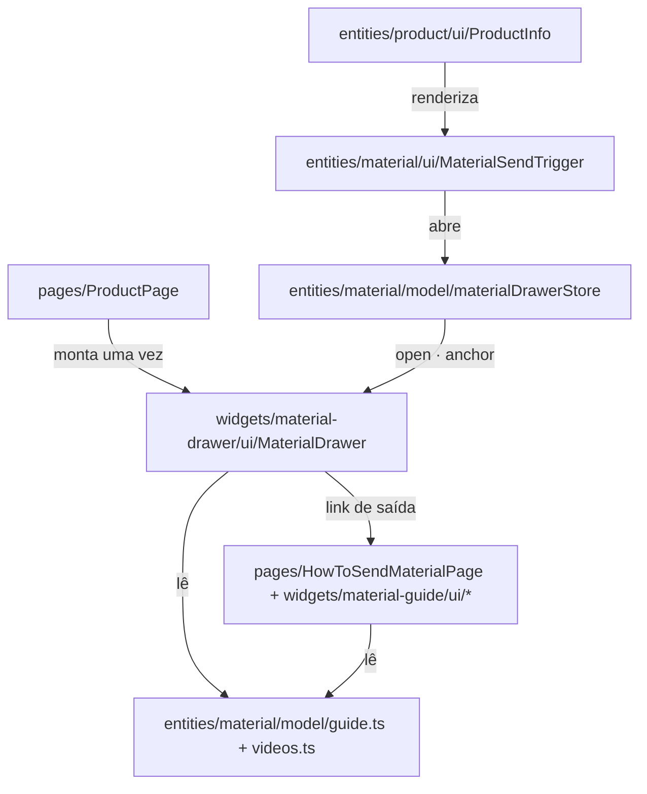

# Gaveta de material — Design

**Spec**: `.specs/features/44-gaveta-de-material/spec.md`
**Status**: Approved (desenho aprovado pelo usuário em 2026-09-11; gaveta pela direita por decisão dele)

---

## Architecture Overview

Três movimentos, e só o primeiro mexe em código que já existe:

1. **O conteúdo do guia muda de casa** — de `widgets/material-guide/model/` para
   `entities/material/model/`. Widget não importa de widget; `entities` é a camada estritamente
   abaixo que as duas superfícies alcançam.
2. **Uma gaveta nova** (`widgets/material-drawer`), comandada por um store de UI no molde do
   `cartUiStore`.
3. **O gatilho** vive em `entities/material/ui/`, e `ProductInfo` só o instancia — nenhuma regra de
   material entra num arquivo guardado.



O dado tem **um** dono (`MOD`) e duas superfícies. É a mesma forma da `24` (`core/home/derive.ts`) e
da `31` (`model/guide.ts` matando `model/fichas.ts`), um nível abaixo.

---

## Code Reuse Analysis

### Componentes e módulos existentes a reaproveitar

| Componente | Onde | Como usar |
| --- | --- | --- |
| `Sheet` / `SheetContent` (shadcn) | `@estrelinha/ui/sheet` | A gaveta. É o mesmo primitivo do `CartDrawer`, com `side="right"` |
| `cartUiStore` (molde) | `entities/cart/model/cartUiStore.ts` | Molde do `materialDrawerStore`. Há três precedentes: `cartUiStore`, `menuUiStore`, `searchUiStore` |
| `ATALHOS_DE_MATERIAL` | `model/guide.ts` (vai para `entities/material`) | **É a lista de chips** — já derivada de fichas + cartões + preparo em casa. Nada de segunda lista |
| `FICHAS_DE_MATERIAL`, `CARTOES_DE_MATERIAL`, `PREPARO_EM_CASA` | idem | Os três formatos de corpo da gaveta |
| `PASSOS_DO_ENVIO` | idem | Os quatro passos universais |
| `videoDoMaterial`, `videoCapa`, `videoEmbed`, `videoUrl` | `model/videos.ts` (vai junto) | Capa, player e saída externa. `youtube-nocookie`, iframe só depois do toque |
| `guiaMaterialHref(kind)` | idem | O link do rodapé da gaveta, por âncora |
| `MaterialShortcuts.tsx` (referência de desenho) | `widgets/material-guide/ui/` | **A mesma espécie de chip já existe** — pílula, `TAP_ROW`, `ATALHOS_DE_MATERIAL`. A gaveta é a quarta tela dela |
| `TAP_44` / `TAP_ROW` | `shared/lib/touchTarget.ts` | Obrigatório no gatilho e nos chips (`touchTarget.test.ts`) |
| `ESTRELINHA_ICONS` | `@estrelinha/ui/icons` | Os ícones das fichas, por `EstrelinhaIconName` |
| Tom `alerta` × `calma` | `MaterialFicha.tsx` (`Aviso`) | Os valores exatos: `#F7EDE8` com barra `#9E4A3E` × `serenity`. Extrair para componente compartilhado em `entities/material/ui/` |

### Pontos de integração

| Sistema | Como conecta |
| --- | --- |
| `products.requires_material` | Lido **uma vez**, por `requiresMaterial()`, dentro de `MaterialSendTrigger` |
| `/como-enviar-seu-material-de-dna` | Destino do rodapé, por `guiaMaterialHref` — a âncora é contrato desde a `22` |
| YouTube (`youtube-nocookie`) | Única dependência externa. Capa estática de `i.ytimg`; iframe só depois do toque |

---

## Components

### `entities/material/model/guide.ts` + `videos.ts` (movidos)

- **Purpose**: O dono único do conteúdo do guia de material.
- **Location**: `apps/store/src/entities/material/model/`
- **Mudança de conteúdo**: só uma — `AtalhoDeMaterial` ganha `rotuloCurto`; `FichaDeMaterial`,
  `CartaoDeMaterial` e `PreparoEmCasa` ganham `rotuloCurto?: string` opcional, e o mapa de
  `ATALHOS_DE_MATERIAL` faz `rotuloCurto: x.rotuloCurto ?? x.titulo`.
- **Reuses**: tudo o que já está escrito. Nenhum texto muda.

### `entities/material/model/materialDrawerStore.ts`

- **Purpose**: Quem manda a gaveta abrir, fechar e qual material está escolhido.
- **Interfaces**:
  - `open: boolean`
  - `anchor: string | null` — a âncora do material escolhido (`null` = nenhum)
  - `openDrawer(): void` · `closeDrawer(): void` · `setAnchor(anchor: string): void`
- **Dependencies**: `zustand`
- **Reuses**: molde do `cartUiStore`. **Sem `persist`** — `anchor` é contexto de visita, não
  preferência (`GAV-15`).

### `entities/material/ui/MaterialSendTrigger.tsx`

- **Purpose**: A linha "Como enviar seu material de DNA" na coluna de informação.
- **Interfaces**: `({ product }: { product: Product }) => JSX.Element | null`
- **Comportamento**: devolve `null` quando `requiresMaterial(product)` é falso (`GAV-02`).
- **Reuses**: `TAP_44`, `requiresMaterial`, `materialDrawerStore`.
- **Por que aqui e não em `widgets/`**: quem a renderiza é `ProductInfo`, que está em `entities`, e
  `entities` não importa de `widgets`. Cross-import na mesma camada tem precedente direto —
  `ProductCard.tsx` importa `cartUiStore`.

### `entities/material/ui/MaterialAviso.tsx`

- **Purpose**: O aviso de ficha nos dois tons, extraído de `MaterialFicha.tsx`.
- **Reuses**: os valores exatos que já estão lá. `MaterialFicha` passa a consumi-lo — senão o tom
  `alerta` ganha dois donos no mesmo dia em que a gaveta nasce.

### `widgets/material-drawer/ui/MaterialDrawer.tsx`

- **Purpose**: A gaveta. Cabeçalho, nota de contexto, chips, corpo do material, passos, rodapé.
- **Interfaces**: sem props — lê o store.
- **Composição**: `MaterialDrawerChips`, `MaterialDrawerBody`, `MaterialDrawerVideo`,
  `MaterialDrawerSteps`.
- **Largura**: `w-full sm:max-w-[480px]` (`GAV-21`) — largura cheia no celular, como o `CartDrawer`. Decisão do usuário em 2026-09-11.

### `widgets/material-drawer/ui/MaterialDrawerBody.tsx`

- **Purpose**: Resolver âncora → um dos três formatos e renderizar só os blocos que existem.
- **Interfaces**: `({ anchor }: { anchor: string }) => JSX.Element | null`
- **Regra**: ficha rica → quantidade + recipientes + preparo + avisos + vídeo; cartão → itens;
  preparo em casa → aviso + passos. **Bloco ausente não vira bloco vazio** (`GAV-12`).

### `widgets/material-drawer/ui/MaterialDrawerVideo.tsx`

- **Purpose**: Capa → player, dentro da gaveta.
- **Regra**: `useState` local do play; o `<iframe>` só existe depois do toque; `videoUrl` sempre
  presente como saída externa (`GAV-23`).

---

## Data Models

Nenhuma tabela, nenhuma coluna, nenhuma migration. O único modelo novo é de UI:

```typescript
interface MaterialDrawerState {
  open: boolean
  /** A âncora do material escolhido — a MESMA de `ATALHOS_DE_MATERIAL`. `null` = nenhum. */
  anchor: string | null
  openDrawer: () => void
  closeDrawer: () => void
  setAnchor: (anchor: string) => void
}
```

**Por que `anchor` e não `MaterialKind`**: dois destinos do guia (`unhas`, `sangue-desidratado`)
**não são** `MaterialKind`. Tipar por `MaterialKind` deixaria dois chips sem estado possível.

---

## Error Handling Strategy

| Cenário | Tratamento | O que a cliente vê |
| --- | --- | --- |
| Capa do YouTube não carrega | `alt` descritivo; o bloco continua acionável | Cartão sem imagem, com título e "assistir" |
| Iframe bloqueado | `videoUrl` permanece como link externo | "abrir no YouTube" |
| Âncora desconhecida no store | `MaterialDrawerBody` devolve `null` | Gaveta com chips e passos, sem corpo — nunca erro |
| `ATALHOS_DE_MATERIAL` vazio (impossível hoje) | Os chips somem; passos e rodapé permanecem | Gaveta ainda útil |

---

## Risks & Concerns

| Concern | Onde | Impacto | Mitigação |
| --- | --- | --- | --- |
| **Mover `model/` quebra 16 imports relativos** | `widgets/material-guide/ui/*.tsx` (`../model/guide`) | Build quebra — ruidoso, não silencioso | Os `ui/` passam a importar de `@/entities/material`; o barrel `widgets/material-guide/index.ts` continua reexportando o conteúdo, então `HowToSendMaterialPage.tsx` e o teste dela **não mudam** (`GAV-18`) |
| **`buttonShape.test.ts` recusa pílula em ação** | `shared/ui/__tests__/buttonShape.test.ts` | Suíte reprova ao nascer | Entrada nova na allowlist `ROTULO` para o arquivo dos chips, com a mesma justificativa das outras três: **rótulo que nomeia material, não CTA**. É a quarta tela da mesma espécie de chip |
| **`touchTarget.test.ts`** | idem | Alvo abaixo de 44px reprova | `TAP_44` no gatilho, `TAP_ROW` nos chips — como `MaterialShortcuts` já faz |
| **FSD: `ProductInfo` ganha um terceiro cross-import** | `entities/product/ui/ProductInfo.tsx` | `eslint-plugin-boundaries` em `warn` — baseline de warnings pode subir | Cross-import é na **mesma** camada (entities→entities), que a regra tolera; os dois existentes são entities→**features**, que é pior. Conferir a baseline de lint no gate |
| **Tom `alerta` tem um dono só hoje, e a gaveta seria o segundo** | `widgets/material-guide/ui/MaterialFicha.tsx:29` | Os hex divergem em silêncio; um vira rosa e o outro não | Extrair `MaterialAviso` para `entities/material/ui/` **antes** de a gaveta consumi-lo |
| **`rotuloCurto` é um segundo rótulo e pode envelhecer** | `entities/material/model/guide.ts` | Ficha renomeada, chip com nome velho | Guarda `GAV-20`: toda entrada de `ATALHOS_DE_MATERIAL` tem `rotuloCurto` não vazio e ≤ 20 caracteres, com âncora de contagem. O fallback `?? titulo` garante que entrada nova nunca fica sem rótulo — só reprova se for longa |
| **`accentText.test.ts` nomeia arquivos de `widgets/material-guide/ui/`** | `shared/lib/__tests__/accentText.test.ts:56-64` | Allowlist apontando para caminho que mudou passa a varrer zero | A mudança é só de `model/`; os `ui/` ficam. **Conferir na execução**, não presumir |
| **A gaveta não fecha no gesto de voltar do Android** | `widgets/material-drawer` | Cliente sai da página do produto achando que fecha a gaveta | **Não mitigado, e declarado.** A faixa de véu de 48px resolvia, e saiu por decisão do usuário em 2026-09-11 em favor da consistência com as outras três superfícies sobrepostas da loja — que têm a mesma dívida. O que resta é o fecho sempre alcançável: cabeçalho `shrink-0`, só o corpo rola |

---

## Tech Decisions

| Decisão | Escolha | Rationale |
| --- | --- | --- |
| Onde mora o conteúdo do guia | `apps/store/src/entities/material/model/` | **Não** `packages/core`: os dois consumidores são widgets do **mesmo app**, e `entities` é a camada estritamente abaixo que ambos alcançam. Core exigiria ou uma dependência `core → @estrelinha/ui` (que `core/menu/__tests__/purity.test.ts` proíbe explicitamente para `core/menu`) ou um segundo vocabulário de ícones em core, no molde de `core/menu/icons.ts`. Vira `AD-033` |
| Rótulo dos chips | `rotuloCurto`, com fallback para `titulo` | **Rejeitado**: repetir o `truncate` + grade de 2 colunas de `MaterialShortcuts`. Ali a cliente já está lendo a página e os chips são navegação; na gaveta o chip é a **porta de entrada** da resposta, e "Unhas (humanas ou de…" é pior do que "Unhas". Medido no mock: títulos completos = 7 fileiras; curtos = 5 |
| Estado da gaveta | Zustand (`materialDrawerStore`) | `useState` em `ProductPage` perderia a escolha quando o `Sheet` do Radix desmonta o conteúdo ao fechar — e é o desmonte que **para o som** do vídeo, que queremos manter. Três precedentes no app |
| Onde a gaveta é montada | `pages/ProductPage.tsx` | O `CartDrawer` vive no `StoreLayout` porque o carrinho é alcançável de toda rota; esta gaveta só existe na página do produto. `<MaterialDrawer />` não casa a régua do guarda |
| Chave do estado escolhido | `anchor: string` | Dois destinos (`unhas`, `sangue-desidratado`) não são `MaterialKind` |
| Vídeo | Inline, no lugar da capa | `Dialog` sobre `Sheet` empilha foco em duas camadas; no celular a gaveta já ocupa quase a tela |

> **Decisão de projeto**: a primeira linha vira `AD-033` em `.specs/STATE.md` — *conteúdo
> compartilhado entre widgets do MESMO app vai para `entities`, não para `packages/core`*.

---

## Guardas — o que esta feature muda e o que ela cria

| Guarda | Mudança |
| --- | --- |
| `semMaterialNaPaginaDoProduto.test.ts` | **Estreitado**: `requiresMaterial` sai da régua; as outras sete formas ficam. Sensor novo provando que a régua **aceita** `requiresMaterial` e **acusa** cada uma das sete (`GAV-06`, `GAV-07`) |
| `semMaterialNaPaginaDoProduto.test.ts` | Caso novo: a gaveta **nomeia** material e **não** está no escopo — prova de que o escopo é o certo (`GAV-08`) |
| `buttonShape.test.ts` | Entrada nova na allowlist `ROTULO`, com justificativa escrita |
| `donoUnicoDoGuia.test.ts` (**novo**) | Recusa uma segunda definição de `FICHAS_DE_MATERIAL`/`CARTOES_DE_MATERIAL`/`PREPARO_EM_CASA` em `apps/**`; recusa `widgets/material-drawer` importar de `widgets/material-guide` e vice-versa. Âncora dupla + sensor (`GAV-17`) |
| `atalhosRotuloCurto.test.ts` (**novo**, ou caso em `donoUnicoDoGuia`) | Toda entrada de `ATALHOS_DE_MATERIAL` tem `rotuloCurto` ≤ 20, com âncora de contagem (`GAV-20`) |
| `touchTarget.test.ts` | Nenhuma mudança de régua — os controles novos adotam `TAP_44`/`TAP_ROW` |
