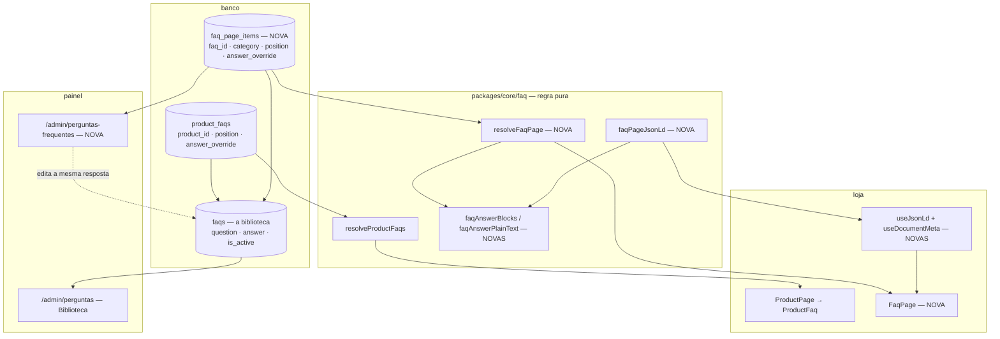

# Perguntas frequentes da loja — Design

**Spec**: `.specs/features/46-perguntas-frequentes-da-loja/spec.md`
**Status**: Draft
**Desenho**: Paper, página **46 · Perguntas frequentes da loja** (4 artboards)

---

## Architecture Overview

A feature acrescenta **uma tabela de colocação** e **nenhuma tabela de conteúdo**. O conteúdo é a
biblioteca `faqs` da feature `28`; o que nasce aqui é o segundo tipo de vínculo sobre ela — o
primeiro é `product_faqs`, e a simetria entre os dois é o desenho inteiro.



**A propriedade que o desenho compra:** editar uma resposta alcança **todos** os lugares que a usam,
porque só existe um texto. Onde a página precisa de voz própria, a colocação carrega
`answer_override` — o mesmo mecanismo que 30% dos vínculos de produto já usam, com a mesma regra de
que override idêntico ao padrão grava `null`.

### Abordagens consideradas

| Abordagem | Por que não foi escolhida |
| --- | --- |
| **Tabela própria de Q&A** (`store_faqs`) | Dois corpora de pergunta e resposta no mesmo projeto — o "defeito 01" nascendo dentro do material que o agente de IA vai ler. E a dedup entre eles teria de ser inventada; com a biblioteca única ela já existe (`faqs.question_key` é `unique`) |
| **Colunas na própria `faqs`** (`show_on_faq_page`, `faq_page_position`, `category`) | Confunde **conteúdo** com **colocação**. A ordem na página não é propriedade da pergunta — é propriedade de onde ela está, como `product_faqs.position` já demonstra. E uma flag booleana onde cabe presença de linha é exatamente o que `/admin/home` recusou ("curadoria é a PRESENÇA de itens, não uma flag") |
| **Escolhida: `faq_page_items`** | Simetria exata com `product_faqs`, dedup de graça, corpus único, e a colocação pode ganhar campo (assunto, ordem, texto próprio) sem tocar no conteúdo |

---

## Code Reuse Analysis

### O que já existe e vai ser usado

| Componente | Onde | Como |
| --- | --- | --- |
| `resolveProductFaqs` | `packages/core/src/faq/faq.ts:208` | **Molde** de `resolveFaqPage` — as três regras (ordem com desempate, pular vínculo órfão sem preencher a vaga, override só de espaço cai no padrão) valem iguais |
| `faqOverrideOf` | idem `:182` | Usado **sem alteração** pelo painel novo (`FAQL-24`) |
| `faqQuestionKey` | idem `:119` | Dedup ao criar pergunta nova (`FAQL-18`) **e** a busca da loja (`FAQL-04`) — o mesmo normalizador, um dono |
| `faqRefusal` | idem `:154` | Validação da pergunta/resposta no painel; passa a ler o `FAQ_ANSWER_MAX` novo |
| `useProductFaqs` | `apps/store/.../api/useProductFaqs.ts` | Molde do hook novo, **com uma divergência declarada** (abaixo) |
| `PolicyContact` | `apps/store/src/shared/ui/PolicyContact.tsx` | **Reusado inteiro** no fecho da página (`FAQL-08`). Já lê `store_settings`, já tem o portão do WhatsApp por contagem de dígitos, já é `min-h-11` |
| `useCanonical` | `apps/store/src/shared/lib/useCanonical.ts` | Molde exato de `useJsonLd` e `useDocumentMeta`: injeta no mount, **remove no unmount** |
| `useOverflowAffordance` | `apps/store/src/shared/lib/` | A faixa de assuntos do celular (`FAQL-06`) — degradê e setas pela posição real de rolagem, não por contagem de itens |
| `TAP_ROW` / `TAP_44` | `apps/store/src/shared/lib/touchTarget.ts` | Alvo de 44px na linha da pergunta e nos chips (`FAQL-11`) |
| Drag nativo HTML5 | `HomeSectionRow.tsx:159`, `CategoryTable.tsx:82` | **`draggable` + `dataTransfer`, NÃO `@dnd-kit`.** O pacote está instalado, mas as duas listas reordenáveis do painel usam o nativo — introduzir a segunda mecânica numa tela nova daria dois jeitos de arrastar no mesmo produto |
| `AdminTable` · `EmptyState` · `PageHeader` · `TableSkeleton` | `apps/backoffice/src/shared/ui` | Moldura da tela nova |
| `useAdminFaqs` | `apps/backoffice/.../faq-library/api/` | Molde do hook admin; o diálogo "Da biblioteca" o **consome** para buscar entre as 67 |
| `faq_usage` (view) | migration da `28` | O "em N produtos" de cada linha (`FAQL-23`) — a contagem já é view, e continua sendo |
| `shoppingParity.test.ts` | `packages/core/src/shopping/__tests__/` | Molde do teste de paridade JSON-LD × tela (`FAQL-14`), inclusive o sensor embutido |

### Pontos de integração

| Sistema | Como conecta |
| --- | --- |
| `@estrelinha/core/routes` | Ganha `FAQ_PATH`; entra em `ROUTE_SLUGS` e `SITEMAP_STATIC_PATHS`. Quatro guardas leem isso do disco |
| Rodapé (`widgets/footer`) | Um `FooterLink` novo na coluna **Ajuda**, por `FAQ_PATH` |
| Sidebar do painel | `navGroups` ganha item em **Loja**; o de Catálogo é **renomeado**; `App.tsx` reordenado junto (`navItems.test.ts` lê o arquivo) |
| `faqSchema.test.ts` | Passa a guardar `4000` no lugar de `600` — ele compara o `.sql` do disco com o TypeScript |

---

## Components

### `packages/core/src/faq/page.ts` — a regra da página (NOVO)

- **Purpose**: decidir o que a página mostra, em que ordem, e sob que assunto.
- **Interfaces**:
  - `FAQ_PAGE_CATEGORIES: readonly { key: FaqPageCategoryKey; label: string }[]` — o vocabulário
    fechado, **na ordem em que a página os exibe**. Espelhado pelo `check` da migration.
  - `faqPageCategoryLabel(key): string` — rótulo, com valor desconhecido caindo no próprio `key`
    (degradar, nunca quebrar — molde de `menuIconKey`).
  - `faqPageCategoryRefusal(key): string | null` — motivo, no formato `string | null` obrigatório sob
    `strictNullChecks: false`.
  - `resolveFaqPage(links, entries?): FaqPageGroup[]` — ordena por (ordem do assunto, `position`,
    `faq_id`), pula vínculo órfão ou inativo **sem preencher a vaga**, aplica `answer_override`, agrupa
    por assunto e **descarta assunto que ficou sem pergunta**.
- **Dependencies**: nenhuma. Puro, como todo o diretório.
- **Reuses**: as três regras de `resolveProductFaqs`, literalmente as mesmas.

### `packages/core/src/faq/text.ts` — o formato da resposta (NOVO)

- **Purpose**: dono único de "como esse texto puro vira leitura".
- **Interfaces**:
  - `faqAnswerBlocks(answer): readonly FaqBlock[]` — linha em branco separa parágrafo; linha começada
    por `- ` vira item de lista; itens consecutivos colapsam num bloco `list`.
  - `faqAnswerPlainText(answer): string` — **definido como uma dobra sobre `faqAnswerBlocks`**, nunca
    como um segundo parser. É essa definição que torna a paridade do `FAQL-14` estrutural em vez de
    coincidente: as duas superfícies não têm como divergir porque uma é derivada da outra.
- **Dependencies**: nenhuma.
- **Por que não HTML**: nenhuma das 3.476 respostas do catálogo tem tag; manter texto puro evita
  sanitizador, evita `dangerouslySetInnerHTML` e é a forma que um LLM ingere limpa (`FAQL-30`).

### `packages/core/src/faq/jsonld.ts` — o `FAQPage` (NOVO)

- **Purpose**: serializar o `FAQPage` do schema.org.
- **Interfaces**: `faqPageJsonLd(groups, { url }): object`
- **Reuses**: `faqAnswerPlainText`. Precedente de lugar: `core/shopping/jsonld.ts` já é JSON-LD em
  `core`, pelo mesmo motivo (a serialização é regra, não tela).

### `apps/store/src/entities/faq/` (NOVO)

- **`api/useFaqPage.ts`** — React Query, chave `['faq-page']`, lê `faq_page_items` com embed
  `faq:faqs(id, question, answer, is_active)` e devolve `resolveFaqPage(...)`.
  - **Divergência declarada de `useProductFaqs`**: aquele devolve `[]` quando a leitura falha ("a
    seção some, a página vive"). Aqui a leitura **é** a página, então o erro **sobe** e vira a faixa
    do `FAQL-09`. Engolir aqui produziria exatamente o defeito que `AD-014` e `BUG-20260809`
    registraram: tela vazia indistinguível de banco fora do ar.
- **`ui/FaqAnswer.tsx`** — renderiza os blocos de `faqAnswerBlocks`. Sem `dangerouslySetInnerHTML`.
- **`ui/FaqQuestion.tsx`** — `<details>` + `<summary>`, **não** o Accordion do shadcn.
  - O motivo é o `FAQL-03`: o Radix desmonta o conteúdo fechado (e mesmo com `forceMount` o esconde
    por atributo), enquanto `<details>` mantém a resposta no DOM **por definição**, funciona sem JS,
    é acessível de fábrica e é a marcação que o Google documenta como indexável. A entrada por
    âncora (`FAQL-07`) só precisa do atributo `open`.
- **`ui/FaqSubjectNav.tsx`** — a mesma lista de assuntos em duas formas: faixa rolável até `md`
  (com `useOverflowAffordance`), coluna fixa a partir de `lg`. **Uma fonte, dois desenhos** — nunca
  duas listas.
- **`model/useFaqSearch.ts`** — filtro no cliente por `faqQuestionKey` sobre pergunta **e** resposta.
- **`index.ts`** — barrel.

### `apps/store/src/pages/FaqPage.tsx` (NOVO)

- Compõe: cabeçalho, busca, `FaqSubjectNav`, os grupos, `PolicyContact` no fecho.
- Chama `useCanonical(FAQ_PATH)`, `useDocumentMeta(...)` e `useJsonLd(faqPageJsonLd(...))`.
- Entra em `App.tsx` como `lazy` (`routeSplitting.test.ts` é bidirecional).

### `apps/store/src/shared/lib/useJsonLd.ts` e `useDocumentMeta.ts` (NOVOS)

- **Purpose**: os donos únicos de `<script type="application/ld+json">` e de `<title>`/`<meta
  name="description">`.
- **Regra herdada do `useCanonical`**: injeta no mount e **desfaz no unmount** — numa SPA o `<head>`
  sobrevive à navegação, e tag deixada para trás declara o conteúdo errado na página seguinte.
  `useDocumentMeta` guarda o valor anterior e o restaura.

### `apps/backoffice/src/features/faq-page/` (NOVO)

- **`api/useAdminFaqPage.ts`** — lê a colocação com a entrada e o uso (`faq_usage`); escreve
  `adicionar`, `remover`, `reordenar`, `moverDeAssunto`, `salvarTextoProprio`.
- **`ui/FaqPageGroupCard.tsx`** — o grupo por assunto, colapsável, com contagem.
- **`ui/FaqPageRow.tsx`** — a linha: punho de arraste · pergunta e trecho da resposta · selo "em N
  produtos" · interruptor · editar/remover. **Faixas de largura fixa** (`flex-shrink: 0`) para as
  colunas alinharem entre linhas de conteúdo desigual.
- **`ui/AddQuestionDialog.tsx`** — as duas abas: **Da biblioteca** (busca sobre as 67, mostrando onde
  cada uma já é usada, seleção múltipla) e **Escrever uma nova** (passa por `faqRefusal` e por
  `faqQuestionKey` antes de gravar).
- **`pages/admin/AdminStoreFaqPage.tsx`** — a tela, montada em `/admin/perguntas-frequentes`.

---

## Data Models

### `faq_page_items` (nova tabela)

```sql
create table if not exists public.faq_page_items (
  faq_id     uuid primary key references public.faqs(id) on delete restrict,
  category   text    not null,
  position   integer not null default 0,
  answer_override text,
  created_at timestamptz not null default now(),
  constraint faq_page_items_category_check
    check (category in ('sobre','o-processo','envio-do-material',
                        'materiais-e-acabamentos','personalizacao','cuidados')),
  constraint faq_page_items_override_len
    check (answer_override is null or char_length(btrim(answer_override)) between 1 and 4000)
);
create index if not exists faq_page_items_order_idx on public.faq_page_items (category, position);
```

- **`faq_id` é a PK**, e não uma coluna a mais: a página é **uma**, então a mesma pergunta não pode
  estar duas vezes nela. Em `product_faqs` a PK é composta porque existem 680 produtos; aqui o
  "produto" é singular e some da chave.
- **`on delete restrict`**, igual à irmã: apagar entrada em uso removeria a resposta de todas as
  páginas em silêncio; o caminho reversível é `is_active = false`.
- **Sem `updated_at`**: nada aqui tem histórico de edição — o texto mora em `faqs`, que já tem trigger.

```typescript
export type FaqPageCategoryKey =
  | 'sobre' | 'o-processo' | 'envio-do-material'
  | 'materiais-e-acabamentos' | 'personalizacao' | 'cuidados'

export interface FaqPageLink {
  faq_id: string
  category: FaqPageCategoryKey
  position: number
  answer_override?: string | null
  faq?: FaqEntry | null          // o embed do PostgREST; `null` quando a entrada está inativa
}

export interface FaqPageGroup {
  category: FaqPageCategoryKey
  label: string
  items: readonly ResolvedFaq[]  // o MESMO tipo que a página do produto desenha
}
```

**Relacionamento**: `faq_page_items.faq_id → faqs.id`. `ResolvedFaq` é reusado de propósito — a
pergunta resolvida é a mesma coisa nas duas superfícies, e um tipo próprio aqui seria um segundo
vocabulário para o mesmo objeto.

### Os 26 assuntos, e as contagens reais

| Assunto (`key`) | Rótulo | Perguntas |
| --- | --- | ---: |
| `sobre` | Sobre as joias e a Uma Estrelinha | 5 |
| `o-processo` | O processo e os prazos | 3 |
| `envio-do-material` | Envio do material | 4 |
| `materiais-e-acabamentos` | Materiais e acabamentos | 8 |
| `personalizacao` | Personalização | 3 |
| `cuidados` | Cuidados com a joia | 3 |

> **As contagens do artboard (4/4/4/7/3/4) são ilustrativas e não batem com estas.** O desenho foi
> feito antes do mapeamento pergunta a pergunta; o que vale é a tabela acima, e `26` é a soma dela.
> *"Ainda tenho dúvidas. Como posso falar com a Uma Estrelinha?"* entra em `sobre` — é por isso que o
> primeiro assunto tem 5 e o rótulo dele nomeia a loja, não só as joias.

### A semeadura, e o problema do `question_key`

`faqs.question_key` é escrita **pela aplicação**, por `faqQuestionKey` — a migration da `28` recusou
coluna gerada de propósito, para não criar uma segunda normalização. Uma migration que calculasse a
chave em SQL reintroduziria exatamente esse segundo dono.

**Saída**: a semeadura grava o `question_key` **literal, pré-computado** por `faqQuestionKey`, e um
guarda lê a migration do disco e assere, para cada uma das 26 linhas, que
`faqQuestionKey(question) === question_key`. O normalizador continua sendo um só; a migration só
transporta o resultado dele, e o teste impede o transporte de apodrecer.

```sql
-- aditiva e idempotente: nenhum `update`, nenhum `delete`
insert into public.faqs (question, answer, question_key)
select v.question, v.answer, v.question_key
from (values (...26 linhas...)) as v(question, answer, question_key, category, position)
on conflict (question_key) do nothing;

insert into public.faq_page_items (faq_id, category, position)
select f.id, v.category, v.position
from (values (...as mesmas 26...)) as v(question_key, category, position)
join public.faqs f on f.question_key = v.question_key
on conflict (faq_id) do nothing;
```

O `join` por `question_key` é o que faz a colocação encontrar tanto a linha recém-inserida quanto a
que **já existia na biblioteca** — é assim que "Quanto tempo demora", que hoje está em dezenas de
produtos, entra na página sem virar uma segunda pergunta.

---

## Error Handling Strategy

| Cenário | Tratamento | O que a pessoa vê |
| --- | --- | --- |
| Leitura da página falha | O erro **sobe** do hook; a página mostra faixa com "tentar de novo" | Faixa de erro, nunca "nenhuma pergunta" |
| Leitura devolve zero linhas | Estado vazio próprio + bloco de contato | "Ainda não há perguntas publicadas" e o caminho do WhatsApp |
| Entrada inativa na biblioteca | `resolveFaqPage` **pula** a vaga, sem preencher | A pergunta some da página; o painel marca `FORA DO AR` |
| Assunto sem nenhuma pergunta ativa | Descartado por `resolveFaqPage` | O assunto some do índice e da faixa |
| Busca sem resultado | Estado próprio, distinto de vazio | "Nenhuma pergunta com esse texto" + contato |
| Âncora que não casa pergunta | Ignorada | Página abre no topo, sem erro |
| Pergunta nova duplicada (painel) | `faqQuestionKey` + `unique` do banco; recusa **antes** de gravar | Motivo nomeando a entrada que já existe |
| Resposta acima de 4000 | `faqRefusal` recusa antes; o `check` é a segunda linha | Contagem e limite na tela |
| Duas admins reordenam junto | Última gravação vence | Ordem da última gravação, sem erro |

---

## Risks & Concerns

| Concern | Onde | Impacto | Mitigação |
| --- | --- | --- | --- |
| **Teto de 600 caracteres bloqueia o conteúdo da feature** | `packages/core/src/faq/faq.ts:144` + `check` da migration da `28` | Metade das respostas escritas pela dona **não grava** — e o erro sai como `23514`, que na tela vira "falha ao salvar" sem dizer o motivo | `FAQL-26`: migration nova sobe para 4000, `FAQ_ANSWER_MAX` junto, `faqSchema.test.ts` guarda os dois lados |
| **A loja não tem SSR** | `apps/store/CLAUDE.md` (URLs) | Rastreador que não executa JS vê o shell. O JSON-LD é injetado no cliente | Declarado na spec como limitação conhecida. O Googlebot renderiza JS; o caminho para os que não renderizam é uma edge function no molde da `product-page`, **fora de escopo** e registrada como backlog |
| **`<title>` e `<meta description>` não têm dono nenhum hoje** | busca em `apps/store/src` | Toda página da loja usa o título do `index.html`. A primeira que precisar é esta | `useDocumentMeta` nasce como dono único e restaura no unmount; as outras páginas o adotam quando quiserem — não é escopo daqui migrá-las |
| **A migration mexe num `check` de tabela com 67 linhas em produção** | migration da `28` | `drop constraint` + `add constraint` revalida a tabela inteira; com 67 linhas é instantâneo, mas o `add` falha se alguma linha violar | O novo limite é **maior** que o antigo: nenhuma linha existente pode violá-lo. Risco nulo por construção, e o guarda assere que a direção é de afrouxamento |
| **`faq_page_items` lida publicamente sem condição** | migration nova | Um uuid e uma posição ficam legíveis para `anon` | Mesma decisão declarada de `product_faqs`, pelo mesmo motivo (o ramo de "pular" precisa rodar em produção). O conteúdo continua fechado em `faqs`, que filtra por `is_active` |
| **`core/faq` não tem teste de pureza** | `packages/core/src/faq/` | O diretório é consumido pelo importador em **Node**; um `import` de React ou de Supabase derruba o importador em runtime, não em build | Tarefa: `purity.test.ts` no molde do de `shopping`, com âncora de contagem |
| **O verde do WhatsApp do artboard reprova contraste** | Paper, fecho das duas telas da loja | Branco sobre `#25D366` mede ~1,9:1 | **Resolvido pelo reuso**: `PolicyContact` usa `bg-estrelinha-primary` (navy). O botão verde do board não é implementado — divergência declarada abaixo |

---

## Tech Decisions

| Decisão | Escolha | Racional |
| --- | --- | --- |
| Acordeão | `<details>`/`<summary>`, não o Accordion do shadcn | `FAQL-03` exige a resposta no DOM fechada. O Radix desmonta; `<details>` mantém por definição, funciona sem JS e é o que o Google documenta como indexável |
| Âncora da pergunta | `#p-<faqs.id>` | `policySectionId` deriva o `id` do **título** — correto lá, porque o título é literal de código. Aqui o título é editável pela dona: derivar do texto faria a correção de uma vírgula quebrar todo link já compartilhado. Feio e estável vence bonito e frágil |
| Paridade JSON-LD × tela | `faqAnswerPlainText` **definido sobre** `faqAnswerBlocks` | Paridade estrutural, não coincidente. Dois parsers independentes divergiriam no primeiro ajuste, e o teste só pegaria os casos que ele imagina |
| Erro do hook da loja | **Sobe** (ao contrário de `useProductFaqs`) | Lá o FAQ é um pedaço da página; aqui é a página. Engolir produziria "vazio" indistinguível de "fora do ar" |
| Arraste no painel | HTML5 nativo | É o que `HomeSectionRow` e `CategoryTable` fazem. `@dnd-kit` está instalado, mas a segunda mecânica de arraste no mesmo produto é dívida de interação |
| Assunto no vínculo, não na pergunta | `faq_page_items.category` | Assunto é propriedade da **colocação**. Na pergunta, ele viajaria junto para qualquer outra superfície que a reusasse |
| Busca | Cliente, por `faqQuestionKey` | Dezenas de entradas; e o normalizador já existe. Busca no servidor exigiria índice de texto **e** uma segunda normalização |
| Rótulo do primeiro assunto | "Sobre as joias e a Uma Estrelinha" | Ele acolhe "Ainda tenho dúvidas, como falo com vocês?", que é sobre a loja e não sobre a joia |

### SPEC_DEVIATION — divergências declaradas do artboard

1. **O botão do WhatsApp do fecho é navy (`primary`), não verde.** O board desenha verde; a
   implementação reusa `PolicyContact`, que já é o dono do bloco de contato em três páginas. Um botão
   verde aqui exigiria ou uma segunda versão do componente, ou trocar a cor nas outras três.
2. **As contagens por assunto do índice** saem do dado, não dos números do board (ver tabela acima).
3. **O selo "só nesta página"** do board vira o **ausência** de selo: a linha mostra "em N produtos"
   quando N > 0 e nada quando N = 0. Selo para dizer "zero" é ruído numa lista de 26 linhas.

> **Project-level decision a registrar em `STATE.md` ao fechar a feature**: *"Superfície pública nova
> que serve conteúdo textual declara `FAQPage`/JSON-LD por um dono único que injeta no mount e desfaz
> no unmount, e o texto serializado é derivado do mesmo parser que a tela renderiza — nunca uma
> segunda escrita."* Vira `AD-034` se a feature for adiante como desenhada.

---

## Guardas que esta feature cria ou mexe

| Guarda | Onde | O que derruba |
| --- | --- | --- |
| `faqPageSchema.test.ts` (novo) | store `shared/lib/__tests__` | O `check` de 4000 divergir do TypeScript; o vocabulário de assunto do `.sql` divergir de `FAQ_PAGE_CATEGORIES`, **item a item**; `grant` alcançar `anon`; policy de escrita sem `has_role`; a FK deixar de ser `restrict`; a semeadura ganhar `update`/`delete`; e **`faqQuestionKey(question) === question_key` nas 26 linhas semeadas** |
| `faqPageSingleOwner.test.ts` (novo) | store `shared/lib/__tests__` | Qualquer arquivo fora de um allowlist de **dois** (o hook da loja e o do painel) abrir `from('faq_page_items')`. Escopo varre `apps/**` **e** `supabase/functions/**` — guarda com alcance menor que a regra é allowlist com outro nome (`L-035`). Âncora dupla e sensor de comentário com CRLF e LF (`L-031`) |
| `faqJsonLdParity.test.ts` (novo) | store `entities/faq/__tests__` | O texto de `acceptedAnswer` divergir do texto renderizado, medido pelas **duas serializações reais**. Sensor embutido: um segundo parser ingênuo reprova na mesma régua |
| `faqCorpusUnico.test.ts` (novo) | store `shared/lib/__tests__` | Uma segunda **declaração** de tabela ou constante de pergunta/resposta fora de `faqs`. A régua procura declaração, nunca menção |
| `purity.test.ts` (novo, `core/faq`) | `packages/core/src/faq/__tests__` | Um arquivo de `core/faq` importar React, Supabase ou Deno. Com âncora de contagem |
| `faqSchema.test.ts` (existente) | store `shared/lib/__tests__` | Passa a guardar **4000** no lugar de 600 |
| `reservedSlugs` · `routes` · `sitemapRoutes` · `routeSplitting` (existentes) | store `app/__tests__` | Os quatro são **bidirecionais** e quebram sozinhos se a rota nova não for classificada |
| `navItems.test.ts` (existente) | backoffice `widgets/admin-layout` | A ordem das rotas do `App.tsx` divergir de `navGroups` depois do item novo e do rename |
| `copyInstitucional.test.tsx` (existente) | store `pages/__tests__` | Emoji no texto semeado (`FAQL-10`) |

---

## Sequência proposta (vira `tasks.md`)

1. **Base** — `FAQ_ANSWER_MAX`, migration (tabela, `check`, RLS, semeadura), `faqPageSchema.test.ts`,
   probe HTTP contra o banco local.
2. **Regra pura** — `page.ts`, `text.ts`, `jsonld.ts`, `purity.test.ts`.
3. **Loja** — `entities/faq`, `FaqPage`, rota, `FAQ_PATH`, rodapé, `useJsonLd`, `useDocumentMeta`, os
   guardas de rota.
4. **Painel** — `features/faq-page`, a tela, o diálogo, sidebar e rename.
5. **Guardas de dono único** — `faqPageSingleOwner`, `faqCorpusUnico`, `faqJsonLdParity`.
6. **Gate** — lint, tipos, suíte por workspace com exit code fora de pipe, e a prova em navegador a
   390×844 e 1440 (que é o que jsdom não mede).
