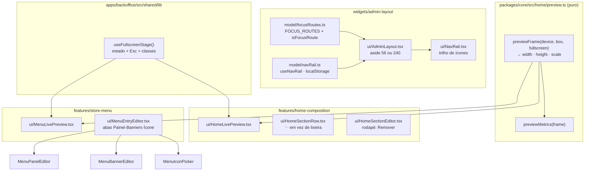

# Painel em foco — Design

**Spec**: `.specs/features/47-painel-em-foco/spec.md`
**Status**: Draft

---

## Decisões de projeto que restringem este design

Lidas de `.specs/STATE.md` `## Decisions` antes de qualquer escolha. Nenhuma é superada aqui —
todas são **conformadas**.

| Decisão | O que ela obriga | Como este design conforma |
| --- | --- | --- |
| **AD-020** | A prévia é a **loja num iframe**. O painel **não desenha** seção da Home — "nem esquema, nem mini-mapa, nem *só um fallback para quando o iframe não carrega*" | A tela cheia é um **modo do palco existente**, não uma superfície nova. O estado de falha do iframe fica fora de escopo **por decisão**, não por esquecimento (`FOCO-22`) |
| **AD-029** | Nenhuma seção da Home é indelével; a recusa da última ativa é **do banco**, com a mensagem dele | O `⋯` e o rodapé do editor chamam o **mesmo** `deleteSection`; nada antecipa a regra (`FOCO-27`) |
| **AD-033** | Regra compartilhada por dois consumidores do **mesmo app** vai para `entities/` (ou camada abaixo), não para `packages/core` | A mecânica React da tela cheia vai para `apps/backoffice/src/shared/lib/`. A **geometria** vai para `core/home/preview.ts` por outro motivo — ver `TD-03` |
| **AD-025** | Contador e o dado que ele conta têm de sair do **mesmo predicado** | O contador da aba *Banners* lê a mesma fonte que o `MenuBannerEditor` (`FOCO-32`) |
| **AD-028** | O menu é curado **por dispositivo**; trocar de dispositivo troca o que se edita | Trocar de dispositivo remonta o card de abas e volta para *Painel* (`FOCO-30`) |

---

## Architecture Overview

Três mudanças estruturais e quatro locais. As três estruturais:

1. **`AdminLayout` ganha um segundo estado de largura**, decidido por uma lista de rotas que mora ao
   lado de `navGroups` — a mesma fonte que a navegação já usa.
2. **O palco da prévia ganha um modo**, não um componente. `fixed inset-0` sobre a própria `<section>`
   que já existe — sem portal, sem remontagem, logo sem recarregar o iframe.
3. **A geometria do quadro vira uma função só**, em `core/home/preview.ts`, que já é o dono de
   `PREVIEW_DEVICES`/`previewScale` e já tem os dois palcos como consumidores.



---

## Code Reuse Analysis

### O que já existe e é aproveitado

| Peça | Onde | Como é usada |
| --- | --- | --- |
| `navGroups`, `footerNavItems` | `widgets/admin-layout/model/navItems.ts` | **Fonte única** dos destinos do trilho. O trilho não declara item nenhum (`FOCO-02`) |
| `isNavActive` | `widgets/admin-layout/lib/isNavActive.ts` | Marca o destino atual no trilho **e** decide se a rota pede foco |
| `navCollapse.ts` | `widgets/admin-layout/model/` | **Molde**, não dependência: mesma forma de hook (`useState` inicializado do storage, `try/catch` mudo, valor guardado é o que DIFERE do padrão). Chave e módulo separados (`FOCO-11`) |
| `PREVIEW_DEVICES`, `previewScale`, `previewSrc` | `packages/core/src/home/preview.ts` | Estendido, não substituído |
| `usePreviewBridge` / `useMenuPreviewBridge` | `features/*/model/` | Intocados. É o que garante `FOCO-21` continuar valendo — a ponte não sabe que existe tela cheia |
| `Tabs` (Radix/shadcn) | `@estrelinha/ui/tabs` | O card de abas da entrada de menu |
| `DropdownMenu` | `@estrelinha/ui/dropdown-menu` | O `⋯` da linha de seção |
| `Tooltip` | `@estrelinha/ui/tooltip` | O rótulo de cada ícone do trilho |
| `PageHeader` (`actions`) | `shared/ui/` | Recebe o selo "Salvando…" (`FOCO-33`) |
| Alternador `abas-mobile` | `AdminHomePage.tsx` | **Molde** para as abas do menu — com a forma trocada por `FOCO-37` |

### Pontos de integração

| Sistema | Como conecta |
| --- | --- |
| `localStorage` | Chave nova `estrelinha.admin.nav-rail`, ao lado de `estrelinha.admin.nav-collapsed`. **Não** compartilham leitura nem escrita |
| Ponte `postMessage` painel ↔ loja | Nenhuma mensagem nova. A tela cheia é CSS |
| Banco | **Nenhuma migration.** Esta feature não escreve no servidor |

---

## Abordagens consideradas (as duas decisões não óbvias)

### Como o layout sabe que a rota pede foco

| # | Abordagem | Prós | Contras | Veredito |
| --- | --- | --- | --- | --- |
| **A** | **Constante de rotas em `widgets/admin-layout/model/focusRoutes.ts`**, casada com `isNavActive` | Sem provider, sem efeito, **sem piscada**; vizinha de `navGroups`, que já é o dono de "quais rotas a navegação conhece" | O widget passa a conhecer duas rotas por nome | ✅ **Escolhida** |
| B | A página pede por contexto (`useFocusMode()` num `useEffect`) | Quem quer foco é quem pede; acrescentar uma terceira página não toca o layout | O layout renderiza **antes** do efeito da página: o trilho apareceria expandido por um quadro e recolheria depois. Piscada visível a cada navegação | ❌ |
| C | `handle` da rota + `useMatches()` | Declarativo, colocado junto da rota em `App.tsx` | **Indisponível de fato**: exige data router (`createBrowserRouter`); o app usa `BrowserRouter`. Migrar o router está fora de escopo | ❌ (por fato) |

### Como a largura do `<aside>` convive com o guarda

`AdminLayout.test.tsx` lê as classes do `<aside>` por `className="([^"]*)"` — **string literal**.
Tornar a largura dinâmica quebra a **âncora**, que passaria a medir string vazia.

| # | Abordagem | Veredito |
| --- | --- | --- |
| **A1** | `className={cn('…invariantes…', recolhido ? 'w-14' : 'w-60')}` **e estender `classesDe`** para concatenar os literais dentro de `cn(...)` | ✅ **Escolhida.** O ponto cego é real e vale para qualquer refator futuro para `cn()`: consertá-lo agora tira uma armadilha do repositório. A extensão mantém âncora **e** sensor |
| A2 | `className` literal + largura por `style={{ width }}` | ❌ Guarda intacto por acidente: o ponto cego continua lá, esperando o próximo `cn()`. E tira do Tailwind um valor que tem variante responsiva ao lado |

---

## Components

### `focusRoutes.ts` *(novo)*

- **Purpose**: dizer quais rotas do painel pedem o modo de foco.
- **Location**: `apps/backoffice/src/widgets/admin-layout/model/focusRoutes.ts`
- **Interfaces**:
  - `FOCUS_ROUTES: readonly string[]` — `['/admin/home', '/admin/menu']`
  - `isFocusRoute(pathname: string): boolean` — verdadeiro para a rota e suas subrotas
- **Dependencies**: `isNavActive`
- **Reuses**: `isNavActive` — a mesma função que marca o item ativo. Duas réguas de "esta rota é
  aquela" discordariam no dia em que uma subrota nova aparecesse.

### `navRail.ts` *(novo)*

- **Purpose**: a preferência de trilho recolhido/expandido.
- **Location**: `apps/backoffice/src/widgets/admin-layout/model/navRail.ts`
- **Interfaces**:
  - `STORAGE_KEY = 'estrelinha.admin.nav-rail'`
  - `readExpanded(storage: Storage): boolean` — `true` **somente** quando o valor é `'expandido'`
  - `useNavRail(focus: boolean, storage?: Storage): { recolhido: boolean; alternar: () => void }`
- **Dependencies**: nenhuma além de `react`
- **Reuses**: molde de `navCollapse.ts` — `try/catch` mudo nos dois lados, estado inicializado do
  storage uma vez.
- **Regra**: `recolhido = focus && !expandido`. Fora de rota de foco, **sempre** `false` — a
  preferência existe, mas não tem efeito (`FOCO-07`).
- **Escrita**: `alternar()` grava `'expandido'` ou **remove** a chave (`A-01`).

### `NavRail.tsx` *(novo)*

- **Purpose**: desenhar o trilho de 56px.
- **Location**: `apps/backoffice/src/widgets/admin-layout/ui/NavRail.tsx`
- **Interfaces**: `({ pathname, onExpand }: { pathname: string; onExpand: () => void })`
- **Dependencies**: `navGroups`, `footerNavItems`, `isNavActive`, `Tooltip`
- **Reuses**: a **mesma** lista da sidebar. Os cabeçalhos de grupo viram separadores de 1px — o
  grupo não desaparece, perde o rótulo.
- **Medidas**: caixa de **44 × 44**, glifo de 18, marcador ativo de 3 × 22 na borda esquerda.

### `AdminLayout.tsx` *(alterado)*

- **Purpose**: escolher entre trilho e sidebar.
- **Mudança**: `<aside className={cn(INVARIANTES, recolhido ? 'w-14' : 'w-60')}>` com o conteúdo
  ramificado (`<NavRail/>` ou `<NavContent/>`). O botão de recolher entra no `NavContent` **só
  quando a rota pede foco**.
- **Invariantes que não se movem**: `sticky top-0 self-start h-screen`, `hidden md:block`, o `<nav>`
  com `flex-1 min-h-0 overflow-y-auto`, a raiz sem `h-screen`/`overflow-hidden`, a barra do celular
  `sticky`.

### `previewFrame` em `core/home/preview.ts` *(estendido)*

- **Purpose**: o **único** dono de "que tamanho tem o quadro da prévia".
- **Location**: `packages/core/src/home/preview.ts`
- **Interfaces**:
  ```ts
  export interface PreviewBox { width: number; height: number }
  export interface PreviewFrame { width: number; height: number; scale: number }
  export const previewFrame = (
    device: PreviewDevice,
    box: PreviewBox,
    fullscreen: boolean,
  ): PreviewFrame
  export const previewMetrics = (frame: PreviewFrame): string  // "1024 × 948 · 100%"
  ```
- **Regras**:
  - `mobile`, em qualquer modo: `390 × 844`, escala `min(previewScale(box.w − FOLGA, 390), previewScale(box.h − FOLGA, 844))`.
  - `desktop`, normal: `1024 × 768`, mesma conta pelas duas dimensões.
  - `desktop`, tela cheia: `width = 1024`, `scale = 1`, `height = max(768, box.height − FOLGA)`.
- **Dependencies**: nenhuma. **Puro** — `catalog.test.ts` proíbe React e Supabase em `core/home`.
- **Por que em `core` e não em `entities`, dado `AD-033`**: ver `TD-03`.

### `useFullscreenStage` *(novo)*

- **Purpose**: o estado da tela cheia e a tecla que sai dela.
- **Location**: `apps/backoffice/src/shared/lib/useFullscreenStage.ts`
- **Interfaces**: `(): { cheia: boolean; entrar: () => void; sair: () => void; classes: string }`
- **Dependencies**: `react`
- **Reuses**: precedente de `BL-009` — o que dois `features/` precisam mora em `shared/lib`, porque
  `features/` não importa de `features/`.
- **Regra**: `classes` devolve a string do modo cheio (`fixed inset-0 z-50 rounded-none`) ou a
  vazia. Mora aqui para os dois palcos **não poderem divergir** na medida.

### `HomeLivePreview` / `MenuLivePreview` *(alterados)*

- **Mudança**: `<section>` recebe `cn(CLASSES_DE_HOJE, classes)`; a barra ganha o botão
  Tela cheia / Sair; a métrica passa a vir de `previewMetrics(previewFrame(...))`.
- **Invariante crítica (`FOCO-21`)**: o `<iframe>` **não muda de lugar na árvore React** e o `src`
  **não muda**. A tela cheia é CSS na `<section>`; nenhum ramo condicional envolve o iframe.
- **`FOCO-20`**: `onSelect` do `HomeLivePreview` passa a `sair()` antes de chamar o callback da
  página.

### `MenuEntryEditor.tsx` *(novo)*

- **Purpose**: os três editores da entrada selecionada, num card com abas.
- **Location**: `apps/backoffice/src/features/store-menu/ui/MenuEntryEditor.tsx`
- **Interfaces**: `({ surface, host, categories, onToggleChild, onSaveBanners, onIcon })`
- **Dependencies**: `Tabs`, e os três editores de hoje **sem alteração interna**
- **Reset (`FOCO-30`)**: `key={`${surface}:${host.id}`}` no `<Tabs>` — remontar zera a aba **e** o
  estado interno dos editores (`mostrarTodas` do `MenuPanelEditor`), que é o que se quer ao trocar
  de entrada.
- **Nome**: **não** contém `Preview` — `previaUnica.test.ts` recusa um segundo arquivo `*Preview`
  em `store-menu/ui`.

### `HomeSectionRow.tsx` *(alterado)* e `HomeSectionEditor.tsx` *(alterado)*

- **Linha**: a lixeira sai; entra `DropdownMenu` com gatilho `⋯` em
  `opacity-0 group-hover:opacity-100 group-focus-within:opacity-100`. **`opacity-0` continua
  focável e tabulável** — é o que faz `FOCO-24` valer sem `hover`.
- **Editor**: ação destrutiva no rodapé, chamando o **mesmo** `onRemove` (`FOCO-26`).

---

## Data Models

Nenhum. Esta feature não toca banco, não cria coluna e não escreve no servidor. O único dado
persistido é uma chave de `localStorage`:

```ts
// estrelinha.admin.nav-rail
type NavRailPreference = 'expandido' | /* chave ausente */ undefined
```

---

## Error Handling Strategy

| Cenário | Tratamento | O que a pessoa vê |
| --- | --- | --- |
| `localStorage` lança ao ler (aba anônima, política de site) | `try/catch` devolve o padrão | O trilho recolhido na rota de foco, como se fosse a primeira visita |
| `localStorage` lança ao gravar (cota) | `try/catch` mudo; o estado em memória vale para a sessão | O trilho alterna normalmente; ao recarregar volta ao padrão |
| Valor gravado diferente de `'expandido'` | Lido como ausente | Padrão da rota |
| `VITE_STORE_URL` ausente | `previa-sem-loja` como hoje, **sem** botão de tela cheia | A mensagem de configuração de hoje, sem um botão que não faria nada |
| Seção removida pelo `⋯` enquanto o editor dela está aberto | Comportamento de hoje: `sectionId` inexistente cai na lista | A lista, sem tela de erro |
| Recusa do banco ao remover a última seção ativa | `avisar()` com a mensagem **do banco** | O texto que o `guard_last_active_home_section` devolve |

---

## Risks & Concerns

| Preocupação | Onde | Impacto | Mitigação |
| --- | --- | --- | --- |
| **`classesDe` é cego a `className={cn(...)}`** — a âncora passaria a medir string vazia | `apps/backoffice/src/widgets/admin-layout/ui/AdminLayout.test.tsx:~220` | A pior falha possível num teste que lê fonte: verde sobre nada. E a armadilha vale para **qualquer** refator futuro, não só este | Task própria: estender `classesDe`, manter a âncora, **e** provar por sensor que a declaração antiga reprova. Feito **antes** de mexer no `AdminLayout.tsx` |
| **`AdminMenuPage` não tem altura de tela** — a prévia rola junto com três editores | `apps/backoffice/src/pages/admin/AdminMenuPage.tsx:~250` | É metade da queixa no menu, e não estava nomeada no pedido | `FOCO-13`. O número (`11rem`) é copiado de `/admin/home`, **e precisa de prova em navegador**: os dois `PageHeader` têm subtítulos de comprimentos diferentes, e um que embrulhe em duas linhas faz o corpo estourar a viewport |
| **`MenuIconPicker` usa célula fixa `h-[76px] w-[100px]`** | `apps/backoffice/src/features/store-menu/ui/MenuIconPicker.tsx:44` | Mudando da coluna da direita (~712px) para dentro de um card de 440px, 4 células por fileira somam 400px + gaps e podem estourar | Conferir que o contêiner embrulha; se não embrulhar, a correção é no contêiner do card, **não** na medida da célula |
| **`HomeSectionRow` carrega um `SPEC_DEVIATION` sobre `TAP_44`** | `HomeSectionRow.tsx:~100` | Tentar "padronizar" copiando `TAP_44` da loja criaria um segundo dono da medida — exatamente o que `touchTarget.test.ts` existe para impedir | Os 44px do trilho são declarados **em classe própria** e asseridos em `AdminLayout.test.tsx`. `TAP_44` **não** é copiado |
| **jsdom devolve 0 para layout e não tem `ResizeObserver`** | os dois palcos | Nenhum teste de componente consegue provar que a tela cheia mede 1024×N a 100% | A geometria é **função pura em `core`**, testada lá com caixas sintéticas. O teste de componente prova o **fio**: que a métrica exibida vem de `previewFrame`, e que o botão alterna o modo |
| **Teste que monta a própria árvore não prova fiação** (lição da `44`) | testes novos dos palcos e do layout | Apagar `<NavRail/>` do `AdminLayout` ou o botão da barra poderia deixar a suíte verde | Todo teste de fio renderiza **a página/o layout real**, nunca uma composição escrita dentro do arquivo de teste |
| **`FOLGA = 40` tem DOIS donos** — achado ao ler o código para este design | `HomeLivePreview.tsx:33` e `MenuLivePreview.tsx:31` | Defeito 01 em miniatura: mudar a folga num palco e não no outro faz as duas prévias escalarem diferente, com build, `tsc` e testes verdes | `previewFrame(device, box, fullscreen)` recebe a **caixa** e aplica a folga **dentro de `core`**. As duas constantes são **apagadas**, e uma asserção recusa a volta de `FOLGA` a `apps/backoffice/**` |

---

## Tech Decisions

| # | Decisão | Escolha | Racional |
| --- | --- | --- | --- |
| TD-01 | Quem sabe que a rota pede foco | `focusRoutes.ts` no widget, casado por `isNavActive` | Sem piscada; vizinho de `navGroups`, que já é dono de "quais rotas a nav conhece" |
| TD-02 | Largura do `aside` | `cn()` + guarda estendido | Consertar o ponto cego vale mais que contorná-lo |
| TD-03 | Onde mora a **geometria** do quadro, dado que `AD-033` manda `entities/` para dois consumidores do mesmo app | **`packages/core/src/home/preview.ts`** | `AD-033` decide onde nasce regra **nova**. Esta não é nova: `PREVIEW_DEVICES`, `previewScale` e `previewMetrics` **já moram lá** e **já têm os dois palcos como consumidores** — `MenuLivePreview` importa de `@estrelinha/core/home` hoje. Pôr o caso da tela cheia noutro lugar partiria a regra em dois donos, que é o defeito 01. `AD-033` não é superada: ela continua valendo para regra sem dono prévio |
| TD-04 | Onde mora a **mecânica React** da tela cheia | `apps/backoffice/src/shared/lib/useFullscreenStage.ts` | Dois `features/` precisam dela e `features/` não importa de `features/`. Precedente literal: `BL-009`, quando `uploadImageBlob` fez o mesmo caminho |
| TD-05 | Tela cheia: CSS ou portal? | **CSS** (`fixed inset-0` na `<section>` que já existe) | Portal reparenta o nó, React remonta, o iframe recarrega e o rascunho da ponte se perde — que é o defeito que `PRV-13` já custou uma vez |
| TD-06 | Um palco compartilhado (`shared/ui/PreviewStage`) em vez de um hook? | **Não** | Os dois palcos diferem de verdade (alternador de dispositivo × selo estático). Extrair o invólucro inteiro é refator maior que a feature, e criaria um componente que teria de conhecer os dois casos |
| TD-07 | As abas de vista do menu têm forma **diferente** das da Home | Sim, e a assimetria é declarada | No menu elas ficam logo abaixo de uma pílula segmentada (Computador/Celular); na Home não há colisão — o alternador de dispositivo mora dentro do palco. A forma segue a colisão, não uma regra global. **Trade-off aceito**: quem abre as duas telas no celular vê dois alternadores de vista com formas diferentes |
| TD-08 | Reset da aba ao trocar de entrada | `key` no `<Tabs>` | Remontar zera a aba **e** o estado interno dos editores — que é o comportamento correto ao trocar de entrada, e sai de graça |

> **Nenhuma destas vira `AD-NNN`.** `TD-03` é a única candidata, e ela **aplica** `AD-033` em vez de
> criar convenção nova — o critério ("a regra já tem dono?") já estava implícito no defeito 01 do
> `CLAUDE.md`. Se a execução mostrar que a distinção precisa ser escrita, a decisão nasce no fecho,
> como `AD-034`.

---

## Matriz de cobertura de teste

Cada requisito tem um lugar onde é provado, e o tipo de prova. Requisito sem linha aqui é requisito
sem teste.

| Requisito | Onde | Tipo |
| --- | --- | --- |
| FOCO-01, 03, 04, 07, 08 | `AdminLayout.test.tsx` | Componente, renderizando o **layout real** em cada rota |
| FOCO-02 | `AdminLayout.test.tsx` | Componente + **âncora de contagem** derivada de `navGroups` |
| FOCO-05, 06, 11 | `navRail.test.ts` | Unitário, com `Storage` dublê que lança |
| FOCO-09, 10 | `AdminLayout.test.tsx` | **Lê o fonte do disco**, com âncora e sensor |
| FOCO-12, 13, 14 | `AdminHomePage.test.tsx`, `AdminMenuPage.test.tsx` | Lê a declaração da grade do disco (jsdom não mede layout) |
| FOCO-16, 17, 18 | `packages/core/src/home/__tests__/preview.test.ts` | **Unitário puro**, caixas sintéticas, incluindo `box.height` menor que 768 |
| FOCO-15, 19, 20, 21 | `HomeLivePreview.test.tsx`, `MenuLivePreview.test.tsx` | Componente; `FOCO-21` provado por **identidade do nó** do iframe antes/depois |
| FOCO-22 | `previaUnica.test.ts` | Varredura de fonte, **sem afrouxar asserção nenhuma** |
| FOCO-23, 24, 25, 26, 27 | `HomeSectionList.test.tsx`, `HomeSectionEditor` | Componente, incluindo alcance por `Tab` sem hover |
| FOCO-28 … FOCO-32 | `MenuEntryEditor.test.tsx` | Componente |
| FOCO-33, 34 | `AdminMenuPage.test.tsx` | Componente; ausência do nó, não invisibilidade |
| FOCO-35, 36, 37 | `AdminMenuPage.test.tsx` | Componente + régua de forma dos dois alternadores |

**O que jsdom não alcança, e portanto fica para a prova em navegador**: as larguras reais (440/872),
a escala de 81% e de 100%, o trilho de 44px sob o dedo em 768, e o corpo do menu não estourar a
viewport com `11rem`.
