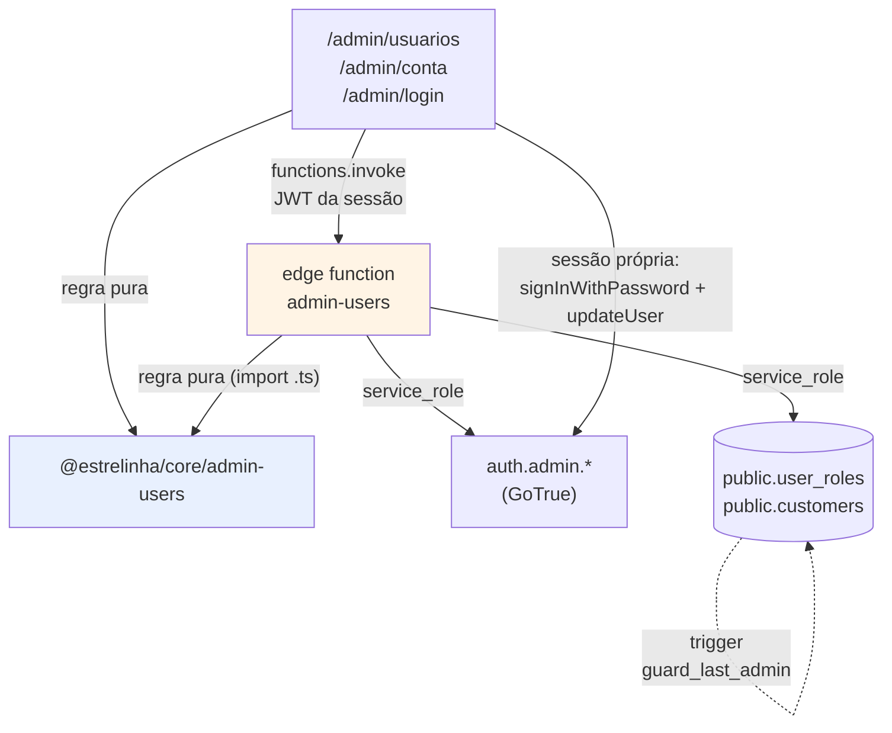

# Usuários do painel — design

**Spec**: `.specs/features/48-usuarios-do-painel/spec.md`
**Status**: Draft

---

## Architecture Overview

Três camadas, e a divisão segue a regra nº 1 do defeito 01: **regra que dois consumidores leem mora
em `packages/core`**. Aqui os dois consumidores existem desde o primeiro dia — o painel (Vite) e a
edge function (Deno) —, então `core/admin-users` não é antecipação, é o caso literal.



**O que NÃO passa pela function, de propósito:** trocar a **própria** senha e o fluxo de
recuperação. Os dois agem sobre a sessão de quem está logada e a chave publicável basta — mandá-los
pela function daria à `service_role` um trabalho que o próprio usuário tem permissão de fazer, e
criaria um segundo caminho para a mesma troca de senha.

### Abordagens consideradas

| # | Abordagem | Veredito |
| --- | --- | --- |
| **A** | **Edge function nova `admin-users`**, molde `AD-004` (`handlers.ts` testável em vitest, `index.ts` só wiring), `verify_jwt = false` + `has_role` manual | **Escolhida.** É o único caminho em que a `service_role` fica no servidor. O molde já existe e tem dublês prontos em `_shared/testing/fakes.ts` |
| B | RPC `security definer` em SQL, inserindo direto em `auth.users` com `pgcrypto` | **Recusada.** Escreveria em `auth.users` por fora do GoTrue — sem `identities`, sem a contabilidade de sessão, com o hash feito à mão. É a forma de criar contas que funcionam até a primeira troca de senha |
| C | Mais uma `action` na `send-notification` | **Recusada.** `AD-005` define aquela function como o motor de e-mail transacional. Pendurar gestão de identidade ali junta dois domínios num deploy só e faz o redeploy de um arriscar o outro |

---

## Code Reuse Analysis

### O que já existe e vamos usar

| Peça | Onde | Como |
| --- | --- | --- |
| Molde de handler testável | `supabase/functions/send-notification/handlers.ts` | Copiar a **estrutura** (`Deps`, `route`, `corsHeaders`, `json`, `requireAdmin`, `currentUser`, `log`) — inclusive a decisão de checar papel pela RPC `has_role` e não por leitura própria de `user_roles` |
| Dublês de teste | `supabase/functions/_shared/testing/fakes.ts` | `createFakeSupabase` já cobre `auth.getUser`, `from`, `rpc`. **Precisa ganhar `auth.admin.*`** — extensão mínima, só a superfície que os handlers usam |
| Tradutor de erro do GoTrue | `packages/core/src/auth/errors.ts` (`authErrorMessage`) | Todas as telas de senha. Já tem `weak_password`, `same_password`, `invalid_credentials`, `over_email_send_rate_limit` |
| Troca de senha e recuperação | `packages/auth/src/AuthContext.tsx` | `updatePassword`, `resetPassword`, `verifyRecoveryCode` **já existem e não têm consumidor no painel**. A feature liga os três |
| Mínimo de senha | `packages/core/src/constants.ts` (`MIN_PASSWORD_LENGTH`) | Uma constante, três telas. Espelha `minimum_password_length` do `config.toml` |
| Tabela e vazio do painel | `@/shared/ui` (`AdminTable`, `EmptyState`, `PageHeader`, `FormCard`, `FieldGroup`) | `/admin/usuarios` e `/admin/conta` |
| Molde de hook CRUD | `features/faq-library/api/useAdminFaqs.ts` | Mesma forma: `{ loading, error, refetch, create, update, remove }`, recusa como `string \| null`, e `error` separado de "lista vazia" (`AD-014`) |
| Diálogo de editor | `features/faq-library/ui/FaqEditorDialog.tsx` | Mesma forma do editor com recusa exibida em `role="alert"` |
| Invocação de function | `entities/order/api/notifyOrder.ts` | `supabase.functions.invoke('admin-users?action=…', { body })` — o client já anexa o JWT |
| Desfecho do login | `pages/admin/AdminLoginPage.tsx` (efeito `entrando`/`authLoading`) | O fluxo de recuperação **reusa o mesmo efeito** para navegar quando o papel resolve — `USR-42` é o desfecho do login normal por construção, não uma segunda cópia |

### Pontos de integração

| Sistema | Como conecta |
| --- | --- |
| `public.user_roles` | Fonte da verdade de quem é admin. A function lê e escreve com service role; a RLS existente (`admin full user_roles`) continua valendo para o painel |
| `public.has_role(uuid, app_role)` | A **mesma** função que toda policy do schema usa. A autorização da function chama a RPC, não uma leitura própria — senão haveria duas definições de "admin" |
| `handle_new_customer` (trigger) | Dispara ao criar a conta: grava `customers` e **adota pedidos órfãos do mesmo e-mail** (`A-07`). Não é alterado |
| Templates de e-mail do GoTrue | `recovery.html` já existe e manda código de 6 dígitos. A cópia dele diz "na loja" — a feature **não** altera o template; o `USR-39` dá ao painel a tela que consome o código |

---

## Components

### `@estrelinha/core/admin-users` — a regra pura

- **Purpose**: as recusas e a validação, num lugar só, lidas pelo painel e pela function.
- **Location**: `packages/core/src/admin-users/` (`refusals.ts`, `index.ts`, `__tests__/`)
- **Interfaces** (todas devolvem `string | null` — **nunca** união discriminada por booleano, que
  `strictNullChecks: false` não estreita):
  - `adminUserRefusal(input: { name: string; email: string; password?: string }): string | null` — `USR-05`, `USR-06`, `USR-21`
  - `passwordChangeRefusal(input: { current: string; next: string; confirm: string }): string | null` — `USR-11`, `USR-12`, `USR-23`
  - `selfTargetRefusal(actorId: string, targetId: string, acao: 'remover' | 'apagar'): string | null` — `USR-14`, `USR-34`
  - `lastAdminRefusal(totalAdmins: number): string | null` — `USR-15`, `USR-34`
  - `accountHistoryRefusal(counts: AccountHistory): string | null` — `USR-32`, `USR-33`
  - `EMAIL_RE`, `normalizeEmail(raw: string): string` — o `trim` + `toLowerCase` num dono só
- **Dependencies**: `../constants.ts` (`MIN_PASSWORD_LENGTH`). Nada mais.
- **Regra de import obrigatória**: **todo** especificador relativo leva `.ts` explícito, inclusive
  `import type` — é o que torna o módulo alcançável pelo Deno (medido na feature `33`). Um teste de
  pureza (`purity.test.ts`, molde de `core/shopping`) recusa React, Supabase e Deno no diretório.

### `supabase/functions/admin-users/` — a porta única

- **Purpose**: tudo que exige `service_role`: listar, criar, editar, revogar, apagar, reenviar senha.
- **Location**: `handlers.ts` (roteamento + regra de I/O, testável em vitest) e `index.ts` (só
  wiring: env, `createClient`, `Deno.serve`) — `AD-004`.
- **Interfaces** (`?action=`, molde `melhor-envio`/`send-notification`):

| Action | Corpo | Devolve | ACs |
| --- | --- | --- | --- |
| `list` | — | `{ users: AdminUserRow[] }` | `USR-20`, `USR-26` |
| `create` | `{ name, email, password }` | `{ user }` ou `{ error }` | `USR-04`…`USR-08`, `USR-21` |
| `update` | `{ id, name, email }` | `{ user }` ou `{ error }` | `USR-28`, `USR-29` |
| `revoke` | `{ id }` | `{ ok: true }` ou `{ error }` | `USR-13`…`USR-15` |
| `delete` | `{ id }` | `{ ok: true }` ou `{ error }` | `USR-31`…`USR-34` |
| `reset-password` | `{ id }` | `{ ok: true }` ou `{ error }` | `USR-18`, `USR-30` |

- **Autorização**: `requireAdmin` idêntico ao da `send-notification` — 401 sem header / com anon key,
  403 sem papel, **403 também quando a RPC erra** (`USR-19`). `verify_jwt = false` no `config.toml`,
  com o comentário explicando que `true` seria teatro (a anon key é JWT válido do projeto).
- **Como lista** (`USR-20`): lê `user_roles` filtrando `role = 'admin'` (tabela pequena), e resolve
  cada id por `auth.admin.getUserById`. **Não** usa `listUsers`, que é paginado e traria a base
  inteira de clientes para filtrar no cliente.
- **Compensação de falha parcial** (`USR-08`): `createUser` → `insert user_roles`. Se o insert falha,
  `deleteUser(id)` desfaz e a resposta é erro. Sem isso sobra uma conta de loja criada por engano.
- **Dependencies**: `../../../packages/core/src/admin-users/index.ts` (caminho relativo com extensão,
  como as irmãs), client service-role com `auth: { autoRefreshToken: false, persistSession: false }`.

### Migration `20260913120000_48-usuarios-do-painel.sql`

- **Purpose**: tornar **impossível** o painel ficar sem admin, no único lugar que uma requisição
  forjada não contorna.
- **Conteúdo**:
  - `public.guard_last_admin()` — `BEFORE DELETE OR UPDATE ON public.user_roles`, dispara só para
    linhas com `role = 'admin'`, e **decide por contagem**: `count(*) FILTER (WHERE role = 'admin')`
    restante. Nunca pela identidade da linha — é a mesma régua de
    `guard_last_active_home_section` (`AD-029`), e pela mesma razão: identidade envelhece, contagem
    não.
  - `COMMENT ON FUNCTION` explicando por que existe.
  - **Aditiva e idempotente**: `CREATE OR REPLACE FUNCTION` + `DROP TRIGGER IF EXISTS` antes do
    `CREATE TRIGGER`. Nenhum `INSERT`/`UPDATE`/`DELETE` de dado.
  - Nenhum `grant` novo a `anon`.

### Painel — `features/admin-users/`

| Arquivo | Papel |
| --- | --- |
| `api/useAdminUsers.ts` | Hook no molde de `useAdminFaqs`: `{ users, loading, error, refetch, create, update, revoke, remove, resetPassword }`, recusa `string \| null`, `error` distinto de vazio |
| `ui/AdminUserEditorDialog.tsx` | Criar e editar. Chama `adminUserRefusal` **antes** de gravar (a mesma que a function chama) |
| `ui/DeleteAccountDialog.tsx` | `USR-35` — confirmação digitando o e-mail; botão desabilitado enquanto não casa |
| `pages/admin/AdminUsersPage.tsx` | `/admin/usuarios` — `AdminTable` + `EmptyState` |

### Painel — `features/account/`

| Arquivo | Papel |
| --- | --- |
| `ui/ChangePasswordCard.tsx` | Três campos + mostrar/ocultar. Recusa por `passwordChangeRefusal` antes de qualquer rede |
| `pages/admin/AdminAccountPage.tsx` | `/admin/conta` — quem é você, e o cartão de senha |

**A troca em si** entra em `packages/auth/src/AuthContext.tsx` como
`changeOwnPassword(current, next): Promise<{ error: string \| null }>`:

```
1. passwordChangeRefusal(...)            → recusa local, zero rede            (USR-11, USR-12, USR-23)
2. signInWithPassword(user.email, current) → prova a senha atual              (USR-10)
3. updateUser({ password: next })        → troca                              (USR-09)
```

O passo 2 substitui a sessão por outra **do mesmo usuário** — `resolvedFor.current === u.id` no
`AuthContext`, então não pisca `loading` e ninguém é deslogado. Errar a senha atual **não** derruba a
sessão existente: o supabase-js não limpa a sessão num `signInWithPassword` que falha.

### Painel — recuperação em `/admin/login`

`features/account/ui/ForgotPasswordFlow.tsx`, três passos (`email` → `codigo` → `senha`), consumindo
`resetPassword`, `verifyRecoveryCode` e `updatePassword` do `AuthContext` — os três **já existem e
hoje não têm chamador no painel**. O desfecho reusa o efeito `entrando`/`authLoading` que já mora em
`AdminLoginPage`, e é por isso que `USR-42` sai de graça em vez de virar uma segunda cópia da regra
de "para onde ir depois de entrar".

---

## Data Models

```typescript
/** O que `?action=list` devolve. Campos ESCOLHIDOS: nada de `raw_user_meta_data` inteiro. */
export interface AdminUserRow {
  id: string
  email: string
  name: string
  created_at: string
  last_sign_in_at: string | null
  /** Quem está pedindo. A tela usa para desabilitar "remover" e "apagar" em si mesma. */
  is_self: boolean
}

/** O que bloqueia apagar uma conta. Cada campo é uma FK real, medida no schema. */
export interface AccountHistory {
  pedidos: number            // orders.customer_id -> customers.id (NO ACTION)
  notasDePedido: number      // order_notes.created_by
  mudancasDeStatus: number   // order_status_history.created_by
  notasDeCliente: number     // customer_notes.created_by
}
```

---

## Error Handling Strategy

| Cenário | Tratamento | O que a pessoa vê |
| --- | --- | --- |
| Sem JWT / anon key (`USR-01`, `USR-02`) | 401 antes de tocar em `auth.users` | "Sessão expirada. Entre novamente." |
| Autenticada sem papel (`USR-03`) | 403 | "Acesso restrito ao admin" |
| RPC `has_role` erra (`USR-19`) | **403** + log distinto | Igual ao acima — falha de verificação nunca vira permissão |
| E-mail já existe (`USR-07`) | Recusa antes de criar, com ramo para "já é admin" e "conta existe sem acesso" | Motivo acionável, não "erro ao salvar" |
| Papel não concedido após criar (`USR-08`) | `deleteUser` compensatório + erro | "Não foi possível concluir. Nada foi criado." |
| Último admin / si mesma (`USR-14`, `USR-15`, `USR-34`) | Recusa na function **e** trigger no banco | Motivo nomeando qual das duas regras barrou |
| Conta com histórico (`USR-32`) | Contagem **antes**, recusa nomeando o que bloqueia | "…tem 3 pedidos e 2 notas. Use *Remover do painel*." |
| FK `23503` mesmo assim (`USR-33`) | Traduzido para o mesmo texto | Idem — o banco garante, a tela explica |
| Rate limit do reenvio (`USR-30`) | `authErrorMessage` → `over_email_send_rate_limit` | "Aguarde alguns segundos para reenviar" — e **não** "enviado" |
| GoTrue indisponível (`USR-26`) | `error` separado de lista vazia | `EmptyState` com o motivo e "Tentar de novo" |
| Qualquer erro do GoTrue numa tela de senha (`USR-24`) | `authErrorMessage` | Nunca `error.message` cru |

---

## Risks & Concerns

| Concern | Onde | Impacto | Mitigação |
| --- | --- | --- | --- |
| **A `service_role` key pode vazar para o bundle.** Errar isso não quebra nada: a tela funciona perfeitamente e entrega acesso total ao banco para qualquer visitante | `apps/backoffice/**` | Catastrófico e silencioso | Guarda `chaveDeServidorForaDoNavegador.test.ts` varrendo `apps/**` por `service_role`, `SUPABASE_SERVICE_ROLE_KEY` e `auth.admin.`, com âncora dupla e sensor (`USR-25`) |
| **`order_status_history` e `order_notes` têm policy `FOR ALL USING (true)`** — qualquer sessão autenticada lê e escreve | `20260415160758_order_tracking_and_history.sql:25,36` | Pré-existente, fora do escopo desta feature. Relevante aqui porque a contagem de `USR-32` lê essas tabelas **com service role**, então não depende da policy frouxa | Registrado. A contagem usa service role e não herda o buraco; consertar a policy é item de backlog próprio |
| **`customers.user_id` é `ON DELETE CASCADE`** — apagar a conta apaga a ficha da cliente | `20260414121021_…sql:61` | Apagar um admin que também comprou destruiria a ficha dela | `USR-32` conta pedidos **antes** e recusa; `orders.customer_id` (NO ACTION) é a garantia dura |
| **Revogar papel não encerra a sessão** — verificado: `signOut(jwt, scope?)` exige o JWT da pessoa, e não há logout por id no supabase-js 2.110.7 | `GoTrueAdminApi.d.ts:63` | O casco do painel pode ficar visível para quem perdeu o acesso até recarregar | Declarado em `A-06` e no `CLAUDE.md`. **Nada que ela faça grava** — toda policy de escrita chama `has_role`, avaliado por requisição |
| **`AuthContext` não re-resolve papel em `TOKEN_REFRESHED`** (`resolvedFor`) | `packages/auth/src/AuthContext.tsx:85` | É a causa direta de `A-06` | **Não mexer.** Aquele curto-circuito foi o conserto do `BUG-20260802`; trocá-lo reabriria um bug pior que a limitação |
| **`packages/auth` não tem script `test`** — teste posto lá é invisível ao `turbo run test` | `packages/auth/package.json` | `changeOwnPassword` nasceria sem cobertura | A **regra** (`passwordChangeRefusal`) mora em `core`, que roda vitest; a **fiação** é provada pelo teste do componente no backoffice, que renderiza a página real (nunca uma árvore montada no próprio teste) |
| **jsdom devolve 0 para layout** | toda a suíte | Nenhuma asserção desta feature mede largura ou sobreposição | Assumido: as telas são formulário e tabela, e o QA em 390×844 fica registrado como pendência, como nas features anteriores |

---

## Tech Decisions

| Decisão | Escolha | Razão |
| --- | --- | --- |
| Onde vive "quem é admin" | `public.user_roles`, lido pela RPC `has_role` | Já é a fonte de toda policy do schema. Uma segunda leitura própria criaria a segunda definição |
| Como a function lista | `user_roles` + `getUserById` por id | `listUsers` é paginado e traria a base inteira de clientes para filtrar depois |
| Invariante "nunca zero admins" | **Trigger no banco**, decidindo por contagem | É o único ponto que uma requisição forjada, o Studio e duas remoções simultâneas não contornam |
| A recusa duplicada (function + trigger) | Deliberada, com guarda que lê os dois | Molde de `materialTransitions.test.ts`: só o banco impede o forjado, só o TypeScript produz motivo legível |
| Forma dos vereditos | `string \| null` | `strictNullChecks: false` não estreita união por literal booleano. Molde de `menuTargetRefusal` |
| Troca da própria senha | Fora da function, na sessão do próprio usuário | Dar à `service_role` um trabalho que o usuário pode fazer criaria um segundo caminho para a mesma troca |

> **Decisão de nível de projeto:** a escolha de que **toda operação que exige `service_role` passa por
> edge function com `has_role` manual, e nenhum arquivo de `apps/**` toca `auth.admin.*`** vai para
> `.specs/STATE.md` como `AD-034`, porque vale para qualquer feature futura que precise mexer em
> identidade.

---

## Cobertura da spec

43 requisitos, todos com dono nesta página. Os que **não** viram código novo e sim reuso declarado:
`USR-42` (desfecho do login — reusa o efeito existente) e `USR-17` (a RLS já se comporta assim; o
requisito vira **prova**, não implementação).
