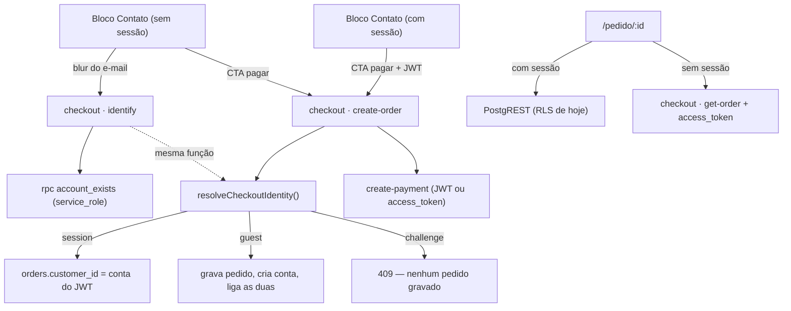

# Checkout sem conta — Design

**Spec**: `.specs/features/49-checkout-sem-conta/spec.md`
**Status**: Draft

---

## Decisões ativas que este design tem de obedecer

Lido de `.specs/STATE.md` `## Decisions` antes de qualquer escolha.

| Decisão | O que impõe aqui |
| --- | --- |
| **`AD-004`** | A edge function nova nasce partida: `index.ts` só faz wiring (env + client real + `Deno.serve`), `handlers.ts` recebe `Deps` por parâmetro e é testado em **vitest**, no workspace `@estrelinha/functions`. |
| **`AD-012`** | Tipo escrito à mão é afirmação. A gravação nova se prova com **probe HTTP contra o banco local**, nunca por `tsc` verde nem por teste que mocka o client. |
| **`AD-013`** | Um campo por dado. O documento do pagador continua sendo coletado **uma vez só** (Brick no cartão, campo no PIX) e continua chegando a `customers.cpf` **antes** do `create-payment`. Muda **quem grava**, não quem coleta. |
| **`AD-020`/`AD-021`** | Não se aplicam a esta feature (prévia da home e `Content-Type` entregue), mas a lição do `AD-021` vale no fecho: **a prova de que uma rota servida está de pé é o corpo entregue, nunca o status**. |
| **`AD-032`** | O que a function informa é o **gatilho** ("pedido criado"), nunca qual mensagem sai. Esta feature não acrescenta gatilho nenhum. |

### `AD-023` — conflito resolvido por **estreitamento**, não por revogação

`AD-023` decidiu que a lista de clientes é a view `customer_directory`, e o **trade-off escrito nela**
diz o oposto do que esta feature faz:

> *"A alternativa (criar linha em `customers` para cada convidada) seria escrever no banco para
> responder uma pergunta de leitura, e daria a ela um cadastro que ela nunca pediu."*

A premissa mudou por decisão do usuário: a partir da `49` **a convidada pede, sim, um cadastro** —
implicitamente, ao comprar. E, principalmente, a escrita deixou de ser "para responder uma pergunta
de leitura": ela existe para o pedido ter dono, `/conta` funcionar e `buildPayer` continuar tendo
uma fonte só de CPF.

**A decisão de `AD-023` continua `active` e não é superseded.** A lista continua sendo a view — que é
o ponto dela. O que muda é de qual lado da união a convidada entra: antes, sempre do ramo derivado;
agora, do ramo `customers`, **e o ramo derivado continua necessário** para (a) os pedidos importados
da Nuvemshop e (b) o pedido órfão que `CSC-08` deixa quando a criação da conta falha. Registrado como
**`AD-035`** em `.specs/STATE.md`, que nomeia `AD-023` e diz exatamente qual metade dele foi
estreitada.

> **Consequência verificável, e que precisa de asserção:** a view exclui do ramo derivado todo e-mail
> que já existe em `customers` (`WHERE NOT EXISTS …`). Sem isso, a convidada apareceria **duas vezes**
> na tela de Clientes a partir desta feature. O `WHERE NOT EXISTS` já existe desde a `35`; a tarefa é
> **provar que continua lá**, não escrevê-lo.

---

## Architecture Overview

Um servidor passa a ser o dono de "como nasce um pedido", e a identidade é decidida por **uma função
pura** que a tela e o servidor chamam igual.



**A peça que sustenta o desenho** é `resolveCheckoutIdentity`: `IDN-02` (a tela mostra o desafio) e
`IDN-08` (o servidor recusa) são a **mesma pergunta**. Escritas em dois lugares, divergiriam sem
build, `tsc` ou teste acusarem — o defeito 01 na forma exata que este repositório já pagou sete
vezes. Escritas em `packages/core`, a tela e a function chamam a mesma linha.

---

## Code Reuse Analysis

### O que já existe e não será reescrito

| Peça | Onde | Como entra |
| --- | --- | --- |
| `AuthCodeStep` | `store features/auth/ui/steps/` | Renderizado **inline** no bloco Contato. Lê tudo de `useAuthFlow`/`authUiStore`, então já funciona fora do overlay — com o mesmo reenvio e o mesmo cooldown de 60s (`IDN-03`). |
| `useAuthFlow.sendCode` / `submitCode` | `store features/auth/model/` | Enviam e verificam o código. Dono único de "enviar código" — o desafio inline **chama**, não reimplementa. |
| `AuthOverlay` + `useAuthUiStore.open({returnTo})` | `store features/auth/` | O convite "Entrar" abre isto (`ENT-02`). `finish()` já não navega quando `returnTo === location.pathname` — é o que entrega `ENT-03` sem escrever nada. |
| `handle_new_customer` | migration `35` | Cria a ficha em `customers` no `auth.users` insert **e adota pedido órfão pelo e-mail**. É o que faz `CSC-08` degradar com graça. |
| `customer_directory` | migration `35` | Continua sendo a lista do painel (`AD-023`). Nenhuma tela do painel muda. |
| `orders.customer_phone` / `customer_document` | migration `35` | Já são o lugar do telefone e do documento da convidada (`CSC-04`). Nenhuma coluna nova para isso. |
| `buildPayer` / `PGD-04` | `core/payment/payer.ts` + `mercado-pago/handlers.ts` | **Intocados.** O CPF chega a `customers.cpf` como sempre; só muda quem escreve lá. |
| `RETRYABLE_STATUSES` | `mercado-pago/handlers.ts` | Continua sendo o portão de "pode pagar" (`PED-07`). |
| `corsHeaders` / `json` | `mercado-pago/handlers.ts` | Sobem para `_shared/http.ts`; o arquivo do MP passa a **reexportar** deles (mesmo padrão de delegação do `AD-030`), para os dois não divergirem. |
| `resolveFlow` / `isContactComplete` | `core/checkout/blocks.ts` | Dono único de "bloco completo". `IDN-04` entra **dentro** dele, não ao lado. |
| `checkoutStore.invalidateOrder()` | `store features/checkout/model/` | Mecânica de `CHK-08` reusada por `IDN-07` — trocar de identidade invalida o pedido em curso. |

### Pontos de integração

| Sistema | Como conecta |
| --- | --- |
| GoTrue (admin) | `supabase.auth.admin.createUser({ email, email_confirm: false, user_metadata: { full_name } })`. Confirmado nos tipos instalados (`auth-js@2.110.7`): a API existe e **não envia e-mail de confirmação**. `user_metadata.full_name` é o que `handle_new_customer` lê. |
| `auth.users` | Nunca por `select` direto da aplicação. A pergunta "tem conta?" passa por `public.account_exists(text)`, `security definer`, com `execute` **só** para `service_role`. |
| Mercado Pago | Sem mudança de contrato. `create-payment` ganha uma segunda prova de posse, e nada mais. |

---

## Components

### `resolveCheckoutIdentity` — a regra que a tela e o servidor compartilham

- **Purpose**: responder "quem é quem está fechando este pedido?" com **uma** resposta.
- **Location**: `packages/core/src/checkout/identity.ts` (barrel `core/checkout`).
- **Interfaces**:
  - `type CheckoutIdentity = { kind: 'session' } | { kind: 'guest' } | { kind: 'challenge' }`
  - `resolveCheckoutIdentity(input: { hasSession: boolean; emailHasAccount: boolean }): CheckoutIdentity`
  - `checkoutIdentityRefusal(identity: CheckoutIdentity): string | null` — motivo legível, ou `null`.
- **Dependencies**: nenhuma. Puro.
- **Reuses**: o formato de recusa de `menuTargetRefusal`/`reservedSlugRefusal` — **`string | null`**, nunca união discriminada por booleano: com `strictNullChecks: false` ler `.reason` no ramo do `else` é TS2339. E `kind` discrimina por **literal de string**, que estreita.

> **Todo especificador relativo deste módulo leva `.ts` explícito, inclusive `import type`.** Ele é
> importado por Deno, e o grafo de **tipos** também é resolvido lá — é a armadilha medida na `33`.

### `guestAccess` — o token de posse do pedido

- **Purpose**: gerar, guardar e conferir a prova de que quem pede é dono do pedido, sem sessão.
- **Location**: `packages/core/src/checkout/guestAccess.ts`.
- **Interfaces**:
  - `newAccessToken(): Promise<string>` — 32 bytes de `crypto.getRandomValues`, base64url.
  - `hashAccessToken(token: string): Promise<string>` — SHA-256 hex (Web Crypto, existe em Deno e no vitest).
  - `accessGrant(order: { guest_access_hash: string; guest_access_expires_at: string }, token: string, now: Date): Promise<boolean>` — confere hash **e** validade.
- **Dependencies**: Web Crypto.
- **Reuses**: nada — é peça nova, e por isso nasce com teste próprio.

### Edge function `checkout`

- **Purpose**: a única porta que grava pedido e a única que responde "este e-mail tem conta?".
- **Location**: `supabase/functions/checkout/{index.ts,handlers.ts,__tests__/}`.
- **Interfaces** (query param `?action=`, molde de `melhor-envio`/`mercado-pago`):
  - `identify` → `{ email }` ⇒ `{ registered: boolean }`. Teto de **20 chamadas por IP em 5 minutos**; acima disso **429** (`IDN-09`).
  - `create-order` → payload do pedido + `client_request_id`, `Authorization` opcional ⇒ `{ order_id, access_token? }`.
  - `get-order` → `{ order_id, access_token }` ⇒ o pedido com os itens, ou 403.
- **Dependencies**: `Deps { supabase, env }` injetado (`AD-004`). `verify_jwt = false` no `config.toml` — a convidada não tem JWT nenhum.
- **Reuses**: `_shared/http.ts`, `resolveCheckoutIdentity`, `guestAccess`.

**A ordem dentro de `create-order` é requisito, não detalhe** (`CSC-08`):

1. valida o payload e resolve a identidade — **sem escrever nada**;
2. `challenge` ⇒ 409 e para aqui (`IDN-08`: nenhum pedido gravado);
3. grava `orders` + `order_items` (com `customer_id` da sessão, ou `null`);
4. sem sessão: cria a conta e **liga** `orders.customer_id` a ela;
5. grava CPF em `customers` e endereço em `addresses` (`PED-08`, `ADR-G1`);
6. responde.

Se (4) falhar, o pedido de (3) **continua válido e pagável** — órfão, que é exatamente o caso que
`customer_directory` e `handle_new_customer` já tratam desde a `35`. O inverso (conta antes do
pedido) deixaria uma conta órfã que faria a **próxima** tentativa da mesma pessoa cair num desafio de
código por um pedido que ela nunca fez.

### `create-payment` — a segunda prova de posse

- **Purpose**: aceitar quem paga sem sessão, sem afrouxar quem paga com sessão.
- **Location**: `supabase/functions/mercado-pago/handlers.ts` (bloco de ownership, hoje em `:268-297`).
- **Interfaces**: o corpo aceita `access_token?`. A regra vira: **JWT válido cujo `customers.user_id`
  casa** ⇒ ok; **senão**, `accessGrant(order, access_token, now)` ⇒ ok; **senão**, 403.
- **Reuses**: `guestAccess.accessGrant`. Nada do cálculo de preço, do `buildPayer` nem do webhook é
  tocado — e o gate confere isso por `git diff --name-only`.

### `SignInInvite` — o convite do board

- **Purpose**: oferecer "Entrar" sem obrigar (`ENT-01`…`ENT-07`).
- **Location**: `apps/store/src/features/checkout/ui/SignInInvite.tsx`.
- **Interfaces**: sem props — lê `useAuthContext().user` e chama `useAuthUiStore.open({ returnTo: '/checkout' })`.
- **Forma**: faixa em `bg-estrelinha-ground-deep` com ícone neutro, duas linhas de texto e botão de
  contorno à direita, `min-h-11`. Em 390px as duas linhas embrulham e o botão desce — sem rolagem
  horizontal do body.
- **Desvio deliberado do board**: o Paper lidera com o "G" do Google. O botão abre o overlay
  **inteiro** (código, senha, Google); marca de provedor prometeria um caminho só.
- **Copy**: sem urgência fabricada — o board dizia *"finaliza em 20 segundos"*, e a loja não vende
  pressa. Fica *"Já comprou aqui? Entre para preencher seus dados"* / *"Endereço e contato que você
  já salvou"*.

### `CheckoutSignInChallenge` — o desafio inline

- **Purpose**: `IDN-02`/`IDN-03` — avisar e pedir o código **dentro** do bloco Contato.
- **Location**: `apps/store/src/features/checkout/ui/CheckoutSignInChallenge.tsx`.
- **Interfaces**: `{ email: string }`. Ao montar, semeia `authUiStore` (`setEmail`, `returnTo:
  '/checkout'`) e chama `sendCode(email)` **uma vez**; renderiza `<AuthCodeStep />`.
- **Reuses**: `AuthCodeStep` inteiro. Não existe segundo campo de 6 dígitos nesta loja, e um guarda
  recusa que passe a existir.

### `useAccountLookup` — a consulta do e-mail

- **Purpose**: `IDN-01` — perguntar uma vez por e-mail normalizado, no blur, nunca a cada tecla.
- **Location**: `apps/store/src/features/checkout/api/useAccountLookup.ts`.
- **Interfaces**: `useAccountLookup(): { check(email): Promise<boolean>; known: Record<string, boolean> }`.
- **Dependencies**: React Query com `queryKey: ['account-exists', lower(email)]` e `staleTime:
  Infinity` — a dedup por e-mail é a do cache, não um `useRef` à mão.
- **Falha**: erro ou 429 ⇒ resolve `false` (`IDN-09`). Falhar para "não cadastrado" é seguro porque a
  recusa de verdade é a do servidor.

### `orderAccess` — o dono único do token no navegador

- **Purpose**: guardar e ler `estrelinha-order-access` num lugar só.
- **Location**: `apps/store/src/entities/order/model/orderAccess.ts`.
- **Interfaces**: `rememberAccess(orderId, token)`, `accessFor(orderId): string | null`, `forget(orderId)`.
- **Dependencies**: `localStorage`, sempre dentro de `try/catch` — navegador com storage bloqueado
  não pode derrubar a confirmação.

### `useCreateOrder` / `useOrder` — a fiação da loja

- `useCreateOrder`: troca o `insert` do PostgREST por `supabase.functions.invoke('checkout?action=create-order')`,
  mantendo a **mesma** forma de entrada. Passa `client_request_id` (um por tentativa de CTA,
  guardado no `checkoutStore` para a retentativa reusar — `PED-04`).
- `useOrder(id)`: com sessão, segue no PostgREST; sem sessão e com token guardado, vai por
  `get-order`. O hook é o dono único de "como leio um pedido".

---

## Data Models

### `orders` — três colunas novas

```sql
alter table public.orders
  add column if not exists client_request_id       text,
  add column if not exists guest_access_hash       text,
  add column if not exists guest_access_expires_at timestamptz;

create unique index if not exists idx_orders_client_request_id
  on public.orders (client_request_id)
  where client_request_id is not null;
```

- `client_request_id` — idempotência de `create-order` (`PED-04`). **Não é derivável de nada** que já
  exista, então não é um segundo dono: `idempotency_key` do `create-payment` é de outra operação
  (cobrar), com outro ciclo de vida.
- `guest_access_hash` — SHA-256 **hex** do token. O texto puro nunca toca o banco.
- `guest_access_expires_at` — criação + 7 dias.

### `public.account_exists(p_email text) returns boolean`

`security definer`, `set search_path = ''`, compara por `lower()`. `revoke execute … from public,
anon, authenticated` e `grant execute … to service_role` — a única porta é a edge function, que é
onde o teto por IP existe.

---

## Error Handling Strategy

| Cenário | Tratamento | O que a cliente vê |
| --- | --- | --- |
| `identify` falha ou 429 | resolve `false` (`IDN-09`) | nada — segue como convidada; a recusa vem do servidor |
| `create-order` devolve 409 `needs_otp` | a tela entra no desafio inline com o e-mail digitado | o aviso de conta existente e o campo de código |
| `create-order` falha por outro motivo | `toast.error(ORDER_FAILED_MESSAGE)`, rascunho e carrinho intactos (`CHK-09`) | a mensagem de sempre, com o CTA acionável |
| criação da conta falha (`CSC-08`) | log e segue — pedido órfão, pagável | nada |
| `addresses` falha (`ADR-G2`) | engolido, como `ADR-03` já faz | nada |
| token inválido/expirado em `get-order` | 403 | "pedido não encontrado", com a oferta de entrar por código |
| token inválido em `create-payment` | 403 | a mensagem de falha de pagamento existente |
| `localStorage` lança | `accessFor` devolve `null` | cai no caminho de "entrar por código" |

---

## Risks & Concerns

| Concern | Onde | Impacto | Mitigação |
| --- | --- | --- | --- |
| **`handleConfirm` faz sete coisas numa função só** | `apps/store/src/pages/CheckoutPage.tsx:220-420` | Esta feature mexe no meio dela; qualquer engano cai no caixa | Extrair a montagem do payload para `features/checkout/lib/buildOrderPayload.ts`, pura e testada, **antes** de trocar o caminho de gravação |
| **A suíte do checkout mocka o client do Supabase** | `apps/store/src/pages/__tests__/CheckoutPage.test.tsx` | Nada na suíte prova que o pedido é gravado de verdade — é a forma exata do `AD-012` | Gate com **probe HTTP real** contra o banco local, com e sem JWT; teste que mocka não fecha a task |
| **A policy de `INSERT` em `orders`/`order_items` continua permitindo a gravação antiga** | `20260414…` e `20260718234512_orders_rls_hardening.sql` | Um segundo dono de "como nasce um pedido" continua **possível** pelo banco | `PED-03` vira guarda que lê o disco e recusa `from('orders').insert` em `apps/**` — o padrão de `menuSurfaceSingleOwner`/`freeShippingSingleOwner`. Derrubar as policies fica para depois, registrado no `BACKLOG.md`: entre o deploy do Supabase e o da loja há uma janela em que aba aberta com bundle antigo ainda insere, e fechá-la à força custaria venda |
| **Enumeração de e-mail** | ação `identify` | Dá para descobrir se um e-mail comprou aqui | Teto por IP, `account_exists` fechado a `service_role`, chamada só no blur. Risco **já existente**: `signInWithOtp({shouldCreateUser:false})` com a anon key publicada responde o mesmo |
| **Mudar `isContactComplete` mexe na régua do CTA** | `packages/core/src/checkout/blocks.ts:25` | Errar aqui trava ou libera o pagamento indevidamente | O parâmetro novo é **obrigatório** — o `tsc` acha todo chamador. Um opcional com default silencioso é como se ganha um segundo dono |
| **`saveCpf` client-side viraria o segundo gravador do CPF** | `CheckoutPage.tsx` + `entities/customer` | `PGD-04` passaria a ter duas fontes | Quem grava o CPF do pedido passa a ser **só** a function, para convidada **e** logada. Se `useSaveCustomerCpf` não tiver outro consumidor, sai |
| **jsdom devolve 0 para layout** | toda a suíte | `ENT-07` (44px, 390px) não é mensurável em teste | Asserção de **token exato** de classe, e a medida real entra na dívida declarada de navegador |

---

## Tech Decisions

| Decisão | Escolha | Racional |
| --- | --- | --- |
| Onde a lógica nova mora | Function **nova** `checkout`, não uma ação a mais em `mercado-pago` | `mercado-pago` é a porta do gateway; criar pedido e identificar pessoa não são. E `handlers.ts` de lá já tem mil linhas no caminho do dinheiro |
| Como a convidada lê o próprio pedido | Ação `get-order` com token | RLS não tem como escopar "este pedido" sem um segredo, e pôr o segredo num `where` do PostgREST o joga para a URL e para o log |
| Onde o token fica no navegador | `localStorage`, chave nova | Sobrevive a fechar a aba. Chave nova não desperta a regra que protege carrinho de cliente real |
| Formato do veredito de identidade | `kind` por **literal de string** + recusa `string \| null` | Com `strictNullChecks: false`, união por literal **booleano** não estreita (TS2339). É o formato de `menuTargetRefusal` |
| `corsHeaders`/`json` | Sobem para `_shared/http.ts`; `mercado-pago` **reexporta** | Duas cópias de header CORS divergem calado. Delegar em vez de copiar é o padrão do `AD-030` |
| Identidade decidida em `core` | `resolveCheckoutIdentity` | `IDN-02` e `IDN-08` são a mesma pergunta em dois consumidores — a regra vai para `packages/core` (consequência 1 do defeito 01) |
| Quem grava CPF e endereço | A function, para convidada **e** logada | Um dono. `AD-013` fala de quem **coleta**, e isso não muda |

> **`AD-035`** (a escrever em `.specs/STATE.md`): o checkout de convidada cria conta sem senha e o
> pedido nasce com dono; `AD-023` é **estreitado**, não revogado — a lista continua sendo a view, e o
> ramo derivado dela continua servindo o pedido importado e o órfão de `CSC-08`.

---

## O que o gate desta feature exige

- Cinco workspaces medidos **um por vez**, com exit code capturado fora de pipe, e o backoffice com
  `--testTimeout=20000` (achado da `46`).
- **Probe HTTP real** contra o banco local: pedido criado com JWT e sem JWT, e as linhas conferidas
  em `orders`, `order_items`, `customers` e `auth.users`.
- `git diff --name-only` provando que `packages/core/src/payment/**` não mudou.
- Baselines **remedidas** na abertura, não copiadas desta tabela — três features seguidas acharam
  linha velha.
