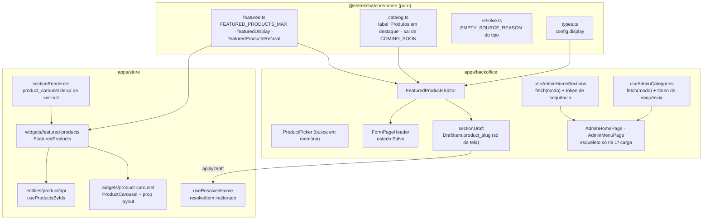

# Produtos em destaque, e o painel que não recarrega — Design

**Spec**: `.specs/features/50-produtos-em-destaque-e-painel-sem-recarga/spec.md`
**Status**: Draft

Decisões de projeto lidas antes de desenhar (`.specs/STATE.md`): `AD-012`, `AD-014`, `AD-019`,
`AD-024`, `AD-027`, `AD-029`, `AD-030`, `AD-033`. **Nenhuma é superseded por esta feature** — as
quatro que a tocam de perto entram como restrição:

| Decisão | Como esta feature se conforma |
| --- | --- |
| `AD-019` — a prévia é a LOJA num iframe; o painel **não desenha seção da Home** | O editor do bloco novo é **lista de escolhas** (molde do `HeroCarouselEditor`), nunca uma mini-vitrine. `previaUnica.test.ts` continua sendo o guarda, e ganha o nome do editor novo no sensor |
| `AD-014` — id em `jsonb` não tem FK | `display` é **valor** (`slider`/`grid`). Todo produto escolhido continua em `home_section_items.product_id`, com FK e `on delete set null` |
| `AD-029` — a Home não tem bloco indelével; quem recusa a última seção ativa é o **banco** | O bloco novo é removível como qualquer outro, e a tela **não antecipa** a recusa |
| `AD-024` — contador e filtro são o mesmo predicado | "Saiu do ar" tem de significar o mesmo no painel e na loja. Hoje **não significa** (ver `R-02`), e o conserto entra nesta feature |

Lições confirmadas aplicadas: `L-010` (AC que enumera lista pede um caso por elemento), `L-021`
(âncora de contagem em varredura de fonte), `L-029` (AC com metade celular e metade computador pede
asserção **positiva** nas duas), `L-034` (régua de classe recusa hífen depois do token), `L-036`
(AC com "o sistema faz X **e** a tela diz isso" pede asserção sobre o literal), `L-015` (teste de
invariante chama a MESMA função que produção chama).

---

## Architecture Overview

Três frentes, três fatias verticais que não se cruzam no mesmo arquivo — exceto `AdminHomePage.tsx`,
que é o ponto onde as três se encontram.



**A costura entre as frentes é uma só**: o editor novo é o consumidor mais pesado do painel (12 itens,
busca, arraste), e é por isso que `VIV-*` vem na mesma feature — sem ele, montar a curadoria significa
12 piscadas de tela.

---

## Code Reuse Analysis

### O que já existe e é reusado

| Peça | Onde | Como |
| --- | --- | --- |
| `ProductCard` · `ProductCardSkeleton` | `store/entities/product/ui` | O bloco **não desenha card próprio**. `cardSkeletonBox.test.ts` já prende o par card × esqueleto |
| `ProductCarousel` | `store/widgets/product-carousel` | **Estendido**, não copiado: ganha `layout`. É o dono das classes de vaga (`min-w-[220px] max-w-[220px] snap-start`), e uma segunda escrita delas seria o "defeito 01" no tamanho de uma classe |
| `SectionHeading` | `store/shared/ui` | Título + subtítulo + ação, igual às fileiras de coleção |
| `PRODUCT_CARD_SELECT` · `listingWindow` · `mapDbToProduct` | `store/entities/product/lib`, `api/useProducts.ts` | `useProductsByIds` reusa os três — herda o guarda `cardSelect.test.ts` (o `select` pede tudo o que o card desenha) e o teto declarado |
| `heroCarouselSlidesRefusal` | `core/home/carousel.ts` | **Molde** de `featuredProductsRefusal`: teto + cobrança item a item, `string | null` |
| `heroCarouselWidth` | `core/home/carousel.ts` | **Molde** de `featuredDisplay`: valor desconhecido cai no padrão, nunca recusa |
| `HeroCarouselEditor` | `backoffice/features/home-composition/ui` | Molde do editor: `FormCard`s, lista com `draggable` nativo (não dnd-kit), ordinal na mensagem de recusa |
| `DestinoDoItem` | idem | **Não** é reusado — ele escolhe **um** destino entre três tipos; aqui são N produtos. O que é reusado é o congelamento de `label_snapshot` (a regra, não o componente) |
| `FormCard` · `FormPageHeader` · `Input` | `backoffice/shared/ui` | O formulário inteiro |
| `motion-reduce:transition-none` | `store/widgets/header`, `product-buy-bar` | **A convenção de movimento do projeto já existe** e tem asserção (`Header.test.tsx:551`). O painel passa a segui-la — nada de `matchMedia` em componente |
| `previewFrame` · ponte da prévia | `core/home/preview.ts`, `usePreviewBridge` | Intocados. O bloco novo chega na prévia pelo mesmo `draft` |

### Pontos de integração

| Sistema | Como conecta |
| --- | --- |
| `home_sections` / `home_section_items` | **Sem migration.** `type = 'product_carousel'` já passa no `check`; `display` entra no `config jsonb`; cada produto é uma linha com `product_id` |
| RLS de `products` (loja) | É ela que decide "está no ar": produto despublicado simplesmente não volta em `useProductsByIds` |
| Prévia (iframe) | `applyDraft` já entrega o rascunho; o que falta é o `product_slug` (ver `R-01`) |

---

## Abordagens consideradas

**Frente 1 — onde o bloco desenha.**

| # | Abordagem | Trade-off |
| --- | --- | --- |
| **A (recomendada)** | `ProductCarousel` ganha `layout: 'row' \| 'slider' \| 'grid'`; o bloco novo é um wrapper fino que busca os produtos e delega | Um dono só das vagas e do esqueleto. Custo: um prop a mais num widget que a Home já usa, e `row` (o de hoje) tem de ficar **imóvel** |
| B | Widget novo, independente, reusando só `ProductCard` | Liberdade total de layout. Custo: segunda escrita das classes de vaga e do esqueleto — exatamente o par que `cardSkeletonBox.test.ts` existe para prender |
| C | `HomeCollectionRow` vira genérico e serve os dois | Mistura "produtos de uma coleção" com "produtos escolhidos a dedo"; o hook de dados é outro |

**Frente 2 — como a releitura para de apagar a tela.**

| # | Abordagem | Trade-off |
| --- | --- | --- |
| **A (recomendada)** | `fetchX(modo)` com `'inicial' \| 'revalidar'`: só o inicial liga `loading` e só o inicial esvazia a lista em erro. As escritas passam `'revalidar'` | Cirúrgico: `loading` continua significando o mesmo para as ~8 telas que leem esses hooks. Custo: um parâmetro com dois modos |
| B | Trocar os dois hooks por React Query (`isLoading` × `isFetching` já resolvem) | Resolve de vez e traz cache. Custo: refatoração de infraestrutura no meio de uma feature de produto — e `AdminHomePage`/`AdminMenuPage` esperam `{ loading, error, fetch }` |
| C | A página decide (`loading && sections.length === 0`) | Uma linha por página. Custo: a regra fica em **cada tela** — o "defeito 01", e a terceira tela nasce sem ela |

---

## Components

### `packages/core/src/home/featured.ts` *(novo)*

- **Propósito**: o vocabulário do bloco — quantos cabem, como ele se apresenta e por que um rascunho
  não pode ser salvo.
- **Interfaces**:
  - `FEATURED_PRODUCTS_MAX = 12`
  - `type HomeFeaturedDisplay = 'slider' | 'grid'`
  - `featuredDisplay(valor: string | null | undefined): HomeFeaturedDisplay` — desconhecido/ausente ⇒
    `'slider'` (`DST-10`). Molde literal de `heroCarouselWidth`.
  - `featuredProductsRefusal(config, items): string | null` — na ordem: título vazio (`DST-07`) →
    lista vazia (`DST-11`) → acima do teto, **nomeando 12** (`DST-08`) → item sem `product_id` → id
    repetido (`DST-09`).
- **Dependências**: nenhuma. Módulo puro — `catalog.test.ts` varre `core/home` e reprova import de
  React/Supabase; **a âncora de contagem da varredura sobe de 9 para 10 arquivos** (`L-021`).
- **Reusa**: `ordinal` mora hoje em `sectionRefusals.ts` (painel) e em `core/home/carousel.ts`. A
  recusa nova usa o de `core` — não se escreve um terceiro.

### `packages/core/src/home/{types,catalog,resolve}.ts` *(alterados)*

- `types.ts`: `HomeSectionConfig.display?: HomeFeaturedDisplay`, documentado como **valor, não
  referência** (a fronteira do `AD-014`).
- `catalog.ts`: `LABELS.product_carousel = 'Produtos em destaque'`; `COMING_SOON` fica só com
  `category_grid`. `LIMITS` **não** ganha entrada — o teto é recusa, não `config.limit` (`A-05`).
- `resolve.ts`: `EMPTY_SOURCE_REASON.product_carousel` passa a `'Não vai aparecer: nenhum produto
  escolhido.'`; o caso "escolhi e todos saíram do ar" já é `todosForaDoAr(n)` e **não muda**
  (`DST-20` é atendido pelos dois ramos que já existem).

### `apps/store/src/entities/product/api/useProductsByIds.ts` *(novo)*

- **Propósito**: os produtos de uma curadoria, numa consulta só.
- **Interface**: `useProductsByIds(ids: readonly string[]) => UseQueryResult<Product[]>`
- **Detalhes**: `listingWindow(supabase.from('products').select(PRODUCT_CARD_SELECT).in('id', ids), ids.length)`;
  `enabled: ids.length > 0`; chave `['products', 'ids', [...ids].sort().join(',')]` — **ordenada**,
  para dois blocos com o mesmo conjunto compartilharem cache, já que a ordem é aplicada por quem
  desenha (`DST-22`). Erro sobe como `ProductQueryError`, como as outras leituras.
- **Reusa**: `PRODUCT_CARD_SELECT` (herda `cardSelect.test.ts`), `listingWindow`, `mapDbToProduct`.

### `apps/store/src/widgets/featured-products/ui/FeaturedProducts.tsx` *(novo)*

- **Propósito**: o bloco. Lê a curadoria, busca os produtos, reordena e delega o desenho.
- **Interface**: `({ section, items }: SectionRenderProps)`
- **Comportamento**:
  1. `ids = items.map(i => i.productId).filter(Boolean)`
  2. `const { data, isLoading, isError } = useProductsByIds(ids)`
  3. **Reordena pela curadoria** (`DST-22`): `ids.map(id => mapa.get(id)).filter(Boolean)` — nunca a
     ordem da resposta.
  4. `isError` ⇒ devolve `null` (`DST-17`): o bloco some, a Home fica.
  5. Passa `loading={isLoading}` e `skeletonCount={ids.length}` (`DST-21`).
- **Reusa**: `ProductCarousel` com `layout={featuredDisplay(section.config?.display)}`.

### `apps/store/src/widgets/product-carousel/ui/ProductCarousel.tsx` *(alterado)*

- **Interface nova**: `layout?: 'row' | 'slider' | 'grid'` — padrão `'row'`.
- **As três formas, num mapa só** (dono único, `L-034` na régua do guarda):

  | `layout` | Celular | A partir de `md` | Quem usa |
  | --- | --- | --- | --- |
  | `row` | fita que rola | `md:grid md:grid-cols-4`, **uma linha** | `HomeCollectionRow` — **imóvel**, é a Home de hoje (`HOME-04`) |
  | `slider` | fita que rola | **continua fita**, as setas rolam | `display: 'slider'` (`DST-05`) |
  | `grid` | `grid grid-cols-2` | `md:grid-cols-4`, embrulha | `display: 'grid'` (`DST-06`) |

- **As setas**: hoje elas existem sempre e só rolam no celular, porque a partir de `md` o contêiner é
  grade. Com `slider` elas passam a rolar nos dois; com `grid` **não têm o que rolar** e saem da tela
  (`ANI-06` não se aplica — o bloco inteiro é outro).
- **Risco declarado**: `row` e `slider` são iguais abaixo de `md`. É de propósito, e a AC é escrita
  nos dois tamanhos (`L-029`) para que nenhuma asserção prove a metade fácil.

### `apps/store/src/widgets/home-renderer/ui/sectionRenderers.tsx` *(alterado)*

- `product_carousel` deixa de ser `null` e passa a `({ section, items }) => items.length ? <FeaturedProducts …/> : null`,
  molde literal do `hero_carousel` ao lado. `category_grid` **continua `null`**.

### `apps/backoffice/src/features/home-composition/ui/FeaturedProductsEditor.tsx` *(novo)*

- **Propósito**: título, descrição, apresentação e a lista de peças.
- **Três `FormCard`s**, na ordem em que a decisão acontece (molde do `HeroCarouselEditor`, onde a
  ordem das cobranças é regra):
  1. **Conteúdo** — `Input` título (obrigatório), `Textarea` descrição.
  2. **Apresentação** — par segmentado `Slider` / `Grade` com `aria-pressed`, molde do alternador de
     dispositivo do `AdminMenuPage`. Cada opção diz o que faz em uma linha ("uma fileira que rola" ·
     "linhas de 4, o que sobrar vai abaixo").
  3. **Peças escolhidas** — lista `draggable` (arraste nativo, como os três editores vizinhos), com
     posição, nome, botão remover, e o `ProductPicker` no rodapé. Contador `n de 12`.
- **Não desenha vitrine** (`AD-019`): a lista é lista. Quem mostra como fica é a prévia.
- **Reusa**: `featuredProductsRefusal` via `sectionRefusals.ts` — **nenhuma regra nova é redigida no
  painel**, que é o contrato daquele arquivo.

### `apps/backoffice/src/features/home-composition/ui/ProductPicker.tsx` *(novo)*

- **Propósito**: achar uma peça entre ~680 e acrescentá-la ao fim da lista.
- **Interface**: `({ products, escolhidos, onPick }: …)`
- **Detalhes**: `Input` de busca filtrando **em memória** por nome (sem acento, `toLowerCase`), teto
  de ~20 resultados exibidos, cada linha com nome e um botão `Acrescentar`. Já escolhido aparece
  desabilitado dizendo "já está no bloco" (`DST-09` na tela; a recusa de `core` é a rede de baixo).
- **Reusa**: a lista que `useAdminProducts` já carrega para os seletores de três telas.

### `apps/backoffice/src/features/home-composition/model/sectionDraft.ts` *(alterado)*

- `DraftItem` ganha **`product_slug: string | null`**, e ele é **de tela, como a `key`**:
  `toNewItems` passa a remover os **dois**. Sem isso, o `insert` recebe uma coluna que não existe e
  devolve `PGRST204` — o modo de falha do `AD-012`.
- `applyDraft` copia `product_slug` para o `HomeSectionItem` que vai à prévia — é o que faz `DST-24`
  valer sem tocar em `resolveItem` (ver `R-01`).
- **Guarda novo**: um teste que assere que as chaves de `toNewItems` são **exatamente** as sete
  colunas gravadas, com âncora — senão o terceiro campo de tela repete o defeito em silêncio.

### `apps/backoffice/src/features/home-composition/model/useAdminResolvedHome.ts` *(alterado)*

- Passa a receber **`products`** e a tratar `is_active === false` como fora do ar, espelhando o que já
  faz com `categoria.active === false`.
- **Por quê**: hoje o painel decide "produto está no ar?" pela presença de `product_slug`, que vem do
  embed lido **como admin** — e admin enxerga produto despublicado. A loja (anon) não. Sem isto, o
  painel diria "tudo certo" sobre um bloco que a Home desenha pela metade (`AD-024`, e `R-02`).

### `apps/backoffice/src/entities/home/api/useAdminHomeSections.ts` · `entities/category/api/useAdminCategories.ts` *(alterados)*

- **Interface**: `fetchX(modo: 'inicial' | 'revalidar' = 'inicial')`; toda escrita passa
  `'revalidar'`.
- **`'revalidar'` difere em três coisas, e só nelas**:
  1. **não liga `loading`** (`VIV-01`, `VIV-02`, `VIV-11`);
  2. **não esvazia a lista** quando a leitura falha — grava `error` e mantém as linhas (`VIV-07`);
  3. **respeita o token de sequência**: `const meu = ++pedido.current`, e a resposta é descartada se
     `meu !== pedido.current` (`VIV-08`/`A-11`).
- **O token vale para os dois modos**, não só para a revalidação: é o mesmo defeito.

### `apps/backoffice/src/pages/admin/{AdminHomePage,AdminMenuPage}.tsx` *(alterados)*

- `AdminHomePage.handleSave` **perde o `navigate('/admin/home')`** (`VIV-05`) e ganha `setSalvo(true)`
  no sucesso; o `Salvo` cai sozinho em 2 s (`VIV-06`) e some assim que o rascunho muda.
- O esqueleto passa a ser da primeira carga — consequência de `loading` deixar de ser ligado pela
  revalidação. **O `<iframe>` fica de pé** porque nunca mais sai da árvore (`VIV-03`).
- `AdminMenuPage` já tem o selo `Salvando…` no cabeçalho (`FOCO-33`); ele ganha a transição de saída
  e o par `Salvo`.

### `apps/backoffice/src/shared/ui/FormPageHeader.tsx` *(alterado)*

- **Interface nova**: `justSaved?: boolean` (padrão `false`).
- O selo de pendência e o `Salvo` ocupam **a mesma posição, no fim da fila de ações**, com transição
  de opacidade e `motion-reduce:transition-none` (`ANI-01`, `ANI-02`, `ANI-05`). Fim da fila é o que
  impede o vizinho de se mexer — a mesma razão do `FOCO-34`.
- Usado também pelas duas telas de Descontos: o prop é opcional e o padrão preserva o de hoje.

### Animações — onde cada uma mora

| AC | Onde | Como |
| --- | --- | --- |
| `ANI-01`/`ANI-02` | `FormPageHeader` | `transition-opacity`, troca de rótulo, `motion-reduce:transition-none` |
| `ANI-03` | `HomeSectionRow` | `data-recem-salvo` por ~1,2 s ⇒ `transition-colors` num anel; timer com limpeza no desmonte |
| `ANI-04` | `HomeSectionList` / `HomeSectionRow` | Entrada: `animate-fade-in` do preset. Saída: a linha ganha estado `removendo` **no clique**, e a transição roda **em paralelo** com a requisição (`ANI-07`) — falha desfaz o estado e mostra o motivo. **Sem `framer-motion`** (ver Tech Decisions) |
| `ANI-05` | todas | `motion-reduce:*`, a convenção que a loja já pratica e assere |
| `ANI-08` | páginas | Nada pisca em revalidação: quem avisa é o controle clicado |

---

## Data Models

Nenhum modelo novo. O que muda é **um campo opcional de `config`** e **um campo de tela** no
rascunho:

```typescript
// packages/core/src/home/types.ts
export type HomeFeaturedDisplay = 'slider' | 'grid'

export interface HomeSectionConfig {
  // …
  /** `product_carousel` — fita ou grade. Ausente/desconhecido ⇒ `slider` (`DST-10`). */
  display?: HomeFeaturedDisplay
}

// apps/backoffice/.../sectionDraft.ts
export interface DraftItem {
  key: string            // de tela, nunca gravado
  product_slug: string | null  // de tela, nunca gravado — alimenta a PRÉVIA
  // … as sete colunas que vão ao banco
}
```

**Relações**: `home_section_items.product_id → products.id` com `on delete set null` (já existe). O
`label_snapshot` continua sendo congelado no momento da escolha — é o que permite nomear a peça
depois que ela some (`DST-16`).

---

## Error Handling Strategy

| Cenário | Tratamento | O que a dona vê |
| --- | --- | --- |
| Título vazio / lista vazia / 13º produto / repetido | `featuredProductsRefusal` **antes** da rede | A frase da recusa acima do formulário; nada é limpo (`HOME-14`) |
| `update` do `config` falha | Motivo devolvido a quem chama | "Não foi possível salvar", com a mensagem do banco; o rascunho fica |
| `delete` da curadoria passa e `insert` falha | O motivo é devolvido; **a seção fica sem itens** | A recusa diz que a lista ficou vazia e pede para salvar de novo (`DST-13`) |
| Releitura pós-gravação falha | `error` sobe, as linhas **ficam** | A faixa "Tentar de novo" aparece sobre a lista que continua lá (`VIV-07`) |
| Duas gravações em voo | Token de sequência descarta a resposta velha | A tela mostra o resultado da última (`VIV-08`) |
| `useProductsByIds` falha na loja | O bloco devolve `null` | O bloco não aparece; a Home continua (`DST-17`) |
| Produto despublicado | A RLS não o devolve | A loja mostra os outros; o painel diz quantos saíram do ar |
| Última seção ativa | O trigger recusa (`23514`) | A mensagem **do banco**, sem segunda redação (`AD-029`) |

---

## Risks & Concerns

| Concern | Onde | Impacto | Mitigação |
| --- | --- | --- | --- |
| `R-01` — **a prévia trata produto de rascunho como "fora do ar"**. `applyDraft` não carrega `product_slug`, e `resolveItem` devolve `null` sem ele | `sectionDraft.ts:96`, `useResolvedHome.ts` (ramo `item.product_id`) | Defeito **pré-existente**: hoje um slide de `hero_carousel` com destino de produto já some da prévia enquanto se edita. No bloco novo seria fatal — **todos** os itens são produtos | `DraftItem.product_slug` (de tela) + `applyDraft` copiando. Conserta o bloco novo **e** o carrossel, e `DST-24` é a AC que prova |
| `R-02` — **"saiu do ar" significa coisas diferentes no painel e na loja** para destino de produto | `useAdminResolvedHome.ts` (ramo `item.product_id`) | O painel lê o embed como admin (enxerga despublicado) e diz "tudo certo"; a loja, como anon, não recebe o produto e desenha a menos | `useAdminResolvedHome` passa a receber `products` e a recusar `is_active === false`, espelhando o que já faz com categoria |
| `R-03` — `useAdminProducts` faz `select('*, categories(name)')` **do catálogo inteiro** (~680 linhas com a descrição HTML) e `/admin/home` já o chama | `useAdminProducts.ts:36` | O seletor novo **aumenta o uso** dessa carga; em conexão ruim a tela demora a ficar utilizável | Fora de escopo por decisão (a spec registra), **mas** o `ProductPicker` não piora nada: consome a lista que a página já pede. Fica registrado como `BL-` novo no fecho |
| `R-04` — mudar `loading` dos hooks alcança telas fora desta feature | `useAdminCategories` é lido por Categorias, Produtos, Menu | Uma tela que dependesse do esqueleto pós-ação deixaria de mostrá-lo | Por isso a abordagem **A**: `loading` só muda no caminho `'revalidar'`, que é exatamente o das escritas. O gate roda a suíte inteira do painel, e `AdminCategoriesPage.test.tsx` é quem acusa |
| `R-05` — o editor semeia `config`/`items` **uma vez** e a revalidação agora acontece com ele aberto | `HomeSectionEditor.tsx:78` | Se alguém trocar a semeadura para reagir a `section`, a releitura passa a apagar o que a dona digitou | O `key={sectionId}` e a semeadura única são **invariante**: entram como asserção no teste do editor, não como comentário |
| `R-06` — `EditorProduct` ganha `slug`, e ele é obrigatório | `sectionEditors.tsx:30` | Todo teste que monta um produto falso passa a não compilar | É a mitigação, não o risco: o `tsc` acha todos os construtores. Molde do que a `41` mediu com `ResolvedItem` |
| `R-07` — o bloco pode ser acrescentado **duas vezes** e as duas consultas de produto disparam juntas | `FeaturedProducts` | Duas requisições na Home | Aceito: a chave é ordenada, então conjuntos iguais compartilham cache; conjuntos diferentes **são** duas consultas legítimas |
| `R-08` — `previaUnica.test.ts` recusa "um segundo desenho da Home no painel" | `features/home-composition/__tests__` | Um editor que mostrasse miniaturas em grade **seria acusado** — e com razão | O editor é lista. O guarda ganha o nome do arquivo novo no sensor, provando que a régua o alcança |

---

## Tech Decisions

| Decisão | Escolha | Racional |
| --- | --- | --- |
| Tipo do bloco | Reusar `product_carousel` | `A-01`. Zero migration; o identificador é coluna, o rótulo é interface |
| Onde mora o teto de 12 | `core/home/featured.ts`, como **recusa** | `A-05`. `config.limit` cortaria a lista e daria dois donos de "quantos aparecem" |
| Desenho do bloco | `ProductCarousel` com `layout` | Abordagem A: um dono das vagas e do esqueleto |
| `row` fica imóvel | Sim | A Home de hoje não pode mudar por causa de um bloco novo (`HOME-04`) |
| Releitura | `fetch(modo)` + token de sequência | Abordagem A: cirúrgico, e `loading` continua significando o mesmo nas outras telas |
| `product_slug` no rascunho | Campo **de tela**, removido por `toNewItems` | Conserta a prévia sem mexer em `resolveItem` — que é o dono de "este destino está no ar" |
| Movimento | `motion-reduce:*` em CSS | A convenção já existe na loja e **tem asserção**; `matchMedia` em componente seria um segundo dono da mesma pergunta |
| `framer-motion` no painel | **Não** | O painel não importa framer hoje. Trazer a biblioteca inteira para animar a saída de uma linha é caro; a saída em paralelo com a requisição entrega a mesma coisa sem dependência nova — e sem violar `ANI-07` |
| Ordenação do resultado | No widget, pela curadoria | `.in()` não garante ordem. Ordenar no servidor exigiria `order by array_position`, que o PostgREST não expõe |

> **Nada aqui vira `AD-036`.** As escolhas ou já são cobertas por decisões ativas (`AD-014`,
> `AD-019`, `AD-024`, `AD-029`) ou são locais desta feature. Se o `layout` do `ProductCarousel` vier
> a ser lido por uma terceira superfície, aí sim a fronteira merece decisão própria.

---

## Guardas que esta feature acrescenta ou mexe

| Guarda | Situação |
| --- | --- |
| `core/home/__tests__/catalog.test.ts` | **Invertido, não descartado**: hoje assere que os `comingSoon` são `['product_carousel','category_grid']`; passa a asserir `['category_grid']`. A âncora da varredura de pureza sobe de 9 para 10 arquivos (`L-021`) |
| `apps/store/src/shared/lib/__tests__/homeSections.test.ts` | **Intocado, e isso é a prova**: o conjunto de tipos e o `check` não mudam (`DST-23`) |
| `previaUnica.test.ts` | Ganha sensor com o nome do editor novo — prova que a régua alcança o arquivo que nasceu agora |
| **`toNewItems` só grava coluna que existe** *(novo)* | Chaves exatamente iguais às sete colunas, com âncora. É o guarda do `product_slug` de tela |
| **`layoutDoCarrossel`** *(novo)* | As três formas por **token exato** (`L-034`), com asserção positiva no celular **e** no `md` (`L-029`), e âncora dupla |
| **`animacaoRespeitaMovimento`** *(novo)* | Toda classe de transição/animação nos arquivos tocados do painel tem par `motion-reduce:` — âncora de contagem e sensor |

---

## O que só o navegador prova

jsdom devolve **0** para toda medida de layout, então a suíte inteira do bloco é proxy de forma
(classe declarada, atributo, presença de nó). Entra na fila de UAT, em **390×844 e 1440**:

- a grade de 2 colunas em 390 com nome de produto de duas linhas (o par card × esqueleto);
- a fita do `slider` com 12 itens sem rolagem horizontal **do body** (o defeito que a auditoria da
  `27` mediu: `scrollWidth` 634 numa viewport de 390);
- o CLS do bloco enquanto os produtos chegam;
- o editor em 560px de coluna: a lista de 12 com arraste, e o `ProductPicker` aberto;
- a prévia **não recarregando** ao salvar — que é o olho do pedido, e nenhum teste de jsdom vê.
