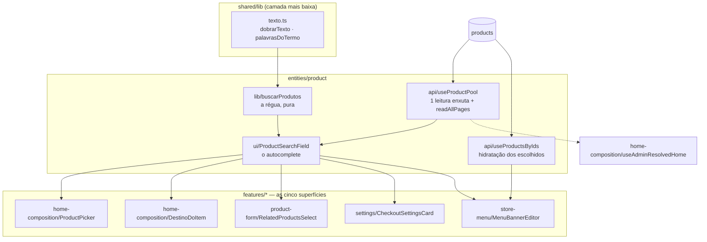

# A busca de produto do painel — Design

**Spec**: `.specs/features/51-busca-de-produto-do-painel/spec.md`
**Status**: Draft

---

## Architecture Overview

Três camadas, e a fronteira entre elas é o que faz a troca de estratégia (pool → servidor) não
alcançar consumidor nenhum:



**A regra pura não conhece React, e o componente não conhece o Supabase.** `buscarProdutos` recebe um
array e devolve um array — é onde as sete ACs de H1 são provadas, sem montar tela. `useProductPool`
sabe ler e nada mais. `ProductSearchField` junta os dois e desenha. Quem trocar o pool por busca no
servidor mexe **em um arquivo** e em nenhum dos cinco consumidores.

---

## Abordagens consideradas

As três foram apresentadas ao usuário com o custo medido; **a primeira foi escolhida**.

| # | Abordagem | Custo | Veredito |
| --- | --- | --- | --- |
| **1. Pool enxuto em memória** ✅ | Uma leitura de `id, name, slug, is_active, base_price` (~137 KB), cacheada por React Query e compartilhada; filtro e dobra no cliente | Não escala além de alguns milhares de produtos; o pool pode estar velho entre invalidações | **Escolhida.** 702 produtos hoje; instantâneo, sem requisição por tecla, **sem migration**, e **sem regredir a dobra de acento** — que é o que a opção 2 faria |
| 2. Busca no servidor | Coluna gerada `search_name` + índice; `ilike` por termo | Migration com guarda, debounce, mínimo de letras, estado de carga, hidratação à parte. E `unaccent()` **não é imutável**, logo não serve em coluna gerada — a dobra teria de ser `translate()` escrito à mão no SQL, virando um **segundo dono** da dobra ao lado do TypeScript | Recusada agora; a porta fica desenhada para ela |
| 3. Pool agora, servidor por dentro depois | Igual à 1, com indireção explícita no hook | A indireção sem o segundo caso é adivinhação | Recusada — a 1 **já** tem essa propriedade de graça, porque quem chama recebe `{ resultados, total, carregando }` e não sabe de onde vêm |

---

## Code Reuse Analysis

### O que já existe e é reusado

| Peça | Onde | Para quê |
| --- | --- | --- |
| `readAllPages` | `@estrelinha/core/paging` | O teto de 1.000 linhas do PostgREST, com **falha** em vez de leitura parcial. Já é o dono desta regra no repositório (`google-feed`, `sitemap`) |
| `EditorProduct` | `home-composition/ui/sectionEditors.tsx` | É exatamente `id, name, slug, is_active` — o pool o **satisfaz**, e `SectionEditorProps.products` não muda de tipo |
| `Peca` de `useAdminResolvedHome` | `home-composition/model` | Estrutural (`id, slug, is_active`); o pool o satisfaz sem cast |
| `MenuProduct` | `@estrelinha/core/menu` | O que `resolveMenuBanners` precisa dos alvos já apontados — `id, name, slug, description, is_active`. É o que `useProductsByIds` devolve |
| `Input`, `Badge`, `cn` | `@estrelinha/ui` | O campo e os chips do modo múltiplo |
| `Search`, `Plus`, `X` | `lucide-react` | Os mesmos ícones das cinco telas de hoje |
| O contrato de 26 testes do `ProductPicker` | `home-composition/ui/ProductPicker.test.tsx` | **Migra quase inteiro** para o componente novo: ele já assere vazio explicado, teto de 20, "já está no bloco", "fora do ar", `<ul>`/`<li>`, ausência de imagem e 44px |
| O recorte de UUID de `useMenuProducts` | `store-menu/model` | Um valor não-uuid dentro de `in('id', …)` derruba a consulta **inteira** com `22P02` — medido na feature 34. Vai junto para `useProductsByIds`, com o comentário |

### Pontos de integração

- `apps/backoffice/src/app/App.tsx` já monta `QueryClientProvider` — **não há infraestrutura nova**.
- `packages/core/src/paging/index.ts` já exporta `readAllPages`.
- `entities/product/index.ts` existe e reexporta `useAdminProducts`; ganha os quatro novos.
- `entities/product/` **não tem segmento `ui/` nem `lib/` hoje** — os dois nascem aqui, no molde que
  `apps/store/src/entities/material/` já usa desde a `44`.

---

## Components

### `apps/backoffice/src/shared/lib/texto.ts` *(novo)*

**Propósito**: a dobra de busca, com um dono. Hoje são **três cópias idênticas** e o
`ProductPicker` já escreveu por que nenhuma pôde ser importada: *"importar de uma delas seria import
feature→feature"*. `shared/` é a camada abaixo de todas.

```ts
/** Sem caixa e sem acento — "colar" acha "Colar", "coracao" acha "Coração". */
export const dobrarTexto = (valor: string): string

/** As palavras do termo, dobradas, sem vazio e sem repetição. */
export const palavrasDoTermo = (termo: string): string[]
```

- **Escapes, não caracteres literais.** As cópias de hoje escrevem `/[̀-ͯ]/` com os combinantes
  literais no fonte; a forma nova é `/[̀-ͯ]/g`, que é a mesma classe e sobrevive a editor,
  a `git` e a `grep`.
- **Consumidores na entrega**: `buscarProdutos`, `MenuIconPicker.tsx`, `categoryTree.ts`.
- **Fora**: as três cópias de `slugify` e `normalizeTag`/`quickGrid`/`buildDuplicates` — dobra
  **mais** recorte de caractere, que é outra função (spec, *Out of Scope*).

### `apps/backoffice/src/entities/product/lib/buscarProdutos.ts` *(novo)*

**Propósito**: a régua. Pura, sem React e sem Supabase — é onde H1 inteira é provada.

```ts
export interface ProdutoDoPool {
  id: string; name: string; slug: string
  is_active: boolean
  base_price: number | null
}

export const RESULTADOS_VISIVEIS = 20

export interface ResultadoDaBusca {
  /** Já cortado pelo teto. */
  itens: ProdutoDoPool[]
  /** Quantas casaram ANTES do corte — é o que o contador diz. */
  total: number
}

export const buscarProdutos = (
  pool: readonly ProdutoDoPool[],
  termo: string,
  opcoes?: { excluir?: readonly string[]; teto?: number },
): ResultadoDaBusca
```

**Casa quando**: **toda** palavra do termo dobrado aparece no nome dobrado (`BUS-01`, `BUS-02`).
Palavra repetida no termo não muda nada, porque `palavrasDoTermo` desduplica.

**Ordena por** (`BUS-03`, `BUS-15`):

| Posto | Condição | Exemplo, para `colar` |
| --- | --- | --- |
| 0 | o nome **começa** com o termo inteiro | `Colar de Cinzas` |
| 1 | alguma **palavra** do nome começa com a primeira palavra do termo | `Pingente Colar Duplo` |
| 2 | casa só no miolo | `Recolar peça` |

Empate desempata por `localeCompare(pt-BR)` e, **empatando de novo, por `id`** — sem esse último a
ordem entre duas peças de nome idêntico dependeria da ordem de chegada do banco, e `BUS-15` seria
verdadeira por acaso.

**Termo vazio, só espaço ou só pontuação** ⇒ `palavrasDoTermo` devolve `[]` ⇒ o pool inteiro,
ordenado por posto 0 vazio → `localeCompare` (`BUS-04`).

### `apps/backoffice/src/entities/product/api/useProductPool.ts` *(novo)*

**Propósito**: a **única** leitura de "quais produtos existem, para escolher um".

```ts
export const PRODUCT_POOL_COLUMNS = 'id, name, slug, is_active, base_price'
export const PRODUCT_POOL_KEY = ['products', 'pool'] as const

/** Lê tudo, ou falha. Client injetável — testável sem mockar o módulo. */
export const lerPoolDeProdutos = (client?: ClienteDeLeitura): Promise<ProdutoDoPool[]>

export const useProductPool = (): {
  produtos: ProdutoDoPool[]
  carregando: boolean
  erro: string | null
  recarregar: () => void
}

export const invalidarPoolDeProdutos = (qc: QueryClient) => Promise<void>
```

- **Conta primeiro, pagina depois** (`BUS-13`): `select('id', { count: 'exact', head: true })` e
  `readAllPages`. Com 702 produtos são **uma contagem e uma página**; o custo do guarda é uma
  requisição `head`, e o que ele compra é que a leitura truncada **falha** em vez de virar um
  catálogo menor.
- **Ordem estável entre páginas**: `.order('name').order('id')`. `name` não é único, e sem o segundo
  critério o PostgREST não garante a mesma sequência entre páginas — linhas repetiriam ou sumiriam
  com a contagem batendo, que é o modo de falha que `readAllPages` **não** pega.
- **`description` fora da projeção** (`BUS-11`), e há asserção sobre a string do `select`.
- `staleTime: 5 min`; invalidado por quem grava produto (`BUS-16`).
- **`BUS-20` sai de graça**: duas telas com a mesma `queryKey` são uma requisição, porque quem
  desduplica é o React Query — não um singleton escrito à mão.

### `apps/backoffice/src/entities/product/api/useProductsByIds.ts` *(novo)*

**Propósito**: o nome (e a `description`) das peças **já escolhidas**. É a metade `porId` que
`useMenuProducts` já tinha, com o dono trocado.

```ts
export const useProductsByIds = (ids: readonly string[]): {
  porId: Record<string, MenuProduct>
  carregando: boolean
}
```

- **Recorte de UUID obrigatório**, com o comentário de origem: um valor não-uuid dentro de
  `in('id', …)` derruba a consulta inteira com `22P02`, e o destino do banner mora em jsonb, onde
  qualquer string cabe. Sem o recorte, um destino escrito à mão apagaria o nome de **todos** os
  outros.
- Chave de query derivada dos ids **ordenados e desduplicados** — senão cada render de quem chama
  refaz a leitura.

### `apps/backoffice/src/entities/product/ui/ProductSearchField.tsx` *(novo)*

**Propósito**: o autocomplete. **Um** componente com dois modos — a diferença entre "escolher uma" e
"acrescentar à lista" é onde o resultado é entregue, e a parte que erra em silêncio (consulta, dobra,
ordenação, vazio explicado, teto) é a mesma.

```ts
interface Props {
  rotulo: string
  modo?: 'unico' | 'multiplo'            // padrão 'multiplo'
  /** modo único — o id atual. */
  escolhido?: string | null
  /** modo único — o nome congelado pelo chamador, para peça apagada do catálogo. */
  nomeEscolhido?: string | null
  /** modo múltiplo — ids já na lista: aparecem DESABILITADOS, dizendo por quê. */
  selecionados?: readonly string[]
  /** ids que nem aparecem (o próprio produto sendo editado). */
  excluir?: readonly string[]
  onEscolher: (produto: ProdutoDoPool) => void
  onLimpar?: () => void                  // modo único
  placeholder?: string
  mostrarPreco?: boolean                 // padrão false
  id?: string
}
```

**`selecionados` desabilita, `excluir` some** — e a diferença é deliberada: quem já está no bloco
precisa ser **visto** para a dona entender por que não pode escolhê-lo de novo (`BUS-08`); o produto
que está sendo editado nunca poderia ser relacionado a si mesmo, e mostrá-lo desabilitado seria
ruído.

**O que ele nunca tem**: ``, grade, e slot de renderização livre (`BUS-17`, `AD-019`). Um slot
de "detalhe" resolveria o preço do order bump com elegância e **abriria a porta para a miniatura** —
é o segundo desenho da Home voltando ao painel pela terceira vez (features `25`, `39`). O preço é um
parâmetro booleano justamente por isso: número, não composição.

**Estados**: carregando · erro com "tentar de novo" (`BUS-12`) · vazio explicado (`BUS-05`) ·
resultado com contador (`BUS-06`).

### As cinco superfícies *(alteradas)*

| Arquivo | Vira | Nota |
| --- | --- | --- |
| `home-composition/ui/ProductPicker.tsx` | Um invólucro fino: `<ProductSearchField modo="multiplo" …>` mais a montagem do `DraftItem` | **A montagem do `DraftItem` fica aqui**, e não no componente compartilhado: congelar `product_slug` e `label_snapshot` é regra da Home (`DST-24`, `HOME-24`), não de busca |
| `home-composition/ui/DestinoDoItem.tsx` | O `<select>` mantém *Coleção*, *Produto* e *Outro endereço*; escolhido **Produto**, aparece o `ProductSearchField modo="unico"` | `BUS-19`: as coleções e o endereço livre não somem, e o congelamento continua onde está |
| `product-form/ui/RelatedProductsSelect.tsx` | Chips dos escolhidos + `ProductSearchField modo="multiplo" excluir={[excludeId]}` | Ganha a dobra de acento que não tinha |
| `settings/ui/CheckoutSettingsCard.tsx` | `ProductSearchField modo="unico" mostrarPreco` no lugar do `<Select>` de 702 itens | Precisa de uma opção **"Nenhum produto"** — é o `onLimpar` |
| `store-menu/ui/MenuBannerEditor.tsx` | `ProductSearchField modo="unico"` + `useProductsByIds` para a `description` dos alvos | `useMenuProducts.ts` é **apagado**; `MINIMO_PARA_BUSCAR` deixa de existir (`A-13`) |

### `home-composition/model/useAdminResolvedHome.ts` · `pages/admin/*` *(alterados — P2)*

`/admin/home`, o formulário de produto e as configurações param de chamar `useAdminProducts()`. Com
os cinco seletores no pool, o `products` daquele hook fica **sem nenhum consumidor** (`BUS-25`,
`BUS-26`) e ele para de carregar o catálogo (`BUS-27`): `getProduct` perde o atalho de cache e cai
na consulta de uma linha que ele já tem escrita.

---

## Data Models

**Nenhuma migration, nenhuma coluna e nenhum índice.** O que muda é a **projeção** lida:

| Leitura | Hoje | Depois |
| --- | --- | --- |
| Seletores | `select('*, categories(name)')` — **3.217 KB**, sem cache, por tela | `select('id, name, slug, is_active, base_price')` — **~137 KB**, uma vez, compartilhado |
| Alvos de banner já escolhidos | `select('id, name, slug, description, is_active')` por busca **e** por id | igual, **só por id** (≤ 4 linhas) |

Medições de 2026-09-14 contra o projeto hospedado `hgkrsfpupypxtygjgthf`: 702 produtos (691 ativos);
`json_agg(row_to_json(p))` do catálogo = 3.217 KB; a projeção enxuta = 130 KB (+ `base_price`).

---

## Error Handling Strategy

| Falha | O que a tela faz | AC |
| --- | --- | --- |
| Rede fora / PostgREST erra | Texto dizendo que não carregou **e** botão de tentar de novo. O campo **não** diz "nenhuma peça" | `BUS-12` |
| Leitura truncada (total ≠ contagem) | `readAllPages` **lança**; cai no mesmo estado de erro, com a mensagem dele | `BUS-13` |
| Pool vazio de verdade | O vazio explicado de `BUS-05`, sem sugerir falha | Edge case |
| `in('id', …)` com valor não-uuid | Recortado **antes** da consulta | `useProductsByIds` |

---

## Risks & Concerns

| # | Concern | Mitigação |
| --- | --- | --- |
| R1 | **`useAdminProducts` não tem `range` nem `count`** — a 1.000 produtos ele trunca em silêncio e os seletores param de achar peça. É a `BL-008`, aberta desde a feature 21 | O pool nasce com `readAllPages`. O `useAdminProducts` para de carregar o catálogo em P2 (`BUS-27`); se P2 cair, o risco **permanece nele** e vai para *Estado conhecido* do `CLAUDE.md` |
| R2 | **`ProductPicker.tsx` está na lista de 8 arquivos de `animacaoRespeitaMovimento.test.ts`**, cuja âncora é de contagem | `ProductSearchField.tsx` **entra na lista** na mesma task em que nasce. Sem isso o movimento do componente novo ficaria fora da régua, e a âncora não acusaria |
| R3 | **`previaUnica.test.ts` recusa arquivo `…Preview` novo e segundo desenho da Home** | O componente é `…Field`, é `<ul>`/`<li>` e não tem ``. `BUS-17` é a asserção que prova isso do lado novo |
| R4 | **`localeCompare` depende do ICU do Node** | O desempate final é por `id`, que é total e não depende de collation. `BUS-15` é provada comparando duas execuções, não uma ordem cravada à mão |
| R5 | **Cache pode ficar velho** (memória do usuário: *frescor acima de cache*) | O estado de hoje é **pior**: `useAdminProducts` não tem cache **nem** invalidação, e só recarrega na montagem. `BUS-16` acrescenta invalidação onde não havia |
| R6 | **`vi.mock` de módulo inteiro** nos testes das páginas que passam a consumir o hook novo quebra no render, não na asserção (`L-030`) | Antes de afirmar "o guarda passa sem edição", listar os mocks totais dos testes que montam cada uma das cinco telas |
| R7 | **`CheckoutSettingsCard` perde o `<Select>`**, e o teste dele procura `aria-label="Produto da oferta"` | O `rotulo` do campo novo mantém o mesmo texto acessível; a asserção migra, não some |
| R8 | **O guarda de `<option>` sobre catálogo (`BUS-23`) é o mais frágil dos três** | Régua sobre fonte **sem comentário**, com sensor nos dois sentidos, e âncora que exige achar a forma no arquivo de sensor. Se a régua não puder ser escrita sem falso positivo, ela é **declarada como não escrita** na `validation.md` — nunca afrouxada para passar |

---

## Tech Decisions

| Decisão | Escolha | Por quê |
| --- | --- | --- |
| Camada do compartilhado | `entities/product` do painel | `AD-033`: consumidores no mesmo app vão para `entities/`, não para `core` |
| Um componente com modo × dois componentes | **Um**, com `modo` | A lista de resultados escrita duas vezes é o defeito de novo (`A-06`) |
| Client injetável em `lerPoolDeProdutos` | Sim | Testa a projeção e a paginação **sem** mockar o módulo do Supabase — e é o que torna `BUS-11` e `BUS-13` auditáveis. Dublê que não enxerga o `select` torna a projeção inauditável |
| Preço no resultado | Parâmetro booleano, padrão desligado | Slot de renderização livre reabriria a porta da miniatura (`AD-019`) |
| Dobra no cliente | Sim | `unaccent` não instalado, e `unaccent()` não é imutável — em coluna gerada viraria um segundo dono da dobra |
| Termo mínimo | Nenhum | Não há requisição por tecla para poupar (`A-13`) |

---

## Guardas que esta feature acrescenta ou mexe

| Guarda | Ação | O que passa a derrubar a suíte |
| --- | --- | --- |
| `shared/lib/__tests__/buscaDeProdutoComDonoUnico.test.ts` | **novo** | `ilike`/`like`/`textSearch` sobre `products` fora do dono (zero allowlist); declaração da dobra de busca fora de `shared/lib/texto.ts`; catálogo inteiro virando `<option>`/`<SelectItem>` fora de `entities/product`. Âncora dupla + remoção de comentário com CRLF **e** LF (`L-031`, `BL-027`) |
| `shared/lib/__tests__/animacaoRespeitaMovimento.test.ts` | **estendido** | `ProductSearchField.tsx` entra na lista de arquivos — a âncora é de contagem, então a entrada é deliberada |
| `home-composition/ui/ProductPicker.test.tsx` | **migra** | O contrato de 26 casos vira o contrato do componente compartilhado; o que sobra no `ProductPicker` é a montagem do `DraftItem`, que é regra da Home |
| `features/home-composition/__tests__/previaUnica.test.ts` | **inalterado** | Deve seguir verde sem edição. Se pedir edição, é sinal de que o componente novo desenhou Home |

---

## O que só o navegador prova

jsdom devolve 0 para toda medida de layout, então nada abaixo é alcançável por teste de componente.
Em **390×844** e **1440**:

- o campo de busca dentro da coluna de edição de 560px de `/admin/home`, com a lista de 20 abaixo;
- os chips de "Produtos relacionados" embrulhando com nomes longos (`Colar de Cinzas com Pingente…`);
- o `ProductSearchField` do `DestinoDoItem` **dentro** de um slide do carrossel, que já é um cartão
  aninhado;
- o alvo de 44px sob o dedo em cada linha de resultado;
- a ausência de rolagem horizontal do corpo em qualquer uma das cinco telas;
- e o percurso que motivou a feature: acrescentar 12 peças ao bloco **Produtos em destaque** sem a
  prévia recarregar (a `50` entregou isso, e a troca do seletor não pode devolvê-lo).
