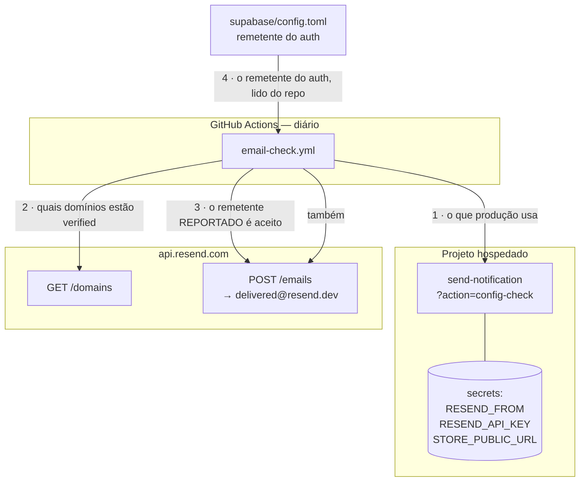

# Entrega de e-mail comprovada — Design

**Spec**: [`spec.md`](./spec.md)
**Status**: Draft

**Decisões ativas conformadas** (lidas de `.specs/STATE.md` antes de qualquer escolha): `AD-004`
(handler com dependências por parâmetro, testado sob vitest), `AD-005` (duas portas, um motor),
`AD-012` (tipo não é schema — provar gravação por probe contra o banco), `AD-017` (migration aplicada
é imutável; correção vem em migration nova), `AD-021` (a prova de uma rota servida é o que ela
**entrega**, nunca o status), `AD-034` (service role só por edge function com autorização manual).
**Nenhuma é superseded por esta feature.**

**Lições aplicadas**: `L-021` (âncora de contagem), `L-031` (CRLF antes do removedor de comentário),
`L-033` (régua por comando, nunca por família), `L-034` (token exato, `(?![-\w])`), `L-035` (o escopo
da varredura é parte da asserção), `L-036` (AC com duas metades assere o literal).

---

## Architecture Overview

A feature tem **quatro peças de código** e **quatro passos de operação**. O que as costura é uma
única ideia: *a prova de que o e-mail sai não pode vir de um lugar diferente de onde o e-mail sai.*



**Por que o sensor pergunta à função, e não a si mesmo.** Um workflow que probasse o Resend com o
remetente escrito nele mesmo mediria *a conta Resend*. O apagão de 2026-09-06 não estava na conta —
estava num **secret do Supabase** —, e aquele probe teria ficado **verde durante os treze dias**.
É a assinatura de guarda que o repositório combate: verdadeiro nos dois mundos. Perguntando à
produção **com o que ela está configurada** e provando **esse** valor contra o Resend, a corrente
fecha.

**O que a peça 4 resolve.** O remetente do auth não passa por `config-check` — ele vive no GoTrue,
que a CLI não lê. O workflow o lê de `supabase/config.toml`, que é onde o repositório o declara e
onde `authSenderDomain.test.ts` já o guarda. Assim não há um segundo literal para divergir.

---

## Code Reuse Analysis

### O que já existe e vai ser usado

| Componente | Local | Como |
| --- | --- | --- |
| `isValidFrom(from)` | `send-notification/render/layout.ts:68` | **A régua de formato já existe** (`CFG-03`) e é pura. `config-check` a chama em vez de reimplementar — senão o probe aprovaria um `from` que o motor recusa |
| `envOr` / `envOptional` | `send-notification/index.ts:24-36` | Já resolvem "env declarada e vazia significa default". `config-check` lê de `deps.env`, que **já** passou por elas — não relê `Deno.env` |
| `Deps` / `NotificationDeps` | `send-notification/handlers.ts:34`, `dispatch.ts` | `deps.env` já carrega `resendApiKey`, `resendFrom`, `storePublicUrl`, `adminPublicUrl`, `resendDevRedirectTo`. **Tudo o que `config-check` precisa já está injetado** — nenhuma dependência nova, e nenhum acesso ao banco |
| `json()` / `corsHeaders` | `_shared/http.ts` | Envelope e CORS com dono único (`49`). `config-check` usa, não declara |
| `route()` | `handlers.ts:300` | `switch (action)` já existe; entra **um** `case` |
| Molde de guarda de migration | `checkoutSchema.test.ts` | Réguas como **predicados** (para o sensor exercer a mesma função), caminho resolvido de `import.meta.url`, âncora antes das asserções |
| Molde de policy por papel | `20260829120000_34:225-250` (`customer_notes`) | `FOR ALL TO authenticated USING (has_role(...)) WITH CHECK (has_role(...))` — é literalmente a policy que a `34` escreveu **dizendo** que `order_notes` estava errada |
| Molde de workflow de entrega | `sitemap-check.yml` | `schedule` + `workflow_dispatch`, `set -euo pipefail`, `::error::` com mensagem que diz **onde procurar**, âncora de piso |
| `notificationSingleOwner.test.ts` | store `shared/lib/__tests__` | Já assere **zero leitores** de `order_emails`. É o que torna seguro derrubar a view |

### Pontos de integração

| Sistema | Como conecta |
| --- | --- |
| `supabase-deploy.yml` | Ganha **um passo** que compara `functions list` remoto com os diretórios de `supabase/functions/` sem prefixo `_`. Avisa, não falha (`DLV-26`) |
| `order_notifications` | Não muda. A view `order_emails` cai; a tabela, as duas RPCs do motor e a RLS ficam intactas |
| Painel (`useAdminOrders.ts:128,150,239`) | Passa a escrever em `order_notes`/`order_status_history` sob policy de `has_role`. **Nada muda no código** — a sessão já é de admin |

---

## Components

### 1. `configCheck(deps)` — a porta que declara a configuração

- **Purpose**: responder, sem autenticação e sem segredo, **com o que a produção está configurada**,
  para que um sensor externo possa provar esse valor contra o Resend.
- **Location**: `supabase/functions/send-notification/handlers.ts` (+ um `case` em `route`)
- **Interface**:
  ```ts
  export function configCheck(deps: Deps): Response
  ```
  Corpo da resposta (200 sempre; é diagnóstico, não autorização):
  ```jsonc
  {
    "from": "Adri - Uma Estrelinha <adri@loja.umaestrelinha.com.br>",
    "from_valid": true,        // isValidFrom(from) — a MESMA régua que o motor aplica
    "from_is_default": false,  // caiu no onboarding@resend.dev? entrega só ao dono da conta
    "has_api_key": true,       // presença, nunca valor, nunca prefixo, nunca tamanho
    "store_public_url": "https://umaestrelinha-store-five.vercel.app",
    "admin_public_url": "http://localhost:8083",
    "dev_redirect_active": false // RESEND_DEV_REDIRECT_TO preenchida em produção
  }
  ```
- **Dependencies**: só `deps.env`. **Não toca no banco** — não pode falhar por indisponibilidade de
  Postgres, o que importa num sensor.
- **Reuses**: `isValidFrom`, `json`, `deps.env`.

**Por que sem autenticação, e o que isso custa.** Nenhum campo é segredo: o `from` viaja no cabeçalho
de todo e-mail que a loja manda, as duas URLs são públicas, e os outros três são booleanos. Exigir
papel de admin obrigaria o workflow a carregar um JWT de administradora — uma credencial de verdade,
para ler informação que não é. **O que a resposta nunca carrega**: a chave, qualquer prefixo ou
tamanho dela, e o endereço de `RESEND_DEV_REDIRECT_TO` (só o booleano).

**`dev_redirect_active` é o achado de graça desta peça.** O `.env.example` avisa que
`RESEND_DEV_REDIRECT_TO` preenchida em produção **desvia todo transacional e nenhuma cliente
recebe**, e por isso ela fica fora da conferência de secrets do CI. Hoje **nada** verifica a ausência
dela — e o modo de falha é silencioso e total. Um booleano no `config-check` fecha isso.

### 2. `email-check.yml` — o sensor diário

- **Purpose**: falhar no dia em que o e-mail deixar de poder sair, nomeando **qual** elo caiu.
- **Location**: `.github/workflows/email-check.yml`
- **Gatilhos**: `schedule` diário + `workflow_dispatch` (molde `sitemap-check.yml`).
- **Passos, na ordem** (cada um com mensagem `::error::` própria):

  | # | Verificação | Falha significa |
  | --- | --- | --- |
  | 1 | `config-check` responde 200 e parseia | a function está fora, ou o deploy quebrou |
  | 2 | `from_valid === true` e `from_is_default === false` | `RESEND_FROM` malformada ou ausente ⇒ apagão total |
  | 3 | `dev_redirect_active === false` | **todo transacional está sendo desviado** |
  | 4 | `store_public_url` é `https://` e não é localhost | os links dos e-mails apontam para lugar nenhum |
  | 5 | `GET /domains` — o domínio de `from` está entre os `verified` | DNS caiu, ou o remetente saiu do domínio |
  | 6 | `POST /emails` com **o `from` reportado** → 200 | a produção manda de um remetente que o Resend recusa |
  | 7 | `POST /emails` com o remetente do auth, lido de `config.toml` → 200 | o login por código vai falhar |

- **Dependencies**: `secrets.RESEND_API_KEY` — **um secret do GITHUB, que ainda NÃO existe**, e
  `vars.SUPABASE_PROJECT_REF`.

  > ⚠️ **A primeira escrita deste design dizia que era "a mesma que o `supabase-deploy.yml` já
  > confere". É falso, e o erro é de categoria**: o deploy lê `supabase secrets list` — o cofre **da
  > Supabase**. `secrets.RESEND_API_KEY` é o cofre **do GitHub**, e nenhum workflow deste
  > repositório o usava (os únicos são `SUPABASE_ACCESS_TOKEN` e `SUPABASE_DB_PASSWORD`). Ter uma
  > não dá a outra. **Criar esse secret é passo de operação desta feature** (`O6`), com a mesma
  > cerimônia do `functions delete`. E há uma segunda armadilha: o job do deploy declara
  > `environment: production`; o `email-check` **não declara environment**, então um secret criado
  > dentro daquele environment ficaria invisível e o sensor falharia todo dia dizendo "vazia" —
  > mandando procurar no lugar errado, que é o anti-padrão que `DLV-09` existe para evitar. O passo
  > 0 do workflow nomeia as duas possibilidades.
- **Reuses**: a forma do `sitemap-check.yml`.

**O passo 5 não tem literal de domínio.** Ele compara o domínio de `from` (reportado pela produção)
com a lista de `verified` (reportada pelo Resend). Escrever `loja.umaestrelinha.com.br` no workflow
criaria um terceiro dono do domínio — e no dia do cutover alguém trocaria dois dos três.

**O que este sensor NÃO cobre, e vai escrito nele** (`DLV-08`): que o GoTrue do hospedado tem SMTP
ligado e os três templates colados. Esse transporte é outro, e a CLI **não tem `config pull`**. O
passo 7 mata o modo `BUG-20260728` (remetente recusado derruba todo login) e nada além disso.

### 3. A migration

- **Purpose**: fechar a nota interna e derrubar as peças de compatibilidade da `42`.
- **Location**: `supabase/migrations/20260919120000_52-entrega-de-email-comprovada.sql`
- **Conteúdo, em duas seções e zero escrita de dado**:

  1. **RLS** (`DLV-15`..`DLV-20`) — para `order_notes` e `order_status_history`, **quatro** comandos
     por tabela: `drop policy if exists` da `Allow all …`; **`drop policy if exists` da policy NOVA**;
     `create policy … for all to authenticated using (public.has_role(auth.uid(),'admin')) with check
     (public.has_role(auth.uid(),'admin'))`; `revoke all on … from anon`.

     > **O segundo `drop` não é zelo — sem ele a migration NÃO é idempotente**, e a Edge Case desta
     > spec ("roda duas vezes ⇒ no-op") seria falsa. O Postgres **não tem `create policy if not
     > exists`**: a segunda execução morreria com `policy … already exists`. A primeira escrita deste
     > design listava três comandos e afirmava idempotência na mesma frase; as duas coisas não podem
     > ser verdade juntas, e quem achou foi a execução da T3, provando por dupla aplicação. É o mesmo
     > molde que a `34` já usava em `customer_notes` — e que este design não tinha lido até o fim.
  2. **Compatibilidade** (`DLV-23`) — `drop view if exists public.order_emails`;
     `drop function if exists public.claim_order_email(uuid, text)`;
     `drop function if exists public.finish_order_email(uuid, text, text)`.

- **Idempotente por construção**: só `drop … if exists` e `create policy` depois do `drop`. Sem
  `do $$`, sem backfill, **sem um `insert`/`update`/`delete`**.

**O `with check` é a metade que se esquece.** Só `using` fecharia a **leitura** e deixaria a
**gravação** aberta — e um teste que apenas tentasse ler passaria. É a razão de `DLV-17` cobrar os
dois e de o guarda ter sensor para a omissão.

**A ordem contra a function zumbi** (`DLV-22`): a `send-email` publicada ainda chama
`claim_order_email`. Derrubar a RPC antes de apagar a function trocaria um endpoint **morto** por um
que **responde 500** — e `db push` e deploy da Vercel rodam em paralelo. Apagar a function é passo de
operação e vem **antes** do push desta migration.

### 4. O guarda da migration

- **Purpose**: recusar o afrouxamento, por comando e com sensor para cada.
- **Location**: `apps/store/src/shared/lib/__tests__/entregaDeEmailSchema.test.ts`
- **Reuses**: o molde de `checkoutSchema.test.ts` — réguas como **predicados**, para a asserção e o
  sensor chamarem a mesma função.
- **Âncora dupla** (`L-021`): o arquivo foi lido **e** as **duas** tabelas foram encontradas. Uma
  régua que casasse zero tabela passaria em silêncio.
- **Réguas** (uma por comando, `L-033` — não uma para a família):

  | Régua | Sensor por mutação |
  | --- | --- |
  | `drop policy if exists "Allow all order_notes"` presente | remover o `drop` reprova |
  | idem para `order_status_history` | idem |
  | policy nova de `order_notes` tem `has_role` no `using` **e** no `with check` | apagar o `with check` reprova |
  | idem para `order_status_history` | idem |
  | nenhuma ocorrência de `using (true)` nas duas tabelas | reintroduzir reprova |
  | `revoke` alcança `anon` nas duas | remover reprova |
  | as **três** peças de compatibilidade são derrubadas | remover um `drop` reprova |
  | as **três** peças do motor (`order_notifications`, `claim_order_notification`, `finish_order_notification`) **não** são derrubadas | acrescentar um `drop` delas reprova |
  | zero `insert`/`update`/`delete` de dado | acrescentar um reprova |

- **CRLF normalizado antes do removedor de comentário** (`L-031`), e recorte por token exato
  (`L-034`) — `order_notes` não pode casar dentro de `order_notes_pkey`.

### 5. O passo de divergência no deploy

- **Purpose**: tornar "function zumbi" um estado **visível**.
- **Location**: `.github/workflows/supabase-deploy.yml`, depois de `functions deploy`.
- **Comportamento**: lista o remoto, lista `supabase/functions/*/` sem prefixo `_`, e emite
  `::warning::` por slug sobrando e por slug faltando. **Nunca falha** (`DLV-26`) — function zumbi é
  dívida, e derrubar o deploy por ela pararia a loja por um problema que não é dela.

### 6. Documentação

| Arquivo | O quê |
| --- | --- |
| `.env.example` | `DLV-27`: a mescla do `.env` pelo `secrets set`, com a medição `count: 8` × `count: 1`, e o procedimento seguro. Marcar a pendência `C-08` como **vencida** (`DLV-11`) |
| `supabase/config.toml` | ~~Descomentar `[auth.email.smtp]`~~ — **`DLV-11` superseded**: o bloco segue comentado e o dev segue no Mailpit. O que entra é a razão escrita no próprio arquivo |
| `supabase/CLAUDE.md` | `DLV-14`: a CLI não tem `config pull`; o que o `Email check` cobre e o que não cobre. `DLV-28`: digest é hash estável; `updated_at` uniforme delata a mescla |
| `CLAUDE.md` (raiz) | Baselines novas; o `Email check` na tabela de workflows; o incidente na seção de estado conhecido |

---

## Passos de operação (não são código, e vão ao `validation.md`)

| # | Passo | Evidência exigida | Estado |
| --- | --- | --- | --- |
| O1 | `RESEND_FROM` correto em produção | digest antes/depois + `POST /emails` 200 | ✅ **feito em 2026-09-19** |
| O2 | SMTP local ligado e código chegando pelo Resend | captura do e-mail | pendente |
| O3 | Dashboard do hospedado: SMTP + 3 templates + `otp_length`/`otp_expiry` | capturas | pendente |
| O4 | `supabase functions delete send-email` | `functions list` antes (9) e depois (8) | pendente |
| O5 | Uma linha `sent` real em `order_notifications` | id + captura no celular | pendente |

---

## Error Handling Strategy

| Cenário | Tratamento | O que quem lê vê |
| --- | --- | --- |
| `config-check` não responde | passo 1 falha | *"a function send-notification não respondeu — confira o deploy"* |
| `from` malformada ou default | passo 2 falha | *"RESEND_FROM inválida ou ausente: TODO transacional falha"* |
| `dev_redirect_active` | passo 3 falha | *"RESEND_DEV_REDIRECT_TO existe em produção — todo e-mail está sendo desviado"* |
| `POST /emails` → 403 | passo 6/7 falha | *"configuração: o Resend recusa o remetente X"* — nomeia **qual** dos dois |
| `POST /emails` → 429 | passo 6/7 falha | *"indisponibilidade: teto de envio do Resend"*, distinto de configuração |
| `api.resend.com` fora / timeout | passo 5-7 falham | *"indisponibilidade do Resend"* — **nunca** "remetente inválido" por ausência de resposta |
| Migration aplicada duas vezes | `drop … if exists` + `create` depois do `drop` | nada; é no-op |
| Admin grava nota depois da migration | policy `has_role` permite | nada muda |
| `anon` tenta ler/gravar nota | RLS recusa | 401/empty, provado por probe (`DLV-20`) |

---

## Risks & Concerns

| Concern | Local | Impacto | Mitigação |
| --- | --- | --- | --- |
| **`supabase secrets set` mescla o `.env` local** | ferramenta | Sobrescreveu 7 secrets de produção em 2026-09-19 | `DLV-27`/`DLV-28` escrevem a regra e o procedimento seguro. **Causa medida**, não suposta |
| **`MELHOR_ENVIO_SENDER_JSON` ficou com valor de dev** | secret de produção | A primeira etiqueta pode falhar com 422, descoberto na hora de postar | Fora de escopo, registrado em **`BL-044`** com o passo de fecho |
| **`send-email` é endpoint público sem JWT rodando código da marca anterior** | produção | Superfície viva que ninguém mede nem lê log | `DLV-21`/`O4` a apagam. Confirmado `ACTIVE`, `OPTIONS` → 200 |
| **A recusa por pré-condição não deixa rastro** | `dispatch.ts:430-436` | Cliente não avisada, e nenhuma linha em lugar nenhum | **Fora de escopo** (`BL-035`, feature `54`). Citado aqui porque o sensor desta feature **não** o cobre — ele mede o cano, não o gatilho |
| **`config-check` expõe configuração sem auth** | peça nova | Alguém descobre o remetente (já público) e que há chave (sem valor) | Contrato fechado por lista de campos; a chave nunca aparece, nem prefixo nem tamanho. Decisão registrada em *Tech Decisions* |
| **Nenhum teste da loja lê `order_notes`** | varredura 2026-09-19 | Se uma feature futura precisar ler pela loja, a policy nova a bloqueia | Aceito: hoje **zero** leitores em `apps/store/**`; abrir depois é migration nova, e é o sentido certo da porta |
| **`BL-041` afirma "dez functions"; são nove** | `.specs/BACKLOG.md` | Uma AC escrita por cima do número errado nasceria falsa | Medido e corrigido na spec (`DLV-21`) |
| **O guarda mora na suíte da loja** | `apps/store/**` | Guarda de migration num app que não é dono dela | Aceito e já declarado no `CLAUDE.md`: é onde moram os seis irmãos. Mover oito arquivos numa feature de cano seria escopo alheio |

---

## Tech Decisions

| Decisão | Escolha | Racional |
| --- | --- | --- |
| Quem o sensor pergunta | **A produção**, por `config-check`, e prova **esse** valor no Resend | Um probe com o remetente escrito nele mede a conta Resend. O apagão estava num secret do Supabase, e aquele probe teria ficado verde por treze dias |
| Autenticação do `config-check` | Nenhuma, com contrato de campos fechado | Nenhum campo é segredo. Exigir admin obrigaria o workflow a carregar um JWT real para ler o que não é |
| O `config-check` toca o banco? | **Não** | Sensor que depende do Postgres confunde "e-mail quebrado" com "banco fora" |
| Remetente do auth no workflow | Lido de `supabase/config.toml` | O repositório já o declara ali e `authSenderDomain.test.ts` já o guarda. Um literal no yml seria um segundo dono |
| Domínio verificado no workflow | **Derivado**, nunca literal | Comparar o domínio de `from` com a lista de `verified` evita o terceiro dono no cutover |
| O passo de divergência falha o deploy? | **Não**, avisa | Dívida não é incidente |
| Onde mora o guarda | `apps/store/src/shared/lib/__tests__/` | Onde estão os seis irmãos que leem migration |
| Ordem function × migration | Function primeiro | Senão o zumbi vira 500 durante a janela `db push` × Vercel |

> **Candidata a `AD-037`**: *"Sensor de configuração pergunta ao ambiente que executa, e prova o valor
> que ele reporta — nunca um valor escrito no próprio sensor."* É convenção que a `53`..`56` vão
> herdar. Registrar em `.specs/STATE.md` ao fechar a feature.

---

## O que só a operação prova

jsdom, `tsc` e vitest não alcançam nada disto, e por isso os cinco passos `O1`..`O5` têm evidência
exigida em vez de asserção:

- que o e-mail **chega** (o Resend aceitar é 200; chegar é outra coisa — spam, DKIM, reputação);
- que o GoTrue do hospedado tem SMTP e os três templates;
- que a `send-email` sumiu da lista;
- que o painel continua gravando nota depois da migration (`AD-012`: probe, nunca inspeção de tipo).
