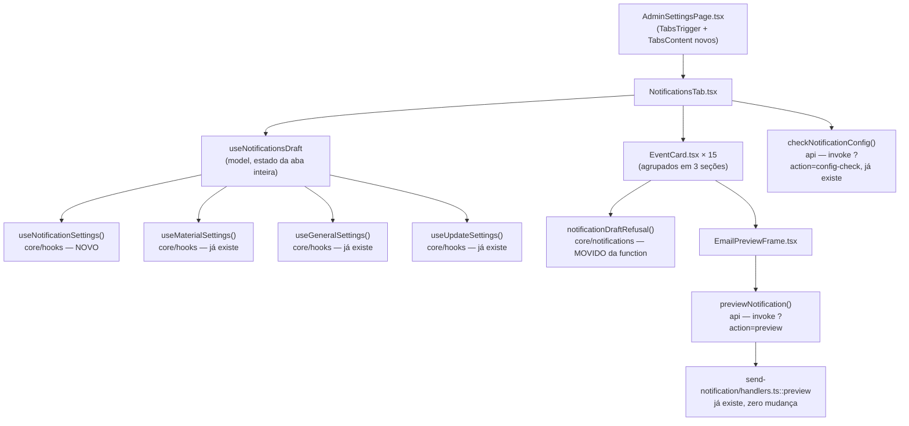

# Aba Notificações — Design

**Spec**: `.specs/features/53-aba-de-notificacoes/spec.md`
**Status**: Draft

**Arquitetura já decidida, não explorada de novo**: o design aprovado da `42` (T19–T23) já escolheu
"aba dentro de `/admin/configuracoes`, feature slice em FSD, prévia pela function" contra as
alternativas óbvias (modal separado, rota própria, e-mail redesenhado no cliente) — e o usuário pediu
explicitamente para usar aquele design como base. As únicas decisões novas aqui são as três que a
spec já resolveu em *Assumptions* (agrupamento derivado, gate de material bloqueante, aviso de
`admin_public_url` não-bloqueante) mais os detalhes de implementação que a leitura do código atual
revelou — o mais importante deles é `ABN-13` (escrita precisa ser sempre a foto completa dos 15
eventos), que muda a forma da UI de "salvar por card" para "salvar a aba inteira", abaixo.

---

## Architecture Overview

A escrita (`useUpdateSettings({ key: 'notifications', value })`) e a leitura
(`useStoreSettings`/`useNotificationSettings`) são as mesmas que toda outra aba já usa — nenhuma
tabela, RPC ou function nova. O único código de servidor tocado é a **remoção** de uma função privada
da edge function (movida para `core`, chamada de volta).

---

## Code Reuse Analysis

### Existing Components to Leverage

| Component | Location | How to Use |
| --- | --- | --- |
| `send-notification?action=preview` | `supabase/functions/send-notification/handlers.ts:209` | Chamado sem mudança — devolve `{ subject, html, text, sample }` já pronto para o `srcdoc` |
| `send-notification?action=config-check` | idem, `:351` | Chamado sem mudança — `admin_public_url` já vem na resposta |
| `resolveAllEventSettings`, `resolveEventSettings` | `packages/core/src/notifications/settings.ts` | Resolve o gravado (parcial ou ausente) contra `DEFAULT_NOTIFICATIONS`, campo a campo |
| `NOTIFICATION_EVENTS`, `NOTIFICATION_EVENT_LABELS`, `EVENT_AUDIENCE`, `isMaterialEvent` | `packages/core/src/notifications/events.ts` | Fonte única da ordem, do rótulo, da audiência e da seção — nenhum dado novo |
| `NOTIFICATION_VARIABLES`, `variablesRefusal` | `packages/core/src/notifications/variables.ts` | Importados, nunca copiados (`ABN-03`, `ABN-11`) |
| `notificationCopyRefusal`, `COPY_LIMITS`, `limitsRefusal` | `packages/core/src/notifications/copy.ts` | Importados, nunca copiados (`ABN-04`, `ABN-05`, `ABN-11`) |
| `useMaterialSettings()`, `useGeneralSettings()`, `useStoreSettings()`, `useUpdateSettings()` | `packages/core/src/hooks/useStoreSettings.ts` | Leitura/escrita — mesmo hook que as outras 7 abas já usam |
| `FormCard`, `FieldGroup`, `ToggleField` | `apps/backoffice/src/shared/ui` | Molde de campo/toggle de TODA outra aba de `AdminSettingsPage` |
| `SaveButton`, `useToast` | idem | Feedback de salvar/erro, mesmo padrão |
| `AdminOrderPage.tsx` → `OrderHistory`/`resendNotification` | `apps/backoffice/src/entities/order/api/notifyOrder.ts` | **Não muda** — é `PNL-08`, já entregue; só precisa continuar funcionando com os eventos novos (nenhum código aqui depende de quais estão ligados) |

### Integration Points

| System | Integration Method |
| --- | --- |
| `store_settings` (chave `notifications`) | `useStoreSettings()` (leitura, já inclui a chave desde a `42`, T8) + `useUpdateSettings()` (escrita, `upsert` por chave inteira) |
| `send-notification` (edge function) | `supabase.functions.invoke('send-notification?action=preview', …)` e `?action=config-check` — mesmo padrão de `notifyOrder.ts`/`resendNotification` |

---

## Components

### `packages/core/src/hooks/useStoreSettings.ts` (alteração)

- **Purpose**: expor `useNotificationSettings()`, no mesmo molde de `useMaterialSettings()`.
- **Interfaces**: `useNotificationSettings(): NotificationSettings` — `data?.notifications ??
  DEFAULT_NOTIFICATIONS` (raso; a resolução campo a campo continua sendo trabalho de
  `resolveAllEventSettings`, chamado por quem precisa da visão por evento).
- **Reuses**: `DEFAULT_NOTIFICATIONS`, já importado neste arquivo desde a T8 da `42`.

### `packages/core/src/notifications/copy.ts` (alteração — move, não cria)

- **Purpose**: dar um dono só à composição "variável → tom → limite" que hoje só a function conhece
  (`draftRefusal`, `handlers.ts:241-259`) e que o painel está prestes a precisar também.
- **O que muda**: a função é **movida** para cá como `notificationDraftRefusal(event, channel,
  fields: Partial<EmailFields>): string | null` — corpo idêntico, só o nome e a localização mudam.
  `handlers.ts` passa a **importar e chamar**, sem reimplementar.
- **Reuses**: `variablesRefusal`, `notificationCopyRefusal`, `limitsRefusal` — as três já existem
  neste módulo/pacote; a novidade é só não deixar a ORDEM de composição delas ter dois donos.

### `apps/backoffice/src/features/notification-settings/model/sections.ts`

- **Purpose**: agrupar os 15 eventos em três seções, **derivadas** de `EVENT_AUDIENCE`/
  `isMaterialEvent` — nunca uma lista nova (`ABN-01`).
- **Interfaces**:
  - `type NotificationSection = 'customer' | 'material' | 'owner'`
  - `SECTION_LABELS: Record<NotificationSection, string>` — `'Pedido e pagamento'`, `'Material'`,
    `'Avisos para você'`
  - `sectionFor(event: NotificationEvent): NotificationSection`
  - `groupedEvents(): Record<NotificationSection, NotificationEvent[]>` — itera
    `NOTIFICATION_EVENTS` uma vez, preserva a ordem dentro de cada balde
- **Dependencies**: `@estrelinha/core/notifications` (`EVENT_AUDIENCE`, `isMaterialEvent`,
  `NOTIFICATION_EVENTS`)

### `apps/backoffice/src/features/notification-settings/model/preconditions.ts`

- **Purpose**: as duas réguas de precondição da spec, puras e testáveis isoladamente.
- **Interfaces**:
  - `materialAddressMissing(material: MaterialSettings): boolean` — `material.street.trim() === ''`
  - `adminUrlLooksLocal(adminPublicUrl: string): boolean` — `!adminPublicUrl.startsWith('https://')
    || /localhost|127\.0\.0\.1/.test(adminPublicUrl)`
- **Dependencies**: `MaterialSettings` de `@estrelinha/supabase/types/settings`

### `apps/backoffice/src/features/notification-settings/model/notificationsWrite.ts`

- **Purpose**: a ÚNICA função que constrói o valor gravado em `store_settings.notifications`
  (`ABN-13`) — impede a escrita parcial.
- **Interfaces**:
  - `buildNotificationsValue(resolved: Record<NotificationEvent, EventChannelSettings<EmailFields>>,
    postDeliveryDays: number): NotificationSettings` — reconstrói `events` (`Record<NotificationEvent,
    { email: EventChannelSettings<EmailFields> }>`) iterando `NOTIFICATION_EVENTS` **uma vez**, nunca
    um subconjunto. `post_delivery_days` é **preservado**, nunca editado por esta feature (o campo
    fica sem UI — `BL-037` é quem lhe dará um leitor).
- **Reuses**: `NOTIFICATION_EVENTS`

### `apps/backoffice/src/features/notification-settings/model/useNotificationsDraft.ts`

- **Purpose**: o estado da aba **inteira** — não por card. É a peça que decide "salvar por card" vs.
  "salvar a aba" (ver *Tech Decisions*).
- **Interfaces**:
  - `useNotificationsDraft(): { draft: Record<NotificationEvent, EventChannelSettings<EmailFields>>,
    setField(event, field, value), setEnabled(event, value), refusalFor(event): string | null,
    canSave: boolean, isSaving: boolean, isDirty: boolean, save(): Promise<boolean> }`
  - Inicializa `draft` a partir de `resolveAllEventSettings(useNotificationSettings(), 'email')`;
    reinicializa quando a leitura do servidor muda **e** não há edição pendente (evita apagar o que a
    Adri está digitando se um `refetch` chegar no meio).
  - `refusalFor(event)` chama `notificationDraftRefusal(event, 'email', draft[event].fields)` e, só
    para `material_instructions`, acrescenta o gate de `materialAddressMissing` quando
    `draft[event].enabled` é `true`.
  - `canSave` é `true` só quando **todos** os 15 `refusalFor(event)` são `null`.
  - `save()` chama `buildNotificationsValue(draft, current.post_delivery_days)` e
    `useUpdateSettings().mutateAsync({ key: 'notifications', value })`.
- **Dependencies**: `useNotificationSettings`, `useMaterialSettings`, `useUpdateSettings`,
  `notificationDraftRefusal`, `buildNotificationsValue`

### `apps/backoffice/src/features/notification-settings/api/previewNotification.ts`

- **Purpose**: a chamada a `?action=preview` — nunca lança (`AD-008` em espírito: falha de rede não
  pode travar a tela).
- **Interfaces**: `previewNotification(input: { event: NotificationEvent; draft: Partial<EmailFields>;
  orderId?: string }): Promise<{ subject: string; html: string; text: string; sample: boolean } | {
  error: string }>`
- **Reuses**: o mesmo `supabase.functions.invoke('send-notification?action=…', { body })` de
  `notifyOrder.ts`/`resendNotification`.

### `apps/backoffice/src/features/notification-settings/api/checkNotificationConfig.ts`

- **Purpose**: expõe `admin_public_url` para o aviso de `ABN-09`. **Falha em silêncio** — sem
  resposta, nenhum aviso aparece (é puramente informativo; gritar sobre uma falha de rede própria
  seria pior que não avisar).
- **Interfaces**: `useNotificationConfigCheck(): { adminPublicUrl: string } | undefined` — `useQuery`
  com `staleTime` de 5 minutos (mesmo molde de `useStoreSettings`), `queryFn` que devolve `undefined`
  em qualquer erro (nunca lança, nunca populate um estado de erro que a tela precisaria tratar).

### `apps/backoffice/src/features/notification-settings/ui/EventCard.tsx`

- **Purpose**: um evento — rótulo, seção/audiência, toggle, campos, recusa inline, "ver prévia".
- **Interfaces**: `EventCard({ event, value, onChange, refusal, warnings, onPreview })` — controlado
  pelo pai (`NotificationsTab`), sem estado de servidor próprio.
- **Reuses**: `FieldGroup`, `ToggleField`, `Input`/`Textarea` do design system do painel; `TAP_44` nos
  alvos de toque (`ABN-10`).
- **Comportamento de aviso**: quando `warnings.length > 0` (material sem endereço, e-mail da dona
  vazio, link do painel não-produção), renderiza um banner inline **acima** dos campos — nunca some o
  card nem desabilita o toggle (o aviso de material vira bloqueio só no `save()` da aba, via
  `refusal`; os dois avisos "para você" nunca bloqueiam).

### `apps/backoffice/src/features/notification-settings/ui/EmailPreviewFrame.tsx`

- **Purpose**: renderiza a resposta da function, **sem recompor** (`ABN-06`).
- **Interfaces**: `EmailPreviewFrame({ subject, html, text, sample, loading, error })` —
  `<iframe sandbox="" srcDoc={html} title={subject} style={{ width }} />` com alternância 390/600px
  (um par de botões, não um input livre — os dois números são os únicos que a spec pede), texto puro
  abaixo em `<pre>` com `white-space: pre-wrap`, e um selo "Prévia de exemplo" quando `sample` é
  `true`. `sandbox=""` (vazio, sem exceções) — é HTML que o **código** compõe a partir de campos que
  já passaram por `notificationDraftRefusal`, mas sandboxar custa zero e a régua deste repositório é
  "nunca confiar por composição" (`sanitizeHtml.test.ts` é o mesmo espírito, noutro lugar).

### `apps/backoffice/src/features/notification-settings/ui/NotificationsTab.tsx`

- **Purpose**: monta as três seções, os 15 `EventCard`, o preview ativo (um por vez — abrir um
  fecha o anterior, para não ter 15 iframes simultâneos) e o `SaveButton` único da aba.
- **Interfaces**: sem props — lê tudo de `useNotificationsDraft` e dos dois hooks de precondição.
- **Reuses**: `useToast` para o erro de salvar (mesmo padrão das outras 7 abas).

### `apps/backoffice/src/pages/admin/AdminSettingsPage.tsx` (alteração)

- Acrescenta `<TabsTrigger value="notifications">Notificações</TabsTrigger>` e
  `<TabsContent value="notifications"><NotificationsTab /></TabsContent>`.
- `TabsList` passa de `sm:grid-cols-7` para `sm:grid-cols-8` (8 abas agora); a grade mobile
  (`grid-cols-3`) não muda — mais uma aba só acrescenta uma terceira linha parcial, que já é o
  comportamento hoje com 7.
- **Não** ganha um branch novo em `save()`: `NotificationsTab` é autocontido, com seu próprio
  `useUpdateSettings()` — é a mesma independência que `CheckoutSettingsCard` já tem hoje
  (`features/settings`, chamado de dentro de uma `TabsContent` sem passar pelo dispatcher da página).

---

## Data Models

Nenhum modelo novo. `NotificationSettings`, `EmailFields`, `EventChannelSettings<F>` já existem em
`packages/core/src/notifications/settings.ts` (ver *Code Reuse Analysis*). O único tipo novo é local
à feature: `NotificationSection` (em `model/sections.ts`, acima).

---

## Error Handling Strategy

| Error Scenario | Handling | User Impact |
| --- | --- | --- |
| `?action=preview` falha (rede, 5xx) | `previewNotification` devolve `{ error }`, nunca lança | `EmailPreviewFrame` mostra mensagem de erro no lugar do iframe, com botão "tentar de novo" |
| `?action=preview` devolve 422 (recusa que escapou da validação local — não deveria acontecer, mas a function é a fonte de verdade) | mesmo tratamento acima — `{ error: recusa }` | Mesma mensagem que apareceria inline, agora vinda do servidor |
| `?action=config-check` falha | `useNotificationConfigCheck` devolve `undefined` | Nenhum aviso de `admin_public_url` aparece — silencioso, porque é puramente informativo |
| `useUpdateSettings().mutateAsync` falha (rede) | `try/catch` em `save()`, mesmo padrão de `AdminSettingsPage.save()` | Toast de erro, nenhuma mudança de estado local (a Adri não perde o que digitou) |
| `refusalFor(event)` não-nulo em qualquer dos 15 | `canSave = false` | Botão "Salvar" desabilitado; a mensagem de recusa já está visível no card específico |

---

## Risks & Concerns

| Concern | Location (file:line) | Impact | Mitigation |
| --- | --- | --- | --- |
| `draftRefusal` (composição variável→tom→limite) só existia na edge function; um segundo consumidor (o painel) reimplementando a mesma composição na mesma ordem seria exatamente o "defeito 01" — divergiriam sem quebrar nada | `supabase/functions/send-notification/handlers.ts:241-259` | Uma regra nova em `notificationCopyRefusal` poderia ser adicionada e o painel continuar recusando (ou aceitando) diferente da function | **Movida para `core/notifications` como `notificationDraftRefusal`, com um dono** — a function passa a importar em vez de declarar. Task própria, não é gambiarra de última hora |
| `useUpdateSettings` faz `upsert` por chave inteira; escrever só o evento editado apagaria os outros 14 | `packages/core/src/hooks/useStoreSettings.ts:130-143` | Editar `pix_expired` e salvar apagaria uma customização anterior em `order_cancelled`, em silêncio | `buildNotificationsValue` sempre recebe o `draft` da aba **inteira** (`ABN-13`); guard é um teste unitário focado, não um guard de disco — o "dono único" aqui é uma função pura, não um padrão de import |
| `material_instructions` ligado com endereço vazio produzindo e-mail em branco é bloqueado **só no painel** — uma gravação por SQL direta ou uma segunda tela futura contornaria o bloqueio | `dispatch.ts` (envio real) não confere `store_settings.material` antes de renderizar `material_instructions` | Um bypass do painel ainda produziria o e-mail quebrado | Aceito, no mesmo nível de confiança que os outros interruptores de `store_settings` já têm (frete grátis, Google Shopping) — nenhum deles tem checagem espelhada no caminho de uso. Fora de escopo; registrado, não escondido |
| 15 `EventCard` cada um podendo abrir uma prévia — se todos ficarem "abertos" ao mesmo tempo, 15 `<iframe>` renderizam HTML completo simultaneamente | `NotificationsTab.tsx` | Tela pesada, possível jank no celular (~90% do tráfego) | Um preview "ativo" por vez — abrir um fecha o anterior (estado no pai, não por card) |
| `TabsList` de `AdminSettingsPage` já é `sm:grid-cols-7`; oito abas em 390px continuam em `grid-cols-3` (3 linhas) — precisa medir se o rótulo "Notificações" (o mais longo da lista) embrulha dentro da célula | `AdminSettingsPage.tsx:117` | Rótulo cortado ou embrulhado feio em mobile | Prova em navegador (`ABN-10`) cobre isso — é exatamente o tipo de coisa que jsdom não vê |

---

## Tech Decisions

| Decision | Choice | Rationale |
| --- | --- | --- |
| Granularidade do salvar: por card ou pela aba inteira | **Pela aba inteira — um `SaveButton` só**, como as outras 7 abas | (1) Consistência com toda a `AdminSettingsPage`, que já salva por TAB, nunca por campo. (2) Resolve `ABN-13` de graça: se o estado local sempre contém os 15 eventos, a escrita sempre contém os 15 — não precisa de "ler o resolvido, trocar um, escrever de volta" como uma escrita por card exigiria. (3) O design original da `42` (T20/T21) não era explícito sobre a granularidade; esta é a interpretação que menos duplica estado |
| Onde mora a composição variável→tom→limite | **Movida para `core/notifications`**, chamada pelos dois lados | Sem isso, o painel teria de reimplementar a MESMA ordem de três funções que já existem em `core` — duplicação de composição, não só de dado. É o "defeito 01" na forma mais sutil dele: cada peça é importada de um dono só, mas a ORDEM de compô-las teria dois donos |
| Gate de `material_instructions` × endereço vazio | **Bloqueia, local ao painel, não vai para `core`** | Um consumidor só (esta aba). Regra do `packages/core/CLAUDE.md`: não pertence a `core` regra "com um consumidor só que ninguém prevê duplicar" |
| Aviso de `admin_public_url`/`general.email` vazios nos cards `owner_*` | **Não bloqueia, só avisa** | É config de servidor (o primeiro) ou de outra aba (o segundo) — bloquear a Adri de ligar o evento por algo que ela não conserta *nesta* tela seria travar sem dar saída. Mesmo tratamento que a `42` já tinha decidido para `general.email` |
| Um `order_id` de teste digitado à mão vs. um seletor de pedido completo | **Campo de texto simples** (UUID), sem busca/autocomplete | A AC pede "informar um pedido real" — um seletor completo (como `entities/order`) resolveria um problema que a spec não pede e que ninguém mediu como necessário. Simplicidade primeiro; se a Adri notar falta, é uma segunda task barata |
| `post_delivery_days` | **Sem UI nesta feature** — preservado ao salvar, nunca exposto | O campo não tem leitor (`BL-037`, cron que não existe). Expor um número que não faz nada ainda prometeria uma funcionalidade que a loja não tem |

> **Nenhuma decisão acima estabelece convenção de projeto nova.** A movida de `draftRefusal` para
> `core` é aplicação do princípio já ativo (dois consumidores ⇒ `core`), não uma decisão nova — não
> vai para `STATE.md` como `AD-NNN`.

---

## Tests to Add (mapeamento para a matriz de cobertura da spec)

| Requisito | Teste |
| --- | --- |
| ABN-01 | `sections.test.ts` — os 15 eventos, cada um em exatamente uma seção, ordem preservada dentro dela |
| ABN-02 | `EventCard.test.tsx` — exatamente os 5 campos editáveis, contador de caracteres |
| ABN-03 | `useNotificationsDraft.test.tsx` — variável desconhecida nomeada na recusa |
| ABN-04, ABN-05 | idem — urgência/emoji/`!!`/`!` de material, e limite de tamanho, cada um nomeando o motivo |
| ABN-06, ABN-07 | `previewNotification.test.ts` (corpo da chamada, `{ error }` sem lançar) + `EmailPreviewFrame.test.tsx` (`srcDoc` recebe o HTML tal qual, sem recompor; selo de exemplo) |
| ABN-08 | `preconditions.test.ts` + `useNotificationsDraft.test.tsx` (ligar `material_instructions` com endereço vazio recusa nomeando a aba Material) |
| ABN-09 | `EventCard.test.tsx` (banner só nos dois cards `owner_*`, nas duas condições, independentes) |
| ABN-10 | prova em navegador (`playwright-cli`), registrada em `validation.md` |
| ABN-11 | `notificationCopySingleOwner.test.ts` — guarda de disco, `apps/backoffice/src/**`, âncora dupla |
| ABN-12 | `NotificationsTab.test.tsx` — reabrir sem salvar mostra o último estado do servidor |
| ABN-13 | `notificationsWrite.test.ts` — o valor construído sempre tem as 15 chaves; sensor: build com só 1 evento alterado ainda contém as outras 14 com o valor resolvido anterior |
