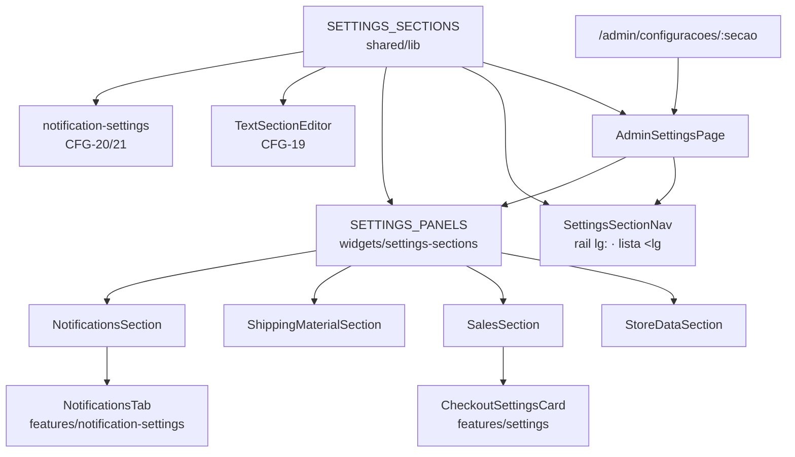

# Configurações por Seções — Design

**Spec**: `.specs/features/55-configuracoes-por-secoes/spec.md`
**Mockups**: Paper, arquivo "Uma Estrelinha", página *Configurações — proposta de reorganização*
(`pageId p-9-0`) — 4 artboards: 1440 com "Frete e Material", 1440 com "Notificações", 390 lista,
390 seção aberta.
**Status**: Approved

---

## Architecture Overview

Três donos, e nenhum deles decide o que é do outro:

| Pergunta | Dono | Onde |
| --- | --- | --- |
| **Quais seções existem, e como se chamam** | `SETTINGS_SECTIONS` | `shared/lib/settingsSections.ts` |
| **Qual seção está aberta** | a **URL** (`useParams().secao`) | `pages/admin/AdminSettingsPage.tsx` |
| **O que cada seção desenha** | `SETTINGS_PANELS` | `widgets/settings-sections/model/panels.tsx` |



### As duas alternâncias, e por que elas são de naturezas diferentes

Esta é a decisão central do desenho, e confundir as duas é como a feature quebraria.

**1. Qual seção está montada — decidida pela URL, com montagem CONDICIONAL.**
O painel renderiza **só** o componente da seção ativa. As outras três não existem no DOM.

Isto não é otimização: é o que mantém verdadeira a *Edge Case* "troca de seção descarta a edição não
salva". Hoje quem garante isso é o Radix, que desmonta `TabsContent` inativo — e o
`NotificationsTab` **depende disso por escrito** (comentário no topo do arquivo: *"o componente
remonta ao trocar de aba, o hook nasce de novo, e o rascunho volta a refletir o servidor"*). Trocar
a montagem condicional por quatro seções escondidas com CSS manteria os quatro rascunhos vivos:
editar o assunto de um e-mail, ir para Frete, voltar, e a edição ainda estaria lá — sem nada
quebrar, sem teste reprovar, e com a prévia de e-mail aberta vazando entre seções.

**2. Desktop × celular — decidido pelo BREAKPOINT, em UMA árvore só.**
Não há `<SettingsDesktop>` e `<SettingsMobile>`. O rail e a lista do celular são **o mesmo nó**, com
classes `lg:`; o marcador de seção ativa é `lg:`-prefixado e o chevron é `lg:hidden`. É o molde de
`AdminMenuPage` (`hidden lg:flex` nas duas colunas), e o motivo é o "defeito 01": duas árvores
paralelas são duas listas das mesmas 4 seções, que divergem no dia em que entrar a 5ª.

> **O marcador ser `lg:`-only resolve o caso que pareceria exigir dois componentes.** No desktop a
> rota-mãe marca "Dados da loja" (CFG-02); no celular a rota-mãe não marca nada (é uma lista, e
> marcar sugeriria que já está aberta). Com o marcador só em `lg:`, os dois comportamentos saem da
> mesma linha de classe — sem `useMediaQuery`, que mediria a janela em JavaScript e daria um quadro
> errado na primeira pintura.

### O recorte de rota

```
/admin/configuracoes            → secaoValida = null   · secaoExibida = SETTINGS_SECTIONS[0]
/admin/configuracoes/vendas     → secaoValida = vendas · secaoExibida = vendas
/admin/configuracoes/xpto       → secaoValida = null   · secaoExibida = SETTINGS_SECTIONS[0]   (CFG-18)
```

Duas derivações, e cada uma responde a uma pergunta diferente:

- **`secaoExibida`** (nunca nula) — o que o painel desenha e o que o rail marca.
- **`secaoValida`** (nula na rota-mãe e no slug inválido) — se o celular mostra a lista ou a seção,
  e se o cabeçalho de voltar existe.

| | `secaoValida` nula | `secaoValida` presente |
| --- | --- | --- |
| **`PageHeader`** | visível | `hidden lg:flex` |
| **cabeçalho de voltar** | não renderiza | `lg:hidden` |
| **`SettingsSectionNav`** | visível | `hidden lg:block` |
| **painel** | `hidden lg:block` | visível |

**Sem redirect** (CFG-17): `/admin/configuracoes` é o endereço que vive em `footerNavItems`, e um
`<Navigate>` dali trocaria o endereço do rodapé por um que a sidebar não conhece.

---

## Code Reuse Analysis

### Existing Components to Leverage

| Componente | Local | Como |
| --- | --- | --- |
| `FormCard` | `shared/ui/FormCard.tsx` | **já aceita `title` e `description`** — os cabeçalhos de card do artboard ("Frete" / "O que a cliente paga…") são props, não código novo |
| `FieldGroup` · `ToggleField` | `shared/ui/FieldGroup.tsx` | inalterados; todos os campos migram como estão |
| `MoneyInput` | `shared/ui/inputs/` | CFG-23 — entra em 3 campos |
| `PageHeader` | `shared/ui/PageHeader.tsx` | o cabeçalho fixo **e** o de voltar do celular: `backTo` já existe na interface e **nunca teve consumidor** — esta feature é o primeiro |
| `CheckoutSettingsCard` | `features/settings` | montado dentro de `SalesSection`, sem uma linha alterada |
| `NotificationsTab` | `features/notification-settings` | montado dentro de `NotificationsSection`, comportamento interno intacto (CFG-07) |
| `freeShippingRefusal` | `@estrelinha/core/shipping` | `FRG-12` acompanha o card de Frete |
| `isNavActive` | `widgets/admin-layout/lib/` | já é o dono do casamento por segmento — as subrotas herdam o foco de graça |
| padrão `hidden lg:flex` | `AdminMenuPage.tsx:412` | a alternância por breakpoint numa árvore só |
| `bg-primary/5` para linha ativa | `CategoryTable.tsx:93` | o marcador do rail |

### Integration Points

| Sistema | Integração |
| --- | --- |
| `react-router` | duas rotas irmãs **auto-fechadas** em `App.tsx` (ver *Risks*) |
| `FOCUS_ROUTES` | ganha `/admin/configuracoes`; `isFocusRoute` casa as subrotas por prefixo de segmento |
| `store_settings` | **nada muda** — mesmas chaves, mesmos tipos, mesmos `upsert` |

---

## Components

### `SETTINGS_SECTIONS` — o registro

- **Purpose**: responder "quais seções existem, como se chamam e onde moram" — uma vez.
- **Location**: `apps/backoffice/src/shared/lib/settingsSections.ts`
- **Interfaces**:
  - `SettingsSectionSlug = 'dados-da-loja' | 'vendas' | 'frete-e-material' | 'notificacoes'`
  - `SETTINGS_SECTIONS: readonly SettingsSection[]` — `{ slug, label, description, icon }`
  - `SETTINGS_ROOT = '/admin/configuracoes'`
  - `settingsSectionPath(slug): string`
  - `findSettingsSection(slug: string | undefined): SettingsSection | null` — o recorte de CFG-18
- **Reuses**: o molde de `navItems.ts` (lista de `{ to, icon, label }` com a ordem sendo o contrato).

> **Por que em `shared/lib` e não ao lado da página.** `navItems.ts` mora em
> `widgets/admin-layout/model/` porque só o widget o lê. Este registro tem consumidores em
> **`features/`** — `notification-settings` (CFG-21) e `home-composition` (CFG-19) —, e `features`
> não importa de `widgets`. Pôr o registro em `widgets` obrigaria as duas features a repetir o
> caminho como literal, que é exatamente o que CFG-19 e CFG-21 existem para acabar.
>
> O registro **não carrega componente React**: quem monta o quê é `SETTINGS_PANELS`, um nível acima.
> Se o `Component` morasse aqui, `shared` importaria `features` — a inversão de camada mais grave
> possível na FSD.

### `SETTINGS_PANELS` — o mapa slug → conteúdo

- **Purpose**: dizer qual componente é o corpo de cada seção.
- **Location**: `apps/backoffice/src/widgets/settings-sections/model/panels.tsx`
- **Interfaces**: `SETTINGS_PANELS: Record<SettingsSectionSlug, ComponentType>`
- **Dependencies**: `features/settings`, `features/notification-settings`
- **Guarda**: bidirecional (`panels.test.tsx`) — toda chave do registro tem painel **e** todo painel
  tem chave. Molde de `menuIconCatalog.test.ts`. Sem o segundo sentido, um painel órfão fica no
  bundle para sempre; sem o primeiro, uma seção nova renderiza o vazio.

### `SettingsSectionNav` — o rail e a lista, na mesma árvore

- **Purpose**: a lista das 4 seções, card-rail de 296px no desktop e lista de largura cheia no
  celular.
- **Location**: `apps/backoffice/src/widgets/settings-sections/ui/SettingsSectionNav.tsx`
- **Interfaces**: `({ ativa: SettingsSectionSlug, className?: string })`
- **Detalhes medidos do artboard**: card 296px · linha `py-[13px] pl-[13px] pr-4` (altura 60px,
  acima do piso de 44) · chip de ícone 34×34 · rótulo 13,5px semibold · descrição 12px.
  As **cores** são traduzidas para os tokens do admin (`primary`, `muted`, `border`), nunca os hex
  do artboard — `adminTokens.test.ts` recusa hex literal, e o modo escuro pararia de acompanhar.
- **Teclado**: cada linha é um `<Link>`, então Tab e Enter são do navegador. **Espaço é
  acrescentado à mão** (`onKeyDown` + `preventDefault`), porque `<a>` não ativa por Espaço — a
  *Edge Case* pede os dois.

### `AdminSettingsPage` — a página fina

- **Purpose**: ler a URL, escolher a seção, e montar cabeçalho + nav + painel.
- **Location**: `apps/backoffice/src/pages/admin/AdminSettingsPage.tsx`
- **O que ela DEIXA de fazer**: todo o estado de formulário (`useState` × 6), o `save()` de seis
  ramos, o `PageSettingsKey` e o `<Tabs>`. Passa de ~430 linhas a ~90.

### As quatro seções

| Seção | Local | Cards | Chave(s) salvas |
| --- | --- | --- | --- |
| `StoreDataSection` | `features/settings/ui/` | Geral · SEO | `general`, `seo` |
| `SalesSection` | `features/settings/ui/` | Pagamento · Checkout · Carrinho abandonado | `payment`, `abandoned_cart` (+ `checkout`, pelo card) |
| `ShippingMaterialSection` | `features/settings/ui/` | Frete · Material | `shipping`, `material` |
| `NotificationsSection` | `widgets/settings-sections/ui/` | cabeçalho + `NotificationsTab` | `notifications`, pela aba |

> **Cada seção é AUTOCONTIDA — próprio `useStoreSettings()`, próprio `useUpdateSettings()`, próprio
> estado.** É a independência que `CheckoutSettingsCard` e `NotificationsTab` já têm, agora valendo
> para as três restantes. Três consequências:
>
> 1. **O descarte ao trocar de seção passa a ser propriedade da árvore**, não de uma biblioteca de
>    abas. Desmontou, acabou.
> 2. **Some o `save()` de seis ramos** e o `PageSettingsKey` que existia para tornar
>    `save('notifications')` inalcançável — não há mais um `save` central para proteger.
> 3. **O estado de carga passa a ser do PAINEL, não da página.** Hoje o `isLoading` troca a tela
>    inteira (cabeçalho incluso) por um spinner. Com o rail sendo navegação, piscá-lo a cada carga
>    seria pior; a *Edge Case* pede o estado de carga "antes de desenhar os cards", e é onde ele
>    passa a ficar.
>
> `NotificationsSection` mora no **widget** e não em `features/settings` porque importaria
> `features/notification-settings` — import lateral entre features, que a FSD deste repositório
> tolera na transição mas não é para ganhar habitante novo. As outras três moram em
> `features/settings` porque `SalesSection` monta `CheckoutSettingsCard`, que é **o mesmo slice**.

### `InfoBanner` — o aviso informativo compartilhado (CFG-26/27)

- **Purpose**: um aviso informativo, em vez de quatro implementações ad hoc.
- **Location**: `apps/backoffice/src/shared/ui/InfoBanner.tsx`
- **Interfaces**: `({ icon?: LucideIcon, children, action?: ReactNode, 'data-testid'?: string })`
- **Consumidores**: Material, Checkout (`CheckoutSettingsCard`), Carrinho abandonado, e os avisos do
  `EventCard`.
- **Cor**: `--estrelinha-admin-amber` a 10% de fundo, texto no token cheio — o par que
  `adminTokens.test.ts` **já prova** ter contraste nos dois temas.

> **CFG-26 e CFG-27 puxam para lados diferentes, e a resolução está escrita aqui.** CFG-27 pede
> "equivalente ao atual" e três dos quatro banners são `bg-muted` neutro; CFG-26 pede a cor
> semântica âmbar, que é o que o `EventCard` **já usa** (hoje com `amber-50`/`amber-900` literais do
> Tailwind, fora do sistema de tokens do painel) e o que os artboards mostram. Lido junto,
> "equivalente" é *extração, não redesenho*: mesma posição, mesmo ícone, mesmo texto, mesma
> densidade. A cor unifica para âmbar — que é a única leitura em que CFG-26 tem efeito.

---

## Data Models

Nenhum. `store_settings` não muda — nem chave, nem tipo, nem coluna. O único tipo novo é de
navegação:

```typescript
export interface SettingsSection {
  slug: SettingsSectionSlug
  label: string
  description: string
  icon: LucideIcon
}
```

E um tipo de aviso, para CFG-21 poder oferecer link:

```typescript
export interface EventWarning {
  text: string
  /** A seção onde o ajuste se resolve. Vira link ao lado do texto. */
  action?: { to: string; label: string }
}
```

> **Por que `EventWarning` e não `ReactNode`.** Um aviso como nó React deixaria o texto partido em
> vários nós de DOM, e `getByText('a frase inteira')` — que é como os casos de hoje o provam —
> pararia de casar. Com o texto continuando `string` e o link ao lado, a asserção existente segue
> válida e a nova é sobre o `href`.

---

## Error Handling Strategy

| Cenário | Tratamento | O que a Adri vê |
| --- | --- | --- |
| Slug de seção inexistente (CFG-18) | `findSettingsSection` devolve `null`; a tela vira a rota-mãe | desktop: rail + "Dados da loja" · celular: a lista |
| Falha ao salvar | o `toast` destrutivo de hoje, por seção | idêntico ao atual |
| `FRG-12` (frete grátis ligado sem faixa) | recusa **antes** da escrita, dentro de `ShippingMaterialSection` | o mesmo toast de hoje |
| `store_settings` carregando | estado de carga **no painel** | rail à vista, painel com o carregando |

---

## Risks & Concerns

| Concern | Local | Impacto | Mitigação |
| --- | --- | --- | --- |
| **`rotasSobGuarda.test.ts` exige exatamente UM `</Route>`** | `app/__tests__/rotasSobGuarda.test.ts:90` | A forma idiomática do React Router (rota-mãe com filhos aninhados) **derruba o guarda de autorização do painel inteiro** — ele recorta o bloco por `indexOf('</Route>')` | As duas rotas são irmãs auto-fechadas. Escrito no `App.tsx` ao lado delas, para o próximo não "arrumar" |
| **A âncora de `focusRoutes.test.ts` só conhece `navGroups`** | `focusRoutes.test.ts:55` | `/admin/configuracoes` vive em `footerNavItems`; a âncora reprovaria a feature por um motivo que não é o dela | A âncora passa a varrer `navGroups` **+** `footerNavItems` — que é o que `NavRail` renderiza. O alcance dela aumenta; a régua não afrouxa |
| **A asserção `isFocusRoute('/admin/configuracoes') === false`** | `focusRoutes.test.ts:29` | Um teste verde **a favor** do estado que a feature remove | **Invertida com o motivo ao lado**, nunca apagada (doutrina da feature 41) |
| **`NotificationsTab` depende do desmonte para descartar rascunho** | `NotificationsTab.tsx:6-8` (comentário) | Se o painel escondesse as seções com CSS, o rascunho sobreviveria à troca e a prévia vazaria — **sem nada reprovar** | Montagem condicional por slug. Um caso prova que trocar de seção e voltar zera o rascunho |
| **Dois campos de dinheiro mudam de contrato de valor** | `MaskedNumberInput` emite `number \| null`; o estado é `number` | `null` gravaria `null` onde hoje grava `0` — mudança silenciosa de dado | `v ?? 0` em cada um dos três, e um caso por campo provando que o payload é idêntico ao de hoje (CFG-24) |
| **`EventCard` usa `amber-*` literal do Tailwind** | `EventCard.tsx:95` | Fora do sistema de tokens do admin: `adminTokens.test.ts` não o alcança, e o dark mode é mantido à mão com quatro classes `dark:` | Passa a usar `InfoBanner`, que usa o token. Quatro classes `dark:` deixam de existir |
| **A copy "aba Geral"/"aba SEO" é LEGÍTIMA no formulário de produto** | `features/product-form/**` | Um guarda que proíba a palavra "aba" no painel nasce reprovando uma tela que esta feature não toca — e guarda que nasce vermelho é guarda que alguém desliga | A régua recusa os **seis rótulos inequívocos** de aba de Configurações mais a forma `Configurações → <rótulo>`; "Geral" e "SEO" sozinhos ficam de fora, **com o motivo escrito no arquivo** |
| **O guarda precisa escrever as formas que proíbe** | o próprio arquivo de guarda | Doutrina do repositório: guarda que recusa STRING é quebrado pela prosa que o explica | Allowlist de **UM** — o próprio guarda —, com um caso provando que **outro** arquivo de teste seria acusado (molde de `chaveDeServidorForaDoNavegador.test.ts`) |
| **`AdminSettingsPage.test.tsx` renderiza a página sem Router** | `AdminSettingsPage.test.tsx` | A página passa a usar `useParams`/`Link` e lançaria fora de um Router | O helper de render embrulha em `MemoryRouter` com a rota inicial. As asserções de comportamento não mudam |
| **`AdminQuickGridPage.tsx:127` lê `products` sem `range`** | dívida `BL-008` pré-existente | Fora do escopo desta feature | Registrada; não tocada |

> **Nenhuma encontrada** em: migrations, RLS, pagamento. `packages/core/src/payment/**` não é tocado,
> e o gate confere por `git diff --name-only`.

---

## Tech Decisions (only non-obvious ones)

| Decisão | Escolha | Motivo |
| --- | --- | --- |
| Quem sabe qual seção está aberta | a URL | Uma fonte só, lida igual pelas duas larguras. Um `useState` ao lado da URL seria o "defeito 01" com dois donos de "onde estou" |
| Desktop × celular | **uma** árvore com classes `lg:` | Duas árvores são duas listas das mesmas 4 seções |
| Montagem das seções | condicional por slug | É o que mantém o descarte de rascunho verdadeiro (ver *Risks*) |
| Marcador do rail | classes `lg:`-only | Desktop marca na rota-mãe, celular não — da mesma linha, sem medir a janela em JS |
| Estado dos formulários | por seção, autocontido | Espelha `CheckoutSettingsCard`/`NotificationsTab`; elimina o `save()` de seis ramos |
| Seta de voltar do celular | `PageHeader` com `backTo` → rota-mãe | A prop existe e nunca teve consumidor. "Subir" para a lista é determinístico mesmo em link colado |
| Espaço ativa a linha do rail | `onKeyDown` explícito | `<a>` não ativa por Espaço; a *Edge Case* pede Enter **e** Espaço |
| Rótulos dos campos de dinheiro | sem `(R$)` | O prefixo do `MoneyInput` carrega a unidade — convenção conferida em `PricingTab.tsx` |
| `InfoBanner` em `shared/ui` | sim | Dois slices de `features/` o consomem; em `features/` seria cross-import |

### Desvios declarados do artboard

Três, e nenhum é esquecimento:

1. **O botão "Ver na loja" do cabeçalho não entra.** O artboard o mostra (é o molde de
   `/admin/menu`), mas nenhuma AC o pede e a tabela *Out of Scope* diz que a feature só reorganiza o
   que existe. Um botão novo é conteúdo novo.
2. **O celular mostra TODOS os campos.** O artboard de 390 omite "Complemento" e "Observação para
   quem envia" no card Material — abreviação de desenho. Omiti-los seria remover campo, que a tabela
   *Out of Scope* proíbe.
3. **O cabeçalho de voltar usa a descrição da seção abaixo do título**, onde o artboard põe um
   sobrescrito "CONFIGURAÇÕES" acima. É o que `PageHeader` já sabe fazer; inventar um cabeçalho novo
   para um sobrescrito seria um segundo dono de cabeçalho de página.

> **Project-level**: o modo de foco em Configurações e o esquema de rota por seção viram `AD-038` em
> `.specs/STATE.md` — as duas são convenções que a próxima tela de configuração vai herdar.
> **`AD-037` não é meu**: está reservado pela feature `52` (já citado no `CLAUDE.md` da raiz) e ainda
> não foi escrito no `STATE.md`. Tomá-lo seria o problema de contador compartilhado que este
> repositório conhece desde a `45`.

---

## Test Coverage Matrix

| Requisito | Onde se prova | Forma |
| --- | --- | --- |
| CFG-01 | `SettingsSectionNav.test.tsx` | 4 linhas, na ordem do registro (âncora derivada da fonte) |
| CFG-02 | `AdminSettingsPage.test.tsx` | rota-mãe: painel = Dados da loja, marcada no rail, **e nenhum índice no painel** |
| CFG-03 | idem | clicar no rail troca painel e marcador |
| CFG-04..07 | idem | um caso por seção, nomeando os cards |
| CFG-08 | idem | o `PageHeader` é o mesmo nó antes e depois da troca |
| CFG-09 | `focusRoutes.test.ts` | `isFocusRoute('/admin/configuracoes')` **invertida** + subrota |
| CFG-10..12 | `AdminSettingsPage.test.tsx` | classes de visibilidade por rota; o voltar leva à rota-mãe |
| CFG-13 | `SettingsSectionNav`/seções | grades `sm:grid-cols-*` preservadas (empilham abaixo de `sm`) |
| CFG-14 | `SettingsSectionNav.test.tsx` | altura da linha ≥ 44 por token exato |
| CFG-15..18 | `AdminSettingsPage.test.tsx` | um caso por rota, inclusive o slug inválido |
| CFG-19 | `TextSectionEditor.test.tsx` | **dois** `href`, um por seção |
| CFG-20..22 | `useNotificationsDraft` · `EventCard` · `semAbaEmConfiguracoes.test.ts` | as duas frases + o guarda de varredura |
| CFG-23..25 | seções | `R$` visível; payload idêntico ao de hoje; % e horas intactos |
| CFG-26..27 | `InfoBanner.test.tsx` + os 4 consumidores | o token e os quatro chamadores |
| Edge: descarte | `AdminSettingsPage.test.tsx` | editar → trocar → voltar → o campo voltou ao servidor |
| Edge: prévia fecha | idem | a prévia não sobrevive à troca de seção |
| Edge: teclado | `SettingsSectionNav.test.tsx` | Enter e Espaço |
| Edge: carga | seções | o carregando aparece antes dos cards |
