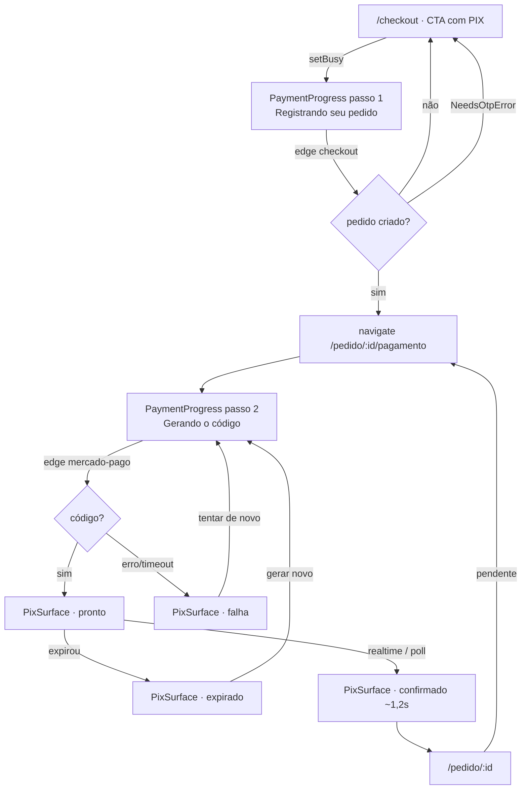

# 58 · Pagamento PIX em rota própria — Design

**Spec**: `.specs/features/58-pagamento-pix-em-rota-propria/spec.md`
**Status**: Draft

---

## Architecture Overview

O fluxo deixa de ser "um acordeão que troca de conteúdo" e passa a ser **duas superfícies com
endereço**: o checkout, que termina quando o pedido existe, e a rota do pagamento, que é a única
casa do PIX.



### As três decisões de arquitetura

**1. Onde mora a superfície do PIX.** Explorado antes de decidir:

| Abordagem | O que seria | Por que não / por que sim |
| --- | --- | --- |
| **(a) Rota própria `/pedido/:id/pagamento`** ✅ | Página nova, fora do `StoreLayout`, dona de todos os estados do PIX | **Recomendada.** É a única que dá endereço: sobrevive a `F5`, volta pelo histórico, abre em outro aparelho e é linkável de `/pedido/:id` e de `/conta`. É o mesmo movimento que `CNF-03` fez com a confirmação, e pelo mesmo motivo |
| (b) Continuar no checkout, com rolagem e colapso dos blocos | `scrollIntoView` no bloco 3 + esconder Contato/Entrega + matar o CTA | Resolve a dobra e **não** resolve o endereço: fechar a aba continua perdendo o caminho de volta, e o QR continua sem link. Mantém o CTA fixo e o resumo editável disputando a tela com o pagamento |
| (c) Modal em cima do checkout | Diálogo full-screen com o QR | Mesma ausência de endereço da (b), mais o problema do `DialogContent` (`dialogGridTrack.test.ts`) e o do foco preso. É a forma que `/conta` já usa hoje, e é ela que estamos removendo |

**2. Quem gera o número do pedido.** Hoje é a edge function (`NP-` + base36 do relógio + 4
aleatórios). Passa a ser **o banco**, por `default` de coluna alimentado por uma `sequence`:

| Abordagem | Por que não / por que sim |
| --- | --- |
| **`default` de coluna com `nextval`** ✅ | `nextval` é seguro sob concorrência por construção; o índice único de `order_number` continua como última linha de defesa; e o gerador some do JavaScript — a function deixa de mandar a coluna. Um dono, e ele é o único que enxerga todas as transações |
| RPC `next_order_number()` chamada pela function | Mesmo resultado com um round-trip a mais e um ponto a mais para esquecer de chamar; quem inserir por outro caminho (importador, seed) nasceria sem número |
| Contador em tabela com `update … returning` | Serializa escrita de pedido num lock de linha só; é o modo clássico de transformar pico de venda em fila |

**3. Quem limpa o carrinho.** Hoje `handlePaymentSuccess` (no checkout) limpa carrinho, cupom e
rascunho na aprovação (`CNF-05`). Com o pagamento em outra rota, o checkout já está desmontado —
então a limpeza muda de casa **e ganha um recorte que hoje não precisava existir**: limpa-se apenas
quando o pedido aprovado é o que o rascunho em curso criou (`checkoutStore.orderId === id`). Sem o
recorte, pagar um pedido antigo por `/conta` apagaria um carrinho **novo** que a pessoa acabou de
montar.

---

## Code Reuse Analysis

| Peça | Onde está | Como entra |
| --- | --- | --- |
| `useOrder(id)` | `entities/order/api/useOrder.ts` | Lê o pedido na rota nova. **Já resolve convidada e sessão** — token primeiro, PostgREST depois |
| `useCreatePayment` | `features/checkout/api/useCreatePayment.ts` | Continua sendo quem chama `mercado-pago?action=create-payment`, com o timeout de 15s e o `access_token` da convidada |
| `accessFor` / `rememberAccess` | `entities/order/model/orderAccess.ts` | Inalterados. `orderAccessSingleOwner.test.ts` continua valendo |
| `fetchGuestOrder` | `entities/order/api/guestOrder.ts` | A pergunta de 5 em 5 segundos da convidada (`CSC-05`) migra junto com a máquina |
| Máquina do PIX | `features/checkout/ui/PixPayment.tsx` | **Extraída** para `usePixPayment` — timer, realtime, poll, copiar, regenerar. O componente é apagado |
| `CheckoutHeader` | hoje dentro de `pages/CheckoutPage.tsx` | **Extraído** para `widgets/checkout-header` — dois consumidores |
| `formatPrice`, `usePaymentSettings` | `@estrelinha/core` | Valor e percentual do desconto, como já é feito |
| `OrderTimeline`, `OrderMaterialBlock` | `entities/order`, `widgets/order-material` | Não mudam: continuam em `/pedido/:id` |
| `qrcode.react` | dependência existente | Continua desenhando o `qr_code` |

### Integration points

| Sistema | Como conecta |
| --- | --- |
| Edge `checkout` (`create-order`) | Para de mandar `order_number`; o resto do corpo é idêntico |
| Edge `mercado-pago` (`create-payment`) | Sem mudança de contrato |
| Supabase Realtime | Sem mudança: o canal continua filtrando `orders.id=eq.<id>` |
| `send-notification` | Passa a citar o número pelo formatador único (`{{numero_pedido}}` vira `#0244`) |

---

## Components

### `pages/OrderPaymentPage.tsx`

- **Purpose**: a casa do pagamento de um pedido — decide entre progresso, código, expirado, falha e
  confirmado.
- **Location**: `apps/store/src/pages/OrderPaymentPage.tsx`
- **Rota**: `/pedido/:id/pagamento`, **fora** do `StoreLayout`, `lazy`.
- **Interfaces**: nenhuma prop — lê `:id` da URL.
- **Regras**:
  - `PIX-P1-06`: `paid_at` presente, `status === 'cancelled'` ou `payment_method !== 'pix'` ⇒
    `<Navigate to={/pedido/:id} replace />`.
  - Pedido inexistente ou sem credencial ⇒ a mesma recusa de `OrderConfirmationPage` (entrar com
    código / ir para Minha conta).
  - Na aprovação: `markCartRecovered`, depois a limpeza **recortada** (só se
    `useCheckoutStore.getState().orderId === id`), depois `navigate('/pedido/:id')`.

### `features/order-payment/model/usePixPayment.ts`

- **Purpose**: a máquina de estado do PIX, sem UI.
- **Interface**:
  ```ts
  type PixState =
    | { kind: 'generating'; slow: boolean }
    | { kind: 'ready'; qrCode: string; secondsLeft: number }
    | { kind: 'expired' }
    | { kind: 'failed'; message: string }
    | { kind: 'approved' }

  usePixPayment(orderId: string): {
    state: PixState
    generate: () => void
    copy: () => void
    copied: boolean
  }
  ```
- **Reusa**: `useCreatePayment`, `accessFor`, `fetchGuestOrder`, o timer e o canal de Realtime que
  hoje vivem em `PixPayment.tsx`.
- **`slow`**: vira `true` aos 8s de geração (`PIX-P1-07`). É estado, não animação.

### `features/order-payment/ui/PaymentProgress.tsx`

- **Purpose**: os dois passos nomeados. **Um** componente para as duas telas (checkout e rota nova),
  que é o que faz a espera ler como um caminho só.
- **Props**: `{ step: 'order' | 'code'; amount: number; orderNumber?: string; slow?: boolean }`.
- **Consumidores**: `pages/CheckoutPage.tsx` e `pages/OrderPaymentPage.tsx` — **duas páginas**, nunca
  uma feature importando a outra (`AD-033`).

### `features/order-payment/ui/PixSurface.tsx`

- **Purpose**: desenha `ready`, `expired`, `failed` e `approved`.
- **Props**: `{ state: PixState; amount: number; orderNumber: string; onGenerate(): void; onCopy(): void; copied: boolean }`.
- **Regras de identidade**: o tempo é fato, não pressão (`PIX-P2-05`) — `ink`, virando `primary` nos
  últimos 5 minutos, sem vermelho e sem piscar; uma pílula cheia por estado.

### `widgets/checkout-header/`

- **Purpose**: o header sem navegação de categorias, hoje declarado dentro do `CheckoutPage`.
- **Consumidores**: `CheckoutPage` e `OrderPaymentPage`.

### `packages/core/src/orders/format.ts`

- **Purpose**: o dono único de "como se escreve o número de um pedido".
- **Interface**: `formatOrderNumber(value: string | null | undefined): string`
  - `'0244'` ⇒ `'#0244'`
  - `'NS-169'` ⇒ `'#NS-169'` (legado continua legível, `PIX-P4-04`)
  - `'#0244'` ⇒ `'#0244'` (não duplica)
  - vazio/nulo ⇒ `''`
- **Consumidores**: loja, painel e `send-notification` (Deno) ⇒ `packages/core` por `AD-033`.
- **Restrição de Deno**: o módulo não importa nada; quem o alcança de `supabase/functions` usa
  caminho relativo com `.ts` explícito, e `denoReach`-style guard cobre o arquivo.

### Migration

`supabase/migrations/<ts>_58-order-number-sequence.sql`:

```sql
create sequence if not exists orders_number_seq start with 170;
alter table orders alter column order_number set default lpad(nextval('orders_number_seq')::text, 4, '0');
```

- **Aditiva e idempotente**; **não escreve dado** (`AD-017`: migration aplicada é imutável; esta é
  nova).
- `start with 170`: o maior número importado da Nuvemshop é `NS-169` (medido contra o projeto
  hospedado em 2026-09-21).
- O importador continua mandando `NS-<numero>` explicitamente — valor explícito vence o `default`.

---

## Data Models

Nenhuma coluna nova. `orders.order_number` continua `text` com índice único
(`orders_order_number_key`); o que muda é **quem** o preenche.

| Valor | Origem | Exibição |
| --- | --- | --- |
| `0170`, `0171`, … | `default` da coluna (sequência) | `#0170` |
| `NS-169` | importador da Nuvemshop | `#NS-169` |
| `NP-MUBBLKLYGOMR` | os 2 pedidos anteriores a esta feature | `#NP-MUBBLKLYGOMR` |

---

## Rotas e listas que envelhecem juntas

| Arquivo | O que entra |
| --- | --- |
| `apps/store/src/app/App.tsx` | `<Route path="/pedido/:id/pagamento" element={<OrderPaymentPage />} />`, fora do `StoreLayout`, `lazy` |
| `packages/core/src/routes/routes.ts` | `/pedido/:id/pagamento` em `NON_INDEXABLE_PATHS`, com o motivo escrito |
| `routeSplitting.test.ts` | a página nova em `lazy` (bidirecional) |
| `ROUTE_SLUGS` | **nada** — `pedido` já está lá, e a comparação é de primeiro segmento |
| `vercel.json` | **nada** — o catch-all do SPA já serve |

---

## Guardas

### Novos

| Guarda | Onde | O que derruba |
| --- | --- | --- |
| `pagamentoComDonoUnico.test.ts` | store `shared/lib/__tests__` (varre `apps/store/**`) | qualquer arquivo fora de `features/order-payment` montar `QRCodeSVG`, chamar `create-payment` com `method: 'pix'`, ou `PixPayment.tsx` voltar ao disco; `AccountPage` voltar a montar a superfície em vez de linkar. **Âncora dupla** (arquivos lidos + o dono encontrado) e a metade positiva — o dono precisa continuar chamando `useCreatePayment` |
| `numeroDoPedidoComDonoUnico.test.ts` | store `shared/lib/__tests__` (varre `apps/**` e `supabase/functions/**`) | `#` colado em `order_number` à mão — interpolação (`` `#${…order_number}` ``) e concatenação — fora de `core/orders/format.ts`. Metade positiva: as três superfícies chamam `formatOrderNumber` |
| `orderNumberSchema.test.ts` | store `shared/lib/__tests__` (lê a migration) | a sequência sumir, nascer em outro número, o `default` deixar de usar `lpad(…, 4, '0')`, a migration escrever dado, ou a coluna perder o índice único. Sensor por mutação em cada asserção |
| `format.test.ts` | `packages/core/src/orders/__tests__` | legado ganhando dois `#`, dígito puro saindo sem `#`, vazio virando `#` |

### Atualizados

| Guarda | Mudança |
| --- | --- |
| `sitemapRoutes.test.ts` · `routeSplitting.test.ts` · `routes.test.ts` | âncoras de contagem sobem em 1 — rota nova classificada e `lazy` |
| `createOrder.test.ts` (functions) | para de exigir `/^NP-/`; passa a exigir que a function **não mande** `order_number` (o banco é o dono) |
| `orderAccessSingleOwner.test.ts` | escopo continua valendo; a leitura do token muda de arquivo, não de dono |

---

## Risks & Concerns

| Concern | Onde | Mitigação |
| --- | --- | --- |
| **`AD-012`: o `default` pode não existir no banco e o teste não notar** — a migration é texto até alguém aplicá-la | migration nova | Probe HTTP/SQL real contra o banco local: inserir dois pedidos e ler os números. Inspeção de tipo não prova gravação |
| **`PixPayment` tem dois consumidores hoje** (bloco 3 e diálogo de `/conta`); apagá-lo sem trocar os dois quebra a conta | `AccountPage.tsx` | A task que apaga o componente é a **mesma** que troca `/conta` por link; o guarda novo recusa a volta |
| **A limpeza do carrinho muda de casa** e pode apagar carrinho novo de quem paga pedido antigo | `OrderPaymentPage` | Recorte por `checkoutStore.orderId === id`, com caso de teste nos dois sentidos |
| **`markCartRecovered` depende do e-mail do contato**, que vive no rascunho do checkout | `OrderPaymentPage` | Passa a usar `order.customer_email`, que é do pedido e existe em qualquer caminho |
| **Realtime não alcança a convidada** (RLS `TO authenticated`) | `usePixPayment` | A pergunta de 5 em 5 segundos migra junto, sem alteração — é `CSC-05`, já provado |
| **`jsdom` devolve 0 para layout** | todas as telas novas | As ACs de forma são provadas por token de classe; o que depende de medida vai para a prova em navegador, listada abaixo |
| **O comentário que explica a forma proibida quebra o guarda** (duas ocorrências no repositório) | guardas novos | Descrever a forma, nunca escrevê-la; remover comentário com CRLF **e** LF na mesma varredura |
| **O `status` de um dos 2 pedidos de produção está `paid` com `payment_status` `pending`** (achado ao medir a numeração) | dado de produção | Fora do escopo desta feature — registrado aqui para não se perder |

---

## Matriz de cobertura (AC → prova)

| AC | Prova |
| --- | --- |
| PIX-P1-01 | `CheckoutPage.test.tsx`: clicar no CTA com PIX renderiza os dois passos nomeados; o passo 2 **não** aparece concluído enquanto a promessa não resolve |
| PIX-P1-02 | `CheckoutPage.test.tsx`: `navigate` recebe `/pedido/<id>/pagamento` **antes** de qualquer chamada a `create-payment` (asserção de ordem, no molde de `ANI-07`) |
| PIX-P1-03 | `OrderPaymentPage.test.tsx`: com o código, a tela tem valor, QR, campo copia-e-cola e tempo |
| PIX-P1-04 | `usePixPayment.test.ts` + página: montar a rota com pedido pendente não chama `create-order`; `generate` é chamado uma vez por montagem |
| PIX-P1-05 | `OrderPaymentPage.test.tsx`: a tela não contém o rótulo do CTA nem os blocos do checkout |
| PIX-P1-06 | três casos: aprovado, cancelado e cartão ⇒ `Navigate` para `/pedido/:id` |
| PIX-P1-07 | `usePixPayment.test.ts` com relógio falso: `slow` é `false` aos 7,9s e `true` aos 8s |
| PIX-P2-01/02 | expirado mostra a frase de "nada foi cobrado" e `generate` reusa o mesmo `orderId` |
| PIX-P2-03 | falha e timeout nomeiam o pedido, afirmam que nada foi cobrado, e oferecem as duas saídas |
| PIX-P2-04 | aprovação renderiza a confirmação **e** navega depois; o link manual está no DOM |
| PIX-P2-05 | token exato: `ink` acima de 5 min, `primary` abaixo; nenhuma classe de vermelho/`animate-pulse` |
| PIX-P3-01/02/03 | `OrderConfirmationPage.test.tsx`: pendente tem o botão e "Acompanhar pedido" é contorno; pago não tem o botão |
| PIX-P3-04 | `AccountPage.test.tsx`: a ação é um link para a rota, e nenhuma superfície de pagamento é montada |
| PIX-P4-01/02 | `orderNumberSchema.test.ts` (migration) + probe real no banco local com dois pedidos |
| PIX-P4-03 | `format.test.ts` + o guarda de dono único |
| PIX-P4-04 | `format.test.ts`: `NS-169` e `NP-…` continuam legíveis, com um `#` só |
| PIX-P4-05 | `orderList.test.ts` (backoffice): `#0244`, `0244` e `244` acham o mesmo pedido |

---

## O que só o navegador prova

Medir em **390×844** e **1440**, com o banco local de pé:

1. O percurso inteiro: CTA → progresso → QR, sem rolagem horizontal do body em nenhum passo.
2. A troca de tela no clique — se há salto de layout entre o checkout e o progresso.
3. O QR legível e escaneável por um celular de verdade (o desenho é `qrcode.react`, mas o tamanho é
   decisão nossa).
4. O alvo de 44px em "Copiar código", "Gerar um código novo" e "Pagar com PIX".
5. A tela de progresso com a resposta atrasada de propósito (interceptação), para ver a linha dos 8s
   entrar sem empurrar o conteúdo.
6. A batida de confirmação: se 1,2s é curto demais para ler, ou longo demais para esperar.
