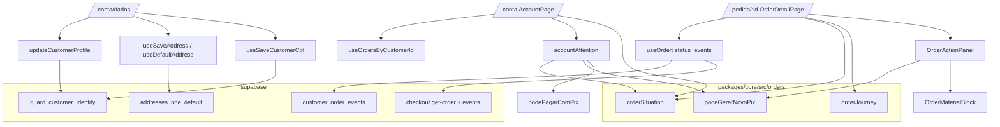

# 59 · Minha Conta V2 — Design

**Spec**: `.specs/features/59-minha-conta-v2/spec.md`
**Context**: `.specs/features/59-minha-conta-v2/context.md`
**Desenho**: Paper, página "59 · Minha Conta V2 — proposta"
**Status**: Approved (o usuário mandou seguir todas as fases em 2026-10-04)

---

## Architecture Overview

Três camadas, e a regra do repositório decide onde cada peça mora (`AD-033`):

- **`packages/core/src/orders`** — as três regras puras que respondem perguntas sobre um pedido:
  *em que pé está?* (`orderSituation`), *ainda dá para gerar PIX novo?* (`podeGerarNovoPix`) e
  *quais etapas, com que datas?* (`orderJourney`). São puras, sem React e sem Supabase, e todo
  import relativo tem `.ts` explícito (o diretório já é alcançado pelo Deno via `format.ts`).
- **`supabase/`** — uma migration nova com quatro comandos independentes (função de eventos,
  gatilho de identidade, um-endereço-padrão, renumeração dos `NP-`), mais duas mudanças na edge
  function `checkout` (`get-order` devolve os eventos; `persistirConveniencias` deixa de sobrescrever
  CPF e passa a criar o primeiro endereço como padrão).
- **`apps/store`** — `useOrder` passa a devolver `status_events` nos dois caminhos (sessão e token);
  `/pedido/:id` é reescrita como o **detalhe** (dono único do pedido); `/conta` vira lista +
  pendências; `/conta/dados` é a aba "Meus dados".



### Abordagens consideradas

| Abordagem | Veredito |
| --- | --- |
| **A. Ampliar `/pedido/:id` como o detalhe; `/conta` é lista + pendências** | **Escolhida.** Um dono só de "como um pedido é mostrado". A confirmação pós-compra e a volta pela conta são a mesma página. |
| B. Detalhe novo em `/conta/pedidos/:id` | Recusada: duas superfícies desenhando o mesmo pedido — o mesmo "defeito 01" que a `58` apagou do PIX (`AD-042`). E a convidada não tem conta, então o detalhe dela continuaria em `/pedido/:id`. |
| C. Acordeão na conta com tudo dentro | Recusada: é o desenho atual, e é o que não coube no celular. |

---

## Code Reuse Analysis

| Peça existente | Onde | Como entra |
| --- | --- | --- |
| `formatOrderNumber` | `core/orders/format.ts` | título e linhas — já é o dono do `#` |
| `podePagarComPix`, `orderPaymentPath` | `entities/order/lib/podePagarComPix.ts` | pendência "Pagamento pendente" e estado do topo; **não muda** (`PEN-08`) |
| `useOrder`, `fetchGuestOrder` | `entities/order/api` | ganham `status_events`; continuam donos de "como leio um pedido" |
| `useOrdersByCustomerId` | `entities/order/api/useOrders.ts` | lista; o tipo `Order` ganha os campos que a lista desenha |
| `OrderMaterialBlock` + `MaterialTrackingForm` | `widgets/order-material` | **reusado** como o estado do topo "Envie o seu material"; ganha portão de sessão (`MAT-06`), recusa de código vazio sem rede (`MAT-03`) e âncora `#material` |
| `useSetMaterialTracking`, `materialTrackingMessage` | `entities/order/api` | gravação do código — nenhum gravador novo (`MAT-02`) |
| `MATERIAL_STATUS_LABELS`, `toMaterialStatus` | `core/material` | selo do bloco "Seu material" |
| `formatEstimate` | `core/shipping` | "Previsão: entre 6 e 8 out" |
| `useSaveAddress`, `useDefaultAddress` | `entities/address` | **ganham consumidor** (eram código morto — `BL-032`) |
| `useSaveCustomerCpf` | `entities/customer` | CPF preenchível uma vez (`DAD-05`) — **ganha consumidor** |
| `updateDisplayName` | `packages/auth/AuthContext.tsx` | vira `updateCustomerProfile({ name, phone })`, que grava os dois e atualiza o contexto |
| `maskPhone`, `isValidBrPhone`, `maskCep`, `isValidDocument`, `maskDocument` | `core/validators` | campos de Meus dados |
| `useCepLookup` | `features/checkout/api` | **move** para `entities/address/api` (dois consumidores no mesmo app — `AD-033`); `features/checkout` reexporta |
| `useGeneralSettings().whatsapp` + portão de 10 dígitos | `PolicyContact`, `PixSurface` | `whatsappHref()` novo em `shared/lib`, usado **só** pelas peças novas (as 8 escritas antigas são dívida, abaixo) |
| `TAP_44` / `TAP_ROW` | `shared/lib/touchTarget.ts` | alvos de toque das peças novas |
| `useAuthUiStore().open` | `features/auth` | `/conta` e `/conta/dados` sem sessão abrem o login (`LST-09`) |

### Integration Points

| Sistema | Integração |
| --- | --- |
| `order_status_history` (RLS só admin desde a `52`) | lida por `customer_order_events(p_order_id)` — `security definer`, `search_path = ''`, devolve `to_status` + `created_at` do pedido da própria cliente |
| `checkout?action=get-order` | passa a devolver `status_events` com o mesmo formato, lidos pela service role depois de `accessGrant` |
| `customers` (policy de UPDATE libera a linha inteira) | gatilho `before update` recusa `email`, `user_id` e `cpf` já preenchido para quem não é admin nem service role |
| `addresses` | índice único parcial `(customer_id) where is_default` |
| `orders_number_seq` (feature `58`) | renumeração dos `NP-%` em `do $$ … loop` por `created_at` |

---

## Components

### `orderSituation` — o selo

- **Purpose**: responder "em que pé está este pedido?" num rótulo, pela régua de 9 regras (`SIT-01..10`).
- **Location**: `packages/core/src/orders/situation.ts`
- **Interfaces**:
  - `type SituationKey = 'cancelled' | 'delivered' | 'shipped' | 'refunded' | 'awaiting_material' | 'in_production' | 'pix_expired' | 'payment_rejected' | 'awaiting_payment'`
  - `type SituationTone = 'neutral' | 'done' | 'progress' | 'wait' | 'alert'`
  - `orderSituation(o: SituationInput): { key; label; tone }`
  - `situationDetail(o: SituationInput, events: StatusEvent[]): string | null` — " · chega até 8 out" / " em 12 ago" (`SIT-12`)
  - `SITUATION_LABELS: Record<SituationKey, string>`, `SITUATION_TONES: Record<SituationKey, SituationTone>`
- **Reuses**: nada de React; datas formatadas por `formatShortDate` local ao módulo (pt-BR, "8 out").

### `podeGerarNovoPix` — a janela de 7 dias

- **Location**: `packages/core/src/orders/repix.ts`
- **Interfaces**:
  - `REPIX_WINDOW_DAYS = 7`
  - `podeGerarNovoPix(o, agora: Date): boolean` — `payment_method === 'pix'`, `payment_status ∈ {expired, rejected}`, `status !== 'cancelled'`, `!paid_at`, `agora − created_at ≤ 7 dias`
  - `repixDeadline(o): Date | null` — `created_at + 7 dias` (o "até 9 de outubro" da copy)
  - `pagamentoPerdido(o, agora): boolean` — a mesma família, **fora** da janela ou cartão recusado (estado "O pagamento não foi concluído")
- **Irmã** de `podePagarComPix`, não alteração dele (`PEN-08`).

### `orderJourney` — as etapas

- **Location**: `packages/core/src/orders/journey.ts`
- **Interfaces**:
  - `type StatusEvent = { status: string; at: string }`
  - `orderJourney(o: JourneyInput, events: StatusEvent[]): Journey`
  - `type Journey = { cancelled: true; cancelledAt: string | null } | { cancelled: false; steps: JourneyStep[] }` — **discriminada por string** não dá aqui sem `kind`; usar `kind: 'cancelled' | 'steps'` (`strictNullChecks: false` não estreita literal booleano)
  - `type JourneyStep = { key: 'received' | 'paid' | 'material' | 'production' | 'shipped' | 'delivered'; label; state: 'complete' | 'current' | 'future'; at: string | null }`
- **Regra de data** (`DET-06`): `received ← created_at`, `paid ← paid_at`, `material ← material_received_at`, `production ← primeiro evento separating`, `shipped ← primeiro evento shipped`, `delivered ← primeiro evento delivered`. Sem fonte → `null`. Nunca `updated_at`.
- **Regra de estado**: a primeira etapa sem conclusão é `current`; o resto `future`. `production` está concluída quando `shipped` está. `material` só existe quando `material_status ≠ 'nao_aplicavel'`.

### Migration `20261004120000_59-minha-conta.sql`

Quatro comandos, cada um com régua própria no guarda (`L-033`):

1. `create or replace function public.customer_order_events(p_order_id uuid) returns table(status text, created_at timestamptz) language sql stable security definer set search_path = ''` — `join public.orders o on o.id = h.order_id join public.customers c on c.id = o.customer_id where h.order_id = p_order_id and c.user_id = auth.uid() order by h.created_at`. `revoke all … from public, anon; grant execute … to authenticated`.
2. `guard_customer_identity()` + `before update on public.customers` — passa direto quando `auth.role() = 'service_role'` ou `public.has_role(auth.uid(), 'admin')`; senão recusa (`errcode 42501`) mudança em `email`, `user_id`, e em `cpf` quando `coalesce(old.cpf,'') <> ''`.
3. Dedup + `create unique index if not exists addresses_one_default on public.addresses (customer_id) where is_default` — antes, `update … set is_default = false` em todo padrão que não seja o mais recente da cliente (no banco de hoje deve ser zero linhas; o comando existe para a migration não falhar num banco que tenha dois).
4. Renumeração: `do $$ declare r record; begin for r in select id from public.orders where order_number like 'NP-%' order by created_at loop update public.orders set order_number = lpad(nextval('public.orders_number_seq')::text, 4, '0') where id = r.id; end loop; end $$;` — idempotente pelo recorte.

### Edge function `checkout`

- **`getOrder`**: depois de `accessGrant`, lê `order_status_history (to_status, created_at)` do pedido e devolve `order.status_events: [{status, at}]` em ordem. Sem `note`, sem `created_by`.
- **`persistirConveniencias`**: (a) CPF só é gravado quando `customers.cpf` é nulo ou vazio — filtro `.or('cpf.is.null,cpf.eq.')` num update separado do telefone; (b) o endereço inserido nasce `is_default: true` **se** a cliente não tem padrão. Corrida com duas compras simultâneas cai no índice único, que o `catch` já engole (`ADR-G2`).

### Store — dados

- **`useOrder`** (`entities/order/api/useOrder.ts`): `OrderDetail` ganha `status_events: StatusEvent[]`, `tracking_code`, `shipping_carrier`, `address_*`, `coupon_code`, `promotion_discount`, `pix_discount`. Caminho com sessão chama `supabase.rpc('customer_order_events', { p_order_id })` depois do `select`; falha da RPC → `status_events: []` (a linha do tempo perde datas, não a página). Caminho da convidada lê `status_events` da resposta.
- **`Order`** (lista): ganha `paid_at`, `material_status`, `tracking_code`, `delivery_estimate_*` — já vêm no `select('*')`, só o tipo mentia (`AD-012`).

### Store — `/pedido/:id` (`pages/OrderConfirmationPage.tsx`, reescrita)

Ordem dos blocos (`DET-01..12`):

1. `OrderDetailHeader` — "Meus pedidos" (só com sessão) · "Pedido {n}" · "Feito em … · n peças · total" · `OrderSituationBadge`. **Mantém** a frase de e-mail do `STO-01` (pago × não pago), porque é requisito vivo da feature `10`.
2. `OrderActionPanel` (`widgets/order-action`) — um estado por vez: material a enviar (monta `OrderMaterialBlock` aqui, no topo) · PIX pendente (`podePagarComPix`) · PIX novo (`podeGerarNovoPix`) · pagamento perdido (WhatsApp) · cancelado. Nenhum → nada.
3. `OrderTrackingCard` (`entities/order/ui`) — só com `tracking_code`.
4. `OrderJourney` (`entities/order/ui`) — vertical; substitui `OrderTimeline` na loja.
5. `OrderMaterialBlock` — **aqui** quando o material não está pendente (recebido/produção/cancelado), com `id="material"`.
6. `OrderItemsSummary` (`entities/order/ui`) — peças + resumo que soma.
7. `OrderPaymentDelivery` (`entities/order/ui`) — forma de pagamento + endereço do snapshot.
8. `OrderHelp` (`widgets/order-help`) — WhatsApp com o número do pedido.
9. As duas ações do `CNF-05` ("Acompanhar pedido" → `/conta`, "Ver mais joias") ficam no fim, como hoje.

### Store — `/conta` e `/conta/dados` (`pages/AccountPage.tsx`, reescrita)

- Uma página, duas rotas irmãs auto-fechadas no `App.tsx` (`/conta` e `/conta/dados`, mesmo `element`) — o mesmo molde que o painel usa em Configurações (`rotasDeConfiguracoes.test.ts`), e o `lazy` já existente serve as duas.
- `AccountShell` — saudação + abas (celular) / coluna lateral 264 px (≥ `lg`).
- `AccountOrdersPanel` — `AttentionList` (`widgets/order-attention`) + `OrderList` (linhas `OrderRow` no celular, colunas no `lg`).
- `AccountDataPanel` — `ProfileCard` (`features/edit-profile`), `DocumentField` (dentro do mesmo card), `AddressCard` (`features/edit-address`), "Sair da conta".
- `accountAttention(orders, agora)` (`entities/order/lib/attention.ts`) — monta e ordena as pendências (`PEN-01..07`); fica em `entities` porque lê `podePagarComPix`.

### Store — peças de apresentação

- `OrderSituationBadge` (`entities/order/ui`) — pílula com ponto; cores por `tone` via tokens novos.
- Tokens novos em `App.css` **e** `tailwind.config.ts` (`palette.test.ts` compara os dois): `wait` `#6B4F24` / `wait-soft` `#F4ECDF`, `alert` `#7E2F2B` / `alert-soft` `#F6E7E5`, `done` `#3F5A3B` / `done-soft` `#EEF0EC`. `progress` usa `primary-strong` sobre `serenity`; `neutral` usa `ink` sobre `ground-deep`. Os três de texto passam ≥ 4,5:1 sobre o próprio fundo **e** sobre `ground`/`surface`.
- `whatsappHref(numero, mensagem): string | null` (`shared/lib/whatsapp.ts`) — `null` com menos de 10 dígitos.
- `parcelTrackingUrl(code)` (`core/orders/tracking.ts`) — `https://www.melhorrastreio.com.br/rastreio/{code}`. **Premissa a confirmar em navegador** (o formato do link direto não está documentado; o Melhor Rastreio reconhece a transportadora pelo código).

---

## Data Models

```typescript
// core/orders/situation.ts
interface SituationInput {
  status: string | null
  payment_status: string | null
  material_status?: string | null
  delivery_estimate_max?: string | null
}

// core/orders/journey.ts
interface JourneyInput extends SituationInput {
  created_at: string
  paid_at: string | null
  material_received_at?: string | null
  delivery_estimate_min?: string | null
}
interface StatusEvent { status: string; at: string }

// core/orders/repix.ts
interface RepixInput {
  payment_method: string | null
  payment_status: string | null
  status: string | null
  paid_at?: string | null
  created_at: string
}

// entities/order/lib/attention.ts
type AttentionKind = 'pay_pending' | 'repix' | 'payment_lost' | 'material'
interface AttentionItem { kind: AttentionKind; order: Order; deadline?: Date | null }
```

---

## Error Handling Strategy

| Cenário | Tratamento | O que a cliente vê |
| --- | --- | --- |
| Lista de pedidos falha | `useOrdersByCustomerId` passa a **lançar** em erro (hoje devolve `[]`) | "Não conseguimos carregar seus pedidos." + "Tentar de novo" (`LST-08`) |
| RPC de eventos falha | `status_events: []` | linha do tempo sem as datas do histórico; o resto da página igual |
| Gatilho recusa e-mail/CPF | erro do PostgREST 42501 | a tela nunca oferece esse caminho; se chegar, mensagem genérica de não salvo |
| Gravar perfil falha | `{ error }`, formulário continua aberto com o digitado (`DAD-09`) | "Não foi possível salvar agora. Tente de novo." |
| `useSaveAddress` devolve `saved: false` | formulário continua aberto | "Não foi possível salvar o endereço agora." |
| Código do material vazio | recusa local, sem rede (`MAT-03`) | "Informe o código de rastreio." |
| WhatsApp da loja não configurado | `whatsappHref` → `null` | bloco de ajuda some; estado "pagamento perdido" mostra só o texto |

---

## Risks & Concerns

| Concern | Location | Impact | Mitigation |
| --- | --- | --- | --- |
| **Segurança**: a cliente altera o próprio CPF e e-mail pelo PostgREST | policy de UPDATE em `customers` (`20260727120100…:35-40`) | documento do pagador trocado depois da compra; `customers.email` divergindo do login | gatilho `guard_customer_identity` + probe SQL (`DAD-06`) |
| `persistirConveniencias` sobrescreve CPF a cada compra pela service role | `checkout/handlers.ts:436-447` | o gatilho não pega (service role passa); o "CPF travado" valeria só na conta | update de CPF só quando vazio |
| Endereço do caixa nasce `is_default = false` | `checkout/handlers.ts:451-460` | `useDefaultAddress` nunca acha nada → caixa não pré-preenche, e a conta não teria endereço a mostrar | primeiro endereço nasce padrão |
| `useOrdersByCustomerId` engole erro como `[]` | `entities/order/api/useOrders.ts:59-63` | falha de rede vira "você não tem pedidos" | passa a lançar; a página distingue (`LST-08`) |
| `OrderTimeline` da loja sai, e tem testes de forma (`CNF-06`) | `entities/order/ui/OrderTimeline.tsx` | queda de contagem | `OrderJourney` herda `data-state`, forma por estado e `aria-current`; os casos reaparecem no teste dele (queda declarada com contrapartida) |
| O link `wa.me` é montado à mão em 8 lugares | `PolicyContact`, `PixSurface`, `AboutPage`, … | nono lugar seria mais uma cópia | `whatsappHref` nasce em `shared/lib` e é usado pelas peças novas; migrar as 8 fica registrado como dívida |
| `formatOrderNumber` sobre `NS-…` e `NP-…` | `core/orders/format.ts` | número longo quebrava a linha | título numa linha com `truncate` + renumeração dos `NP-` |
| Formato do link do Melhor Rastreio não confirmado | `core/orders/tracking.ts` | botão leva a página de erro | uma constante só; conferir em navegador na validação |
| A suíte da loja é a que tem os guardas que varrem os dois apps | `apps/store/src/shared/lib/__tests__` | quebrar `numeroDoPedidoComDonoUnico`, `pagamentoComDonoUnico`, `arbitraryTextColor`, `palette`, `contrast`, `touchTarget`, `sitemapRoutes`, `reservedSlugs`, `routeSplitting` | gate de cada task da loja roda a suíte inteira da loja |

---

## Tech Decisions

| Decisão | Escolha | Por quê |
| --- | --- | --- |
| Onde mora o rótulo | `core/orders/situation.ts` | segundo consumidor previsível (e-mail, painel "o que a cliente vê"); regra pura testável no runner de `core` |
| Onde moram as pendências | `entities/order/lib/attention.ts` | dependem de `podePagarComPix`, que é de `entities` (`AD-033`) |
| Eventos da linha do tempo | função `security definer` + `get-order` | decisão do usuário; coluna nova seria segundo dono da data |
| `/conta/dados` | rota irmã, mesmo componente | sobrevive a F5; o `lazy` existente serve as duas |
| Formulário de endereço | componente próprio com os mesmos campos e o mesmo `useCepLookup` | o do checkout é acoplado ao `checkoutStore`; reusar a peça inteira arrastaria o rascunho do caixa para a conta. **SPEC_DEVIATION** de `DAD-07` ("usar o formulário do checkout"), marcada no código |
| `OrderTimeline` (loja) | substituído por `OrderJourney` | 6 etapas verticais com data não cabem no desenho horizontal de 4; o do painel (`apps/backoffice`) não é tocado |
| Requisitos de features anteriores revogados | `CNF-04` (timeline de 4 estágios) → `DET-05..08`; o título "É nosso!"/"Pedido registrado" e a linha "PEDIDO #N · PAGO EM …" (`CNF-04`, `PIX-P4-03`) → `DET-01` (decisão do usuário em 2026-10-04: título "Pedido #N", subtítulo caloroso por etapa) | registrado aqui e nos testes invertidos |
