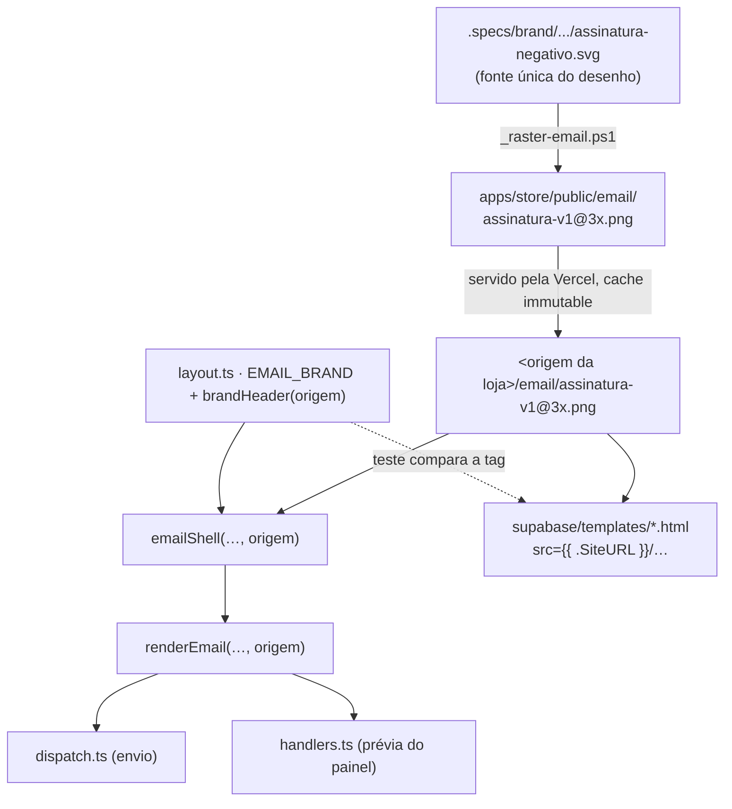

# 60 · A marca no cabeçalho dos e-mails — Design

**Spec**: [`spec.md`](spec.md)
**Status**: Approved (2026-10-05 — o plano foi aprovado em conversa antes da spec, e a spec aprovada em seguida)

---

## Architecture Overview

Um **dono** para o cabeçalho de marca (`brandHeader` em `layout.ts`), dois consumidores:

- o motor transacional chama `brandHeader(storeUrl)` de dentro do `emailShell`;
- os três templates de auth carregam a **mesma tag** escrita à mão com `src="{{ .SiteURL }}/…"` —
  eles são HTML colado num dashboard e não podem chamar função nenhuma —, e um teste compara a tag
  de cada template com `brandHeader('{{ .SiteURL }}')`, **byte a byte**. É a "cópia deliberada com
  guarda que lê os dois do disco" da regra 3 do defeito 01.

### Abordagens consideradas (decididas no plano aprovado)

| Abordagem | Veredito |
| --- | --- |
| **PNG servido pela loja, URL absoluta** (escolhida) | Funciona nas duas famílias; o modo de falha (imagem não carrega) cai no `alt` estilizado = o e-mail de hoje |
| Anexo inline `cid:` pelo Resend | Só alcança os transacionais; o GoTrue não anexa. Duas construções do mesmo cabeçalho |
| PNG num bucket público do Storage | URL independe do domínio da loja, mas o arquivo passaria a ter dois donos (repositório e bucket, sincronizados à mão) |
| SVG inline ou `` | Gmail remove, Outlook desktop não renderiza |

---

## Code Reuse Analysis

### Existing Components to Leverage

| Componente | Local | Uso |
| --- | --- | --- |
| `storeLink(baseUrl, path)` | `render/layout.ts:58` | Monta o `src` normalizando a barra final (`LOGO-04`) — é a mesma junção dos links de CTA |
| `escapeHtml` | `render/layout.ts:45` | Escapa a origem dentro do atributo `src` (vem de env; `"` nela quebraria a tag) |
| `ESTRELINHA`, `WORDMARK_FONT` | `render/layout.ts:20,35` | Cor e fonte do `alt` estilizado (`LOGO-02`) — as mesmas do `` de hoje |
| `uma-estrelinha-assinatura-negativo.svg` | `.specs/brand/uma-estrelinha/` | Fonte do desenho. Três `<path>` (traços 2,4 · 1,29 · 3,15), `stroke="#F7F3EC"`, sem `transform` nem `<g>` — o mini-idioma de path do WPF lê `A` e `Q` direto |
| `_raster-icons.ps1` | idem | Molde do script: WPF (`DrawingVisual` + `Pen` + `RenderTargetBitmap` + `PngBitmapEncoder`), parse invariante de número (máquina em pt-BR) |
| `SIGNATURE_FLOOR`, `SIGNATURE.ratio` | `apps/store/src/shared/ui/brand` | O guarda do PNG prova a largura exibida contra o piso **lido do módulo**, não de uma cópia (`L-022`) |
| `comPrefixo` | `__tests__/render.test.ts` | Molde da divergência nomeada nas fixtures congeladas (`LOGO-08`): transformação aplicada à fixture, âncora de 1 ocorrência, sensor |
| Leitura de `layout.ts` como texto | `authEmailTemplates.test.ts:22` | Precedente para o guarda do PNG (suíte da loja) ler `EMAIL_BRAND` sem importar do workspace das functions |
| Header `immutable` de `/assets` e `/fonts` | `apps/store/vercel.json` | Mesmo bloco para `/email/(.*)` |

### Integration Points

| Sistema | Como conecta |
| --- | --- |
| `send-notification` (envio) | `dispatch.ts:303` já tem `deps.env.storePublicUrl` em mãos; passa para `renderEmail` |
| `send-notification` (prévia) | `handlers.ts:228` idem |
| GoTrue (auth) | Templates colados no dashboard; `{{ .SiteURL }}` resolvido pelo GoTrue a partir do `site_url` do projeto |
| Vercel | Arquivo de `public/` servido do filesystem **antes** dos rewrites — o catch-all do SPA não o alcança |

---

## Components

### `EMAIL_BRAND` + `brandHeader` (novo, em `render/layout.ts`)

- **Purpose**: o conteúdo da faixa do cabeçalho — a imagem da marca, ou o wordmark de hoje quando não há origem.
- **Interfaces**:
  - `EMAIL_BRAND = { path: '/email/assinatura-v1@3x.png', width: 202, height: 44, alt: 'Uma Estrelinha' } as const`
  - `brandHeader(storeUrl: string | null | undefined): string`
    - origem vazia/ausente (`trim() === ''`) ⇒ devolve **exatamente** o `UMA ESTRELINHA` de hoje (`LOGO-03`);
    - senão ⇒ ``.
  - `style` do ``, nesta ordem: `display:block;margin:0 auto;border:0;outline:none;text-decoration:none;font-family:Georgia,'Times New Roman',serif;font-size:17px;letter-spacing:0.14em;line-height:1.2;color:#F7F3EC;text-transform:uppercase;` (sem `height:auto` nem `max-width`; ver o desvio de `LOGO-02` na spec)
- **Dependencies**: `storeLink`, `escapeHtml`, `ESTRELINHA`, `WORDMARK_FONT`.
- **Por que o `span` antigo sobrevive**: ele É o estado de falha (`LOGO-03`). Não é código morto.

### `emailShell(heading, lead, body, storeUrl)` (modificado)

- Troca a linha 247 por `${brandHeader(storeUrl)}`. O fio dourado (linha 248) fica (`LOGO-22`).

### `renderEmail(event, order, fields, vars, storeUrl)` (modificado)

- Ganha o 5º parâmetro e o repassa ao `emailShell`. **Não** se usa `NotificationVars` para levar a origem: `vars` é o mapa de interpolação que a dona escreve nos textos, e uma variável de "origem da loja" seria vocabulário novo exposto ao editor sem pedido.
- `undefined` em runtime é tratado como vazio (Deno não passa por `tsc`; `wiringResolve` vê import, não aridade).

### `_raster-email.ps1` (novo, `.specs/brand/uma-estrelinha/`)

- Lê os três `<path>` do SVG negativo (d + stroke-width), pinta um retângulo 606×132 de #283A4A, escala o desenho por `606 / 450.06`, centra na vertical (`(132 − 97.64·k) / 2`), e desenha cada path com `Pen` #F7F3EC, ponta e junção redondas. Grava `apps/store/public/email/assinatura-v1@3x.png`.
- **Não** sobrescreve um `v1` existente (aborta com mensagem) — `LOGO-14` na ferramenta, além do guarda.

### `assinatura-v1@3x.png` (novo, `apps/store/public/email/`)

- 606 × 132, opaco, fundo #283A4A, traço #F7F3EC, ≤ 40 KB. Imutável depois de publicado.

### Templates de auth (modificados, os três)

- A linha 31 (`…UMA ESTRELINHA`) vira a tag de `brandHeader('{{ .SiteURL }}')`, copiada literalmente. O comentário do topo de cada template ganha uma linha dizendo que a tag tem dono em `layout.ts` e é conferida por teste.

### `vercel.json` (modificado)

- Bloco `{ "source": "/email/(.*)", "headers": [{ "key": "Cache-Control", "value": "public, max-age=31536000, immutable" }] }` ao lado de `/fonts/(.*)`.

---

## Data Models

N/A — sem dado persistido. O único "modelo" é a constante `EMAIL_BRAND`.

---

## Error Handling Strategy

| Cenário | Tratamento | O que a cliente vê |
| --- | --- | --- |
| `STORE_PUBLIC_URL` vazia | `brandHeader` devolve o `` de hoje | O e-mail de hoje |
| Imagem bloqueada pelo cliente | `alt` com o estilo do wordmark, sobre a célula #283A4A | Praticamente o e-mail de hoje |
| Arquivo 404 / Vercel fora | Idem (o cliente cai no `alt`) | Idem |
| Origem com `"` ou `<` | `escapeHtml` no `src` | Imagem quebrada, mas o HTML não é injetado |
| Modo escuro clareia a faixa | Fundo gravado no PNG | Um retângulo #283A4A com a marca, legível |
| `site_url` com barra final | Conferência manual `LOGO-23` antes de colar | — |

---

## Risks & Concerns

| Concern | Location | Impact | Mitigation |
| --- | --- | --- | --- |
| Fixtures congeladas comparam o HTML **byte a byte** | `__tests__/render.test.ts:133` | A troca do cabeçalho reprova os 4 casos de HTML legado | Divergência nomeada `comCabecalho`, no molde do `comPrefixo`: substitui a linha do `` da fixture pelo `brandHeader(STORE)`, com âncora de 1 ocorrência e sensor. Fixture não regerada |
| Asserções que **exigem** o texto `UMA ESTRELINHA` | `render.test.ts:192`, `:414` | Passariam a reprovar | São invertidas (a lição da `41`: teste que defendia o estado removido é invertido, não apagado) — passam a exigir o `` e a ausência do texto |
| O guarda do casco dos templates compara os três **entre si** | `authEmailTemplates.test.ts:152` | Continua verde se os três mudarem juntos — inclusive errado | Comparação nova contra `brandHeader('{{ .SiteURL }}')`, lendo os templates do disco no workspace das functions |
| Os templates **citam** formas proibidas na prosa do topo | `supabase/templates/*.html` | A régua "sem `<svg`" acusaria um comentário que explique por que não há SVG | A régua roda fora do comentário do topo (o mesmo recorte que `authEmailTemplates` já faz para `<style>`); e o comentário **descreve** a forma, não a escreve (regra do `CLAUDE.md`) |
| `envOr('STORE_PUBLIC_URL', 'http://localhost:8080')` | `send-notification/index.ts:66` | Em dev sem env, o logo aponta para a porta errada (a loja é `:8082`) e cai no `alt` | Fora de escopo: o mesmo default já entorta os links de CTA; o `config.toml` resolve a env no local. Registrado, não consertado |
| Nenhum teste renderiza e-mail | — | Gmail/Outlook só se provam à mão | `LOGO-30`/`LOGO-31` como prova manual, registrada no `validation.md` |
| PNG sem lib de leitura no repositório | — | O guarda precisa decodificar pixels | Decodificador mínimo no próprio teste (`node:zlib` + desfiltragem das 5 linhas de filtro do PNG), só para tipo de cor 6/2 com 8 bits — e o guarda **lança** se o arquivo vier em outro formato, em vez de passar sem medir |

---

## Tech Decisions

| Decisão | Escolha | Por quê |
| --- | --- | --- |
| Onde mora a tag | `brandHeader` em `layout.ts` (workspace das functions) | É onde o render vive; os templates são cópia guardada |
| Onde mora o guarda do PNG | Suíte da **loja** (`shared/lib/__tests__/emailBrandImage.test.ts`) | O arquivo está em `apps/store/public` e o piso está em `apps/store/src/shared/ui/brand`; `layout.ts` é lido como texto (precedente de `authEmailTemplates`) |
| Onde mora a comparação templates × `brandHeader` | Suíte das **functions** | Ela importa `brandHeader` de verdade (`L-015`: chamar a mesma função que produção chama) e lê `supabase/templates/` do disco |
| `renderEmail` com 5º parâmetro em vez de variável de template | Parâmetro | Não expor vocabulário novo ao editor da dona |
| Imutabilidade do `v1` | SHA-256 fixado no guarda **e** recusa no script | Um e-mail entregue em 2026 tem de abrir igual em 2030 |

> **Decisão de projeto** — registrada como **`AD-045`** em `.specs/STATE.md`: *a marca nos e-mails é
> um PNG versionado e imutável servido pela loja; `brandHeader` é o dono da tag e os templates de
> auth são cópia guardada por teste.*
